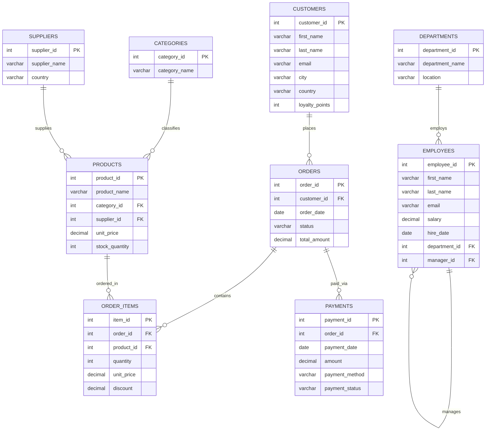

# Master SQL & MySQL Learning Guide: Master Table of Contents

Welcome to the **Master SQL & MySQL Learning Guide**. This comprehensive curriculum synthesizes fundamental database theory, practical SQL programming, enterprise database design, modern query techniques, and performance optimization into an original, unified learning path.

All practice queries, demonstrations, and exercises throughout this guide operate against the unified **`sql_mastery`** database schema, modeling a real-world enterprise spanning e-commerce, workforce management, supply chains, and finance.

---

## Complete Curriculum Structure

```
c:\antigravity\master_sql_guide\
├── sql_mastery_schema.sql             # Unified Schema DDL & Seed Data
├── 00_master_table_of_contents.md     # Curriculum Roadmap & Master Index
├── 01_sql_fundamentals.md             # Level 1: RDBMS Architecture & SQL Core
├── 02_database_and_table_management.md # Level 2 & 3: DDL (Databases, Tables, ALTER)
├── 03_data_types.md                   # Level 4: MySQL Data Types & Storage
├── 04_constraints.md                  # Level 5: Relational Integrity Constraints
├── 05_crud_operations.md              # Level 6: CRUD (INSERT, UPDATE, DELETE)
├── 06_select_and_filtering.md         # Level 7: Retrieval, WHERE, NULLs, Ranges
├── 07_sorting_and_limiting.md         # Level 7: ORDER BY, LIMIT, OFFSET Pagination
├── 08_sql_operators.md                # Level 8: Arithmetic, Logical, Set, Pattern
├── 09_sql_functions.md                # Level 9-12: Aggregate, String, Date, Math, Flow
├── 10_group_by_and_having.md          # Level 13-14: Grouping, HAVING, ROLLUP
├── 11_joins.md                        # Level 15: INNER, LEFT, RIGHT, FULL, Self, Cross
├── 12_union.md                        # Level 16: Set Operations (UNION & UNION ALL)
├── 13_subqueries.md                   # Level 17: Scalar, Correlated, EXISTS, CTEs
├── 14_keys_and_relationships.md       # Level 18-19: Primary/Foreign Keys & Cardinality
├── 15_database_design.md              # Level 20: ER Modeling & Schema Architecture
├── 16_normalization.md                # Level 21: 1NF, 2NF, 3NF, BCNF & De-normalization
├── 17_views.md                        # Level 22: Virtual Tables & Security Views
├── 18_indexes.md                      # Level 23: B-Tree Indexes, Composite, Performance
├── 19_transactions.md                 # Level 24-25: ACID, Locks, Isolation Levels
├── 20_stored_procedures.md            # Level 26: Procedures, Parameters, Control Flow
├── 21_functions.md                    # Level 27: Deterministic User-Defined Functions
├── 22_triggers.md                     # Level 28: Event Triggers & Audit Logging
├── 23_advanced_sql.md                 # Level 29: Window Functions & JSON Manipulation
├── 24_query_optimization.md           # Level 30: EXPLAIN, Profiling & SARGability
├── 25_security_and_best_practices.md  # Level 31: RBAC, Grants, SQL Injection Defense
├── 26_real_world_projects.md          # Level 32: 5 Production-Grade Database Systems
├── 27_exercises.md                    # Practice System: Categorized by Level
├── 28_answer_key.md                   # Complete Solutions & Verifications
├── 29_interview_questions.md          # Level 33: 150 Curated Interview Questions
├── 30_sql_cheat_sheet.md              # Level 35: Compact Command & Syntax Reference
├── 31_learning_roadmaps.md            # 7-Day, 14-Day, 30-Day, 60-Day Schedules
├── 32_final_revision_guide.md         # Level 34: High-Yield Exam & Interview Revision
└── 33_az_sql_reference.md             # Alphabetical Keyword & Function Lexicon
```

---

## 35 Mastery Levels Overview

| Level | Topic Area | Focus Modules | Key Core Concepts |
| :--- | :--- | :--- | :--- |
| **01** | Database Fundamentals | `01_sql_fundamentals.md` | Data vs Information, DBMS vs RDBMS, SQL vs NoSQL, Client-Server architecture |
| **02** | SQL Fundamentals | `01_sql_fundamentals.md` | DDL, DML, DQL, DCL, TCL command taxonomy, execution lifecycle |
| **03** | Database & Table Creation | `02_database_and_table_management.md` | `CREATE DATABASE`, `CREATE TABLE`, `DROP`, `RENAME`, `TRUNCATE` |
| **04** | Data Types | `03_data_types.md` | Numeric, String, Date/Time, JSON, binary storage costs, type casting |
| **05** | Integrity Constraints | `04_constraints.md` | `PRIMARY KEY`, `NOT NULL`, `UNIQUE`, `CHECK`, `DEFAULT`, `AUTO_INCREMENT` |
| **06** | Data Manipulation (CRUD) | `05_crud_operations.md` | `INSERT`, `UPDATE`, `DELETE`, Bulk insertion, `ON DUPLICATE KEY UPDATE` |
| **07** | Filtering & Sorting | `06_select_and_filtering.md`, `07_sorting_and_limiting.md` | `WHERE`, `ORDER BY` multi-column, `LIMIT`, `OFFSET`, pagination traps |
| **08** | SQL Operators | `08_sql_operators.md` | Comparison, Logical (`AND`, `OR`, `NOT`), `BETWEEN`, `IN`, `LIKE`, `IS NULL` |
| **09** | String Functions | `09_sql_functions.md` | `CONCAT`, `SUBSTRING`, `LENGTH`, `LOWER`, `UPPER`, `TRIM`, `REPLACE` |
| **10** | Date & Time Functions | `09_sql_functions.md` | `NOW`, `CURDATE`, `DATEDIFF`, `DATE_ADD`, `DATE_FORMAT`, `TIMESTAMPDIFF` |
| **11** | Numeric Functions | `09_sql_functions.md` | `ROUND`, `FLOOR`, `CEIL`, `MOD`, `POWER`, `SQRT`, `ABS`, `TRUNCATE` |
| **12** | Aggregate Functions | `09_sql_functions.md` | `COUNT(*)`, `COUNT(col)`, `SUM`, `AVG`, `MIN`, `MAX`, NULL handling |
| **13** | GROUP BY | `10_group_by_and_having.md` | Multi-column grouping, `ONLY_FULL_GROUP_BY` SQL mode, `WITH ROLLUP` |
| **14** | HAVING | `10_group_by_and_having.md` | Row filtering (`WHERE`) vs Aggregate filtering (`HAVING`) |
| **15** | Relational JOINs | `11_joins.md` | `INNER`, `LEFT`, `RIGHT`, `FULL OUTER` emulation, `CROSS`, `Self JOIN` |
| **16** | Set Operations | `12_union.md` | `UNION`, `UNION ALL`, schema compatibility rules, ordering set results |
| **17** | Subqueries & CTEs | `13_subqueries.md` | Scalar, Column, Table subqueries, Correlated subqueries, `EXISTS`, CTEs |
| **18** | Primary & Foreign Keys | `14_keys_and_relationships.md` | Surrogate vs Natural keys, Composite keys, Referential actions (`CASCADE`) |
| **19** | Relational Modeling | `14_keys_and_relationships.md` | One-to-One, One-to-Many, Many-to-Many, Junction/Bridge entities |
| **20** | Database Design | `15_database_design.md` | Entity Relationship Diagrams (ERDs), cardinality, conceptual to physical |
| **21** | Normalization | `16_normalization.md` | Update anomalies, 1NF, 2NF, 3NF, BCNF, OLTP vs OLAP de-normalization |
| **22** | Views | `17_views.md` | Virtual tables, Abstraction, Security views, Updatable view rules |
| **23** | Indexes & Performance | `18_indexes.md` | Clustered vs Secondary indexes, B-Tree mechanics, Composite leftmost prefix |
| **24** | Transactions & ACID | `19_transactions.md` | Atomicity, Consistency, Isolation, Durability, Transaction state machine |
| **25** | Concurrency Control | `19_transactions.md` | `COMMIT`, `ROLLBACK`, `SAVEPOINT`, Isolation levels, Dirty/Phantom reads |
| **26** | Stored Procedures | `20_stored_procedures.md` | `DELIMITER`, `IN`, `OUT`, `INOUT` parameters, Control flow (`IF`, `WHILE`) |
| **27** | Stored Functions | `21_functions.md` | `CREATE FUNCTION ... RETURNS`, Deterministic rules vs Procedures |
| **28** | Triggers | `22_triggers.md` | `BEFORE`/`AFTER` `INSERT`/`UPDATE`/`DELETE`, `OLD`/`NEW` row images, Audit trails |
| **29** | Advanced SQL | `23_advanced_sql.md` | Window functions (`ROW_NUMBER`, `RANK`, `LEAD`, `LAG`), JSON operators |
| **30** | Query Optimization | `24_query_optimization.md` | `EXPLAIN`, Execution plans, SARGable clauses, Covering index optimization |
| **31** | Security & Administration | `25_security_and_best_practices.md` | `CREATE USER`, `GRANT`, `REVOKE`, Roles, Prepared statements, SQL Injection |
| **32** | Real-World Projects | `26_real_world_projects.md` | 5 End-to-end schemas, business logic, analytics, and data management |
| **33** | Interview Mastery | `29_interview_questions.md` | 150 Technical interview questions (Beginner, Intermediate, Advanced) |
| **34** | Rapid Revision Guide | `32_final_revision_guide.md` | High-yield summary cards, syntax memory tables, common failure traps |
| **35** | MySQL Cheat Sheet | `30_sql_cheat_sheet.md` | Production cheat sheet of commands, functions, syntax patterns |

---

## Consistent Database Schema Reference: `sql_mastery`

To practice alongside this guide, execute the script [`sql_mastery_schema.sql`](/sql_mastery_schema.sql).

### Entity Relationship Diagram (ERD)



---

## Navigating the Modules

Every technical chapter follows a standardized 12-section blueprint:
1. **What is it?**
2. **Why do we use it?**
3. **Syntax**
4. **Basic Example**
5. **Real-World Example** (using `sql_mastery`)
6. **Step-by-Step Explanation**
7. **Expected Result**
8. **Common Mistakes**
9. **Best Practices**
10. **Practice Questions** (Easy $\rightarrow$ Medium $\rightarrow$ Difficult)
11. **Interview Questions**
12. **Quick Revision**

Proceed to [01 — SQL Fundamentals](/01_sql_fundamentals) to begin the curriculum.
