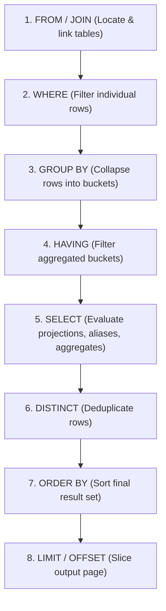

# Chapter 10 — Grouping & Aggregation: GROUP BY & HAVING

---

## 1. What is it?

In relational querying, individual rows often contain granular transaction details, while business decisions require higher-level summaries.

* **`GROUP BY`**: Collapses all rows that share identical values across one or more grouping columns into distinct summary buckets. When combined with aggregate functions (`COUNT`, `SUM`, `AVG`, `MIN`, `MAX`), it computes a single calculated metric for each group.
* **`HAVING`**: A dedicated filtering clause designed specifically to filter summary groups *after* aggregation has occurred.

### The Fundamental Distinction: `WHERE` vs `HAVING`
* **`WHERE`** filters individual raw rows **before** groups are formed and before aggregate functions are calculated. It cannot reference aggregate expressions (e.g., `WHERE AVG(salary) > 50000` is invalid SQL).
* **`HAVING`** filters aggregated summary buckets **after** the `GROUP BY` clause has processed the dataset. It operates directly on aggregated expressions (e.g., `HAVING AVG(salary) > 50000`).

---

## 2. Logical Query Execution Order

To write and debug complex SQL queries effectively, you must understand the engine's internal **Logical Query Processing Order**. Although SQL queries are written starting with `SELECT`, the database engine processes clauses in an entirely different sequence:



Because `WHERE` executes at Step 2 (before groups exist at Step 3), it cannot filter on aggregates! Because `HAVING` executes at Step 4, it filters the aggregated groups before final projection at Step 5.

---

## 3. Syntax

```sql
SELECT 
    group_column1,
    group_column2,
    AGGREGATE_FUNCTION(metric_column) AS summary_metric
FROM table_name
[WHERE raw_row_filter_condition]
GROUP BY 
    group_column1,
    group_column2
[WITH ROLLUP]
[HAVING aggregate_filter_condition]
[ORDER BY summary_metric DESC]
[LIMIT row_count];
```

### Advanced MySQL Aggregation: `GROUP_CONCAT`
MySQL provides the powerful `GROUP_CONCAT()` aggregate function, which concatenates non-null values from each group into a single formatted string:

```sql
GROUP_CONCAT([DISTINCT] column_name [ORDER BY col ASC] [SEPARATOR ', '])
```

---

## 4. Basic Example

Basic grouping, aggregate metrics, and group filtering:

```sql
USE sql_mastery;

-- Total number of customers grouped by country
SELECT 
    country,
    COUNT(*) AS total_customers
FROM customers
GROUP BY country;

-- Filter groups using HAVING: Only show countries with more than 1 customer
SELECT 
    country,
    COUNT(*) AS total_customers
FROM customers
GROUP BY country
HAVING COUNT(*) > 1;

-- Aggregate string concatenation: List all customer first names in each country
SELECT 
    country,
    COUNT(*) AS customer_count,
    GROUP_CONCAT(first_name ORDER BY first_name ASC SEPARATOR ', ') AS customer_roster
FROM customers
GROUP BY country;
```

---

## 5. Real-World Example

The Chief Financial Officer requires a Departmental Payroll & Headcount Analysis from the `employees` table:
1. Group employees by `department_id`.
2. Filter out inactive employees using `WHERE is_active = TRUE`.
3. Compute total headcount, total salary expenditure, average salary, and minimum/maximum salary range.
4. Filter out any department with fewer than 2 active employees or an average salary under $80,000 using `HAVING`.
5. Append subtotal and grand total summary rows using `WITH ROLLUP`.

```sql
USE sql_mastery;

SELECT 
    IF(GROUPING(department_id) = 1, 'ALL DEPARTMENTS (GRAND TOTAL)', COALESCE(CAST(department_id AS CHAR), 'No Department')) AS department_label,
    COUNT(*) AS active_headcount,
    SUM(salary) AS total_payroll,
    ROUND(AVG(salary), 2) AS average_salary,
    MIN(salary) AS min_salary,
    MAX(salary) AS max_salary
FROM employees
WHERE is_active = TRUE
GROUP BY department_id WITH ROLLUP
HAVING COUNT(*) >= 2 OR GROUPING(department_id) = 1;
```

---

## 6. Step-by-Step Explanation

1. **`FROM employees WHERE is_active = TRUE`**:
   * The storage engine scans `employees` and immediately discards any employee whose `is_active` status is `FALSE`.
2. **`GROUP BY department_id WITH ROLLUP`**:
   * Rows are sorted and partitioned into distinct buckets based on `department_id` (e.g., Dept 1, Dept 2, Dept 3, Dept 4).
   * The `WITH ROLLUP` modifier instructs MySQL to generate an extra hierarchical summary row representing the grand total across all departments.
3. **`HAVING COUNT(*) >= 2 OR GROUPING(department_id) = 1`**:
   * The engine evaluates the summary metrics for each department bucket.
   * Single-member departments (e.g., Dept 5) are filtered out.
   * The `OR GROUPING(department_id) = 1` clause ensures that the grand-total rollup row is preserved even though individual departments were filtered.
4. **`SELECT ... GROUPING(...)`**:
   * The `GROUPING(department_id)` function returns `1` for the rollup row and `0` for standard grouped rows, allowing us to display `'ALL DEPARTMENTS (GRAND TOTAL)'` instead of a confusing `NULL`.

---

## 7. Expected Result

Output of the Departmental Payroll Analysis:

```
+--------------------------------+------------------+---------------+----------------+------------+------------+
| department_label               | active_headcount | total_payroll | average_salary | min_salary | max_salary |
+--------------------------------+------------------+---------------+----------------+------------+------------+
| 1                              |                3 |     368000.00 |      122666.67 |   98000.00 |  145000.00 |
| 2                              |                2 |     227000.00 |      113500.00 |   92000.00 |  135000.00 |
| 3                              |                2 |     208000.00 |      104000.00 |   78000.00 |  130000.00 |
| 4                              |                2 |     182000.00 |       91000.00 |   72000.00 |  110000.00 |
| ALL DEPARTMENTS (GRAND TOTAL)  |               10 |    1070000.00 |      107000.00 |   72000.00 |  145000.00 |
+--------------------------------+------------------+---------------+----------------+------------+------------+
5 rows in set (0.00 sec)
```

---

## 8. Common Mistakes

1. **The `ONLY_FULL_GROUP_BY` Error (MySQL 5.7+ / 8.0+)**:
   * *The Broken Query*:
     ```sql
     SELECT department_id, first_name, AVG(salary)
     FROM employees
     GROUP BY department_id;
     ```
   * *Fatal Error*:
     `ERROR 1055 (42000): 'sql_mastery.employees.first_name' isn't in GROUP BY clause and contains nonaggregated column... which is not functionally dependent on columns in GROUP BY clause; this is incompatible with sql_mode=only_full_group_by`
   * *Why?*: If Department 1 has 3 employees (Alex, Sarah, Marcus), which single `first_name` should the database pick to display beside the department average? Choosing one at random produces non-deterministic data.
   * *Strict Rule*: In modern SQL, **every column listed in `SELECT` must either appear in the `GROUP BY` clause or be enclosed inside an aggregate function**.
2. **Placing Aggregate Conditions in `WHERE`**:
   * *Mistake*: `SELECT department_id FROM employees WHERE AVG(salary) > 80000 GROUP BY department_id;`
   * *Error*: `ERROR 1111 (HY000): Invalid use of group function`.
   * *Correction*: Move the aggregate filter to `HAVING AVG(salary) > 80000`.
3. **Placing Non-Aggregate Filters in `HAVING`**:
   * *Sub-optimal Query*:
     ```sql
     SELECT department_id, AVG(salary)
     FROM employees
     GROUP BY department_id
     HAVING department_id = 1; -- POOR PRACTICE!
     ```
   * *Why it's bad*: The database engine groups every employee in the entire company first, and only filters out other departments afterward!
   * *Correction*: Filter raw rows using `WHERE department_id = 1` *before* grouping so the engine processes significantly fewer records.

---

## 9. Best Practices

1. **Filter Early with `WHERE`, Filter Late with `HAVING`**:
   * Always eliminate unwanted rows in `WHERE` before they enter the grouping engine. Reserve `HAVING` strictly for conditions that evaluate aggregate function results (`SUM`, `COUNT`, `AVG`).
2. **Build Composite Indexes to Accelerate Grouping**:
   * If you frequently run `SELECT department_id, status, COUNT(*) FROM orders GROUP BY department_id, status`, an index on `(department_id, status)` allows the engine to compute aggregates by traversing the pre-sorted index tree, completely avoiding a temporary table.
3. **Use the `GROUPING()` Function with `ROLLUP`**:
   * When using `WITH ROLLUP`, never use string functions like `IFNULL(col, 'Total')` if `col` can legitimately contain NULL values. Use the standard ANSI SQL `GROUPING(col)` function to reliably detect engine-generated summary rows.

---

## 10. Practice Questions

### Easy
1. Write a query to find the total number of products in each `category_id`.
2. Write a query to calculate the average `unit_price` for each category.
3. Write a query to count the total number of orders for each `status`.

### Medium
4. Write a query to calculate the total revenue (`SUM(total_amount)`) for each customer in `orders`, filtering to display only customers whose total purchases exceed $500.00.
5. Write a query to list each `supplier_id` along with the number of products they supply, and use `GROUP_CONCAT` to list the product names separated by `' | '`.
6. Write a query to determine the number of orders placed in each calendar month of 2023.

### Difficult
7. Write a multi-column aggregation query on `order_items` that groups by `order_id` and calculates the total quantity of items, the gross total, the average discount, and uses `HAVING` to isolate orders that contain more than 1 distinct product line item and have an average discount greater than 0%.
8. Construct a query against `products` that groups by `category_id` and `supplier_id` using `WITH ROLLUP`, using `GROUPING()` to provide clean descriptive labels for the subtotals and grand totals.

---

## 11. Interview Questions

### Q1: What is the fundamental difference between `WHERE` and `HAVING` in SQL?
**Answer**:
* **Phase of Execution**: In the logical query processing pipeline, `WHERE` executes *before* the `GROUP BY` phase, operating on individual raw table rows. `HAVING` executes *after* rows have been collapsed into aggregate buckets.
* **Expression Capability**: `WHERE` can only reference raw column values and scalar expressions; it cannot contain aggregate functions because aggregates do not yet exist when `WHERE` evaluates. `HAVING` can filter directly on aggregate expressions (`SUM`, `AVG`, `COUNT`), evaluating conditions across entire groups of rows.

### Q2: What is the purpose of `ONLY_FULL_GROUP_BY` in MySQL, and why should it never be disabled in production?
**Answer**: `ONLY_FULL_GROUP_BY` is an SQL mode in MySQL (enabled by default in MySQL 5.7 and 8.0) that conforms strictly to the ANSI SQL standard. It rejects queries where the `SELECT` list, `HAVING` condition, or `ORDER BY` clause references non-aggregated columns that are neither named in the `GROUP BY` clause nor functionally dependent on them. 
Disabling it causes MySQL to return an arbitrary, non-deterministic value from one of the grouped rows for any unaggregated column. This introduces silent data integrity bugs, causes different replicas to return different answers, and violates relational consistency.

### Q3: How does the `WITH ROLLUP` modifier work in MySQL, and how do you distinguish between real NULL values and rollup summary NULLs?
**Answer**: `WITH ROLLUP` is an extension to the `GROUP BY` clause that generates hierarchical subtotals and a grand total row by rolling up dimensions from right to left. 
In the generated summary rows, the rolled-up grouping columns are set to `NULL`. To distinguish whether a `NULL` represents a genuine `NULL` stored in the database row or a summary marker generated by `ROLLUP`, SQL provides the `GROUPING(column_name)` function. `GROUPING()` returns `1` when the `NULL` was generated as a rollup aggregate marker, and `0` when the row represents a genuine data value.

---

## 12. Quick Revision

* **`GROUP BY`** collapses rows with matching keys into aggregate summary buckets.
* **`WHERE`** filters rows *before* grouping; **`HAVING`** filters aggregated buckets *after* grouping.
* **`ONLY_FULL_GROUP_BY`** requires every selected column to be either in the `GROUP BY` clause or wrapped in an aggregate function.
* Use **`GROUP_CONCAT()`** to concatenate string values within a group into a single delimited row.
* **`WITH ROLLUP`** computes multi-level subtotals and grand totals; use **`GROUPING()`** to format the generated summary rows cleanly.
