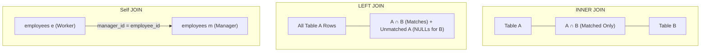

# Chapter 11 — Relational Operations: SQL JOINs

---

## 1. What is it?

In a normalized relational database, related business facts are intentionally decoupled and stored in separate, specialized tables to eliminate redundancy and maintain integrity. A **`JOIN`** is an operation that recombines these disparate tables at query time by matching rows based on shared column values (typically a Foreign Key in a child table referencing a Primary Key in a parent table).

SQL provides several join types that dictate how unmatched rows are handled:
1. **`INNER JOIN`**: Returns strictly the intersection of both tables—only rows that have matching values in **both** tables.
2. **`LEFT JOIN` (or `LEFT OUTER JOIN`)**: Returns **all** rows from the left table, along with matching rows from the right table. If no match exists on the right side, `NULL` values are populated for all right-table columns.
3. **`RIGHT JOIN` (or `RIGHT OUTER JOIN`)**: Returns **all** rows from the right table, along with matching rows from the left table (symmetric mirror of `LEFT JOIN`).
4. **`FULL OUTER JOIN`**: Returns all rows from both tables, filling in `NULL` on either side when a match is absent. (MySQL does not provide a native `FULL OUTER JOIN` keyword; it is emulated using a `LEFT JOIN` combined with a `RIGHT JOIN` via `UNION`).
5. **`CROSS JOIN`**: Computes the **Cartesian Product** of two tables—every row in Table A is paired with every row in Table B ($N \times M$ rows).
6. **`Self JOIN`**: Joins a table to itself by treating the table as two distinct logical instances using aliases, commonly used for recursive or hierarchical relationships (such as employees and managers).

---

## 2. Visual Representation & Relational Venn Diagrams



---

## 3. Syntax

```sql
-- 1. INNER JOIN
SELECT t1.col, t2.col
FROM table1 t1
INNER JOIN table2 t2 ON t1.id = t2.t1_id;

-- 2. LEFT JOIN
SELECT t1.col, t2.col
FROM table1 t1
LEFT JOIN table2 t2 ON t1.id = t2.t1_id;

-- 3. RIGHT JOIN
SELECT t1.col, t2.col
FROM table1 t1
RIGHT JOIN table2 t2 ON t1.id = t2.t1_id;

-- 4. FULL OUTER JOIN Emulation in MySQL
SELECT t1.col, t2.col
FROM table1 t1
LEFT JOIN table2 t2 ON t1.id = t2.t1_id
UNION
SELECT t1.col, t2.col
FROM table1 t1
RIGHT JOIN table2 t2 ON t1.id = t2.t1_id;

-- 5. Self JOIN
SELECT e.first_name AS employee, m.first_name AS manager
FROM employees e
LEFT JOIN employees m ON e.manager_id = m.employee_id;

-- 6. ANTI-JOIN (Find rows in A that have NO match in B)
SELECT t1.id, t1.name
FROM table1 t1
LEFT JOIN table2 t2 ON t1.id = t2.t1_id
WHERE t2.t1_id IS NULL;
```

---

## 4. Basic Example

Demonstrating `INNER JOIN`, `LEFT JOIN`, and Anti-Join across customers and orders:

```sql
USE sql_mastery;

-- INNER JOIN: Only customers who have placed at least one order
SELECT c.customer_id, c.first_name, c.last_name, o.order_id, o.total_amount
FROM customers c
INNER JOIN orders o ON c.customer_id = o.customer_id;

-- LEFT JOIN: ALL customers, showing order details or NULL if they have never ordered
SELECT c.customer_id, c.first_name, c.last_name, o.order_id, o.total_amount
FROM customers c
LEFT JOIN orders o ON c.customer_id = o.customer_id;

-- ANTI-JOIN: Find customers who have NEVER placed an order
SELECT c.customer_id, c.first_name, c.last_name, c.email
FROM customers c
LEFT JOIN orders o ON c.customer_id = o.customer_id
WHERE o.order_id IS NULL;
```

---

## 5. Real-World Example

The enterprise commerce analytics group requires a 5-table relational invoice breakdown:
1. Include `orders` with status `'Delivered'`.
2. Retrieve the customer's full name and city.
3. Retrieve each line item (`order_items`), the product title, and category name.
4. Calculate line-item gross and net costs.
5. Display the manager responsible for the employee managing that product's supplier relationship using a `Self JOIN`.

```sql
USE sql_mastery;

SELECT 
    o.order_id,
    o.order_date,
    CONCAT(c.first_name, ' ', c.last_name) AS customer_name,
    c.city AS customer_city,
    cat.category_name,
    p.product_name,
    oi.quantity,
    oi.unit_price,
    oi.discount,
    ROUND(oi.quantity * oi.unit_price * (1.00 - oi.discount), 2) AS line_total,
    sup.supplier_name
FROM orders o
INNER JOIN customers c ON o.customer_id = c.customer_id
INNER JOIN order_items oi ON o.order_id = oi.order_id
INNER JOIN products p ON oi.product_id = p.product_id
INNER JOIN categories cat ON p.category_id = cat.category_id
INNER JOIN suppliers sup ON p.supplier_id = sup.supplier_id
WHERE o.status = 'Delivered'
ORDER BY o.order_id ASC, line_total DESC;
```

---

## 6. Step-by-Step Explanation

Let us trace how MySQL processes this multi-table join pipeline:

1. **Join Order Determination (Optimizer)**:
   * MySQL evaluates table cardinality, indexes, and filter predicates to determine the most cost-effective join sequence.
   * `orders` has a filter on `status = 'Delivered'`. The optimizer may pick `orders` as the driving table.
2. **First Join (`orders` $\bowtie$ `customers`)**:
   * For every delivered order, MySQL performs an index seek on `customers.customer_id` using the primary key index.
3. **Second Join (`orders` $\bowtie$ `order_items`)**:
   * For each order, the engine uses the foreign key index on `order_items.order_id` to locate matching line items.
4. **Third & Fourth Joins (`order_items` $\bowtie$ `products` $\bowtie$ `categories`)**:
   * Reads the referenced `product_id` from the line item, looks up the product in `products`, and follows its `category_id` to `categories`.
5. **Projection & Calculation**:
   * For each matched tuple across the 5 tables, the arithmetic expression `ROUND(oi.quantity * oi.unit_price * (1.00 - oi.discount), 2)` is computed as `line_total`.
   * Unmatched combinations are discarded because `INNER JOIN` semantics require full matches across every join predicate.

---

## 7. Expected Result

Partial output of the 5-table analytical invoice join:

```
+----------+------------+---------------+---------------+-----------------+-------------------------------+----------+------------+----------+------------+-----------------------+
| order_id | order_date | customer_name | customer_city | category_name   | product_name                  | quantity | unit_price | discount | line_total | supplier_name         |
+----------+------------+---------------+---------------+-----------------+-------------------------------+----------+------------+----------+------------+-----------------------+
|     1001 | 2023-08-01 | Emily Watson  | San Francisco | Electronics     | Quantum Pro 15 Laptop         |        1 |    1299.99 |     0.00 |    1299.99 | Apex Tech Supply      |
|     1001 | 2023-08-01 | Emily Watson  | San Francisco | Electronics     | TrueSound ANC Headphones      |        1 |     249.50 |     0.00 |     249.50 | Nippon Component Corp |
|     1002 | 2023-08-03 | Sophia Garcia | Miami         | Electronics     | UltraVision 4K 27in Monitor   |        1 |     389.00 |     0.00 |     389.00 | Shenzhen Precision Ltd|
|     1003 | 2023-08-10 | Michael Brown | Austin        | Electronics     | TrueSound ANC Headphones      |        1 |     249.50 |     0.00 |     249.50 | Nippon Component Corp |
|     1004 | 2023-08-15 | Aisha Khan    | Bengaluru     | Electronics     | Quantum Pro 15 Laptop         |        1 |    1299.99 |     0.05 |    1234.99 | Apex Tech Supply      |
|     1004 | 2023-08-15 | Aisha Khan    | Bengaluru     | Books & Media   | Mastering Database Design Book|        3 |      49.99 |     0.10 |     134.97 | Apex Tech Supply      |
+----------+------------+---------------+---------------+-----------------+-------------------------------+----------+------------+----------+------------+-----------------------+
```

---

## 8. Common Mistakes

1. **Accidental Cartesian Product (`CROSS JOIN`): Missing Join Condition**:
   * *The Nightmare Query*:
     ```sql
     SELECT * FROM customers, orders; -- OMITTED ON CLAUSE!
     ```
   * *Consequence*: If `customers` has 10,000 rows and `orders` has 100,000 rows, the query attempts to generate $10,000 \times 100,000 = 1,000,000,000$ rows! The server runs out of memory, spikes CPU to 100%, and crashes. Always use modern explicit `JOIN ... ON ...` syntax.
2. **Accidentally Converting a `LEFT JOIN` into an `INNER JOIN` via `WHERE`**:
   * *The Bug*:
     ```sql
     SELECT c.customer_id, o.order_id, o.status
     FROM customers c
     LEFT JOIN orders o ON c.customer_id = o.customer_id
     WHERE o.status = 'Delivered'; -- TURNS LEFT JOIN INTO INNER JOIN!
     ```
   * *Why?*: For customers with zero orders, `o.status` is `NULL`. The condition `NULL = 'Delivered'` evaluates to `UNKNOWN`, which the `WHERE` clause filters out! All customers without orders are silently removed.
   * *Correction*: Move the filter condition into the `ON` clause:
     ```sql
     SELECT c.customer_id, o.order_id, o.status
     FROM customers c
     LEFT JOIN orders o ON c.customer_id = o.customer_id AND o.status = 'Delivered';
     ```
3. **Ambiguous Column Name Errors**:
   * If both tables share a column name (such as `created_at` or `status`), selecting `status` without qualifying it (`o.status` vs `c.status`) produces:
     `ERROR 1052 (23000): Column 'status' in field list is ambiguous`. Always prefix columns with table aliases.

---

## 9. Best Practices

1. **Always Use Table Aliases**:
   * Assign short, intuitive aliases (`FROM customers c JOIN orders o ON c.customer_id = o.customer_id`). This keeps queries concise and readable.
2. **Ensure Foreign Key Columns Are Indexed**:
   * MySQL automatically indexes foreign keys, but always ensure any columns used in `ON` join predicates are indexed. Joining on unindexed columns forces nested loop joins that scan entire tables repeatedly ($O(N \times M)$ complexity).
3. **Prefer `INNER JOIN` Over `LEFT JOIN` When Outer Rows Are Unneeded**:
   * An `INNER JOIN` gives the optimizer freedom to reorder the join sequence (e.g., evaluating the smallest table first), whereas a `LEFT JOIN` constrains the optimizer to read the left table first.
4. **Use ANSI Explicit Join Syntax**:
   * Never use implicit comma joins (`FROM tableA, tableB WHERE tableA.id = tableB.id`). Comma joins make it easy to forget a join condition, obscuring join logic from filtering logic.

---

## 10. Practice Questions

### Easy
1. Write a query using an `INNER JOIN` to display the `employee_id`, `first_name`, `last_name`, and `department_name` for every employee.
2. Write a query to display all `departments`, showing employee details for departments that have employees, and displaying `NULL` for departments with no employees.
3. Write a query joining `products` and `suppliers` to display the product name and its supplier's name.

### Medium
4. Write a query that performs a `Self JOIN` on the `employees` table to display the employee's full name alongside their manager's full name. If an employee has no manager, display `'No Manager'`.
5. Write an Anti-Join query to find all departments that currently have zero employees assigned to them.
6. Write a query joining `customers`, `orders`, and `payments` to display the customer name, order ID, payment amount, and payment method for all completed payments.

### Difficult
7. Write a query that emulates a `FULL OUTER JOIN` between `departments` and `employees`, returning all departments (even those without employees) and all employees (even those without an assigned department).
8. Write a query that calculates the total revenue generated by each `category_name`, including categories that have generated zero sales (showing `$0.00`). Order the results from highest revenue to lowest.

---

## 11. Interview Questions

### Q1: What is the operational difference between an `INNER JOIN` and a `LEFT JOIN`?
**Answer**: An `INNER JOIN` returns only rows where the join predicate evaluates to `TRUE` in **both** tables, discarding any row from either table that lacks a corresponding match. A `LEFT JOIN` (or `LEFT OUTER JOIN`) preserves **all** rows from the left-hand table regardless of whether a match exists on the right. For rows without a right-side match, the engine injects `NULL` values for all columns originating from the right-hand table.

### Q2: Why does adding a `WHERE` condition on a right-table column turn a `LEFT JOIN` into an `INNER JOIN`, and how do you fix it?
**Answer**: In a `LEFT JOIN`, unmatched rows produce `NULL` values for all right-table columns. If a `WHERE` clause tests that right-side column (e.g., `WHERE right_table.status = 'Active'`), `NULL = 'Active'` evaluates to `UNKNOWN` for all unmatched rows. Because `WHERE` only admits rows that evaluate strictly to `TRUE`, all unmatched left-side rows are filtered out, effectively turning the query into an `INNER JOIN`. 
To fix this while preserving the `LEFT JOIN`, the filter must be placed inside the `ON` clause (`LEFT JOIN right_table ON ... AND right_table.status = 'Active'`), which allows unmatched left-side rows to still be included with `NULL` right-side values.

### Q3: How does a Self JOIN work, and why are table aliases mandatory when executing one?
**Answer**: A Self JOIN joins a table to itself. It is used when a table contains a recursive or hierarchical relationship (e.g., an `employees` table where each row contains a `manager_id` foreign key referencing the `employee_id` primary key of another row in the same table). Table aliases are mandatory because the database engine must instantiate two distinct logical instances of the same physical table in memory (e.g., `employees e` as the worker, and `employees m` as the manager). Without distinct aliases, column references like `employee_id` would be completely ambiguous to the parser.

---

## 12. Quick Revision

* **`INNER JOIN`**: Returns matching records from both tables (the intersection).
* **`LEFT JOIN`**: Returns all records from the left table, plus matched records from the right (with `NULL` for missing right values).
* **Anti-Join**: A `LEFT JOIN ... WHERE right_table.id IS NULL` pattern used to find records with no corresponding child or parent entries.
* **Self JOIN**: Joins a table to itself using two distinct aliases to model hierarchies.
* In MySQL, emulate a **`FULL OUTER JOIN`** by combining a `LEFT JOIN` and a `RIGHT JOIN` with **`UNION`**.
* Never omit the `ON` clause to avoid catastrophic Cartesian products (`CROSS JOIN`).
