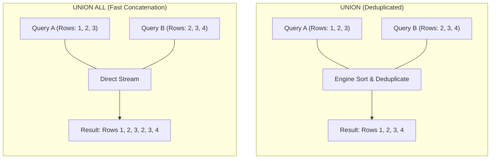

# Chapter 12 — Set Operations: UNION & UNION ALL

---

## 1. What is it?

In relational algebra, set operators combine the results of two or more independent `SELECT` queries into a single unified result set. While a `JOIN` combines tables **horizontally** (appending columns from one table to columns of another), a **Set Operation** combines queries **vertically** (stacking rows from one query on top of rows from another).

SQL provides two primary set combination operators:
1. **`UNION`**: Combines the output of two or more queries, automatically performing an implicit deduplication phase. Identical rows appearing in multiple queries are condensed into a single unique row.
2. **`UNION ALL`**: Combines the output of two or more queries **without** deduplication. All matching rows from all queries are preserved, including duplicates.

Because `UNION` requires the database engine to sort the combined dataset in memory or build a temporary hash table to identify and eliminate duplicate rows, it incurs significant computational overhead. Conversely, `UNION ALL` simply streams the rows from each query sequentially, making it significantly faster.

---

## 2. Strict Schema Compatibility Rules

To combine queries using `UNION` or `UNION ALL`, the participating queries must satisfy three strict relational compatibility requirements:
1. **Identical Column Count**: Every `SELECT` statement in the compound query must project the exact same number of columns.
2. **Compatible Data Types**: Corresponding columns in each query (Column 1 to Column 1, Column 2 to Column 2) must have compatible or implicitly convertible data types. For example, a `VARCHAR` column cannot be matched with a `DATE` column unless explicitly cast.
3. **Column Naming Precedence**: The column names, data types, and aliases of the final output are determined exclusively by the **first** `SELECT` query in the chain.



---

## 3. Syntax

```sql
-- Standard UNION (Implicit Deduplication)
SELECT column1, column2, ...
FROM table1
WHERE condition1

UNION

SELECT column1, column2, ...
FROM table2
WHERE condition2;

-- High-Performance UNION ALL (Preserves Duplicates)
SELECT column1, column2, ...
FROM table1

UNION ALL

SELECT column1, column2, ...
FROM table2;

-- Global Ordering and Pagination of a Compound Query
(SELECT id, name, created_at FROM table1)
UNION ALL
(SELECT id, name, created_at FROM table2)
ORDER BY created_at DESC
LIMIT 20;
```

---

## 4. Basic Example

Demonstrating `UNION` vs `UNION ALL` across geographic locations:

```sql
USE sql_mastery;

-- UNION: Distinct list of cities where we have either customers OR suppliers
SELECT city, country, 'Customer Base' AS entity_source
FROM customers
WHERE country = 'USA'

UNION

SELECT city, country, 'Supplier Base' AS entity_source
FROM suppliers
WHERE country = 'USA';

-- Compare without the entity_source column:
-- UNION removes duplicate cities (e.g. Seattle)
SELECT city, country FROM customers WHERE country = 'USA'
UNION
SELECT city, country FROM suppliers WHERE country = 'USA';

-- UNION ALL preserves both occurrences of duplicate cities
SELECT city, country FROM customers WHERE country = 'USA'
UNION ALL
SELECT city, country FROM suppliers WHERE country = 'USA';
```

---

## 5. Real-World Example

The enterprise security and audit office requires an aggregated **Corporate Directory & Activity Feed** that merges:
1. Internal employees (`employees` table) with contact details, department, and a `'Staff'` role.
2. External supplier contacts (`suppliers` table) with contact details, company name, and a `'Vendor'` role.
3. Customer contacts (`customers` table) with city, country, and a `'Customer'` role.
4. The final unified directory must be ordered alphabetically by contact name.

```sql
USE sql_mastery;

(
    SELECT 
        CONCAT(first_name, ' ', last_name) AS full_name,
        email AS contact_email,
        phone AS contact_phone,
        'Internal Staff' AS entity_type,
        d.department_name AS affiliation
    FROM employees e
    LEFT JOIN departments d ON e.department_id = d.department_id
)
UNION ALL
(
    SELECT 
        contact_name AS full_name,
        contact_email AS contact_email,
        contact_phone AS contact_phone,
        'External Vendor' AS entity_type,
        supplier_name AS affiliation
    FROM suppliers
)
UNION ALL
(
    SELECT 
        CONCAT(first_name, ' ', last_name) AS full_name,
        email AS contact_email,
        phone AS contact_phone,
        'Registered Customer' AS entity_type,
        CONCAT(city, ', ', country) AS affiliation
    FROM customers
)
ORDER BY full_name ASC;
```

---

## 6. Step-by-Step Explanation

1. **First Query (`employees`)**:
   * Extracts the full name, email, phone, and joins `departments` to label internal company personnel.
   * Defines the output column schema: `full_name`, `contact_email`, `contact_phone`, `entity_type`, `affiliation`.
2. **Second Query (`suppliers`)**:
   * Maps supplier contact metadata to the exact same 5-column positional structure. `supplier_name` is positioned to populate the `affiliation` column.
3. **Third Query (`customers`)**:
   * Maps customer personal details into the exact same 5-column layout.
4. **`UNION ALL` Processing**:
   * The database engine skips in-memory deduplication sorting and streams the tuples directly from each table into a single intermediate result set.
5. **Global `ORDER BY full_name ASC`**:
   * The entire combined result set across all three source tables is sorted alphabetically by `full_name`.

---

## 7. Expected Result

Partial output of the Unified Corporate Directory:

```
+-------------------+----------------------------+---------------+---------------------+------------------------+
| full_name         | contact_email              | contact_phone | entity_type         | affiliation            |
+-------------------+----------------------------+---------------+---------------------+------------------------+
| Aisha Khan        | aisha.khan@domain.in       | 555-0305      | Registered Customer | Bengaluru, India       |
| Alex Morgan       | alex.morgan@company.com    | 555-0100      | Internal Staff      | Engineering            |
| Astrid Lind       | lind@nordictm.se           | 555-0205      | External Vendor     | Nordic Timber & Metal  |
| Carlos Mendoza    | carlos.mendoza@company.com | 555-0108      | Internal Staff      | Supply Chain           |
| Chloe Dubois      | chloe.dubois@orange.fr     | 555-0309      | Registered Customer | Lyon, France           |
| David Kim         | david.kim@company.com      | 555-0104      | Internal Staff      | Data & Analytics       |
| Elena Rostova     | elena.rostova@company.com  | 555-0105      | Internal Staff      | Sales & Marketing      |
| Emily Watson      | emily.watson@gmail.com     | 555-0301      | Registered Customer | San Francisco, USA     |
| Greta Weber       | weber@eurosmart.de         | 555-0203      | External Vendor     | EuroSmart Manufacturing|
+-------------------+----------------------------+---------------+---------------------+------------------------+
```

---

## 8. Common Mistakes

1. **Column Count Mismatch**:
   * *Mistake*:
     ```sql
     SELECT employee_id, first_name, email FROM employees
     UNION
     SELECT customer_id, first_name FROM customers; -- ONLY 2 COLUMNS!
     ```
   * *Error*:
     `ERROR 1222 (21000): The used SELECT statements have a different number of columns.`
   * *Rule*: All participating queries must project the exact same number of columns.
2. **Defaulting to `UNION` Instead of `UNION ALL`**:
   * *Mistake*: Writing `UNION` when you know the two datasets cannot overlap (e.g., combining data from `customers` and `suppliers`).
   * *Consequence*: The engine builds an expensive temporary table and performs an unnecessary sort to look for duplicate rows that can never exist, degrading query throughput.
3. **Placing `ORDER BY` Inside Individual Queries Without Parentheses**:
   * Writing:
     ```sql
     SELECT name FROM tableA ORDER BY name
     UNION
     SELECT name FROM tableB;
     ```
     Causes a syntax error. If you need local ordering or limits before merging, each query must be enclosed in parentheses:
     ```sql
     (SELECT name FROM tableA ORDER BY name LIMIT 5)
     UNION ALL
     (SELECT name FROM tableB ORDER BY name LIMIT 5);
     ```
4. **Expecting Column Names from Later Queries to Matter**:
   * If Query 1 aliases a column as `account_id` and Query 2 aliases the same positional column as `customer_number`, the output column will be named `account_id`. Always verify column aliases in the first `SELECT` statement.

---

## 9. Best Practices

1. **Default to `UNION ALL` Unless Deduplication Is Explicitly Required**:
   * Always write `UNION ALL` by default. Only use `UNION` when duplicate rows are expected and business requirements explicitly mandate their removal.
2. **Always Align Column Data Types Positively**:
   * Avoid relying on implicit type coercion (e.g., merging an integer column with a string column). Use explicit `CAST()` functions to harmonize types:
     ```sql
     SELECT CAST(employee_id AS CHAR(20)) FROM employees
     UNION ALL
     SELECT reference_code FROM external_partners;
     ```
3. **Use Static Literal Tags to Identify Row Provenance**:
   * When combining disparate tables, include a constant string literal (e.g., `'Order'`, `'Refund'`, `'Adjustment'`) to allow client code to distinguish row origin.

---

## 10. Practice Questions

### Easy
1. Write a query using `UNION` to combine the `city` column from the `customers` table with the `location` column from the `departments` table into a single list.
2. Write a query using `UNION ALL` to list all email addresses across both `employees` and `customers`.
3. Explain the difference in row counts between your answers to Question 1 and Question 2.

### Medium
4. Write a query that combines all products with `unit_price > 500` and all products with `stock_quantity < 20`, using `UNION` to ensure products meeting both criteria are only listed once.
5. Write a query that generates a unified ledger of financial movements:
   * Positive order values from `orders` where `status = 'Delivered'` (tagged as `'REVENUE'`)
   * Negative shipping costs from `orders` where `shipping_fee > 0` (tagged as `'EXPENSE'`)
   * Order the unified ledger by date descending.
6. Write a query combining the names of active customers and inactive customers into two distinct partitions, with each row labeled with their respective status.

### Difficult
7. Write a query that emulates a `FULL OUTER JOIN` between `departments` and `employees` using `LEFT JOIN`, `RIGHT JOIN`, and `UNION`. Verify that departments without employees and employees without departments are both present.
8. Construct a query that takes the top 2 highest-paid employees and merges them with the top 2 lowest-paid employees using `UNION ALL`, sorted overall by salary descending. (Hint: Utilize parenthesized subqueries with individual `LIMIT` clauses).

---

## 11. Interview Questions

### Q1: What is the mechanical difference between `UNION` and `UNION ALL` in terms of execution mechanics and performance?
**Answer**:
* `UNION` concatenates the result sets of two queries and then performs an **implicit deduplication** step. To do this, the database engine must spill the combined rows into an in-memory or on-disk temporary table, sort the records across all projected columns (or construct a hash set), and eliminate duplicates. This consumes significant CPU, memory, and I/O.
* `UNION ALL` performs a pure vertical concatenation. The engine streams the rows produced by Query 1 directly to the client or parent pipeline, followed immediately by Query 2, performing zero sorting, hashing, or comparisons. Consequently, `UNION ALL` is orders of magnitude faster and should always be preferred when records are known to be distinct or when duplicates are acceptable.

### Q2: What are the three relational rules that two queries must satisfy to be combined using a Set Operator?
**Answer**:
1. **Identical Degree (Column Count)**: Both `SELECT` queries must project the exact same number of columns.
2. **Type Compatibility**: The data types of columns in corresponding positions must be identical or implicitly convertible by the database engine (e.g., an integer and a float, but not a date and a binary blob).
3. **Order of Evaluation**: The column names, aliases, and character collations of the final output set are dictated by the *first* `SELECT` statement in the union chain.

### Q3: How can you apply an `ORDER BY` to an entire compound query versus applying an `ORDER BY` to an individual branch of a `UNION`?
**Answer**:
* To apply an `ORDER BY` across the **entire compound result set**, place a single `ORDER BY` clause at the very end of the final query without parentheses. It evaluates on the combined output.
* To apply an `ORDER BY` (typically combined with a `LIMIT`) to **individual branches**, each branch query must be enclosed in its own parentheses:
  ```sql
  (SELECT * FROM table1 ORDER BY score DESC LIMIT 5)
  UNION ALL
  (SELECT * FROM table2 ORDER BY score DESC LIMIT 5)
  ORDER BY score DESC;
  ```

---

## 12. Quick Revision

* **`UNION`** stacks query results vertically and eliminates duplicate rows (involves sorting overhead).
* **`UNION ALL`** stacks query results vertically without removing duplicates (maximum performance).
* All combined queries must have the **same number of columns** with compatible data types.
* The **first query** sets the column names and aliases for the final result set.
* Wrap individual queries in parentheses when using per-branch `LIMIT` or `ORDER BY`.
