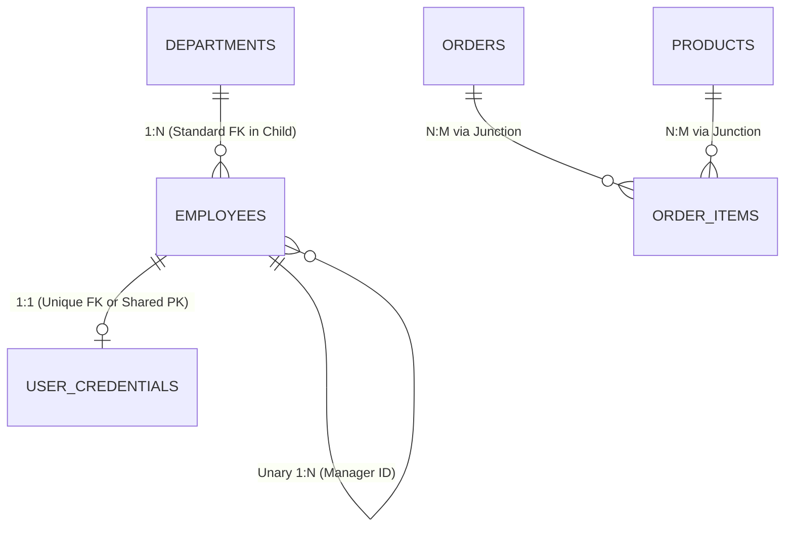

# Chapter 14 — Relational Architecture: Keys & Entity Relationships

---

## 1. What is it?

In relational database systems, **keys** and **relationships** are the structural mechanisms that bind discrete tables into a coherent, self-enforcing web of data.

### 1.1. The Key Taxonomy
* **Super Key**: Any set of one or more columns whose values collectively guarantee uniqueness across every row in a table.
* **Candidate Key**: A minimal Super Key—meaning no proper subset of its columns can guarantee uniqueness. A table can have multiple Candidate Keys.
* **Primary Key (PK)**: The single candidate key chosen by the database architect as the official unique identifier for rows in the table. In MySQL's default **InnoDB** storage engine, the Primary Key physically defines the **Clustered Index**, meaning table rows are physically stored on disk in Primary Key order.
* **Alternate Key**: Any candidate key that was *not* chosen as the primary key (typically implemented as a `UNIQUE NOT NULL` constraint, such as `email`).
* **Composite Key**: A key constructed by combining two or more columns together (e.g., `(order_id, product_id)`).
* **Surrogate Key vs Natural Key**:
  * **Natural Key**: A real-world business attribute with inherent uniqueness (e.g., Social Security Number, VIN, ISBN, email).
  * **Surrogate Key**: An artificial, system-generated identifier with no business meaning (e.g., `INT AUTO_INCREMENT` or `UUID`).
* **Foreign Key (FK)**: A column (or set of columns) in a **child table** that stores values corresponding to the Primary Key of a **parent table**, enforcing **referential integrity**.

---

## 2. Cardinality & Relational Patterns

The number of entity instances in one table related to entity instances in another table is known as **cardinality**:



1. **One-to-One (1:1)**:
   * *Rule*: Exactly one row in Table A corresponds to at most one row in Table B.
   * *Implementation*: A Foreign Key in Table B that is also constrained with a `UNIQUE` constraint (or sharing the identical Primary Key).
   * *Example*: `employees` and `employee_passports`.
2. **One-to-Many (1:N)**:
   * *Rule*: One row in Table A can relate to multiple rows in Table B, but each row in Table B relates to exactly one row in Table A.
   * *Implementation*: Place the Foreign Key on the "Many" (child) side.
   * *Example*: One `department` has many `employees`; one `customer` has many `orders`.
3. **Many-to-Many (N:M)**:
   * *Rule*: Multiple rows in Table A relate to multiple rows in Table B.
   * *Implementation*: Relational engines cannot implement N:M directly within two tables. You must introduce a third table called a **Junction Table** (or Associative / Bridge Table) containing two foreign keys pointing back to each parent table.
   * *Example*: `orders` and `products` connected via `order_items`.
4. **Self-Referencing (Unary)**:
   * *Rule*: A table references itself.
   * *Implementation*: A foreign key column in the table pointing to the primary key of the same table.
   * *Example*: `employees.manager_id` referencing `employees.employee_id`.

---

## 3. Syntax

### Creating Relationships with Referential Actions
```sql
-- 1. One-to-One Table Creation (Unique Foreign Key)
CREATE TABLE employee_profiles (
    profile_id INT AUTO_INCREMENT PRIMARY KEY,
    employee_id INT NOT NULL UNIQUE,       -- UNIQUE enforces 1:1 cardinality
    emergency_contact VARCHAR(100) NOT NULL,
    home_address VARCHAR(255) NOT NULL,
    CONSTRAINT fk_profile_employee FOREIGN KEY (employee_id)
        REFERENCES employees(employee_id)
        ON DELETE CASCADE
        ON UPDATE CASCADE
);

-- 2. One-to-Many Relationship (Standard FK)
CREATE TABLE orders (
    order_id INT AUTO_INCREMENT PRIMARY KEY,
    customer_id INT NOT NULL,              -- 1:N: One customer has many orders
    order_date DATE NOT NULL,
    CONSTRAINT fk_orders_customer FOREIGN KEY (customer_id)
        REFERENCES customers(customer_id)
        ON DELETE RESTRICT
        ON UPDATE CASCADE
);

-- 3. Many-to-Many Junction Table
CREATE TABLE order_items (
    item_id INT AUTO_INCREMENT PRIMARY KEY,
    order_id INT NOT NULL,
    product_id INT NOT NULL,
    quantity INT NOT NULL,
    CONSTRAINT uq_order_product UNIQUE (order_id, product_id),
    CONSTRAINT fk_items_order FOREIGN KEY (order_id)
        REFERENCES orders(order_id)
        ON DELETE CASCADE
        ON UPDATE CASCADE,
    CONSTRAINT fk_items_product FOREIGN KEY (product_id)
        REFERENCES products(product_id)
        ON DELETE RESTRICT
        ON UPDATE CASCADE
);
```

### Managing Keys and Constraints via `ALTER TABLE`
```sql
-- Adding a Foreign Key to an existing table
ALTER TABLE child_table
ADD CONSTRAINT fk_name FOREIGN KEY (parent_id_column)
    REFERENCES parent_table(id_column)
    ON DELETE RESTRICT
    ON UPDATE CASCADE;

-- Dropping a Foreign Key constraint (Requires the specific constraint symbol name)
ALTER TABLE child_table
DROP FOREIGN KEY fk_name;

-- Dropping a Primary Key (Must remove AUTO_INCREMENT attribute first)
ALTER TABLE table_name
MODIFY COLUMN id INT NOT NULL;
ALTER TABLE table_name
DROP PRIMARY KEY;
```

---

## 4. Basic Example

Demonstrating referential integrity enforcement between parent and child tables:

```sql
USE sql_mastery;

CREATE TABLE authors (
    author_id INT AUTO_INCREMENT PRIMARY KEY,
    author_name VARCHAR(100) NOT NULL
);

CREATE TABLE books (
    book_id INT AUTO_INCREMENT PRIMARY KEY,
    title VARCHAR(150) NOT NULL,
    author_id INT NOT NULL,
    CONSTRAINT fk_books_author FOREIGN KEY (author_id)
        REFERENCES authors(author_id)
        ON DELETE CASCADE
);

INSERT INTO authors (author_name) VALUES ('Robert C. Martin'), ('Martin Fowler');
INSERT INTO books (title, author_id) VALUES ('Clean Code', 1), ('Refactoring', 2);

-- Deleting Author 1 automatically triggers CASCADE deletion of 'Clean Code' in books
DELETE FROM authors WHERE author_id = 1;

-- Verify books: 'Clean Code' has been deleted automatically
SELECT * FROM books;

-- Clean up
DROP TABLE books;
DROP TABLE authors;
```

---

## 5. Real-World Example

Let us examine the relational architecture connecting `customers`, `orders`, and `order_items` in our `sql_mastery` database:
1. Verify the foreign keys and cascade rules on `orders` and `order_items`.
2. Demonstrate how `ON DELETE RESTRICT` protects customer history from accidental deletion.
3. Demonstrate how `ON DELETE CASCADE` ensures child line items are cleaned up if an order is cancelled and removed.

```sql
USE sql_mastery;

-- Step 1: Attempt to delete Customer 1 (Emily Watson)
-- This customer has placed orders 1001 and 1006.
-- This command will fail because fk_orders_customer is configured with ON DELETE RESTRICT!
DELETE FROM customers WHERE customer_id = 1;

-- Step 2: Create a temporary test order to test ON DELETE CASCADE on order_items
INSERT INTO orders (order_id, customer_id, order_date, status, total_amount)
VALUES (9999, 1, CURDATE(), 'Cancelled', 100.00);

INSERT INTO order_items (item_id, order_id, product_id, quantity, unit_price, discount)
VALUES (8888, 9999, 9, 2, 49.99, 0.00);

-- Verify line item exists
SELECT * FROM order_items WHERE order_id = 9999;

-- Step 3: Delete the cancelled parent order 9999
-- Because fk_items_order has ON DELETE CASCADE, item 8888 is deleted automatically!
DELETE FROM orders WHERE order_id = 9999;

-- Verify line item was purged automatically
SELECT * FROM order_items WHERE order_id = 9999;
```

---

## 6. Step-by-Step Explanation

1. `DELETE FROM customers WHERE customer_id = 1;`:
   * The InnoDB storage engine receives the request to delete customer `1`.
   * Before touching the customer row, InnoDB inspects all foreign key references pointing to `customers(customer_id)`.
   * It detects child rows in `orders` where `customer_id = 1`.
   * Because the constraint specifies `ON DELETE RESTRICT`, InnoDB immediately halts the operation, rolls back, and issues:
     `ERROR 1451 (23000): Cannot delete or update a parent row: a foreign key constraint fails`.
2. `DELETE FROM orders WHERE order_id = 9999;`:
   * InnoDB locates order `9999`.
   * It inspects foreign keys referencing `orders(order_id)`.
   * Finding child line item `8888` in `order_items` where the constraint specifies `ON DELETE CASCADE`, InnoDB executes an internal cascade deletion, removing row `8888` from `order_items` before deleting order `9999` from `orders`. Both operations commit together in a single atomic transaction.

---

## 7. Expected Result

Terminal output from the deletion test:

```
mysql> DELETE FROM customers WHERE customer_id = 1;
ERROR 1451 (23000): Cannot delete or update a parent row: a foreign key constraint fails (`sql_mastery`.`orders`, CONSTRAINT `fk_orders_customer` FOREIGN KEY (`customer_id`) REFERENCES `customers` (`customer_id`) ON DELETE RESTRICT ON UPDATE CASCADE)

mysql> SELECT * FROM order_items WHERE order_id = 9999;
+---------+----------+------------+----------+------------+----------+---------------------+
| item_id | order_id | product_id | quantity | unit_price | discount | created_at          |
+---------+----------+------------+----------+------------+----------+---------------------+
|    8888 |     9999 |          9 |        2 |      49.99 |     0.00 | 2026-09-09 10:11:00 |
+---------+----------+------------+----------+------------+----------+---------------------+

mysql> DELETE FROM orders WHERE order_id = 9999;
Query OK, 1 row affected (0.01 sec)

mysql> SELECT * FROM order_items WHERE order_id = 9999;
Empty set (0.00 sec)
```

---

## 8. Common Mistakes

1. **Using Natural Keys as Clustered Primary Keys**:
   * *Mistake*: Using `email VARCHAR(100)` or `uuid CHAR(36)` as the Primary Key in an InnoDB table.
   * *Performance Problem*: In InnoDB, the primary key dictates the physical clustered index. Random string keys (like UUID v4) cause **page splits**, random disk I/O, and severe index fragmentation during inserts. Furthermore, every secondary index stores a copy of the primary key, meaning a wide primary key inflates the size of *every other index* on the table.
   * *Rule*: Prefer compact, monotonically increasing surrogate keys (`INT` or `BIGINT AUTO_INCREMENT`) for primary keys, and enforce natural uniqueness via secondary `UNIQUE` constraints.
2. **Missing Indexes on Foreign Key Columns**:
   * In child tables, foreign key columns must always be indexed. Without an index on `child_table(parent_id)`, deleting or updating a parent row forces the engine to perform a full table scan of the child table to check for matching references, causing major locking bottlenecks.
3. **Circular Foreign Key Deadlocks**:
   * Creating Table A with a foreign key referencing Table B, while Table B has a foreign key referencing Table A. Inserting the first row becomes impossible because neither parent exists yet. (If circular references are unavoidable, insert with `NULL` first, or temporarily disable checks: `SET FOREIGN_KEY_CHECKS = 0;`).

---

## 9. Best Practices

1. **Always Choose Surrogate Keys for Relational Joins**:
   * Use surrogate integer keys for relational joins (`customer_id INT`). Business natural attributes (like email or username) frequently change when a user updates their account; surrogate keys never change, preventing cascading updates across millions of foreign keys.
2. **Never Permit Orphaned Records**:
   * Always enforce relationships with explicit database-level Foreign Keys rather than relying solely on application-layer integrity checks.
3. **Always Configure `ON UPDATE CASCADE`**:
   * In the rare event that a primary key value must be re-sequenced or migrated, `ON UPDATE CASCADE` ensures all child tables reflect the updated key automatically.
4. **Model Many-to-Many Relationships with Explicit Junction Tables**:
   * Include auditing metadata (`created_at`, `assigned_by`) directly on junction tables to track relationship history.

---

## 10. Practice Questions

### Easy
1. Define the difference between a Natural Key and a Surrogate Key.
2. Which table is considered the Parent Table, and which is the Child Table in the relationship between `departments` and `employees`?
3. What error occurs if you attempt to insert an employee with `department_id = 999` when department 999 does not exist?

### Medium
4. Write a DDL statement to create a table `customer_passports` that models a strict 1:1 relationship with `customers`, ensuring each customer can have at most one passport.
5. Write the SQL command to drop the foreign key constraint `fk_emp_department` from the `employees` table.
6. Design a many-to-many relationship schema between `students` and `classes` using a junction table named `class_roster`. Include composite uniqueness.

### Difficult
7. Explain the internal mechanics of how InnoDB's clustered index stores secondary index leaf records, and why using a 36-character UUID string as a primary key wastes more RAM than an 8-byte `BIGINT`.
8. Construct an `ALTER TABLE` sequence that converts an existing nullable foreign key relationship into a strict `NOT NULL` foreign key with `ON DELETE CASCADE`, ensuring any existing orphaned rows are cleaned up first.

---

## 11. Interview Questions

### Q1: What is a Clustered Index in MySQL InnoDB, and how is it determined by the Primary Key?
**Answer**: In the InnoDB storage engine, the table data is physically organized on disk according to the order of a B+ Tree index called the **Clustered Index**. The leaf pages of the clustered index contain the complete, actual row records. 
InnoDB automatically designates the table's `PRIMARY KEY` as the clustered index. If no primary key is declared, InnoDB selects the first non-null `UNIQUE` index. If neither exists, InnoDB synthesizes an internal, hidden 6-byte row identifier (`DB_ROW_ID`). 
All secondary (non-clustered) indexes do not store physical disk pointers to rows; instead, their leaf nodes store the corresponding row's `PRIMARY KEY` value. Secondary index searches perform a secondary index traversal followed by a "bookmark lookup" into the clustered index to fetch the full row.

### Q2: What are the differences between `ON DELETE CASCADE`, `ON DELETE SET NULL`, and `ON DELETE RESTRICT`?
**Answer**:
* `ON DELETE RESTRICT` (or `NO ACTION`): Prevents the deletion of a parent row if any child rows reference it, raising an immediate error and rolling back the statement.
* `ON DELETE CASCADE`: Deleting the parent row automatically and recursively deletes all child rows referencing that parent row within the same transaction.
* `ON DELETE SET NULL`: Deleting the parent row sets the foreign key column in all referencing child rows to `NULL` (requiring the child foreign key column to be nullable).

### Q3: How do you implement a Many-to-Many (N:M) relationship in a relational database?
**Answer**: Relational database tables can only establish direct One-to-Many (1:N) links using foreign keys. To implement a Many-to-Many relationship, you must decompose it into two One-to-Many relationships by creating a third table called a **Junction Table** (or Associative/Bridge Table). 
The junction table contains two foreign keys, each referencing the primary key of one of the participating parent tables. The combination of both foreign keys is usually constrained by a composite `PRIMARY KEY` or a composite `UNIQUE` constraint to prevent duplicate links. The junction table can also hold attributes specific to the relationship itself (e.g., in `order_items`, the junction between `orders` and `products`, it stores `quantity`, `unit_price`, and `discount`).

---

## 12. Quick Revision

* A **Primary Key** uniquely identifies rows and defines the physical **clustered index** in InnoDB.
* **Foreign Keys** link child tables to parent tables, preserving referential integrity.
* Prefer compact **Surrogate Keys** (`INT AUTO_INCREMENT`) for primary keys over wide natural keys (like UUIDs or emails).
* **1:1** is implemented via a Foreign Key with a `UNIQUE` constraint.
* **1:N** is implemented via a standard Foreign Key on the child table.
* **N:M** requires an intermediate **Junction Table** with two Foreign Keys.
* Always define explicit referential actions: `ON DELETE RESTRICT` (protect data), `ON DELETE CASCADE` (clean up owned child rows), or `ON DELETE SET NULL`.
