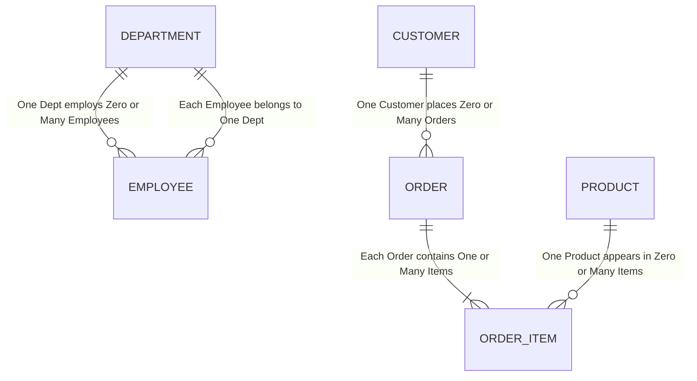
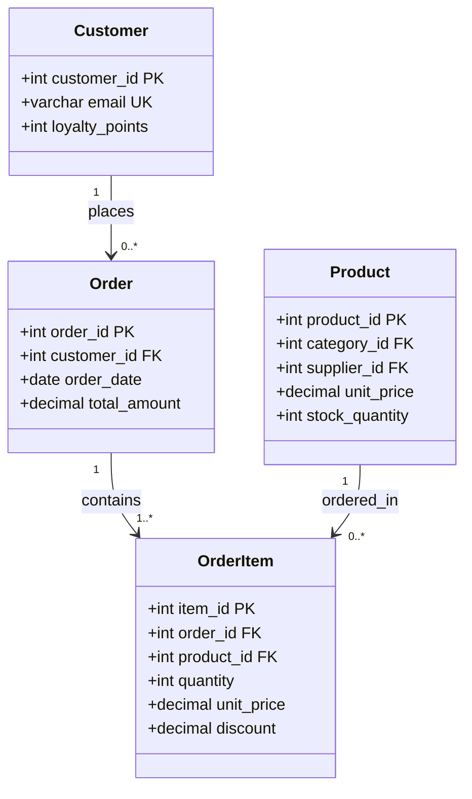
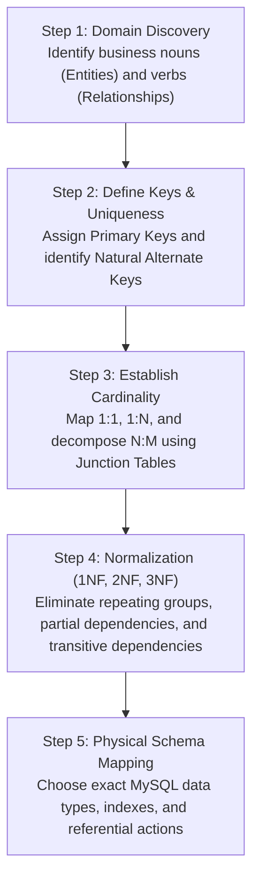

# Chapter 15 — Database Design & Entity Relationship Modeling

---

## 1. What is it?

**Database Design** is the disciplined engineering process of structuring an enterprise data model to satisfy business requirements while ensuring data integrity, performance, and long-term extensibility.

Designing a database is structured into three progressive architectural phases:
1. **Conceptual Design**: High-level identification of core business domains, fundamental business entities (e.g., *Customer*, *Order*, *Product*), and business relationships, abstracted away from any specific database technology.
2. **Logical Design**: Translating conceptual entities into relational tables, defining attributes (columns), identifying primary and foreign keys, establishing exact cardinalities (1:1, 1:N, N:M), and normalizing the schema to eliminate data anomalies.
3. **Physical Design**: Mapping logical relational structures to a specific RDBMS engine (e.g., MySQL InnoDB), choosing hardware storage formats, selecting exact physical data types (`INT UNSIGNED`, `VARCHAR(100)`, `DECIMAL(10,2)`), configuring character collations (`utf8mb4_0900_ai_ci`), designing primary/secondary indexes, and planning table partitioning strategies.

The primary visual tool for database modeling is the **Entity-Relationship Diagram (ERD)**, which utilizes standard modeling notations (such as **Crow's Foot Notation**) to visualize entities, attributes, and relationship constraints.

---

## 2. Crow's Foot Notation & Modeling Standards

Crow's Foot notation visually represents the minimum and maximum cardinality of relationships:

| Symbol / End | Meaning | Cardinality Description |
| :--- | :--- | :--- |
| `||` | One and only one | Mandatory Single (Minimum 1, Maximum 1) |
| `|o` | Zero or one | Optional Single (Minimum 0, Maximum 1) |
| `}|` | One or many | Mandatory Multiple (Minimum 1, Maximum Many) |
| `}o` | Zero or many | Optional Multiple (Minimum 0, Maximum Many) |



---

## 3. Database Design Rules & Principles

1. **Rule of Atomicity**: Every column must store a single, indivisible scalar value. Storing comma-separated lists of values (e.g., `phone_numbers = '555-1111, 555-2222'`) violates First Normal Form, prevents indexing, and breaks relational queries.
2. **Rule of Single Responsibility**: A table should model exactly one real-world entity type. Do not combine customer profile information with order shipping events in a single table.
3. **Rule of Immutability for Keys**: Primary key values should never change. Avoid natural keys that may change in the future (such as phone numbers or email addresses); use synthetic surrogate keys (`INT AUTO_INCREMENT` or `BIGINT`) instead.
4. **Naming Conventions**:
   * Tables: Lowercase plural (`customers`, `orders`, `products`, `departments`).
   * Columns: Lowercase singular (`customer_id`, `unit_price`, `hire_date`).
   * Junction Tables: Hyphenated or combined entity names (`order_items`, `student_courses`).
   * Foreign Keys: Match the parent table's primary key name (`customer_id` references `customers(customer_id)`).

---

## 4. Basic Example

Modeling a basic blogging platform:

```sql
USE sql_mastery;

-- 1. Authors Entity
CREATE TABLE blog_authors (
    author_id INT AUTO_INCREMENT PRIMARY KEY,
    full_name VARCHAR(100) NOT NULL,
    email VARCHAR(100) NOT NULL UNIQUE,
    created_at TIMESTAMP DEFAULT CURRENT_TIMESTAMP
);

-- 2. Posts Entity (1:N with Authors)
CREATE TABLE blog_posts (
    post_id INT AUTO_INCREMENT PRIMARY KEY,
    author_id INT NOT NULL,
    slug VARCHAR(120) NOT NULL UNIQUE,
    title VARCHAR(200) NOT NULL,
    body_content TEXT NOT NULL,
    published_at DATETIME DEFAULT NULL,
    CONSTRAINT fk_posts_author FOREIGN KEY (author_id)
        REFERENCES blog_authors(author_id)
        ON DELETE RESTRICT
        ON UPDATE CASCADE
);

-- 3. Tags Entity
CREATE TABLE blog_tags (
    tag_id INT AUTO_INCREMENT PRIMARY KEY,
    tag_name VARCHAR(50) NOT NULL UNIQUE
);

-- 4. Junction Table for Many-to-Many relationship between Posts and Tags
CREATE TABLE post_tags (
    post_id INT NOT NULL,
    tag_id INT NOT NULL,
    assigned_at TIMESTAMP DEFAULT CURRENT_TIMESTAMP,
    PRIMARY KEY (post_id, tag_id),  -- Composite PK enforces uniqueness
    CONSTRAINT fk_pt_post FOREIGN KEY (post_id)
        REFERENCES blog_posts(post_id)
        ON DELETE CASCADE,
    CONSTRAINT fk_pt_tag FOREIGN KEY (tag_id)
        REFERENCES blog_tags(tag_id)
        ON DELETE RESTRICT
);

-- Clean up
DROP TABLE post_tags;
DROP TABLE blog_tags;
DROP TABLE blog_posts;
DROP TABLE blog_authors;
```

---

## 5. Real-World Architectural Case Study: `sql_mastery`

Let us analyze the architectural decisions made in designing our master database schema:



### Key Design Decisions Explained:
1. **Historical Price Capture in `order_items`**:
   * Notice that `order_items` has its own `unit_price` column, even though `products` already has a `unit_price` column!
   * *Why?*: Product catalog prices fluctuate over time. If a laptop costs $1,299 today and rises to $1,499 next month, historical order totals must remain accurate to the price charged at the moment of checkout. Copying the current catalog price into `order_items.unit_price` at order creation preserves point-in-time financial truth.
2. **Decoupled Order and Payment Entities**:
   * Rather than embedding payment fields directly in `orders`, payments reside in a dedicated `payments` table.
   * *Why?*: A customer order may involve split payments (e.g., paying partially with a gift card and partially with a credit card), payment retries after failures, or post-delivery partial refunds. A separate `payments` table cleanly models 1:N payment attempts per order.

---

## 6. Step-by-Step Design Workflow

When designing a relational database from scratch for an enterprise domain:



---

## 7. Common Design Anti-Patterns

1. **The Comma-Separated List Anti-Pattern (Jaywalking)**:
   * *Anti-pattern*: Storing multiple IDs in one text field: `products.category_ids = '1, 4, 7'`.
   * *Problems*: Searching requires slow full table scans using `LIKE '%4%'`, joining to `categories` is impossible without string parsing functions, foreign keys cannot be enforced, and updating a category requires string replacement.
   * *Fix*: Create a proper junction table `product_categories(product_id, category_id)`.
2. **Entity-Attribute-Value (EAV) Overuse**:
   * *Anti-pattern*: Attempting to store arbitrary product specifications using three generic columns: `(entity_id, attribute_name, attribute_value)`.
   * *Problems*: Every query requires 10 self-joins, basic data type validation is lost (everything becomes a string), and performance degrades rapidly.
   * *Fix*: In MySQL 8.0+, use typed relational columns for shared core attributes and a structured `JSON` column for highly variable, dynamic attributes.
3. **Multipurpose Column Anti-Pattern**:
   * Storing a tracking number if the order is shipped, or a cancellation reason if the order is cancelled, in the same `status_note` column. Mixing data domains causes queries to require complex `CASE` logic.

---

## 8. Best Practices

1. **Always Use Synthetic Auto-Increment Keys for Primary Keys**:
   * Use `INT UNSIGNED AUTO_INCREMENT` or `BIGINT UNSIGNED AUTO_INCREMENT`. They are compact (4 or 8 bytes), monotonically increasing, and maximize clustered index insertion performance in InnoDB.
2. **Enforce Historical Immutability**:
   * When capturing transactions, preserve snapshot values (like product price, shipping address, or billing address) in the transaction record, rather than joining back to the customer profile which might be modified tomorrow.
3. **Soft Deletes with `is_active` or `deleted_at`**:
   * For mission-critical records (customers, orders, accounts), avoid physically deleting rows with `DELETE`. Add an `is_active BOOLEAN DEFAULT TRUE` or `deleted_at TIMESTAMP NULL` column to perform **soft deletes**, preserving audit history.

---

## 9. Practice Questions

### Easy
1. Identify the three phases of database design.
2. In Crow's Foot notation, what does a circle (`o`) combined with a crow's foot (`}`) signify?
3. Why should comma-separated lists never be stored inside a single relational column?

### Medium
4. Design an ER schema for a Hospital Clinic containing `doctors`, `patients`, and `appointments`. Specify primary keys, foreign keys, and cardinalities.
5. In our `sql_mastery` schema, explain why `unit_price` exists in both `products` and `order_items`. What bug would occur if `unit_price` was only stored in `products`?
6. When should an architect model a 1:1 relationship as two separate tables rather than a single unified table?

### Difficult
7. Design a database schema for an Airline Reservation System:
   * Support `flights`, `airports`, `airplanes`, `passengers`, and `seat_reservations`.
   * Ensure a passenger cannot book the same seat twice on the same flight.
   * Handle the relationship where a flight has both an `origin_airport` and a `destination_airport` referencing the same `airports` table.
8. Explain the trade-offs of using UUIDs (Universally Unique Identifiers) as primary keys versus auto-increment integers in MySQL InnoDB. How does MySQL 8.0's `UUID_TO_BIN(uuid, 1)` mitigate clustered index page fragmentation?

---

## 10. Interview Questions

### Q1: What is the difference between Conceptual, Logical, and Physical database design?
**Answer**:
* **Conceptual Design**: Business-centric modeling that identifies core entities, business rules, and high-level relationships without considering any database technology.
* **Logical Design**: Technology-independent relational modeling that defines tables, primary keys, foreign keys, constraints, and normalizes structures to Third Normal Form (3NF).
* **Physical Design**: Engine-specific implementation detailing physical data types, storage engines (InnoDB), B+ Tree indexing strategies, table partitioning, collations, and disk allocation parameters.

### Q2: What is the "Jaywalking" anti-pattern in database design, and why is it problematic?
**Answer**: The Jaywalking anti-pattern occurs when a developer stores a list of related identifiers as a single delimited string (such as comma-separated IDs: `'10,24,35'`) within a single table column instead of building a proper Many-to-Many junction table. 
Problems:
1. Cannot enforce referential integrity (foreign keys cannot validate individual values inside a string).
2. Querying requires slow full table scans using `LIKE '%24%'` or `FIND_IN_SET()`, which cannot leverage indexes.
3. Aggregate calculations (`COUNT`, `AVG`) require complex string parsing.
4. Concurrency issues: adding or removing an ID requires reading, updating, and writing the entire string, introducing race conditions.

### Q3: Why is point-in-time historical data preservation critical when designing e-commerce schemas?
**Answer**: In enterprise schemas, master catalog data changes over time: product prices change, tax rates are revised, and customers update their mailing addresses. If an order line item references the `products.unit_price` dynamically via a join rather than saving the actual price paid at checkout into `order_items.unit_price`, then any future price change will retroactively alter the financial totals of all past orders, corrupting financial reporting and invalidating tax records.

---

## 11. Quick Revision

* Good database design moves through **Conceptual**, **Logical**, and **Physical** modeling phases.
* Use **Crow's Foot notation** to represent minimum and maximum relationship cardinality.
* Adhere to the **Rule of Atomicity**: one scalar value per column; never store comma-separated lists.
* Capture **point-in-time historical values** (such as checkout prices and addresses) directly in transaction tables.
* Use **synthetic surrogate keys** for primary keys to maximize index performance and protect against business attribute changes.
