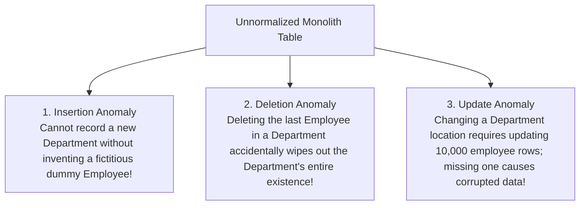
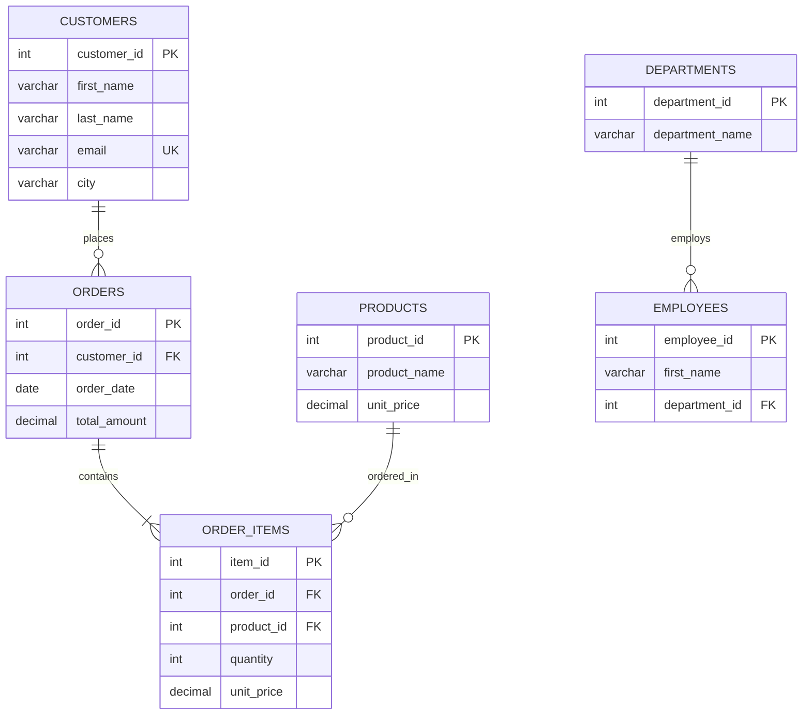

# Chapter 16 — Relational Integrity: Database Normalization & Anomalies

---

## 1. What is it?

**Database Normalization** is a formal mathematical process introduced by Edgar F. Codd for designing relational database tables to minimize data redundancy and prevent destructive **modification anomalies**.

Normalization systematically decomposes large, unorganized tables into smaller, well-structured, cohesive tables linked by foreign keys. It evaluates schemas against progressive mathematical criteria known as **Normal Forms (NF)**:

> *"Every non-key attribute must provide a fact about the key, the whole key, and nothing but the key, so help me Codd."*

### 1.1. The Three Modification Anomalies
Without normalization, storing multiple business facts inside a single table introduces three critical data integrity failures:



1. **Insertion Anomaly**: The inability to insert a legitimate business fact without simultaneously inventing fictitious or `NULL` data for an unrelated entity. (e.g., You cannot record a new `department_name` until your company hires its first employee for that department).
2. **Deletion Anomaly**: The unintended loss of critical business data as a side-effect of deleting an unrelated record. (e.g., If the only employee working in the `'Legal'` department resigns and their row is deleted, the fact that the `'Legal'` department ever existed in `'London'` is permanently erased from the database).
3. **Update (Modification) Anomaly**: Data inconsistency that occurs when redundant data is updated in some rows but missed in others. (e.g., If `'Engineering'` location is repeated across 500 employee rows, moving the office to a new building requires updating all 500 rows. If a server disconnects mid-query, half the company will show `'San Francisco'` while the other half shows `'Austin'`).

---

## 2. Functional Dependencies: The Foundation

A **Functional Dependency** (written $X \rightarrow Y$) describes a mathematical relationship between columns in a table:
* Attribute $Y$ is functionally dependent on attribute $X$ if and only if each distinct value of $X$ is associated with exactly one value of $Y$.
* *Example*: In `employees`, `employee_id` $\rightarrow$ `email` (given an employee ID, there is exactly one email).

---

## 3. The Progressive Normal Forms Step-by-Step

### 3.1. First Normal Form (1NF): Atomic Values & No Repeating Groups
A table is in **1NF** if:
1. Every column contains only **atomic (indivisible)** scalar values (no comma-separated lists or arrays).
2. There are no **repeating groups** of columns (e.g., `phone1`, `phone2`, `phone3`).
3. Each record is uniquely identifiable by a designated **Primary Key**.

```sql
-- VIOLATES 1NF: Multi-valued list in a single column
CREATE TABLE bad_orders_unf (
    order_id INT,
    customer_name VARCHAR(100),
    product_ids VARCHAR(100) -- e.g. '1, 3, 4' VIOLATES 1NF!
);

-- CONVERTED TO 1NF: Atomic rows
CREATE TABLE orders_1nf (
    order_id INT,
    product_id INT,
    customer_name VARCHAR(100),
    PRIMARY KEY (order_id, product_id)
);
```

### 3.2. Second Normal Form (2NF): No Partial Dependencies
A table is in **2NF** if:
1. It is already in **1NF**.
2. It contains **no partial functional dependencies**: every non-key attribute must depend on the **entire** composite primary key, not just a portion of it.
*(Note: If a table's primary key consists of a single column, it is automatically in 2NF once it satisfies 1NF!)*

```sql
-- VIOLATES 2NF: Composite PK is (order_id, product_id).
-- But 'product_name' and 'unit_price' depend ONLY on product_id, NOT on order_id!
CREATE TABLE bad_order_items_2nf (
    order_id INT,
    product_id INT,
    quantity INT,            -- Depends on BOTH (order_id, product_id) -> Full dependency
    product_name VARCHAR(50),-- Depends ONLY on product_id -> PARTIAL DEPENDENCY!
    PRIMARY KEY (order_id, product_id)
);

-- CONVERTED TO 2NF: Decompose into two tables
CREATE TABLE products_2nf (
    product_id INT PRIMARY KEY,
    product_name VARCHAR(50)
);

CREATE TABLE order_items_2nf (
    order_id INT,
    product_id INT,
    quantity INT,
    PRIMARY KEY (order_id, product_id),
    FOREIGN KEY (product_id) REFERENCES products_2nf(product_id)
);
```

### 3.3. Third Normal Form (3NF): No Transitive Dependencies
A table is in **3NF** if:
1. It is already in **2NF**.
2. It contains **no transitive functional dependencies**: non-key attributes must not depend on other non-key attributes ($X \rightarrow Y$ and $Y \rightarrow Z$, meaning $X \rightarrow Z$). Non-key attributes must depend *only* on the primary key.

```sql
-- VIOLATES 3NF: PK is employee_id.
-- employee_id -> department_id, and department_id -> department_name.
-- Therefore, department_name depends transitively on employee_id via department_id!
CREATE TABLE bad_employees_3nf (
    employee_id INT PRIMARY KEY,
    first_name VARCHAR(50),
    department_id INT,
    department_name VARCHAR(50), -- TRANSITIVE DEPENDENCY!
    department_location VARCHAR(50)
);

-- CONVERTED TO 3NF: Decompose into departments and employees
CREATE TABLE departments_3nf (
    department_id INT PRIMARY KEY,
    department_name VARCHAR(50),
    department_location VARCHAR(50)
);

CREATE TABLE employees_3nf (
    employee_id INT PRIMARY KEY,
    first_name VARCHAR(50),
    department_id INT,
    FOREIGN KEY (department_id) REFERENCES departments_3nf(department_id)
);
```

### 3.4. Boyce-Codd Normal Form (BCNF): Strict 3NF
A table is in **BCNF** if for every non-trivial functional dependency $X \rightarrow Y$, the determinant $X$ must be a **Super Key**. BCNF resolves rare edge-case anomalies in 3NF tables that have multiple overlapping composite candidate keys.

---

## 4. Controlled Denormalization: When & Why?

While 3NF is the gold standard for **OLTP (Online Transaction Processing)** environments (minimizing write locking and eliminating update anomalies), enterprise systems often employ **controlled denormalization** for **OLAP (Online Analytical Processing)** and reporting systems:

| Dimension | Normalized Schema (3NF) | Denormalized Schema (Star / Snowflake) |
| :--- | :--- | :--- |
| **Primary Goal** | Minimize redundancy; safe, atomic `INSERT`/`UPDATE`/`DELETE`. | Maximize query speed for massive analytical reads. |
| **Workload Type** | High-concurrency OLTP (e.g., e-commerce checkouts). | Business Intelligence & Data Warehousing (e.g., Snowflake, BigQuery). |
| **Query Complexity** | Requires multiple `JOIN`s to reconstruct entities. | Pre-joined wide tables; minimal joins. |
| **Storage Overhead** | Compact storage footprints. | Higher disk consumption due to repeated dimension values. |

### Practical Denormalization Example: Pre-Aggregated Totals
In our `orders` table, `total_amount` is technically a denormalized calculated column (since it could be derived dynamically via `SUM(quantity * unit_price * (1 - discount)) + shipping_fee` from `order_items`). 
* *Why store it?*: Recalculating the total across millions of historic line items on every customer dashboard load wastes enormous CPU cycles. Caching the finalized sum in `orders.total_amount` is an intentional, controlled denormalization trade-off.

---

## 5. Real-World Normalization Transformation

Let us examine how a messy, unnormalized spreadsheet row transforms into our clean, 3NF `sql_mastery` schema:

### The Raw Unnormalized Invoice Row (Spreadsheet)
```
Order_ID: 1001
Order_Date: 2023-08-01
Customer_Name: Emily Watson
Customer_Email: emily.watson@gmail.com
Customer_City: San Francisco
Products_Ordered: "Quantum Pro 15 Laptop (Qty: 1, $1299.99), TrueSound Headphones (Qty: 1, $249.50)"
Department: Sales
Department_Head: Elena Rostova
```

### The 3NF Relational Decomposition:


* **1NF achieved**: `Products_Ordered` multi-valued string is broken into individual atomic rows in `order_items`.
* **2NF achieved**: `product_name` is decoupled into `products` so it no longer partially depends on the line item composite key.
* **3NF achieved**: Customer contact information is moved to `customers`, and Department Head metadata is separated into `departments` and `employees`, completely eliminating transitive dependencies.

---

## 6. Common Mistakes

1. **Over-Normalizing to the Point of Paralysis**:
   * Decomposing every single attribute into its own standalone lookup table (e.g., creating a separate table for `cities`, a table for `postal_codes`, a table for `street_names`). Every basic query ends up requiring 15 joins, crippling query performance. 3NF strikes the optimal balance for transactional systems.
2. **Failing to Enforce Foreign Keys on Decomposed Tables**:
   * Splitting an unnormalized table into three tables without defining foreign key constraints allows orphaned records to proliferate, negating the benefits of normalization.
3. **Premature Denormalization**:
   * Duplicating columns across tables for "performance reasons" before encountering any actual performance bottlenecks. Always start with a clean 3NF schema; only denormalize when query profiling proves that join overhead is a measurable bottleneck.

---

## 7. Best Practices

1. **Normalize for Writes, Denormalize for Reads**:
   * Design your core operational transactional database in strict **3NF** to guarantee data integrity.
   * If heavy reporting queries degrade transactional performance, replicate data asynchronously to an analytics data warehouse organized into a denormalized **Star Schema** (Fact tables and Dimension tables).
2. **Maintain Point-of-Sale Snapshots**:
   * Storing historical transaction values (such as the price charged on the date of checkout) is not redundancy; it represents historical audit truth.
3. **Use Triggers or Application Services to Guard Denormalized Caches**:
   * If you denormalize a calculated metric (e.g., caching `total_amount` on `orders`), ensure transactional consistency using triggers or application services so the cached sum never drifts out of sync with line items.

---

## 8. Practice Questions

### Easy
1. Define the three modification anomalies: Insertion, Deletion, and Update anomalies.
2. What core rule must a table satisfy to achieve First Normal Form (1NF)?
3. If a table has a single-column primary key and satisfies 1NF, is it automatically in 2NF? Explain why.

### Medium
4. Identify the transitive dependency in this table: `Student_ID, Student_Name, Dorm_Name, Dorm_Building_Manager`. How should this table be normalized to 3NF?
5. Explain how splitting `orders` and `order_items` into two tables solves the partial dependency violation of 2NF.
6. A table has columns `(Author_ID, Book_ISBN, Book_Title, Author_Bio, Publication_Year)`. With a primary key of `(Author_ID, Book_ISBN)`, which normal form is violated?

### Difficult
7. Given the functional dependencies:
   * $A \rightarrow B$
   * $B \rightarrow C$
   * $C \rightarrow D$
   Decompose a relation $R(A, B, C, D)$ into a collection of 3NF relations without losing any dependency or data.
8. Explain Boyce-Codd Normal Form (BCNF) using a concrete real-world scenario where a table is in 3NF but fails BCNF due to overlapping composite candidate keys.

---

## 9. Interview Questions

### Q1: Explain the statement: "Every non-key attribute must depend on the key, the whole key, and nothing but the key."
**Answer**: This phrase summarizes the first three Normal Forms:
1. **"On the key" (1NF)**: Every non-key attribute must be functionally dependent on the table's primary key identifier.
2. **"The whole key" (2NF)**: In tables with a composite primary key, every non-key attribute must depend on the complete key as a whole, rather than on a partial subset of the primary key columns (eliminating partial dependencies).
3. **"And nothing but the key" (3NF)**: Non-key attributes must depend exclusively on the primary key, and cannot depend on any other non-key attributes (eliminating transitive dependencies).

### Q2: What is an Update Anomaly, and what real-world danger does it pose to a business?
**Answer**: An Update Anomaly occurs when redundant, duplicate data exists across multiple rows in an unnormalized table. Modifying that data requires locating and updating every single duplicate occurrence. If a network interruption, server crash, or poorly formatted query updates only a subset of those rows, the database enters an inconsistent state where conflicting values represent the same entity. In business applications, this causes critical errors—such as shipping merchandise to an outdated address or billing an obsolete subscription rate.

### Q3: Why do Data Warehouses frequently utilize denormalized schemas (like Star Schemas) instead of 3NF?
**Answer**: 
* **OLTP systems** prioritize fast, safe, highly concurrent single-row inserts and updates. 3NF is ideal because each fact is stored in exactly one place, eliminating locking overhead and update anomalies.
* **OLAP / Data Warehouses** prioritize complex analytical read queries scanning millions of historical records across multiple dimensions. In 3NF, calculating annual revenue across regions requires joining 10+ tables, requiring massive memory for join buffers. Denormalized Star Schemas combine attributes into wide Dimension tables surrounding a central Fact table, minimizing joins, enabling columnar storage compression, and speeding up aggregation queries.

---

## 10. Quick Revision

* **Normalization** eliminates redundancy and prevents Insertion, Deletion, and Update anomalies.
* **1NF**: Atomic scalar values; no repeating groups; primary key identified.
* **2NF**: Satisfies 1NF + no **partial dependencies** on composite primary keys.
* **3NF**: Satisfies 2NF + no **transitive dependencies** between non-key attributes.
* **BCNF**: Strict 3NF where every determinant must be a Super Key.
* Use **3NF for transactional OLTP databases**; use **controlled denormalization (Star Schema) for analytics and data warehousing**.
