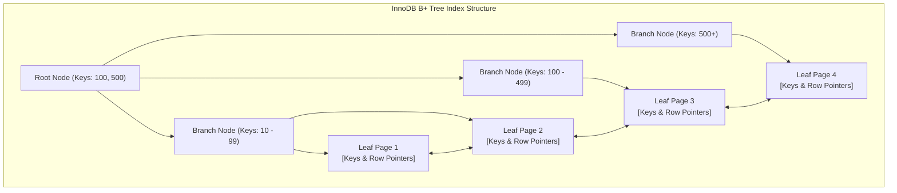
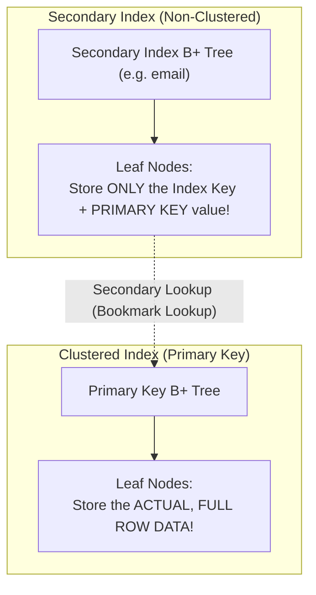

# Chapter 18 — Query Acceleration: MySQL B-Tree Indexes & Optimization

---

## 1. What is it?

An **Index** in a relational database is a specialized, highly ordered on-disk data structure (primarily a **B+ Tree** in MySQL's InnoDB storage engine) that allows the database engine to find specific rows in $O(\log N)$ logarithmic time, bypassing the need to read every single data page on disk.

### The Book Index Analogy
Imagine searching for the topic *"Foreign Keys"* in an 800-page database textbook:
* **Full Table Scan**: Without an index, you must turn every page from page 1 to 800, inspecting every paragraph.
* **Index Seek**: With an index at the back of the book, you look up *"Foreign Keys"*, find the exact entry indicating *"Pages 145, 148"*, and flip directly to those pages in seconds.

### 1.1. The Physical B+ Tree Architecture
In MySQL's default **InnoDB** engine, indexes are structured as balanced search trees (B+ Trees):
* **Root & Branch Nodes**: Store key values and pointer addresses to guide tree traversal.
* **Leaf Nodes**: The bottom tier of the tree. In a B+ Tree, leaf nodes are linked sequentially in a doubly-linked list, allowing fast range scans (e.g., `BETWEEN 10 AND 50`).
* **Depth**: A typical B+ Tree with millions of rows has a depth of only 3 to 4 levels, meaning any row can be located in just 3 to 4 page reads!



---

## 2. Clustered vs Secondary Indexes in InnoDB

Understanding the distinction between Clustered and Secondary indexes is critical for writing high-performance SQL:



1. **Clustered Index**:
   * In InnoDB, the table **is** the clustered index.
   * Defined by the `PRIMARY KEY`.
   * The leaf nodes contain the physical, complete row data.
   * A table can have **only one** clustered index.
2. **Secondary (Non-Clustered) Index**:
   * Any index created on non-primary key columns (`CREATE INDEX idx_email ON customers(email)`).
   * Leaf nodes do **not** store row data or physical disk offsets; they store the indexed column value plus the row's **Primary Key value**.
   * When you query by a secondary index, MySQL traverses the secondary B+ Tree, retrieves the Primary Key, and then performs a second lookup into the Clustered Index to retrieve the rest of the row's columns (known as a **Bookmark Lookup**).

---

## 3. Syntax

```sql
-- 1. Create a Single-Column Index
CREATE INDEX idx_customers_city ON customers(city);

-- 2. Create a Composite (Multi-Column) Index
CREATE INDEX idx_orders_customer_status ON orders(customer_id, status);

-- 3. Create a Unique Index (Enforces uniqueness while indexing)
CREATE UNIQUE INDEX uq_suppliers_email ON suppliers(contact_email);

-- 4. Inspect Indexes on a Table
SHOW INDEX FROM table_name;

-- 5. Drop an Index
DROP INDEX idx_customers_city ON customers;

-- 6. Verify Index Usage with EXPLAIN
EXPLAIN SELECT * FROM customers WHERE city = 'San Francisco';
```

---

## 4. The Leftmost Prefix Rule for Composite Indexes

When you create a multi-column index on `(colA, colB, colC)`, MySQL can use that index for queries that filter on:
* `colA` alone
* `colA` AND `colB`
* `colA` AND `colB` AND `colC`

However, MySQL **cannot** use the index if your query filters on:
* `colB` alone
* `colC` alone
* `colB` AND `colC`

> [!TIP]
> Think of a composite index like a telephone directory ordered by `(Last_Name, First_Name)`. It is easy to find everyone named `"Smith"` (`colA`), or `"Smith, John"` (`colA, colB`). But finding everyone whose first name is `"John"` (`colB` alone) requires scanning the entire phone book from cover to cover!

---

## 5. Basic Example

Creating and analyzing indexes on the `customers` table:

```sql
USE sql_mastery;

-- Inspect initial default indexes created by primary keys and foreign keys
SHOW INDEX FROM customers;

-- Create an index on the city column
CREATE INDEX idx_customers_city ON customers(city);

-- Analyze query execution plan with EXPLAIN
EXPLAIN SELECT customer_id, first_name, last_name, city
FROM customers
WHERE city = 'San Francisco';

-- Clean up
DROP INDEX idx_customers_city ON customers;
```

---

## 6. Real-World Example: The Covering Index Optimization

A **Covering Index** is an index that contains all columns requested by a query (in the `SELECT`, `WHERE`, `GROUP BY`, and `ORDER BY` clauses). When a query is covered by an index, InnoDB satisfies the query entirely from the secondary index tree, completely eliminating the secondary lookup into the clustered index!

```sql
USE sql_mastery;

-- Scenario: The mobile API frequently queries customer loyalty rankings by country:
-- SELECT customer_id, loyalty_points, country FROM customers WHERE country = 'USA';

-- Step 1: Without a covering index, check execution plan
EXPLAIN SELECT customer_id, loyalty_points, country 
FROM customers 
WHERE country = 'USA';

-- Step 2: Create a composite covering index
-- Notice that customer_id is automatically included in every secondary index leaf node in InnoDB!
CREATE INDEX idx_cov_country_loyalty ON customers(country, loyalty_points);

-- Step 3: Check execution plan with the covering index in place
-- Notice 'Using index' in the Extra column: Zero clustered index lookups!
EXPLAIN SELECT customer_id, loyalty_points, country 
FROM customers 
WHERE country = 'USA';

-- Clean up
DROP INDEX idx_cov_country_loyalty ON customers;
```

---

## 7. Step-by-Step Explanation of `EXPLAIN` Output

When evaluating `EXPLAIN` to verify index health, inspect these key columns:

| EXPLAIN Field | Ideal Target Value | Danger Value | Technical Explanation |
| :--- | :--- | :--- | :--- |
| **`type`** | `const`, `eq_ref`, `ref`, `range` | `ALL` | Access mechanism. `ALL` indicates a full table scan; `ref` or `range` indicates index usage. |
| **`possible_keys`** | Name of your index | `NULL` | Indexes the optimizer considered using. |
| **`key`** | Name of index actually chosen | `NULL` | The actual index selected by the Cost-Based Optimizer. |
| **`rows`** | Lowest possible number | Total table rows | Estimated count of disk rows the engine must inspect. |
| **`Extra`** | `Using index` (Covering!) | `Using filesort`, `Using temporary` | Performance notes. `Using index` means covered by memory; `Using filesort` indicates sorting without index. |

---

## 8. Expected Result

Comparing `EXPLAIN` before and after creating the Covering Index:

Before index creation:
```
+----+-------------+-----------+------------+------+---------------+------+---------+------+------+----------+-------------+
| id | select_type | table     | partitions | type | possible_keys | key  | key_len | ref  | rows | filtered | Extra       |
+----+-------------+-----------+------------+------+---------------+------+---------+------+------+----------+-------------+
|  1 | SIMPLE      | customers | NULL       | ALL  | NULL          | NULL | NULL    | NULL |   10 |    10.00 | Using where |
+----+-------------+-----------+------------+------+---------------+------+---------+------+------+----------+-------------+
```
*(Notice `type: ALL` and `key: NULL` $\rightarrow$ Full Table Scan).*

After creating `idx_cov_country_loyalty`:
```
+----+-------------+-----------+------------+------+------------------------+------------------------+---------+-------+------+----------+-------------+
| id | select_type | table     | partitions | type | possible_keys          | key                    | key_len | ref   | rows | filtered | Extra       |
+----+-------------+-----------+------------+------+------------------------+------------------------+---------+-------+------+----------+-------------+
|  1 | SIMPLE      | customers | NULL       | ref  | idx_cov_country_loyalty| idx_cov_country_loyalty| 202     | const |    4 |   100.00 | Using index |
+----+-------------+-----------+------------+------+------------------------+------------------------+---------+-------+------+----------+-------------+
```
*(Notice `type: ref`, `key: idx_cov_country_loyalty`, and `Extra: Using index` $\rightarrow$ Extremely fast covering index seek!).*

---

## 9. The Cost of Indexing: The Write Penalty

Indexes are not free. Every index carries significant costs:
1. **The Write Penalty (DML Overhead)**: Every time an `INSERT`, `UPDATE`, or `DELETE` statement executes, the database engine must not only write the change to the table's clustered index, but must also update and balance the B+ Tree of **every single secondary index** on that table! A table with 10 indexes will write 11 distinct index trees on every insert, causing severe write slowdowns.
2. **Disk & Buffer Pool RAM Consumption**: Index trees consume disk space and compete for memory inside the MySQL Buffer Pool, reducing the RAM available to cache active data pages.
3. **Indexing Low-Cardinality Columns Is Ineffective**: Indexing a column with very few unique values (e.g., a boolean `is_active` column or a `gender` column) is generally useless. If 50% of the table matches `is_active = TRUE`, the query optimizer will ignore the index and perform a full table scan anyway, because scanning sequentially is faster than bouncing between secondary index pages and clustered index pages.

---

## 10. Best Practices

1. **Index Columns Frequently Used in `WHERE`, `JOIN ... ON`, and `ORDER BY` Clauses**:
   * Prioritize indexing columns that filter high-cardinality datasets or serve as foreign key joins.
2. **Follow the Leftmost Prefix Rule in Composite Indexes**:
   * Order columns in a composite index from highest selectivity to lowest: `(high_cardinality_col, low_cardinality_col)`.
3. **Design Covering Indexes for High-Frequency Queries**:
   * Include the columns needed by high-throughput API endpoints in the index to eliminate clustered index bookmark lookups (`Extra: Using index`).
4. **Audit and Remove Unused or Duplicate Indexes**:
   * Periodically query `sys.schema_unused_indexes` in MySQL to identify indexes that consume disk and write I/O without ever being used by queries.

---

## 11. Practice Questions

### Easy
1. What data structure is predominantly used by MySQL InnoDB to store indexes?
2. What is the fundamental difference between a Clustered Index and a Secondary Index in InnoDB?
3. How many Clustered Indexes can exist on a single table?

### Medium
4. Given a composite index on `orders(customer_id, order_date, status)`, which of the following query `WHERE` clauses can utilize the index?
   * A: `WHERE customer_id = 5`
   * B: `WHERE order_date = '2023-08-01'`
   * C: `WHERE customer_id = 5 AND order_date = '2023-08-01'`
   * D: `WHERE status = 'Delivered'`
5. Write the SQL statement to create an index named `idx_emp_hire_date` on the `hire_date` column of `employees`.
6. Explain what `Using filesort` indicates in the `Extra` column of an `EXPLAIN` query plan.

### Difficult
7. What is a "Covering Index", and how does it prevent the "Bookmark Lookup" step in InnoDB? Write a concrete query and covering index definition for the `products` table.
8. Why will MySQL's optimizer deliberately choose to ignore an index and execute a full table scan (`type: ALL`) if an indexed query predicate matches 40% of the rows in a table?

---

## 12. Interview Questions

### Q1: Explain how an InnoDB B+ Tree index executes a range search query like `WHERE id BETWEEN 100 AND 200`.
**Answer**: In an InnoDB B+ Tree index, the engine starts at the **Root Node** and compares the target key `100` against branch node pointers, navigating down the tree levels in $O(\log N)$ time until it reaches the specific **Leaf Node Page** holding key `100`. 
Because all leaf nodes in a B+ Tree are linked together sequentially in a doubly-linked list, the engine does not need to traverse back up the tree to find key `101`, `102`, etc. It simply performs a sequential scan forward along the linked leaf pages, reading rows in order until it encounters a key greater than `200`, at which point it halts.

### Q2: What is the "Leftmost Prefix Rule" in MySQL multi-column indexing?
**Answer**: The Leftmost Prefix Rule dictates that a composite index created on multiple columns `(A, B, C)` can only be utilized by the query optimizer if the query's filtering predicates reference the leftmost column `A` first. The index can accelerate queries filtering on:
* `(A)`
* `(A, B)`
* `(A, B, C)`
It cannot be used if the query filters on `(B)` alone, `(C)` alone, or `(B, C)` without `A`, because the composite B+ Tree is physically sorted first by `A`, then by `B` within ties of `A`, and finally by `C` within ties of `B`.

### Q3: What is the downside of creating too many indexes on a database table?
**Answer**:
1. **Degraded Write Throughput (DML Penalty)**: Every `INSERT`, `UPDATE`, and `DELETE` operation must update not only the table's clustered index, but also every secondary index tree on the table. Each additional index requires CPU, memory, and disk I/O to rebalance tree nodes and perform page splits.
2. **Buffer Pool Contention**: Index pages consume memory inside the InnoDB Buffer Pool (RAM). Excess indexes push active data pages out of cache, causing higher physical disk read rates.
3. **Storage Overhead**: On wide tables with millions of rows, secondary indexes frequently consume more cumulative disk space than the actual table data itself.
4. **Optimizer Overhead**: Having too many overlapping indexes increases the query optimization time as the Cost-Based Optimizer must evaluate execution plans for dozens of index candidates before selecting one.

---

## 13. Quick Revision

* An **Index** is a B+ Tree search structure that accelerates queries from $O(N)$ table scans to $O(\log N)$ logarithmic seeks.
* **Clustered Index**: Defined by the `PRIMARY KEY`; leaf nodes store the actual row data.
* **Secondary Index**: Stores the index key plus the row's Primary Key.
* **Covering Index**: Contains all queried columns in the index itself, avoiding the clustered index lookup (`Using index`).
* Multi-column indexes strictly obey the **Leftmost Prefix Rule**.
* Indexes speed up reads, but impose a **write penalty** on `INSERT`, `UPDATE`, and `DELETE`.
