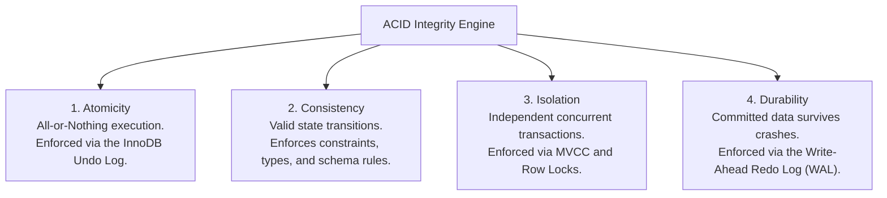
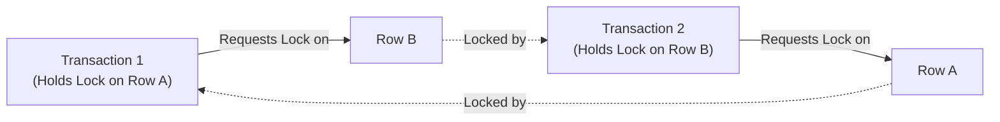

# Chapter 19 — Concurrency Control: Transactions & ACID Integrity

---

## 1. What is it?

A **Transaction** in a relational database is a logical unit of computational work comprising one or more SQL statements that are executed together as an **indivisible, atomic operation**.

In enterprise database applications, business operations rarely involve a single table. Consider a banking transfer: moving $500 from Account A to Account B requires two distinct SQL statements:
1. `UPDATE accounts SET balance = balance - 500 WHERE id = 1;`
2. `UPDATE accounts SET balance = balance + 500 WHERE id = 2;`

If the database server suffers a power failure or crashes after Step 1 but before Step 2, $500 evaporates into thin air! A transaction ensures that either **both** statements succeed and commit together, or if an error occurs, the database automatically **rolls back** all changes, restoring the database to its clean state as if the operation had never begun.

---

## 2. The ACID Properties

The reliability of a transactional database engine (such as MySQL's **InnoDB**) is governed by the four **ACID** guarantees:



1. **Atomicity**: The entire sequence of statements executes as an all-or-nothing unit. If any individual statement fails, all preceding statements in the transaction are reversed using the **Undo Log**.
2. **Consistency**: A transaction can only transition the database from one valid state to another valid state. All schema constraints (Primary Keys, Foreign Keys, `CHECK`, `NOT NULL`) must be satisfied when the transaction commits.
3. **Isolation**: The intermediate state of a transaction is hidden from other concurrent transactions. Multi-Version Concurrency Control (**MVCC**) ensures that reading transactions do not block writing transactions, and writing transactions do not block reading transactions.
4. **Durability**: Once a transaction is committed, its changes are permanently recorded in the database and will survive system crashes, operating system reboots, or hardware power outages via the **Redo Log** (Write-Ahead Logging).

---

## 3. Syntax

```sql
-- 1. Explicitly Start a Transaction
START TRANSACTION;
-- Alternative shorthand:
-- BEGIN;

-- 2. Execute DML Mutations
UPDATE accounts SET balance = balance - 500 WHERE account_id = 1;
UPDATE accounts SET balance = balance + 500 WHERE account_id = 2;

-- 3. Permanently Commit Changes
COMMIT;

-- 4. Revert All Uncommitted Changes on Failure
ROLLBACK;

-- 5. Intermediate Savepoints
SAVEPOINT savepoint_alpha;
-- Partially rollback to savepoint without aborting the entire transaction:
ROLLBACK TO SAVEPOINT savepoint_alpha;
-- Remove a savepoint:
RELEASE SAVEPOINT savepoint_alpha;

-- 6. Toggling AutoCommit Mode
SET autocommit = 0; -- Disables auto-commit for the session
SET autocommit = 1; -- Enables auto-commit (default in MySQL)
```

---

## 4. Transaction Isolation Levels & Concurrency Anomalies

When thousands of users query and modify the same tables concurrently, four major concurrency phenomena can occur:
1. **Dirty Read**: Transaction A reads data modified by Transaction B that has **not yet been committed**. If Transaction B subsequently rolls back, Transaction A was working with "dirty" data that technically never existed!
2. **Non-Repeatable Read (Fuzzy Read)**: Transaction A reads a row. Transaction B modifies that same row and commits. Transaction A re-reads the row and finds that its column values have changed.
3. **Phantom Read**: Transaction A queries a range of rows (e.g., `WHERE salary > 100000`). Transaction B inserts a **brand-new row** that satisfies that condition and commits. Transaction A re-runs the range query and discovers a new "phantom" row that was not present previously.

### The Four ANSI Isolation Levels

| Isolation Level | Dirty Reads Allowed? | Non-Repeatable Reads Allowed? | Phantom Reads Allowed? | Performance Impact |
| :--- | :--- | :--- | :--- | :--- |
| **`READ UNCOMMITTED`** | **Yes** (Dangerous) | Yes | Yes | Maximum throughput; zero safety. |
| **`READ COMMITTED`** | No | Yes | Yes | Standard in PostgreSQL/Oracle; fast. |
| **`REPEATABLE READ`** | No | No | **No in MySQL!** (MVCC Next-Key Locks) | **MySQL Default**; high consistency. |
| **`SERIALIZABLE`** | No | No | No | Slowest; locks all read ranges shared. |

```sql
-- Checking and Setting Isolation Level in MySQL
SELECT @@transaction_isolation;
SET SESSION TRANSACTION ISOLATION LEVEL REPEATABLE READ;
```

---

## 5. Locking Primitives: Explicit Row-Level Locks

In high-concurrency environments, applications often need to read a record and lock it exclusively to prevent other transactions from modifying it before an update is complete:

```sql
-- 1. Exclusive Lock for Update (Pessimistic Locking)
-- Other transactions attempting to SELECT ... FOR UPDATE or modify these rows are blocked!
SELECT balance FROM accounts WHERE account_id = 1 FOR UPDATE;

-- 2. Shared Lock (Lock in Share Mode / FOR SHARE in MySQL 8.0)
-- Allows other transactions to READ the rows, but blocks them from modifying them.
SELECT balance FROM accounts WHERE account_id = 1 FOR SHARE;
```

---

## 6. Basic Example

Demonstrating `COMMIT` and `ROLLBACK`:

```sql
USE sql_mastery;

CREATE TABLE transaction_test (
    id INT PRIMARY KEY,
    val VARCHAR(50)
);

-- TEST 1: The Rollback
START TRANSACTION;
INSERT INTO transaction_test VALUES (1, 'Initial Data');
-- Change mind / simulate error:
ROLLBACK;

-- Verify: Empty set! Row 1 was not persisted
SELECT * FROM transaction_test;

-- TEST 2: The Commit
START TRANSACTION;
INSERT INTO transaction_test VALUES (2, 'Committed Data');
COMMIT;

-- Verify: Row 2 is permanently saved
SELECT * FROM transaction_test;

-- Clean up
DROP TABLE transaction_test;
```

---

## 7. Real-World Example: Multi-Table Order & Payment Checkout

In our `sql_mastery` database, let us simulate a real-world e-commerce checkout transaction:
1. Customer 1 purchases 1 unit of Product 1 (`Quantum Pro 15 Laptop`, price $1,299.99).
2. Lock the product row using `SELECT ... FOR UPDATE` to confirm sufficient inventory.
3. Decrement the product's `stock_quantity` in `products`.
4. Create an order record in `orders`.
5. Create a line item record in `order_items`.
6. Record the processed transaction in `payments`.
7. Commit all mutations as a single atomic unit.

```sql
USE sql_mastery;

-- Begin the checkout transaction
START TRANSACTION;

-- Step 1: Pessimistic Lock on Product 1 to check stock
SELECT product_id, product_name, unit_price, stock_quantity
FROM products
WHERE product_id = 1
FOR UPDATE;

-- Step 2: Decrement inventory by 1 unit
UPDATE products
SET stock_quantity = stock_quantity - 1
WHERE product_id = 1 AND stock_quantity >= 1;

-- Step 3: Insert the parent Order record
INSERT INTO orders (order_id, customer_id, order_date, status, shipping_fee, total_amount)
VALUES (2001, 1, CURDATE(), 'Processing', 0.00, 1299.99);

-- Step 4: Insert the Order Line Item
INSERT INTO order_items (item_id, order_id, product_id, quantity, unit_price, discount)
VALUES (3001, 2001, 1, 1, 1299.99, 0.00);

-- Step 5: Record the Payment
INSERT INTO payments (payment_id, order_id, payment_date, amount, payment_method, payment_status, transaction_ref)
VALUES (4001, 2001, CURDATE(), 1299.99, 'Credit Card', 'Completed', 'TXN-CHECKOUT-9901');

-- Step 6: Commit all 4 operations atomically!
COMMIT;

-- Verification: Inspect the synchronized records across tables
SELECT o.order_id, o.status, p.payment_status, p.amount, pr.stock_quantity
FROM orders o
JOIN payments p ON o.order_id = p.order_id
JOIN order_items oi ON o.order_id = oi.order_id
JOIN products pr ON oi.product_id = pr.product_id
WHERE o.order_id = 2001;

-- Clean up the demo checkout records
DELETE FROM payments WHERE payment_id = 4001;
DELETE FROM order_items WHERE item_id = 3001;
DELETE FROM orders WHERE order_id = 2001;
UPDATE products SET stock_quantity = stock_quantity + 1 WHERE product_id = 1;
```

---

## 8. Step-by-Step Explanation

1. `START TRANSACTION;`:
   * Suspends MySQL's default `autocommit` behavior for this connection. All subsequent DML statements are recorded within a private transaction context.
2. `SELECT ... FOR UPDATE`:
   * Acquires an **Exclusive Row Lock (X-Lock)** on the row for `product_id = 1`. Any concurrent checkout transaction attempting to read or decrement product 1 is queued in memory until this transaction issues `COMMIT` or `ROLLBACK`.
3. `UPDATE products SET stock_quantity = stock_quantity - 1 ...`:
   * Decrements stock in the Buffer Pool and writes the pre-modification image to the **Undo Log** and the post-modification image to the **Redo Log**.
4. Steps 3, 4, 5 (`INSERT INTO orders`, `order_items`, `payments`):
   * Insert the corresponding order, item, and payment records into their respective tables within the same transaction scope.
5. `COMMIT;`:
   * InnoDB writes a commit record to the physical Redo Log buffer and flushes the log to disk (`fsync`).
   * All exclusive row locks held on `products`, `orders`, and `payments` are released.
   * The new order, payment, and updated inventory become visible to all other database connections simultaneously.

---

## 9. Deadlocks: Detection and Resolution

A **Deadlock** occurs when two concurrent transactions hold locks that the other needs, creating a circular dependency:
* Transaction 1 locks Row A, and requests a lock on Row B.
* Transaction 2 locks Row B, and requests a lock on Row A.
* Neither transaction can proceed!



### How MySQL Resolves Deadlocks
InnoDB includes an internal **Deadlock Detector**. When a circular dependency is detected:
1. It automatically identifies the transaction that has modified the smallest amount of data (the lowest rollback cost).
2. It breaks the cycle by aborting that transaction, rolling it back completely, and returning:
   `ERROR 1213 (40001): Deadlock found when trying to get lock; try restarting transaction`.
3. The other transaction acquires the lock and proceeds to completion.
4. **Production Application Best Practice**: Wrap transactional logic in application code with retry blocks that catch error `1213` and re-attempt the transaction after a randomized exponential backoff.

---

## 10. Common Mistakes

1. **Executing DDL Inside a Transaction (Implicit Commit Trap)**:
   * *Mistake*:
     ```sql
     START TRANSACTION;
     INSERT INTO accounts VALUES (1, 500);
     CREATE TABLE temp_log (id INT); -- DDL STATEMENT!
     ROLLBACK;
     ```
   * *The Surprise*: The row `(1, 500)` is **NOT** rolled back!
   * *Why?*: In MySQL, all DDL commands (`CREATE TABLE`, `ALTER TABLE`, `DROP TABLE`, `TRUNCATE`) trigger an **implicit commit**. The instant MySQL hits `CREATE TABLE`, it commits the preceding `INSERT`. The subsequent `ROLLBACK` has no effect.
2. **Holding Transactions Open During External HTTP / API Calls**:
   * *The Anti-Pattern*:
     ```python
     db.execute("START TRANSACTION")
     db.execute("SELECT ... FOR UPDATE")
     # BAD: Calling external third-party payment gateway API inside transaction!
     response = http.post("https://api.stripe.com/v1/charges")
     db.execute("COMMIT")
     ```
   * *Consequence*: If Stripe's API takes 4 seconds to respond, database row locks are held for 4 full seconds, causing lock wait timeouts (`Lock wait timeout exceeded`) and blocking thousands of other application users. Always perform external network calls *before* or *after* database transactions.
3. **Inconsistent Lock Ordering**:
   * If Service A updates Account 1 then Account 2, while Service B updates Account 2 then Account 1, deadlocks are inevitable. Always acquire locks in a consistent, deterministic order (e.g., sort IDs in ascending order: `ORDER BY account_id ASC`).

---

## 11. Best Practices

1. **Keep Transactions as Short as Possible**:
   * Execute business calculations and input validations in application memory before starting the transaction. Open the transaction, execute the DML statements, and `COMMIT` immediately.
2. **Always Implement Deadlock Retry Logic**:
   * In multi-threaded systems, deadlocks are normal occurrences. Design applications to catch error `1213` and automatically retry the transaction up to 3–5 times.
3. **Verify `autocommit` Settings**:
   * Be aware of your client library's default autocommit behavior (Python `psycopg2` or `mysql-connector` often begin transactions implicitly, whereas Java JDBC defaults to autocommit).

---

## 12. Practice Questions

### Easy
1. What does each letter in the acronym ACID stand for?
2. What is the default transaction isolation level in MySQL InnoDB?
3. Which SQL command reverts all changes made inside an open transaction?

### Medium
4. Write a transaction that inserts a new department named `'Security'` and adds an employee assigned to that new department. If either insert fails, roll back the transaction.
5. Explain the difference between `SELECT ... FOR UPDATE` and `SELECT ... FOR SHARE`.
6. Explain what a "Dirty Read" is, and which ANSI isolation level allows it.

### Difficult
7. Construct a reproducible scenario demonstrating a Deadlock between two concurrent terminal sessions in MySQL using the `accounts` table. Show the exact SQL statements executed in Session 1 and Session 2 that trigger error `1213`.
8. Explain the difference between MySQL's Undo Log and Redo Log. Which log is used to guarantee Atomicity during a `ROLLBACK`, and which is used to guarantee Durability during crash recovery?

---

## 13. Interview Questions

### Q1: Describe the ACID properties and how MySQL InnoDB physically enforces each of them.
**Answer**:
* **Atomicity**: Enforced via the **Undo Log**. As statements modify rows, InnoDB records the pre-image of the data in the undo tablespace. If an error occurs or a `ROLLBACK` is issued, InnoDB reads the undo log in reverse to undo all modifications.
* **Consistency**: Enforced through database integrity constraints (`PRIMARY KEY`, `FOREIGN KEY`, `CHECK`, `NOT NULL`) validated at the storage engine level, alongside the doublewrite buffer preventing partial page writes.
* **Isolation**: Enforced through **Multi-Version Concurrency Control (MVCC)** and **Locking** (Record Locks, Gap Locks, Next-Key Locks). Readers do not block writers, and writers do not block readers.
* **Durability**: Enforced through **Write-Ahead Logging (WAL)** using the **Redo Log**. Before modified data pages in memory are written to disk tablespace files, changes are appended to the sequential redo log file. In the event of a sudden power loss, InnoDB reads the redo log on startup to reapply committed transactions.

### Q2: How does MySQL's default `REPEATABLE READ` isolation level prevent Phantom Reads without locking the entire table?
**Answer**: In standard ANSI SQL, `REPEATABLE READ` prevents Dirty Reads and Non-Repeatable Reads, but permits Phantom Reads (where new rows inserted by another transaction appear in subsequent range queries). 
MySQL InnoDB's implementation of `REPEATABLE READ` prevents Phantom Reads through two complementary mechanisms:
1. **Consistent Non-Locking Reads (MVCC)**: Standard `SELECT` queries read from a consistent snapshot (Read View) created at the instant the transaction's first read query begins. Any rows inserted by other transactions after this snapshot is established are filtered out by inspecting row creation transaction IDs (`trx_id`), preventing phantoms in regular reads.
2. **Next-Key Locking (Locking Reads)**: When executing locking reads (`SELECT ... FOR UPDATE` or `UPDATE`), InnoDB employs **Next-Key Locks**, which combine an index record lock with a **Gap Lock** on the open space preceding that record. By locking the gap between keys, concurrent transactions are physically blocked from inserting new rows into that range until the transaction commits.

### Q3: What happens when a DDL statement like `ALTER TABLE` is executed inside an active transaction in MySQL?
**Answer**: In MySQL, DDL statements trigger an **implicit commit**. If a transaction has executed several `INSERT` or `UPDATE` statements and then encounters an `ALTER TABLE` or `CREATE TABLE` command, MySQL automatically calls an internal `COMMIT` immediately before running the DDL, and another `COMMIT` immediately after. As a result, the preceding DML statements are permanently committed to disk, and a subsequent `ROLLBACK` command cannot revert them.

---

## 14. Quick Revision

* A **Transaction** is an indivisible unit of work governed by **ACID** properties.
* **Atomicity** (Undo log) guarantees all-or-nothing; **Durability** (Redo log) ensures committed work survives crashes.
* **`START TRANSACTION`**, **`COMMIT`**, and **`ROLLBACK`** manage transactional boundaries.
* MySQL's default isolation level is **`REPEATABLE READ`**, which prevents Dirty, Non-Repeatable, and Phantom reads.
* Use **`SELECT ... FOR UPDATE`** for pessimistic row locking.
* **DDL statements trigger implicit commits** and cannot be rolled back.
