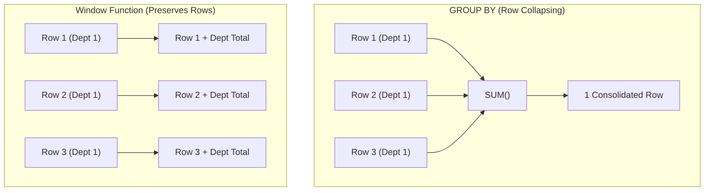

# Chapter 23 — Modern Analytics: Window Functions & JSON Manipulation

---

## 1. What is it?

Modern SQL (standardized in ANSI SQL:2003 and fully implemented in **MySQL 8.0**) fundamentally expanded relational database capabilities with two transformative features:
1. **Window Functions (Analytic Functions)**: Perform mathematical and ranking calculations across a set of table rows related to the current row without collapsing the rows into a single summary output (unlike `GROUP BY`). Every single row retains its individual identity while gaining access to aggregate and contextual metrics.
2. **Native JSON Document Processing**: Bridges the gap between relational integrity and NoSQL document storage, allowing structured tables to store, query, index, and transform semi-structured JSON payloads natively.

---

## 2. Window Functions Architecture: The `OVER()` Clause

Unlike a `GROUP BY` query (which collapses 10 rows into 1 summary row), a Window Function produces a calculated value for **every single row** by defining an analytical "window" or frame over which the function computes:



The behavior of a window function is defined by the **`OVER()`** clause:
```sql
FUNCTION(...) OVER (
    [PARTITION BY partition_column]
    [ORDER BY sort_column [ASC | DESC]]
    [ROWS | RANGE window_frame_specification]
)
```

1. **`PARTITION BY`**: Divides rows into distinct processing groups (similar to `GROUP BY`, but without collapsing them).
2. **`ORDER BY`**: Dictates the sorting sequence within each partition.
3. **Window Frame (`ROWS BETWEEN ...`)**: Defines the sliding window of neighboring rows evaluated (e.g., for rolling 7-day moving averages or cumulative running totals).

---

## 3. Comprehensive Window Function Taxonomy

### 3.1. Ranking Functions

| Function | Tie Handling Behavior | Numbering Sequence Example | Typical Use Case |
| :--- | :--- | :--- | :--- |
| **`ROW_NUMBER()`** | Never ties. Assigns strict sequential integers. | $1, 2, 3, 4, 5$ | Pagination, deduplication, fetching Top-1 per group. |
| **`RANK()`** | Ties share the same rank; skips subsequent ranks. | $1, 2, 2, 4, 5$ | Olympic leaderboards, competitive standings. |
| **`DENSE_RANK()`** | Ties share the same rank; does **not** skip ranks. | $1, 2, 2, 3, 4$ | Department salary rankings, top compensation tiers. |
| **`NTILE(N)`** | Divides partition into $N$ equal-sized buckets. | Bucket $1, 1, 2, 2, 3, 3$ | Quartile/Decile customer segmentation. |

### 3.2. Value Navigation Functions

| Function | Syntax | Description |
| :--- | :--- | :--- |
| **`LAG()`** | `LAG(col, offset, default)` | Accesses data from a preceding row without a self-join (ideal for Month-over-Month growth). |
| **`LEAD()`** | `LEAD(col, offset, default)` | Accesses data from a subsequent row (ideal for calculating churn or duration until next event). |
| **`FIRST_VALUE()`** | `FIRST_VALUE(col)` | Returns value from the first row of the window frame. |
| **`LAST_VALUE()`** | `LAST_VALUE(col)` | Returns value from the last row of the window frame. |

---

## 4. Syntax: Window Functions & Native JSON

### Window Function Calculations
```sql
-- 1. Cumulative Running Total
SELECT 
    order_id,
    order_date,
    total_amount,
    SUM(total_amount) OVER (ORDER BY order_date ASC ROWS BETWEEN UNBOUNDED PRECEDING AND CURRENT ROW) AS running_total
FROM orders;

-- 2. Ranking Employees within their Department
SELECT 
    employee_id,
    department_id,
    salary,
    DENSE_RANK() OVER (PARTITION BY department_id ORDER BY salary DESC) AS dept_salary_rank
FROM employees;

-- 3. Period-over-Period Growth using LAG
SELECT 
    order_date,
    total_amount,
    LAG(total_amount, 1) OVER (ORDER BY order_date) AS prev_order_amount,
    ROUND((total_amount - LAG(total_amount, 1) OVER (ORDER BY order_date)) / LAG(total_amount, 1) OVER (ORDER BY order_date) * 100, 2) AS pct_change
FROM orders;
```

### Native JSON Functions & Operators
```sql
-- JSON Extraction Operators
SELECT 
    data_column->'$.user.name' AS raw_json_string,      -- Returns quoted: "Alex"
    data_column->>'$.user.name' AS unquoted_string,    -- Returns unquoted: Alex
    JSON_EXTRACT(data_column, '$.items[0].price') AS item_price;

-- Constructing JSON Objects & Arrays
SELECT JSON_OBJECT('id', employee_id, 'name', first_name, 'salary', salary) FROM employees;

-- Modifying JSON Documents
UPDATE table_name 
SET json_col = JSON_SET(json_col, '$.is_verified', true) 
WHERE id = 1;
```

---

## 5. Basic Example

Demonstrating `ROW_NUMBER()` and `LAG()`:

```sql
USE sql_mastery;

-- Rank all products by price within their category
SELECT 
    product_id,
    product_name,
    category_id,
    unit_price,
    ROW_NUMBER() OVER (PARTITION BY category_id ORDER BY unit_price DESC) AS price_rank
FROM products;

-- Compare each order's value to the immediately preceding order
SELECT 
    order_id,
    order_date,
    total_amount,
    LAG(total_amount, 1) OVER (ORDER BY order_date) AS prior_amount
FROM orders;
```

---

## 6. Real-World Example: Enterprise Sales Analytics & JSON Ingestion

In our `sql_mastery` database, the Business Intelligence group requires:
1. **Running Sales Total & Moving Average**: Calculate a running cumulative revenue total for 2023 orders, along with a 3-order moving average.
2. **Top-N per Category**: Identify the top 2 highest-earning employees in each department using `DENSE_RANK()`.
3. **Semi-Structured Customer Metadata**: Query customer telemetry stored in JSON format, extract nested keys, and build an indexed virtual generated column.

```sql
USE sql_mastery;

-- PART 1: Cumulative Revenue & 3-Period Moving Average
SELECT 
    order_id,
    order_date,
    total_amount,
    SUM(total_amount) OVER (
        ORDER BY order_date ASC 
        ROWS BETWEEN UNBOUNDED PRECEDING AND CURRENT ROW
    ) AS cumulative_revenue,
    ROUND(AVG(total_amount) OVER (
        ORDER BY order_date ASC 
        ROWS BETWEEN 2 PRECEDING AND CURRENT ROW
    ), 2) AS moving_avg_3orders
FROM orders
WHERE status != 'Cancelled'
ORDER BY order_date ASC;

-- PART 2: Top-2 Highest Paid Employees per Department (CTE + DENSE_RANK)
WITH DepartmentRankedSalaries AS (
    SELECT 
        e.employee_id,
        CONCAT(e.first_name, ' ', e.last_name) AS employee_name,
        d.department_name,
        e.salary,
        DENSE_RANK() OVER (
            PARTITION BY e.department_id 
            ORDER BY e.salary DESC
        ) AS salary_rank
    FROM employees e
    JOIN departments d ON e.department_id = d.department_id
    WHERE e.is_active = TRUE
)
SELECT department_name, salary_rank, employee_name, salary
FROM DepartmentRankedSalaries
WHERE salary_rank <= 2
ORDER BY department_name ASC, salary_rank ASC;

-- PART 3: JSON Telemetry & Indexed Generated Column Demo
CREATE TABLE customer_sessions (
    session_id INT AUTO_INCREMENT PRIMARY KEY,
    customer_id INT NOT NULL,
    session_payload JSON NOT NULL,
    -- Extract JSON key into an indexed virtual generated column!
    device_os VARCHAR(30) AS (session_payload->>'$.device.os') STORED,
    INDEX idx_device_os (device_os)
);

INSERT INTO customer_sessions (customer_id, session_payload) VALUES
(1, '{"device": {"os": "iOS", "version": "16.5"}, "actions": ["login", "view_cart", "checkout"]}'),
(2, '{"device": {"os": "Android", "version": "13.0"}, "actions": ["login", "search"]}'),
(3, '{"device": {"os": "iOS", "version": "17.1"}, "actions": ["login", "view_product"]}');

-- High-performance query utilizing the generated column index
SELECT session_id, customer_id, device_os, session_payload->'$.actions' AS actions_array
FROM customer_sessions
WHERE device_os = 'iOS';

-- Clean up
DROP TABLE customer_sessions;
```

---

## 7. Step-by-Step Explanation

1. `SUM(total_amount) OVER (ORDER BY order_date ...)`:
   * The query sorts non-cancelled orders by `order_date`.
   * For each row, the window frame `ROWS BETWEEN UNBOUNDED PRECEDING AND CURRENT ROW` instructs the engine to sum all previous rows up to the current row, calculating an exact running total.
2. `AVG(...) OVER (... ROWS BETWEEN 2 PRECEDING AND CURRENT ROW)`:
   * Dynamically defines a 3-row sliding window frame (the 2 prior rows plus the current row), calculating a moving average that smooths out sales spikes.
3. `DENSE_RANK() OVER (PARTITION BY department_id ORDER BY salary DESC)`:
   * Evaluates each department independently. Employees with identical salaries receive identical rank numbers without skipping subsequent integers.
   * Wrapping this in a CTE (`DepartmentRankedSalaries`) allows the outer `WHERE salary_rank <= 2` clause to filter the ranked results cleanly (remember: window functions cannot be placed directly in a `WHERE` clause!).
4. `device_os VARCHAR(30) AS (session_payload->>'$.device.os') STORED`:
   * MySQL creates a virtual column populated dynamically by extracting the `device.os` path from the JSON document.
   * `STORED` instructs InnoDB to physically store the extracted string on disk and build a standard B+ Tree index (`idx_device_os`), enabling lightning-fast $O(\log N)$ seeks on JSON attributes.

---

## 8. Expected Result

Output of Part 1 (Running Totals and Moving Averages):

```
+----------+------------+--------------+--------------------+---------------------+
| order_id | order_date | total_amount | cumulative_revenue | moving_avg_3orders  |
+----------+------------+--------------+--------------------+---------------------+
|     1001 | 2023-08-01 |      1564.49 |            1564.49 |             1564.49 |
|     1002 | 2023-08-03 |       389.00 |            1953.49 |              976.75 |
|     1003 | 2023-08-10 |       261.50 |            2214.99 |              738.33 |
|     1004 | 2023-08-15 |      1424.98 |            3639.97 |              691.83 |
|     1005 | 2023-08-20 |       519.00 |            4158.97 |              735.16 |
|     1006 | 2023-09-02 |       549.00 |            4707.97 |              830.99 |
|     1008 | 2023-09-12 |      1248.50 |            5956.47 |              772.17 |
|     1009 | 2023-09-18 |       429.99 |            6386.46 |              742.50 |
|     1010 | 2023-09-22 |       344.00 |            6730.46 |              674.16 |
+----------+------------+--------------+--------------------+---------------------+
9 rows in set (0.00 sec)
```

Output of Part 2 (Top 2 Earners per Department):

```
+--------------------+-------------+---------------+-----------+
| department_name    | salary_rank | employee_name | salary    |
+--------------------+-------------+---------------+-----------+
| Data & Analytics   |           1 | Priya Patel   | 135000.00 |
| Data & Analytics   |           2 | David Kim     |  92000.00 |
| Engineering        |           1 | Alex Morgan   | 145000.00 |
| Engineering        |           2 | Sarah Chen    | 125000.00 |
| Human Resources    |           1 | Fatima Al-M.  |  85000.00 |
| Sales & Marketing  |           1 | Elena Rostova | 130000.00 |
| Sales & Marketing  |           2 | Liam OConnor  |  78000.00 |
| Supply Chain       |           1 | Jessica Taylor| 110000.00 |
| Supply Chain       |           2 | Carlos Mendoza|  72000.00 |
+--------------------+-------------+---------------+-----------+
```

---

## 9. Common Mistakes

1. **Attempting to Filter Window Functions in `WHERE`**:
   * *The Mistake*:
     ```sql
     SELECT employee_id, ROW_NUMBER() OVER (ORDER BY salary DESC) AS rnk
     FROM employees
     WHERE rnk <= 3; -- SYNTAX ERROR!
     ```
   * *Error*: `ERROR 3593 (HY000): You cannot use the window function 'row_number' in this context`
   * *Why?*: Referring to our Logical Execution Order from Chapter 10, `WHERE` executes at Step 2, while Window Functions execute during the `SELECT` phase at Step 5. The rank does not exist yet when `WHERE` evaluates!
   * *Fix*: Always wrap window functions inside a **CTE** or derived table subquery, and filter on the calculated alias in the outer query.
2. **Confusing `RANK()` and `DENSE_RANK()`**:
   * If two employees tie for 1st place:
     * `RANK()` produces: $1, 1, 3$ (rank 2 is skipped).
     * `DENSE_RANK()` produces: $1, 1, 2$ (no numbers are skipped).
3. **Omitting the Window Frame in Running Totals**:
   * If you write `SUM(total) OVER (ORDER BY order_date)` and multiple rows share the **exact same `order_date`**, MySQL defaults the window frame to `RANGE BETWEEN UNBOUNDED PRECEDING AND CURRENT ROW`, which sums all tied rows together on the same day rather than row-by-row! Always explicitly specify `ROWS BETWEEN UNBOUNDED PRECEDING AND CURRENT ROW` for true row-by-row cumulative sums.

---

## 10. Best Practices

1. **Use Named Windows When Multiple Functions Share the Same Frame**:
   * To keep queries concise and maintainable, define a named window using the `WINDOW` clause:
     ```sql
     SELECT 
         order_id,
         SUM(total_amount) OVER w AS running_sum,
         AVG(total_amount) OVER w AS running_avg
     FROM orders
     WINDOW w AS (PARTITION BY customer_id ORDER BY order_date);
     ```
2. **Index Partition and Order Columns**:
   * To maximize window function execution speeds, create composite indexes matching `(partition_col, order_col)`. This allows the engine to stream pre-sorted records without an expensive in-memory Filesort.
3. **Use Virtual Generated Columns to Index Nested JSON**:
   * Do not repeatedly parse deep JSON paths with `->>`. Extract frequently filtered JSON properties into generated columns and index them.

---

## 11. Practice Questions

### Easy
1. What is the fundamental difference between `GROUP BY` and a Window Function?
2. Which window function assigns strict sequential numbers ($1, 2, 3, \dots$) without gaps or ties?
3. What is the difference between the `->` and `->>` JSON extraction operators in MySQL?

### Medium
4. Write a query against `orders` using `LAG()` to calculate the number of elapsed days between each customer's current order and their previous order.
5. Write a query that groups employees into 4 salary quartiles using `NTILE(4)`.
6. Write a query against `products` that uses `DENSE_RANK()` to find the 3 most expensive products overall, handling ties cleanly.

### Difficult
7. Write a query that computes a 3-period centered moving average for product pricing (calculating the average of the immediately preceding row, the current row, and the immediately following row). Specify the exact window frame syntax.
8. Given a table with an un-indexed `JSON` column containing an array of tag objects `[{"tag": "sql"}, {"tag": "mysql"}]`, demonstrate how to query records matching `"mysql"` using `JSON_CONTAINS()` or `JSON_SEARCH()`.

---

## 12. Interview Questions

### Q1: What is the difference between `ROW_NUMBER()`, `RANK()`, and `DENSE_RANK()`?
**Answer**:
* **`ROW_NUMBER()`**: Assigns a unique, incremental integer ($1, 2, 3, 4, \dots$) to every row within a partition. It never produces ties; even if two rows share identical sorting values, one is arbitrarily ranked before the other.
* **`RANK()`**: Assigns the same rank to rows that share identical sorting values (ties). However, it leaves gaps in the sequence corresponding to the number of tied rows (e.g., $1, 2, 2, 4, 5$).
* **`DENSE_RANK()`**: Also assigns the same rank to tied rows, but does **not** skip any numbers in the sequence (e.g., $1, 2, 2, 3, 4$).

### Q2: Why can you not use a window function in a `WHERE` or `HAVING` clause?
**Answer**: In the SQL logical query processing lifecycle, the clauses evaluate in this sequence:
`FROM` $\rightarrow$ `WHERE` $\rightarrow$ `GROUP BY` $\rightarrow$ `HAVING` $\rightarrow$ **`SELECT` (Window Functions)** $\rightarrow$ `DISTINCT` $\rightarrow$ `ORDER BY` $\rightarrow$ `LIMIT`.
Window functions are evaluated during the `SELECT` phase, after rows have already been filtered by `WHERE` and grouped by `GROUP BY` / `HAVING`. Because the window calculations do not exist during the `WHERE` or `HAVING` phases, the engine cannot filter on them. To filter by a window metric, you must encapsulate the window function inside a Common Table Expression (CTE) or subquery, and apply the filter in the outer query.

### Q3: What is the difference between `ROWS` and `RANGE` in a window frame specification?
**Answer**:
* **`ROWS`**: Defines the window frame in terms of physical row counts (e.g., `ROWS BETWEEN 2 PRECEDING AND CURRENT ROW` counts exactly 2 physical preceding row records, regardless of their values).
* **`RANGE`**: Defines the window frame logically in terms of value offsets. If multiple rows share identical sorting values, `RANGE` treats all tied rows as a single collective set. When combined with `ORDER BY`, omitting the frame defaults to `RANGE BETWEEN UNBOUNDED PRECEDING AND CURRENT ROW`, which aggregates all tied rows simultaneously rather than incrementally row-by-row.

---

## 13. Quick Revision

* **Window Functions** compute calculations across a set of rows while **preserving every individual row**.
* **`PARTITION BY`** defines groups; **`ORDER BY`** defines the window sorting sequence.
* **`ROW_NUMBER()`** has no ties; **`RANK()`** ties with gaps; **`DENSE_RANK()`** ties without gaps.
* Use **`LAG()`** and **`LEAD()`** to access adjacent rows without self-joins.
* Always wrap window functions in a **CTE** if you need to filter their results in a `WHERE` clause.
* Use **`->>`** to extract unquoted JSON values, and index them using **Stored Generated Columns**.
