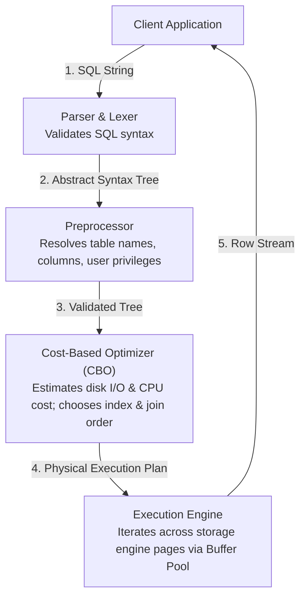

# Chapter 24 — Performance Tuning: MySQL Query Optimization & Execution Plans

---

## 1. What is it?

**Query Optimization** is the engineering discipline of diagnosing, profiling, and restructuring SQL queries, indexes, and database configurations to minimize query execution time, disk I/O, CPU consumption, and lock contention.

When an SQL statement arrives at the MySQL server daemon (`mysqld`), it passes through a multi-stage execution pipeline:



The core of this architecture is the **Cost-Based Optimizer (CBO)**. The optimizer evaluates multiple alternative execution paths (e.g., whether to use Index A, Index B, or scan the full table; which table to join first), calculates an estimated cost based on table statistics in the data dictionary, and chooses the lowest-cost execution plan.

---

## 2. Diagnostic Tools: `EXPLAIN` and `EXPLAIN ANALYZE`

MySQL provides two primary diagnostic tools for profiling queries:
1. **`EXPLAIN`**: Displays the static execution plan chosen by the optimizer *without* actually executing the query.
2. **`EXPLAIN ANALYZE`** (MySQL 8.0.18+): Executes the query, measures actual runtime performance, and outputs a detailed tree displaying actual time spent, loops executed, and row counts compared against optimizer estimates.

### Decoding the `EXPLAIN` Access Types (From Best to Worst)

| Access `type` | Performance Grade | Description |
| :--- | :--- | :--- |
| **`system` / `const`** | **Optimal** | Exactly 1 row matches (e.g., lookup via `PRIMARY KEY` or `UNIQUE` index). Instant $O(1)$ memory seek. |
| **`eq_ref`** | **Excellent** | Exactly 1 row is read from this table for each row combination from the preceding table (indexed primary/unique key join). |
| **`ref`** | **Very Good** | Non-unique index lookup (returns multiple matching rows matching an indexed value). |
| **`range`** | **Good** | Index range scan (used for `BETWEEN`, `<`, `>`, `IN(...)`, or `LIKE 'prefix%'`). |
| **`index`** | **Mediocre** | Full Index Scan (scans the entire index tree from start to finish; faster than table scan, but still reads all keys). |
| **`ALL`** | **CRITICAL WARNING** | **Full Table Scan**. The storage engine reads every single page from disk. Severe bottleneck on large tables! |

### Dangerous Warnings in the `Extra` Column
* **`Using filesort`**: MySQL could not use an index to satisfy the `ORDER BY` clause. It had to load candidate rows into memory (`sort_buffer_size`) and perform an explicit sorting pass.
* **`Using temporary`**: MySQL had to create an internal temporary table on disk or in memory to process a complex `GROUP BY` or `DISTINCT`.
* **`Using index`** (Positive!): The query is a **Covering Index** query; all requested columns were satisfied entirely from the secondary index without touching the clustered index.

---

## 3. Join Algorithms in MySQL

When executing joins between tables, MySQL utilizes three primary internal join algorithms:
1. **Index Nested-Loop Join (NLJ)**:
   * Used when the joined column in the inner table has an index.
   * For each row in the outer table, the engine performs a fast $O(\log N)$ index seek on the inner table.
2. **Block Nested-Loop Join (BNL)** (Legacy MySQL 5.7):
   * Used when no index exists on the join column. Reads chunks of outer rows into a buffer and scans the inner table. High CPU cost.
3. **Hash Join** (MySQL 8.0.18+):
   * Replaces BNL for joins lacking indexes.
   * The engine builds an in-memory hash table of the smaller table in memory and streams rows from the larger table against the hash table in $O(N)$ linear time.

---

## 4. SARGability: The Golden Rule of Index Optimization

**SARGable** stands for **S**earch **Arg**ument **Able**. A query predicate is SARGable if the optimizer can leverage a B+ Tree index seek.

### Non-SARGable Anti-Patterns vs SARGable Rewrites

| Anti-Pattern | Non-SARGable (Forces Full Table Scan) | SARGable Rewrite (Uses Index Seek) |
| :--- | :--- | :--- |
| **Functions on Columns** | `WHERE YEAR(order_date) = 2023` | `WHERE order_date >= '2023-01-01' AND order_date < '2024-01-01'` |
| **String Functions** | `WHERE SUBSTRING(phone, 1, 3) = '555'` | `WHERE phone LIKE '555%'` |
| **Leading Wildcards** | `WHERE email LIKE '%@gmail.com'` | Reverse index, Fulltext search, or ngram index. |
| **Arithmetic on Columns**| `WHERE salary * 1.10 > 100000` | `WHERE salary > 100000 / 1.10` |
| **Implicit Type Conversion**| `WHERE phone = 5550100` (`phone` is `VARCHAR`) | `WHERE phone = '5550100'` (String literal!) |

> [!WARNING]
> **Implicit Type Conversion Trap**: If column `phone` is defined as `VARCHAR(20)`, writing `WHERE phone = 5550100` (an unquoted integer) forces MySQL to cast the `phone` column of **every row** into a floating-point number at runtime to compare it to the integer. This silently disables any index on `phone` and triggers a full table scan!

---

## 5. Basic Example

Inspecting `EXPLAIN` and converting a non-SARGable query into a SARGable query:

```sql
USE sql_mastery;

-- 1. Non-SARGable Query: Using a function on the indexed hire_date column
EXPLAIN SELECT employee_id, first_name, last_name, hire_date
FROM employees
WHERE YEAR(hire_date) = 2020;

-- 2. SARGable Rewrite: Bounding the date range with constants
EXPLAIN SELECT employee_id, first_name, last_name, hire_date
FROM employees
WHERE hire_date >= '2020-01-01' AND hire_date < '2021-01-01';
```

---

## 6. Real-World Example: Optimizing a Slow Production Query

Scenario: A high-traffic customer portal query is causing CPU spikes. It searches for all delivered orders placed in August 2023, joining customers, products, and order items, sorted by total amount.

```sql
USE sql_mastery;

-- Step 1: Diagnose the un-optimized query using EXPLAIN ANALYZE
EXPLAIN ANALYZE
SELECT 
    o.order_id,
    c.first_name,
    c.last_name,
    o.total_amount
FROM orders o
JOIN customers c ON o.customer_id = c.customer_id
WHERE o.order_date BETWEEN '2023-08-01' AND '2023-08-31'
  AND o.status = 'Delivered'
ORDER BY o.total_amount DESC;

-- Step 2: Optimization Analysis
-- Notice orders has no composite index covering (status, order_date, total_amount).
-- MySQL scans all orders, filters them, and performs a Filesort.

-- Step 3: Create a targeted Composite Index tailored for this workload
CREATE INDEX idx_opt_orders ON orders(status, order_date, total_amount);

-- Step 4: Re-evaluate with EXPLAIN ANALYZE
EXPLAIN ANALYZE
SELECT 
    o.order_id,
    c.first_name,
    c.last_name,
    o.total_amount
FROM orders o
JOIN customers c ON o.customer_id = c.customer_id
WHERE o.status = 'Delivered'
  AND o.order_date BETWEEN '2023-08-01' AND '2023-08-31'
ORDER BY o.total_amount DESC;

-- Clean up
DROP INDEX idx_opt_orders ON orders;
```

---

## 7. Step-by-Step Explanation of `EXPLAIN ANALYZE` Output

Understanding the tree output of `EXPLAIN ANALYZE`:

```
-> Nested loop inner join  (cost=1.85 rows=3) (actual time=0.042..0.065 rows=3 loops=1)
    -> Index range scan on o using idx_opt_orders (status = 'Delivered' AND order_date BETWEEN ...), with index condition: ... (cost=0.80 rows=3) (actual time=0.021..0.028 rows=3 loops=1)
    -> Single-row index lookup on c using PRIMARY (customer_id=o.customer_id) (cost=0.35 rows=1) (actual time=0.008..0.009 rows=1 loops=3)
```

1. **`actual time=0.021..0.028`**: The first number (`0.021 ms`) is the time to fetch the first row; the second (`0.028 ms`) is the time to stream all rows.
2. **`rows=3`**: The actual number of rows materialized by that iterator step.
3. **`loops=1`**: How many times this iterator was invoked. For the inner join lookup on `c`, `loops=3` indicates the single-row primary key lookup was performed 3 times (once for each candidate order).
4. **`Index range scan`**: Proves that the index seek directly isolated the matching records, completely eliminating a full table scan and eliminating `Using filesort`.

---

## 8. Common Mistakes

1. **Blindly Adding Indexes to Every Column**:
   * Creating 15 single-column indexes on a table. MySQL can generally only use **one index per table** in a query. A single well-designed composite index matching your query's `WHERE` and `ORDER BY` pattern is vastly superior to multiple individual indexes.
2. **Ignoring the Slow Query Log**:
   * Guessing which queries are slow instead of enabling MySQL's built-in **Slow Query Log** to capture queries whose execution time exceeds a defined threshold (e.g., `long_query_time = 1.0`).
3. **Using `SELECT COUNT(*)` on Giant InnoDB Tables**:
   * In the MyISAM engine, `COUNT(*)` was instantaneous because MyISAM stored an exact row counter in the table header. In InnoDB, because MVCC provides different snapshots to different transactions, **InnoDB must scan the clustered or secondary index to count active rows**. For massive tables, use approximate counts from `information_schema.tables` or maintain a counter table.

---

## 9. Best Practices

1. **Follow the Rule of Index Selectivity**:
   * Place the column with the highest **selectivity** (the highest number of distinct values relative to total rows) at the beginning of a composite index.
2. **Tune the InnoDB Buffer Pool**:
   * On a dedicated MySQL database server, configure `innodb_buffer_pool_size` to **70%–80% of total physical RAM**. This ensures that frequently accessed data and index pages remain cached in memory, preventing disk I/O.
3. **Enable the Slow Query Log in Production**:
   ```sql
   SET GLOBAL slow_query_log = 'ON';
   SET GLOBAL long_query_time = 0.5; -- Log queries taking longer than 500ms
   SET GLOBAL log_queries_not_using_indexes = 'ON';
   ```
4. **Batch Massive DML Modifications**:
   * When updating or deleting millions of records, batch the operations into chunks of 5,000 rows with a `LIMIT` clause to avoid exhausting memory buffers and locking out concurrent traffic.

---

## 10. Practice Questions

### Easy
1. Which access `type` in an `EXPLAIN` report indicates the worst performance?
2. What does `type: const` signify in an `EXPLAIN` execution plan?
3. Rewrite `WHERE salary * 12 > 120000` into a SARGable format.

### Medium
4. Explain why the query `SELECT * FROM customers WHERE email LIKE '%@yahoo.com'` cannot use a standard B+ Tree index on `email`.
5. What is the difference between `EXPLAIN` and `EXPLAIN ANALYZE` in MySQL 8.0?
6. Identify the performance flaw in this query:
   ```sql
   SELECT * FROM orders WHERE DATE(order_date) = '2023-08-01';
   ```
   Rewrite it so that an index on `order_date` can be utilized.

### Difficult
7. In MySQL 8.0.18+, when does the query optimizer choose a **Hash Join** over a **Nested Loop Join**? How does memory allocation (`join_buffer_size`) impact Hash Join spilling to disk?
8. Write an optimized covering index definition for the query:
   ```sql
   SELECT customer_id, order_date, total_amount 
   FROM orders 
   WHERE customer_id = 10 AND status = 'Delivered' 
   ORDER BY order_date DESC;
   ```
   Explain the exact order of columns in your composite index and why that sequence minimizes CPU operations.

---

## 11. Interview Questions

### Q1: What does SARGable mean in SQL, and what are three common anti-patterns that destroy SARGability?
**Answer**: SARGable stands for *Search Argument Able*. A query predicate is SARGable if the database engine's query optimizer can evaluate the condition by performing an index seek directly into a B+ Tree index structure. 
Three common non-SARGable anti-patterns:
1. **Wrapping indexed columns in scalar functions**: `WHERE YEAR(order_date) = 2023` forces a full table scan because the engine must execute the function for every stored row. (Rewrite: `WHERE order_date >= '2023-01-01' AND order_date < '2024-01-01'`).
2. **Leading wildcard pattern matching**: `WHERE name LIKE '%Smith'` prevents the B+ Tree from navigating by prefix.
3. **Implicit type conversion**: Comparing a `VARCHAR` column to an unquoted integer literal (`WHERE phone = 5550100`) forces MySQL to convert the column to a numeric value for every row, disabling index usage.

### Q2: How do you interpret the `rows` and `filtered` columns in a MySQL `EXPLAIN` plan?
**Answer**:
* **`rows`**: Represents the optimizer's statistical estimate of the number of physical rows the storage engine must read from disk or cache to satisfy that stage of the execution plan.
* **`filtered`**: Represents the estimated percentage of those examined rows that will satisfy the remaining filtering conditions and be passed to the next join or projection step. 
A low `filtered` value (e.g., `10.00%`) alongside a high `rows` count indicates that the engine is reading massive amounts of data only to discard 90% of it, pointing to a missing or inefficient index.

### Q3: What is the difference between `Using filesort` and `Using index` in the `Extra` column of an `EXPLAIN` plan?
**Answer**:
* **`Using filesort`**: Indicates that MySQL could not read the rows in the order required by the `ORDER BY` clause directly from an index. It must load the filtered rows into a memory buffer (`sort_buffer_size`) and perform an explicit sorting algorithm (quicksort or merge sort), potentially spilling to temporary disk files.
* **`Using index`**: Signifies a **Covering Index**. The query was satisfied entirely by reading the leaf pages of a secondary index, without performing any secondary lookups into the clustered index or touching base table data pages.

---

## 12. Quick Revision

* Use **`EXPLAIN`** to inspect the static execution plan and **`EXPLAIN ANALYZE`** to measure actual execution time.
* Aim for access types **`const`**, **`eq_ref`**, **`ref`**, or **`range`**; eliminate **`ALL`** (Full Table Scans) on large tables.
* Keep queries **SARGable**: never wrap indexed columns in functions or perform implicit type conversions in `WHERE`.
* A **Covering Index** satisfies all queried columns directly from the index tree (`Extra: Using index`).
* Eliminate **`Using filesort`** by incorporating `ORDER BY` columns into composite indexes.
* Size the **`innodb_buffer_pool_size`** to 70–80% of system RAM on dedicated database servers.
