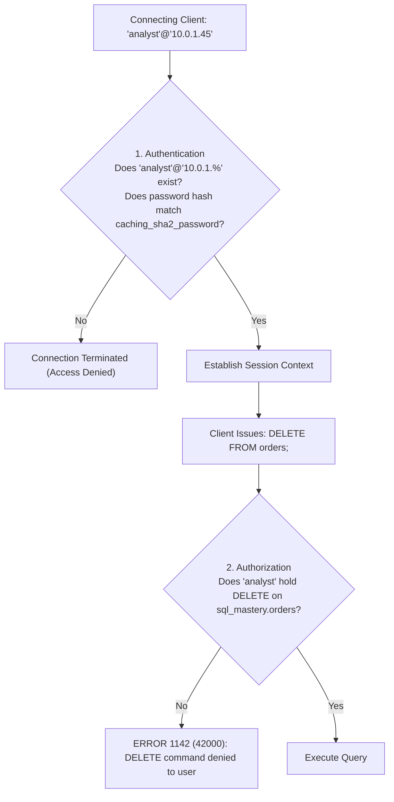
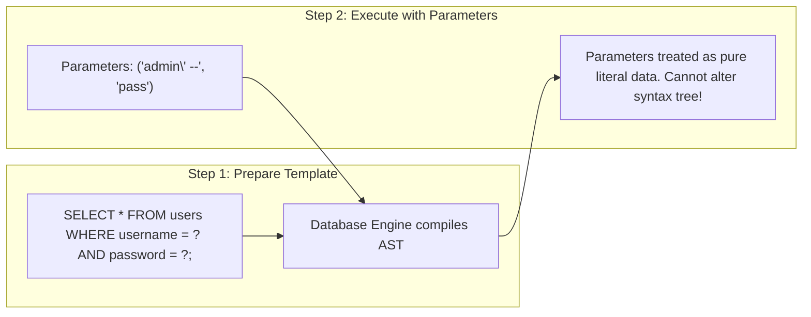

# Chapter 25 — Enterprise Security: Access Control, Roles & SQL Injection Defense

---

## 1. What is it?

**Database Security** is the collective set of controls, administrative procedures, and programming practices designed to protect the confidentiality, integrity, and availability of database assets against unauthorized access, data breaches, corruption, and malicious exploitation.

Enterprise MySQL security encompasses three critical layers:
1. **Authentication & Identity**: Identifying who is connecting. In MySQL, a user identity is strictly bound to both a username and a host: `'username'@'host_specification'` (e.g., `'app_user'@'10.0.0.%'`).
2. **Authorization & Access Control**: Enforcing the **Principle of Least Privilege (PoLP)**. Granting users and applications only the minimum necessary permissions (`SELECT`, `INSERT`, `EXECUTE`) at granular scopes (global, database, table, or column-level). MySQL 8.0 introduces **Role-Based Access Control (RBAC)** to streamline permission management across teams.
3. **Application Defense against SQL Injection (SQLi)**: Defending against vulnerabilities where untrusted user input alters the logical syntax of an SQL query.

---

## 2. User & Host Identity Architecture in MySQL

In MySQL, an account is not just a username; it is a composite of **Username + Client Host**:
* `'app_service'@'localhost'`: Can connect *only* via a local UNIX socket or loopback IP (`127.0.0.1`) on the same physical server.
* `'analyst'@'192.168.1.%'`: Can connect only from client machines within the private subnet `192.168.1.0/24`.
* `'admin'@'%'`: The wildcard `%` allows connections from any IP address (dangerous for privileged accounts!).



---

## 3. Syntax

### User Account Administration
```sql
-- 1. Create a User with Modern SHA-256 Authentication
CREATE USER 'app_backend'@'10.0.0.%'
IDENTIFIED BY 'P@ssw0rd_Enterprise_2026!';

-- 2. Alter User Password / Expire Password
ALTER USER 'app_backend'@'10.0.0.%'
IDENTIFIED BY 'New_Secure_Password_2026!'
PASSWORD EXPIRE INTERVAL 90 DAY;

-- 3. Lock or Unlock an Account
ALTER USER 'app_backend'@'10.0.0.%' ACCOUNT LOCK;
ALTER USER 'app_backend'@'10.0.0.%' ACCOUNT UNLOCK;

-- 4. Delete a User
DROP USER IF EXISTS 'app_backend'@'10.0.0.%';
```

### Granular Privilege Management
```sql
-- Grant read-only access to a specific database
GRANT SELECT ON sql_mastery.* TO 'reporting_user'@'localhost';

-- Grant DML access on a specific table
GRANT SELECT, INSERT, UPDATE ON sql_mastery.customers TO 'app_backend'@'10.0.0.%';

-- Grant execution rights on stored procedures
GRANT EXECUTE ON PROCEDURE sql_mastery.sp_process_order_checkout TO 'app_backend'@'10.0.0.%';

-- Inspect Active Grants for a User
SHOW GRANTS FOR 'reporting_user'@'localhost';

-- Revoke Privileges
REVOKE UPDATE ON sql_mastery.customers FROM 'app_backend'@'10.0.0.%';
```

### Role-Based Access Control (RBAC in MySQL 8.0)
Instead of granting privileges to 50 individual users, define **Roles**, grant permissions to the role, and assign the role to users:

```sql
-- 1. Create Roles
CREATE ROLE 'developer_readwrite', 'analyst_readonly';

-- 2. Assign Privileges to Roles
GRANT SELECT ON sql_mastery.* TO 'analyst_readonly';
GRANT SELECT, INSERT, UPDATE, DELETE ON sql_mastery.* TO 'developer_readwrite';

-- 3. Assign Role to User
GRANT 'analyst_readonly' TO 'sarah_chen'@'localhost';

-- 4. Activate Role as Default
SET DEFAULT ROLE ALL TO 'sarah_chen'@'localhost';
```

---

## 4. SQL Injection (SQLi): Anatomy & Prepared Statement Defense

### 4.1. The Vulnerability: Dynamic String Concatenation
Consider an insecure web login script that concatenates user input into an SQL string:

```python
# FATAL INSECURE CODE: DO NOT USE!
username_input = request.form["username"]
password_input = request.form["password"]

query = f"SELECT * FROM users WHERE username = '{username_input}' AND password = '{password_input}';"
cursor.execute(query)
```

If an attacker enters the following string into the username field:
```
admin' --
```
The resulting SQL executed by MySQL becomes:
```sql
SELECT * FROM users WHERE username = 'admin' --' AND password = '...';
```
Because `-- ` is the SQL comment marker, the engine ignores the password check entirely! The attacker logs in as the administrator without knowing the password.

### 4.2. The Solution: Parameterized Queries (Prepared Statements)
Prepared statements separate query code from user data:



```python
# SECURE PRODUCTION CODE: Parameterized Query
query = "SELECT user_id, password_hash FROM users WHERE username = %s AND is_active = TRUE;"
cursor.execute(query, (username_input,))
```

---

## 5. Basic Example

Creating an isolated read-only analyst account:

```sql
USE sql_mastery;

-- Create user restricted to local loopback
CREATE USER 'bi_analyst'@'localhost' IDENTIFIED BY 'Analyst_Safe_2026!';

-- Grant SELECT privileges on the practice database
GRANT SELECT ON sql_mastery.* TO 'bi_analyst'@'localhost';

-- Verify privileges
SHOW GRANTS FOR 'bi_analyst'@'localhost';

-- Revoke and drop
REVOKE ALL PRIVILEGES, GRANT OPTION FROM 'bi_analyst'@'localhost';
DROP USER 'bi_analyst'@'localhost';
```

---

## 6. Real-World Example: Enterprise Privilege & RBAC Architecture

In our `sql_mastery` database, let us establish a production-grade enterprise security architecture:
1. Create a `developer_role` with DML permissions on `sql_mastery`.
2. Create a restricted user `'alex_dev'@'localhost'`.
3. Mask sensitive customer data (phones and emails) using a security view `v_customer_public` and grant permissions on that view alone.

```sql
USE sql_mastery;

-- Step 1: Create Role
CREATE ROLE IF NOT EXISTS 'role_ecommerce_app';

-- Step 2: Grant strict permissions to the role
GRANT SELECT, INSERT, UPDATE ON sql_mastery.orders TO 'role_ecommerce_app';
GRANT SELECT, INSERT, UPDATE ON sql_mastery.order_items TO 'role_ecommerce_app';
GRANT SELECT, UPDATE ON sql_mastery.products TO 'role_ecommerce_app';
GRANT SELECT ON sql_mastery.customers TO 'role_ecommerce_app';

-- Step 3: Create App User and Assign Role
CREATE USER 'app_ecommerce_service'@'10.0.2.%'
IDENTIFIED BY 'App_Service_Vault_Key_9900!';

GRANT 'role_ecommerce_app' TO 'app_ecommerce_service'@'10.0.2.%';
SET DEFAULT ROLE 'role_ecommerce_app' TO 'app_ecommerce_service'@'10.0.2.%';

-- Step 4: Verify Grants
SHOW GRANTS FOR 'app_ecommerce_service'@'10.0.2.%';
SHOW GRANTS FOR 'app_ecommerce_service'@'10.0.2.%' USING 'role_ecommerce_app';

-- Clean up
DROP USER 'app_ecommerce_service'@'10.0.2.%';
DROP ROLE 'role_ecommerce_app';
```

---

## 7. Step-by-Step Explanation

1. `CREATE USER ... IDENTIFIED BY ...`:
   * MySQL hashes the supplied plaintext password using the default `caching_sha2_password` algorithm (utilizing salted SHA-256 iterations) and stores the resulting hash in `mysql.user`.
   * Restricting host to `'10.0.2.%'` ensures that even if credentials leak, connections originating outside the application server subnet are rejected.
2. `CREATE ROLE` and `GRANT ... TO 'role_ecommerce_app'`:
   * Isolates permissions into a logical bundle. If permissions need to be updated in the future, altering the role instantly updates all assigned accounts.
3. `SET DEFAULT ROLE ...`:
   * By default in MySQL 8.0, assigned roles are inactive when a user first connects. `SET DEFAULT ROLE ALL` ensures the assigned roles activate immediately upon login without requiring an explicit `SET ROLE` command.

---

## 8. Expected Result

Inspecting `SHOW GRANTS` output for the application service:

```
+-------------------------------------------------------------------------------------------------+
| Grants for app_ecommerce_service@10.0.2.%                                                       |
+-------------------------------------------------------------------------------------------------+
| GRANT USAGE ON *.* TO `app_ecommerce_service`@`10.0.2.%`                                        |
| GRANT `role_ecommerce_app`@`%` TO `app_ecommerce_service`@`10.0.2.%`                            |
+-------------------------------------------------------------------------------------------------+

Output of SHOW GRANTS ... USING 'role_ecommerce_app':
+-------------------------------------------------------------------------------------------------+
| Grants for app_ecommerce_service@10.0.2.%                                                       |
+-------------------------------------------------------------------------------------------------+
| GRANT USAGE ON *.* TO `app_ecommerce_service`@`10.0.2.%`                                        |
| GRANT SELECT, UPDATE ON `sql_mastery`.`products` TO `app_ecommerce_service`@`10.0.2.%`          |
| GRANT SELECT, INSERT, UPDATE ON `sql_mastery`.`orders` TO `app_ecommerce_service`@`10.0.2.%`    |
| GRANT SELECT, INSERT, UPDATE ON `sql_mastery`.`order_items` TO `app_ecommerce_service`@10.0.2.%|
| GRANT SELECT ON `sql_mastery`.`customers` TO `app_ecommerce_service`@`10.0.2.%`                |
+-------------------------------------------------------------------------------------------------+
```

---

## 9. Common Mistakes

1. **Granting `ALL PRIVILEGES ON *.*` to Applications**:
   * *Anti-pattern*: Giving an application user `ALL PRIVILEGES` on `*.*`.
   * *Danger*: If the web application is compromised via SQL injection, the attacker can drop entire databases, create administrative backdoor accounts, and read passwords from `mysql.user`.
   * *Rule*: Grant only the specific DML permissions needed on specific tables.
2. **Using the `root` User for Application Connections**:
   * Never configure web applications to connect as `root`. Restrict `root` to local CLI maintenance only, and bind its host strictly to `localhost`.
3. **Misunderstanding `FLUSH PRIVILEGES`**:
   * *Misconception*: Running `FLUSH PRIVILEGES;` after every `GRANT` or `REVOKE` statement.
   * *Reality*: Standard DDL/DCL commands (`GRANT`, `REVOKE`, `CREATE USER`) update MySQL's internal in-memory grant tables immediately. `FLUSH PRIVILEGES` is only required if you modify the underlying grant tables directly via raw DML (e.g., `UPDATE mysql.user SET ...;`), which is discouraged.
4. **Relying on Client-Side Input Filtering for SQL Injection Defense**:
   * Attempting to sanitize user input by stripping quotes or regex-filtering words like `SELECT` or `DROP`. Attackers easily bypass these filters using alternative encodings, hex literals, or unicode tricks. **Parameterized queries are the only reliable defense**.

---

## 10. Best Practices

1. **Enforce the Principle of Least Privilege (PoLP)**:
   * Separate accounts by responsibility:
     * Read-only reporting accounts (`GRANT SELECT`)
     * Application services (`GRANT SELECT, INSERT, UPDATE`)
     * Migration/deployment scripts (`GRANT CREATE, ALTER, DROP`)
2. **Use Enterprise Backup Practices (`mysqldump`)**:
   * When backing up active InnoDB databases with `mysqldump`, always use `--single-transaction` to take an online, consistent backup without locking tables:
     ```bash
     mysqldump -u root -p \
       --single-transaction \
       --quick \
       --routines \
       --triggers \
       sql_mastery > sql_mastery_backup.sql
     ```
3. **Enforce TLS/SSL for Network Connections**:
   * Configure MySQL to require encrypted TLS connections for all remote users:
     ```sql
     ALTER USER 'app_backend'@'10.0.0.%' REQUIRE SSL;
     ```
4. **Never Commit Database Credentials to Source Control**:
   * Store database passwords in environment variables or cloud secret managers (e.g., AWS Secrets Manager, HashiCorp Vault).

---

## 11. Practice Questions

### Easy
1. Write a SQL command to create a user `'auditor'@'localhost'` with the password `'Audit_2026_Secure!'`.
2. Write a statement to grant `SELECT` privileges on the `employees` table to `'auditor'@'localhost'`.
3. Write a command to revoke all privileges and drop `'auditor'@'localhost'`.

### Medium
4. Write the commands to create a role named `'app_writer'`, grant `SELECT`, `INSERT`, and `UPDATE` on all tables in `sql_mastery` to that role, and assign that role to user `'web_api'@'localhost'`.
5. Why does a query written using string concatenation like `f"SELECT * FROM items WHERE id = {user_input}"` expose an application to SQL injection?
6. Show how to rewrite the query from Question 5 as a secure parameterized prepared statement in SQL syntax (`PREPARE` and `EXECUTE`).

### Difficult
7. Write a secure MySQL DCL script that creates a user who is permitted to query the `customers` table, but is strictly restricted from viewing the `phone` and `email` columns. (Hint: Use column-level `GRANT` syntax or a security `VIEW`).
8. Explain the mechanical differences between taking an InnoDB backup with `mysqldump --single-transaction` versus taking a physical binary backup using tools like Percona XtraBackup. What are the performance and recovery speed tradeoffs?

---

## 12. Interview Questions

### Q1: What is SQL Injection (SQLi), and why are Prepared Statements (Parameterized Queries) the definitive defense?
**Answer**: SQL Injection is a vulnerability that occurs when untrusted user input is directly concatenated into an SQL query string without proper separation. An attacker crafts input containing SQL keywords and control characters (such as quotes, `-- `, or `OR 1=1`), altering the syntax tree interpreted by the database parser to execute unauthorized commands or extract data.
Prepared statements are the definitive defense because they separate query logic from data into two distinct phases:
1. **Compilation Phase**: The database engine compiles and parses the query template containing placeholders (`?`), creating a fixed Abstract Syntax Tree (AST).
2. **Execution Phase**: The database engine binds the user data parameters directly into the compiled AST nodes. Because the query's syntax tree was already compiled, the incoming parameters are treated strictly as literal data values and can **never** be interpreted as executable SQL instructions, completely neutralizing injection attacks.

### Q2: What is the Principle of Least Privilege (PoLP) in database administration?
**Answer**: The Principle of Least Privilege requires that every user, service, application, and process be granted only the minimal set of privileges strictly required to complete its legitimate business function. 
In practice:
* Web applications should never connect as `root` or `admin`.
* Read-only reporting dashboards should be granted only `SELECT` privileges.
* Online web services should have `SELECT`, `INSERT`, `UPDATE`, and `DELETE` on specific domain tables, but should be denied `DROP`, `ALTER`, or `TRUNCATE` privileges.
* Table structural changes should be executed exclusively through isolated migration service accounts.

### Q3: How does the `caching_sha2_password` authentication plugin in MySQL 8.0 improve security compared to legacy `mysql_native_password`?
**Answer**: `mysql_native_password` relies on older SHA-1 hashing, which is vulnerable to collision attacks and rainbow-table cracking. 
`caching_sha2_password` uses salted SHA-256 iterations, providing significantly stronger cryptographic resistance against brute-force attacks. Additionally, it implements in-memory caching of authentication tokens on the MySQL server, allowing repeated connections from the same client to authenticate with minimal CPU hashing overhead while maintaining modern encryption standards.

---

## 13. Quick Revision

* MySQL user accounts are host-specific: **`'username'@'host'`**.
* Always adhere to the **Principle of Least Privilege (PoLP)**.
* Use **Roles (RBAC)** in MySQL 8.0 to manage permissions cleanly across teams.
* **SQL Injection** occurs when untrusted strings are concatenated into queries; **Prepared Statements (Parameterized Queries)** are the only reliable defense.
* Use **`mysqldump --single-transaction`** for non-blocking online logical backups of InnoDB tables.
* Restrict the `root` account strictly to `localhost`.
