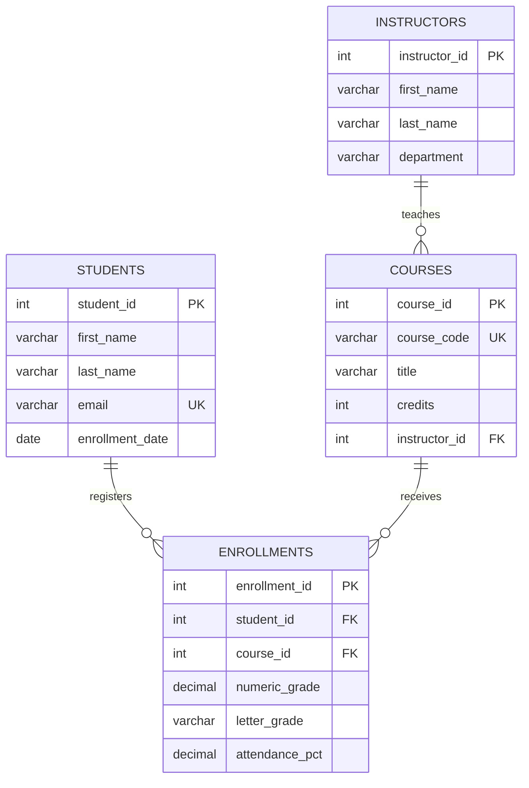
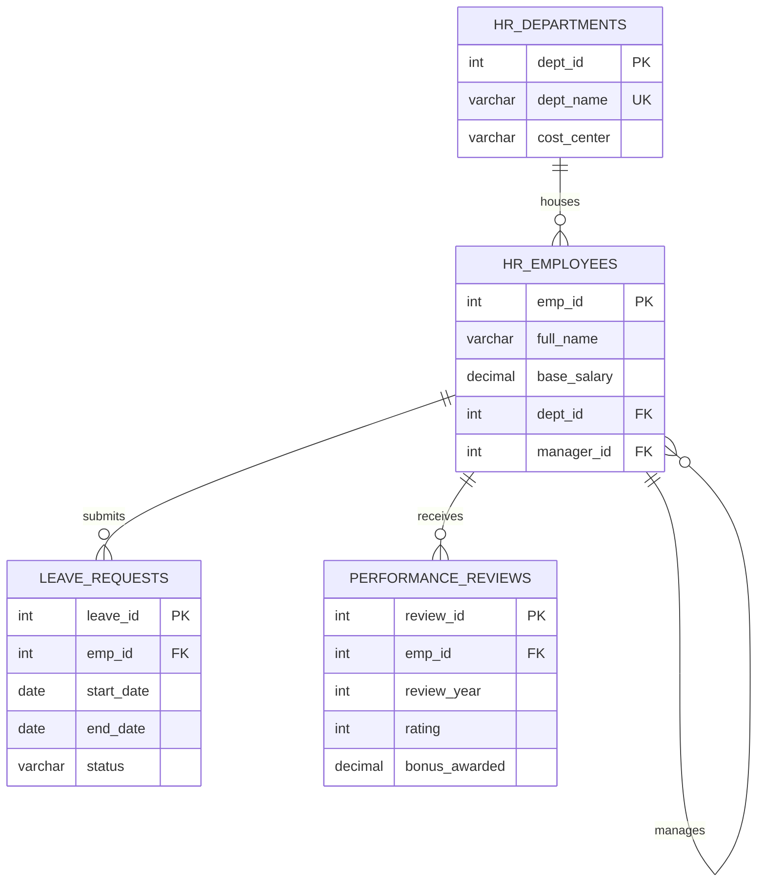
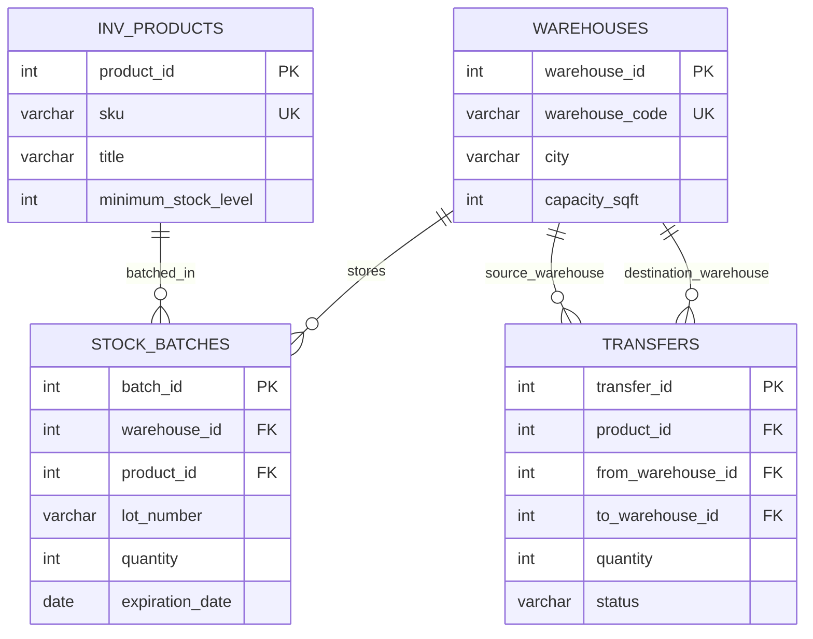
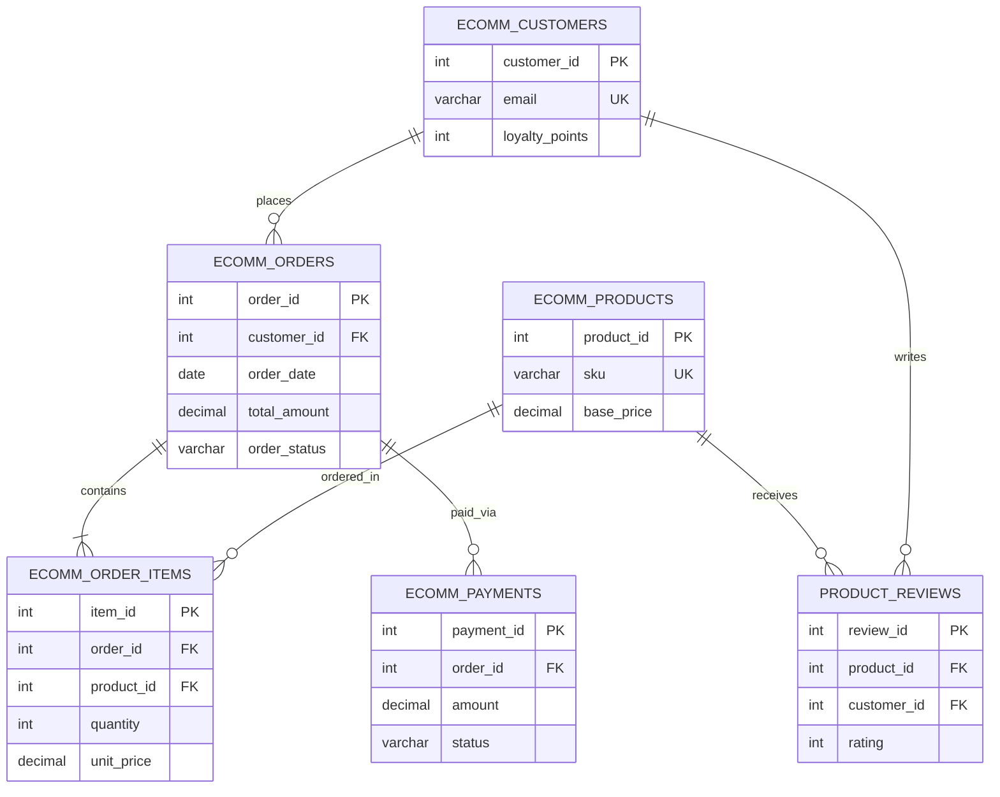
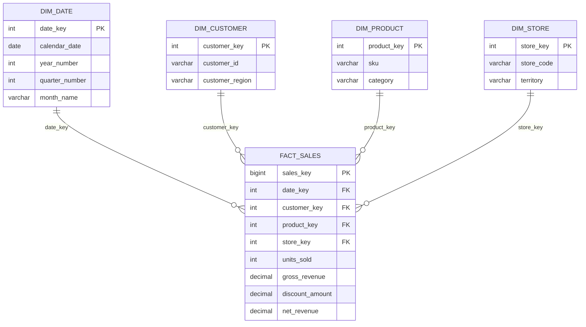

# Chapter 26 — Hands-On Engineering: 5 Progressive Real-World SQL Projects

This chapter delivers five end-to-end, production-grade relational database projects designed to build your skills progressively from foundational schema design to complex analytical data warehousing.

Each project includes:
* **Business Requirements & Scope**
* **Entity-Relationship (ER) Architecture**
* **Complete DDL Specification (Tables, Keys, Constraints)**
* **Realistic Seed Data**
* **Operational Business Queries**
* **Advanced Analytical Queries**
* **Engineering Challenge Tasks**

---

# Project 1: Student & Academic Management System (Beginner)

### 1. Requirements & Scope
An educational academy requires an operational database to manage its academic programs:
* Store student profiles and faculty instructors.
* Track courses offered across academic departments.
* Manage student course enrollments, letter grades, and attendance rates.
* Calculate Grade Point Averages (GPA) and generate class rosters.

### 2. ER Diagram & Architecture


### 3. DDL & Seed Data Script
```sql
CREATE DATABASE IF NOT EXISTS school_db CHARACTER SET utf8mb4;
USE school_db;

CREATE TABLE students (
    student_id INT AUTO_INCREMENT PRIMARY KEY,
    first_name VARCHAR(50) NOT NULL,
    last_name VARCHAR(50) NOT NULL,
    email VARCHAR(100) NOT NULL UNIQUE,
    enrollment_date DATE NOT NULL
);

CREATE TABLE instructors (
    instructor_id INT AUTO_INCREMENT PRIMARY KEY,
    first_name VARCHAR(50) NOT NULL,
    last_name VARCHAR(50) NOT NULL,
    department VARCHAR(50) NOT NULL
);

CREATE TABLE courses (
    course_id INT AUTO_INCREMENT PRIMARY KEY,
    course_code VARCHAR(10) NOT NULL UNIQUE,
    title VARCHAR(100) NOT NULL,
    credits INT NOT NULL DEFAULT 3,
    instructor_id INT,
    CONSTRAINT fk_courses_instructor FOREIGN KEY (instructor_id)
        REFERENCES instructors(instructor_id) ON DELETE SET NULL
);

CREATE TABLE enrollments (
    enrollment_id INT AUTO_INCREMENT PRIMARY KEY,
    student_id INT NOT NULL,
    course_id INT NOT NULL,
    numeric_grade DECIMAL(5,2) DEFAULT NULL,
    letter_grade ENUM('A', 'B', 'C', 'D', 'F') DEFAULT NULL,
    attendance_pct DECIMAL(5,2) DEFAULT 100.00,
    CONSTRAINT uq_student_course UNIQUE (student_id, course_id),
    CONSTRAINT fk_enroll_student FOREIGN KEY (student_id)
        REFERENCES students(student_id) ON DELETE CASCADE,
    CONSTRAINT fk_enroll_course FOREIGN KEY (course_id)
        REFERENCES courses(course_id) ON DELETE CASCADE
);

-- Seed Data
INSERT INTO students (first_name, last_name, email, enrollment_date) VALUES
('Liam', 'Vance', 'liam.vance@school.edu', '2022-09-01'),
('Maya', 'Lin', 'maya.lin@school.edu', '2022-09-01'),
('Noah', 'Kahn', 'noah.kahn@school.edu', '2023-01-15');

INSERT INTO instructors (first_name, last_name, department) VALUES
('Dr. Alan', 'Turing', 'Computer Science'),
('Dr. Grace', 'Hopper', 'Computer Science'),
('Dr. Isaac', 'Newton', 'Mathematics');

INSERT INTO courses (course_code, title, credits, instructor_id) VALUES
('CS101', 'Intro to Algorithms', 4, 1),
('CS202', 'Database Systems', 4, 2),
('MATH301', 'Linear Algebra', 3, 3);

INSERT INTO enrollments (student_id, course_id, numeric_grade, letter_grade, attendance_pct) VALUES
(1, 1, 92.50, 'A', 95.00),
(1, 2, 88.00, 'B', 98.00),
(2, 1, 95.00, 'A', 100.00),
(2, 3, 74.00, 'C', 82.00),
(3, 2, 81.50, 'B', 90.00);
```

### 4. Key Business & Analytical Queries
```sql
-- Query 1: Course Rosters with Instructor & Student Names
SELECT 
    c.course_code,
    c.title AS course_title,
    CONCAT(i.first_name, ' ', i.last_name) AS professor,
    CONCAT(s.first_name, ' ', s.last_name) AS student_name,
    e.letter_grade
FROM courses c
JOIN instructors i ON c.instructor_id = i.instructor_id
JOIN enrollments e ON c.course_id = e.course_id
JOIN students s ON e.student_id = s.student_id
ORDER BY c.course_code, s.last_name;

-- Query 2: Student GPA & Academic Standing Analysis
SELECT 
    s.student_id,
    CONCAT(s.first_name, ' ', s.last_name) AS student_name,
    COUNT(e.course_id) AS courses_enrolled,
    ROUND(AVG(e.numeric_grade), 2) AS overall_numeric_average,
    ROUND(AVG(e.attendance_pct), 1) AS avg_attendance_rate,
    CASE 
        WHEN AVG(e.numeric_grade) >= 90 THEN 'Dean\'s Honor List'
        WHEN AVG(e.numeric_grade) >= 80 THEN 'Good Standing'
        ELSE 'Academic Warning'
    END AS academic_status
FROM students s
JOIN enrollments e ON s.student_id = e.student_id
GROUP BY s.student_id, s.first_name, s.last_name;
```

---

# Project 2: Employee & Payroll Management System (Beginner-Intermediate)

### 1. Requirements & Scope
A corporate enterprise requires an HR and compensation tracking database:
* Organize workforce across regional departments.
* Track employee compensation, hire dates, and manager hierarchies.
* Manage paid time off (PTO) / leave requests with status tracking.
* Conduct annual performance evaluations and calculate merit bonuses.

### 2. ER Diagram & Architecture


### 3. DDL & Seed Data Script
```sql
CREATE DATABASE IF NOT EXISTS corporate_hr_db CHARACTER SET utf8mb4;
USE corporate_hr_db;

CREATE TABLE hr_departments (
    dept_id INT AUTO_INCREMENT PRIMARY KEY,
    dept_name VARCHAR(50) NOT NULL UNIQUE,
    cost_center VARCHAR(20) NOT NULL
);

CREATE TABLE hr_employees (
    emp_id INT AUTO_INCREMENT PRIMARY KEY,
    full_name VARCHAR(100) NOT NULL,
    email VARCHAR(100) NOT NULL UNIQUE,
    hire_date DATE NOT NULL,
    base_salary DECIMAL(10,2) NOT NULL,
    dept_id INT,
    manager_id INT,
    CONSTRAINT chk_sal CHECK (base_salary > 0),
    CONSTRAINT fk_hr_dept FOREIGN KEY (dept_id)
        REFERENCES hr_departments(dept_id) ON DELETE SET NULL,
    CONSTRAINT fk_hr_mgr FOREIGN KEY (manager_id)
        REFERENCES hr_employees(emp_id) ON DELETE SET NULL
);

CREATE TABLE leave_requests (
    leave_id INT AUTO_INCREMENT PRIMARY KEY,
    emp_id INT NOT NULL,
    leave_type ENUM('Sick', 'Vacation', 'Parental', 'Unpaid') NOT NULL,
    start_date DATE NOT NULL,
    end_date DATE NOT NULL,
    status ENUM('Pending', 'Approved', 'Rejected') DEFAULT 'Pending',
    CONSTRAINT chk_dates CHECK (end_date >= start_date),
    CONSTRAINT fk_leave_emp FOREIGN KEY (emp_id)
        REFERENCES hr_employees(emp_id) ON DELETE CASCADE
);

CREATE TABLE performance_reviews (
    review_id INT AUTO_INCREMENT PRIMARY KEY,
    emp_id INT NOT NULL,
    review_year INT NOT NULL,
    rating INT NOT NULL, -- 1 (Unsatisfactory) to 5 (Outstanding)
    bonus_awarded DECIMAL(10,2) DEFAULT 0.00,
    CONSTRAINT chk_rating CHECK (rating BETWEEN 1 AND 5),
    CONSTRAINT uq_emp_year UNIQUE (emp_id, review_year),
    CONSTRAINT fk_perf_emp FOREIGN KEY (emp_id)
        REFERENCES hr_employees(emp_id) ON DELETE CASCADE
);

-- Seed Data
INSERT INTO hr_departments (dept_name, cost_center) VALUES
('Product Development', 'CC-101'),
('Enterprise Sales', 'CC-202'),
('People Operations', 'CC-303');

INSERT INTO hr_employees (full_name, email, hire_date, base_salary, dept_id, manager_id) VALUES
('Victoria Sterling', 'v.sterling@corp.com', '2018-05-12', 175000.00, 1, NULL),
('Rajesh Kumar', 'r.kumar@corp.com', '2020-02-15', 120000.00, 1, 1),
('Chloe Bennett', 'c.bennett@corp.com', '2019-10-01', 135000.00, 2, NULL),
('Samuel Osei', 's.osei@corp.com', '2021-08-19', 85000.00, 2, 3),
('Elena Gomez', 'e.gomez@corp.com', '2022-01-10', 95000.00, 3, NULL);

INSERT INTO leave_requests (emp_id, leave_type, start_date, end_date, status) VALUES
(2, 'Vacation', '2023-07-01', '2023-07-10', 'Approved'),
(4, 'Sick', '2023-08-14', '2023-08-16', 'Approved'),
(2, 'Vacation', '2023-12-24', '2024-01-02', 'Pending');

INSERT INTO performance_reviews (emp_id, review_year, rating, bonus_awarded) VALUES
(1, 2023, 5, 25000.00),
(2, 2023, 4, 12000.00),
(3, 2023, 5, 20000.00),
(4, 2023, 3, 4000.00),
(5, 2023, 4, 8000.00);
```

### 4. Key Business & Analytical Queries
```sql
-- Query 1: Total Compensation Analysis (Salary + Bonus) by Department
SELECT 
    d.dept_name,
    COUNT(e.emp_id) AS employee_count,
    ROUND(AVG(e.base_salary), 2) AS avg_base_salary,
    SUM(e.base_salary) AS total_base_payroll,
    COALESCE(SUM(pr.bonus_awarded), 0.00) AS total_bonus_distributed,
    SUM(e.base_salary) + COALESCE(SUM(pr.bonus_awarded), 0.00) AS grand_total_expense
FROM hr_departments d
LEFT JOIN hr_employees e ON d.dept_id = e.dept_id
LEFT JOIN performance_reviews pr ON e.emp_id = pr.emp_id AND pr.review_year = 2023
GROUP BY d.dept_id, d.dept_name
ORDER BY grand_total_expense DESC;

-- Query 2: Identifying High Performers with Zero Vacation Days Taken
SELECT 
    e.full_name,
    d.dept_name,
    pr.rating AS perf_rating_2023,
    pr.bonus_awarded,
    COALESCE(SUM(DATEDIFF(lr.end_date, lr.start_date) + 1), 0) AS total_vacation_days_taken
FROM hr_employees e
JOIN hr_departments d ON e.dept_id = d.dept_id
JOIN performance_reviews pr ON e.emp_id = pr.emp_id AND pr.review_year = 2023
LEFT JOIN leave_requests lr ON e.emp_id = lr.emp_id 
    AND lr.leave_type = 'Vacation' 
    AND lr.status = 'Approved'
    AND YEAR(lr.start_date) = 2023
WHERE pr.rating >= 4
GROUP BY e.emp_id, e.full_name, d.dept_name, pr.rating, pr.bonus_awarded
HAVING total_vacation_days_taken = 0;
```

---

# Project 3: Multi-Warehouse Inventory & Supply Chain Database (Intermediate)

### 1. Requirements & Scope
A regional distributor requires a logistics database:
* Manage multiple physical storage warehouses across geographical cities.
* Track product inventory batched by manufacturing lot numbers and expiration dates.
* Coordinate inter-warehouse stock transfer orders.
* Trigger replenishment alerts when total warehouse stock drops below minimum safety thresholds.

### 2. ER Diagram & Architecture


### 3. DDL & Seed Data Script
```sql
CREATE DATABASE IF NOT EXISTS supply_chain_db CHARACTER SET utf8mb4;
USE supply_chain_db;

CREATE TABLE warehouses (
    warehouse_id INT AUTO_INCREMENT PRIMARY KEY,
    warehouse_code VARCHAR(10) NOT NULL UNIQUE,
    facility_name VARCHAR(100) NOT NULL,
    city VARCHAR(50) NOT NULL,
    capacity_sqft INT NOT NULL
);

CREATE TABLE inv_products (
    product_id INT AUTO_INCREMENT PRIMARY KEY,
    sku VARCHAR(20) NOT NULL UNIQUE,
    title VARCHAR(100) NOT NULL,
    unit_cost DECIMAL(10,2) NOT NULL,
    minimum_safety_stock INT NOT NULL DEFAULT 50
);

CREATE TABLE stock_batches (
    batch_id INT AUTO_INCREMENT PRIMARY KEY,
    warehouse_id INT NOT NULL,
    product_id INT NOT NULL,
    lot_number VARCHAR(30) NOT NULL,
    quantity INT NOT NULL DEFAULT 0,
    received_date DATE NOT NULL,
    expiration_date DATE DEFAULT NULL,
    CONSTRAINT chk_qty CHECK (quantity >= 0),
    CONSTRAINT fk_batch_wh FOREIGN KEY (warehouse_id)
        REFERENCES warehouses(warehouse_id) ON DELETE RESTRICT,
    CONSTRAINT fk_batch_prod FOREIGN KEY (product_id)
        REFERENCES inv_products(product_id) ON DELETE RESTRICT
);

CREATE TABLE stock_transfers (
    transfer_id INT AUTO_INCREMENT PRIMARY KEY,
    product_id INT NOT NULL,
    from_warehouse_id INT NOT NULL,
    to_warehouse_id INT NOT NULL,
    quantity INT NOT NULL,
    transfer_date DATE NOT NULL,
    status ENUM('Draft', 'In Transit', 'Completed', 'Cancelled') DEFAULT 'Draft',
    CONSTRAINT chk_transfer_qty CHECK (quantity > 0),
    CONSTRAINT chk_diff_wh CHECK (from_warehouse_id <> to_warehouse_id),
    CONSTRAINT fk_trf_prod FOREIGN KEY (product_id)
        REFERENCES inv_products(product_id),
    CONSTRAINT fk_trf_from FOREIGN KEY (from_warehouse_id)
        REFERENCES warehouses(warehouse_id),
    CONSTRAINT fk_trf_to FOREIGN KEY (to_warehouse_id)
        REFERENCES warehouses(warehouse_id)
);

-- Seed Data
INSERT INTO warehouses (warehouse_code, facility_name, city, capacity_sqft) VALUES
('WH-SEA', 'Pacific Northwest Hub', 'Seattle', 150000),
('WH-CHI', 'Midwest Logistics Center', 'Chicago', 220000),
('WH-DAL', 'Southern Distribution Point', 'Dallas', 180000);

INSERT INTO inv_products (sku, title, unit_cost, minimum_safety_stock) VALUES
('SKU-101', 'High-Temp Thermal Compound', 12.50, 100),
('SKU-202', 'Industrial Copper Heat Sink', 45.00, 60),
('SKU-303', 'Silicone Thermal Gasket Pack', 8.20, 200);

INSERT INTO stock_batches (warehouse_id, product_id, lot_number, quantity, received_date, expiration_date) VALUES
(1, 1, 'LOT-2023-A1', 40, '2023-03-10', '2024-03-10'),
(2, 1, 'LOT-2023-A2', 35, '2023-04-15', '2024-04-15'),
(1, 2, 'LOT-2023-B1', 25, '2023-05-01', NULL),
(3, 2, 'LOT-2023-B2', 50, '2023-05-20', NULL),
(2, 3, 'LOT-2023-C1', 120, '2023-06-01', '2025-06-01');

INSERT INTO stock_transfers (product_id, from_warehouse_id, to_warehouse_id, quantity, transfer_date, status) VALUES
(1, 1, 2, 20, '2023-08-10', 'Completed'),
(2, 3, 1, 15, '2023-08-15', 'In Transit');
```

### 4. Key Business & Analytical Queries
```sql
-- Query 1: Network-Wide Inventory Valuation & Critical Deficit Alert
SELECT 
    p.sku,
    p.title,
    p.minimum_safety_stock,
    COALESCE(SUM(b.quantity), 0) AS total_physical_units,
    ROUND(COALESCE(SUM(b.quantity), 0) * p.unit_cost, 2) AS total_inventory_valuation,
    CASE 
        WHEN COALESCE(SUM(b.quantity), 0) = 0 THEN 'OUT OF STOCK'
        WHEN COALESCE(SUM(b.quantity), 0) < p.minimum_safety_stock THEN 'CRITICAL DEFICIT'
        ELSE 'OPTIMAL'
    END AS stock_health_status
FROM inv_products p
LEFT JOIN stock_batches b ON p.product_id = b.product_id
GROUP BY p.product_id, p.sku, p.title, p.unit_cost, p.minimum_safety_stock;

-- Query 2: Warehouse Stock Transfer Movement Manifest
SELECT 
    t.transfer_id,
    p.sku,
    p.title AS product_name,
    t.quantity AS transfer_qty,
    w_from.facility_name AS origin_facility,
    w_to.facility_name AS destination_facility,
    t.transfer_date,
    t.status
FROM stock_transfers t
JOIN inv_products p ON t.product_id = p.product_id
JOIN warehouses w_from ON t.from_warehouse_id = w_from.warehouse_id
JOIN warehouses w_to ON t.to_warehouse_id = w_to.warehouse_id
ORDER BY t.transfer_date DESC;
```

---

# Project 4: Enterprise E-Commerce Platform (Advanced)

### 1. Requirements & Scope
A high-throughput electronic retail enterprise platform:
* Customer registration, tiered loyalty balances, and profile addresses.
* Hierarchical product taxonomy (Categories and Sub-categories).
* Shopping carts, orders, line items, and promotional coupon discounts.
* Payment processing logs (handling partial payments and payment failures).
* Post-delivery customer product ratings and reviews with anti-fraud verification.

### 2. ER Diagram & Architecture


### 3. DDL & Seed Data Script
```sql
CREATE DATABASE IF NOT EXISTS ecommerce_enterprise_db CHARACTER SET utf8mb4;
USE ecommerce_enterprise_db;

CREATE TABLE ecomm_customers (
    customer_id INT AUTO_INCREMENT PRIMARY KEY,
    full_name VARCHAR(100) NOT NULL,
    email VARCHAR(100) NOT NULL UNIQUE,
    country VARCHAR(50) NOT NULL,
    registered_at DATE NOT NULL
);

CREATE TABLE ecomm_categories (
    category_id INT AUTO_INCREMENT PRIMARY KEY,
    category_name VARCHAR(50) NOT NULL UNIQUE,
    parent_category_id INT DEFAULT NULL,
    CONSTRAINT fk_cat_parent FOREIGN KEY (parent_category_id)
        REFERENCES ecomm_categories(category_id) ON DELETE SET NULL
);

CREATE TABLE ecomm_products (
    product_id INT AUTO_INCREMENT PRIMARY KEY,
    sku VARCHAR(20) NOT NULL UNIQUE,
    title VARCHAR(150) NOT NULL,
    category_id INT NOT NULL,
    price DECIMAL(10,2) NOT NULL,
    stock INT NOT NULL DEFAULT 0,
    CONSTRAINT fk_ecomm_prod_cat FOREIGN KEY (category_id)
        REFERENCES ecomm_categories(category_id)
);

CREATE TABLE ecomm_orders (
    order_id INT AUTO_INCREMENT PRIMARY KEY,
    customer_id INT NOT NULL,
    order_date DATETIME NOT NULL DEFAULT CURRENT_TIMESTAMP,
    status ENUM('Pending', 'Paid', 'Shipped', 'Delivered', 'Cancelled') NOT NULL,
    total_amount DECIMAL(12,2) NOT NULL DEFAULT 0.00,
    CONSTRAINT fk_ecomm_ord_cust FOREIGN KEY (customer_id)
        REFERENCES ecomm_customers(customer_id)
);

CREATE TABLE ecomm_order_items (
    item_id INT AUTO_INCREMENT PRIMARY KEY,
    order_id INT NOT NULL,
    product_id INT NOT NULL,
    quantity INT NOT NULL,
    unit_price DECIMAL(10,2) NOT NULL,
    discount DECIMAL(4,2) DEFAULT 0.00,
    CONSTRAINT fk_ecomm_oi_ord FOREIGN KEY (order_id)
        REFERENCES ecomm_orders(order_id) ON DELETE CASCADE,
    CONSTRAINT fk_ecomm_oi_prod FOREIGN KEY (product_id)
        REFERENCES ecomm_products(product_id)
);

CREATE TABLE ecomm_payments (
    payment_id INT AUTO_INCREMENT PRIMARY KEY,
    order_id INT NOT NULL,
    amount DECIMAL(12,2) NOT NULL,
    method ENUM('Credit Card', 'PayPal', 'Crypto', 'Bank Wire') NOT NULL,
    status ENUM('Success', 'Failed') NOT NULL,
    payment_time DATETIME NOT NULL DEFAULT CURRENT_TIMESTAMP,
    CONSTRAINT fk_ecomm_pay_ord FOREIGN KEY (order_id)
        REFERENCES ecomm_orders(order_id)
);

CREATE TABLE product_reviews (
    review_id INT AUTO_INCREMENT PRIMARY KEY,
    product_id INT NOT NULL,
    customer_id INT NOT NULL,
    rating INT NOT NULL,
    review_text TEXT,
    created_at TIMESTAMP DEFAULT CURRENT_TIMESTAMP,
    CONSTRAINT chk_rev_rating CHECK (rating BETWEEN 1 AND 5),
    CONSTRAINT uq_cust_prod_review UNIQUE (product_id, customer_id),
    CONSTRAINT fk_rev_prod FOREIGN KEY (product_id) REFERENCES ecomm_products(product_id),
    CONSTRAINT fk_rev_cust FOREIGN KEY (customer_id) REFERENCES ecomm_customers(customer_id)
);

-- Seed Data
INSERT INTO ecomm_customers (full_name, email, country, registered_at) VALUES
('Harrison Ford', 'h.ford@domain.com', 'USA', '2021-04-12'),
('Sonia Braga', 's.braga@domain.com', 'Brazil', '2022-07-20'),
('Ken Watanabe', 'k.watanabe@domain.com', 'Japan', '2023-01-15');

INSERT INTO ecomm_categories (category_name, parent_category_id) VALUES
('Hardware', NULL),
('Peripherals', 1),
('Audio', 1);

INSERT INTO ecomm_products (sku, title, category_id, price, stock) VALUES
('PRD-KEY-01', 'Mechanical Gaming Keyboard', 2, 129.99, 50),
('PRD-MOU-02', 'Wireless Precision Mouse', 2, 79.50, 80),
('PRD-DAC-03', 'Studio DAC Audio Amplifier', 3, 299.00, 20);

INSERT INTO ecomm_orders (customer_id, order_date, status, total_amount) VALUES
(1, '2023-08-01 10:30:00', 'Delivered', 209.49),
(2, '2023-08-05 14:15:00', 'Delivered', 299.00),
(1, '2023-09-01 09:00:00', 'Paid', 79.50);

INSERT INTO ecomm_order_items (order_id, product_id, quantity, unit_price, discount) VALUES
(1, 1, 1, 129.99, 0.00),
(1, 2, 1, 79.50, 0.00),
(2, 3, 1, 299.00, 0.00),
(3, 2, 1, 79.50, 0.00);

INSERT INTO ecomm_payments (order_id, amount, method, status, payment_time) VALUES
(1, 209.49, 'Credit Card', 'Success', '2023-08-01 10:31:00'),
(2, 299.00, 'PayPal', 'Success', '2023-08-05 14:16:00'),
(3, 79.50, 'Credit Card', 'Success', '2023-09-01 09:01:00');

INSERT INTO product_reviews (product_id, customer_id, rating, review_text) VALUES
(1, 1, 5, 'Superb mechanical switch feedback!'),
(3, 2, 4, 'Very clean audio output, excellent dynamic range.');
```

### 4. Key Analytical Queries
```sql
-- Advanced Query: Customer Lifetime Value (LTV) & Churn Risk Segmentation
WITH CustomerOrderStats AS (
    SELECT 
        c.customer_id,
        c.full_name,
        c.email,
        COUNT(DISTINCT o.order_id) AS total_orders_placed,
        COALESCE(SUM(o.total_amount), 0.00) AS lifetime_revenue,
        MAX(o.order_date) AS most_recent_order_date
    FROM ecomm_customers c
    LEFT JOIN ecomm_orders o ON c.customer_id = o.customer_id AND o.status != 'Cancelled'
    GROUP BY c.customer_id, c.full_name, c.email
)
SELECT 
    full_name,
    total_orders_placed,
    lifetime_revenue,
    most_recent_order_date,
    DATEDIFF(NOW(), most_recent_order_date) AS days_since_last_purchase,
    CASE 
        WHEN total_orders_placed >= 2 AND DATEDIFF(NOW(), most_recent_order_date) <= 45 THEN 'Loyal Active'
        WHEN total_orders_placed >= 1 AND DATEDIFF(NOW(), most_recent_order_date) > 90 THEN 'At Risk / Churning'
        ELSE 'Standard Customer'
    END AS customer_lifecycle_segment
FROM CustomerOrderStats
ORDER BY lifetime_revenue DESC;
```

---

# Project 5: Enterprise Sales Analytics Data Mart (Master / OLAP)

### 1. Requirements & Scope
The Executive Data Platform requires an **OLAP Data Mart** modeled as a **Star Schema**:
* Optimize high-throughput analytical reads across millions of historical sales transactions.
* Design a central **Fact Table (`fact_sales`)** with pre-joined surrogate foreign keys to dimensional tables.
* Design **Dimension Tables**: `dim_customer`, `dim_product`, `dim_store`, and `dim_date`.
* Compute complex analytical Key Performance Indicators (KPIs): Year-over-Year (YoY) revenue growth, cohort retention, and regional revenue shares.

### 2. Star Schema Dimensional Architecture


### 3. DDL & Seed Data Script
```sql
CREATE DATABASE IF NOT EXISTS sales_analytics_dw CHARACTER SET utf8mb4;
USE sales_analytics_dw;

-- Dimension 1: Calendar Date
CREATE TABLE dim_date (
    date_key INT PRIMARY KEY, -- Format: YYYYMMDD
    full_date DATE NOT NULL UNIQUE,
    year_num INT NOT NULL,
    quarter_num INT NOT NULL,
    month_num INT NOT NULL,
    month_name VARCHAR(20) NOT NULL,
    day_of_week_name VARCHAR(20) NOT NULL
);

-- Dimension 2: Product Dimension
CREATE TABLE dim_product (
    product_key INT AUTO_INCREMENT PRIMARY KEY,
    product_sku VARCHAR(30) NOT NULL UNIQUE,
    product_title VARCHAR(150) NOT NULL,
    category_name VARCHAR(50) NOT NULL,
    department_name VARCHAR(50) NOT NULL
);

-- Dimension 3: Store & Channel Dimension
CREATE TABLE dim_store (
    store_key INT AUTO_INCREMENT PRIMARY KEY,
    store_code VARCHAR(20) NOT NULL UNIQUE,
    channel_type ENUM('Online Web', 'Flagship Retail', 'Outlet Partner') NOT NULL,
    region VARCHAR(50) NOT NULL,
    country VARCHAR(50) NOT NULL
);

-- Central Fact Table
CREATE TABLE fact_sales (
    sales_key BIGINT AUTO_INCREMENT PRIMARY KEY,
    date_key INT NOT NULL,
    product_key INT NOT NULL,
    store_key INT NOT NULL,
    units_sold INT NOT NULL,
    gross_revenue DECIMAL(12,2) NOT NULL,
    discount_amount DECIMAL(10,2) NOT NULL DEFAULT 0.00,
    net_revenue DECIMAL(12,2) NOT NULL,
    cost_amount DECIMAL(12,2) NOT NULL,
    gross_profit DECIMAL(12,2) NOT NULL,
    CONSTRAINT fk_fact_date FOREIGN KEY (date_key) REFERENCES dim_date(date_key),
    CONSTRAINT fk_fact_prod FOREIGN KEY (product_key) REFERENCES dim_product(product_key),
    CONSTRAINT fk_fact_store FOREIGN KEY (store_key) REFERENCES dim_store(store_key)
);

-- Seed Dimensions
INSERT INTO dim_date (date_key, full_date, year_num, quarter_num, month_num, month_name, day_of_week_name) VALUES
(20230801, '2023-08-01', 2023, 3, 8, 'August', 'Tuesday'),
(20230815, '2023-08-15', 2023, 3, 8, 'August', 'Tuesday'),
(20230901, '2023-09-01', 2023, 3, 9, 'September', 'Friday'),
(20230915, '2023-09-15', 2023, 3, 9, 'September', 'Friday');

INSERT INTO dim_product (product_sku, product_title, category_name, department_name) VALUES
('SKU-LAP-01', 'Quantum Pro 15', 'Computers', 'Technology'),
('SKU-PHN-02', 'AeroPhone Ultra', 'Telephony', 'Technology'),
('SKU-DESK-03', 'ErgoStand 60in', 'Furniture', 'Office');

INSERT INTO dim_store (store_code, channel_type, region, country) VALUES
('STORE-WEB-US', 'Online Web', 'North America', 'USA'),
('STORE-RET-SF', 'Flagship Retail', 'North America', 'USA'),
('STORE-WEB-EU', 'Online Web', 'Europe', 'Germany');

-- Seed Fact Sales
INSERT INTO fact_sales (date_key, product_key, store_key, units_sold, gross_revenue, discount_amount, net_revenue, cost_amount, gross_profit) VALUES
(20230801, 1, 1, 5, 6499.95, 200.00, 6299.95, 4000.00, 2299.95),
(20230815, 2, 1, 10, 8990.00, 0.00, 8990.00, 5000.00, 3990.00),
(20230901, 1, 2, 2, 2599.98, 50.00, 2549.98, 1600.00, 949.98),
(20230915, 3, 3, 8, 3992.00, 100.00, 3892.00, 2000.00, 1892.00);
```

### 4. Master Analytical OLAP Queries
```sql
-- OLAP Analytical Query: Multi-Dimensional Revenue Contribution Matrix
SELECT 
    d.year_num,
    d.month_name,
    s.region AS sales_region,
    p.category_name,
    SUM(f.units_sold) AS total_units_sold,
    SUM(f.net_revenue) AS total_net_revenue,
    SUM(f.gross_profit) AS total_gross_profit,
    ROUND(SUM(f.gross_profit) / SUM(f.net_revenue) * 100, 2) AS profit_margin_pct,
    -- Window function calculating regional percentage contribution
    ROUND(SUM(f.net_revenue) / SUM(SUM(f.net_revenue)) OVER (PARTITION BY d.month_name) * 100, 2) AS pct_of_monthly_revenue
FROM fact_sales f
JOIN dim_date d ON f.date_key = d.date_key
JOIN dim_product p ON f.product_key = p.product_key
JOIN dim_store s ON f.store_key = s.store_key
GROUP BY d.year_num, d.month_num, d.month_name, s.region, p.category_name
ORDER BY d.year_num, d.month_num, total_net_revenue DESC;
```

---

## 5. Summary of Projects Progression

| Project | Target Skillset | Primary Concepts Covered |
| :--- | :--- | :--- |
| **1. Student Academy** | Relational Basics | 1:N & N:M modeling, PK/FK, composite keys, basic aggregate functions. |
| **2. Corporate HR & Payroll** | Business Workflows | Self-joins (manager trees), multi-table joins, CHECK constraints, date math. |
| **3. Multi-Warehouse Inventory** | Logistics & Triggers | Multi-location stock reconciliation, batch tracking, transfer auditing. |
| **4. Enterprise E-Commerce** | High-Throughput OLTP | LTV calculation, window function segmentation, transaction checkout logic. |
| **5. Business Sales Data Mart** | Enterprise Analytics (OLAP) | Star Schema modeling, Fact/Dimension architecture, multi-dimensional window KPIs. |
