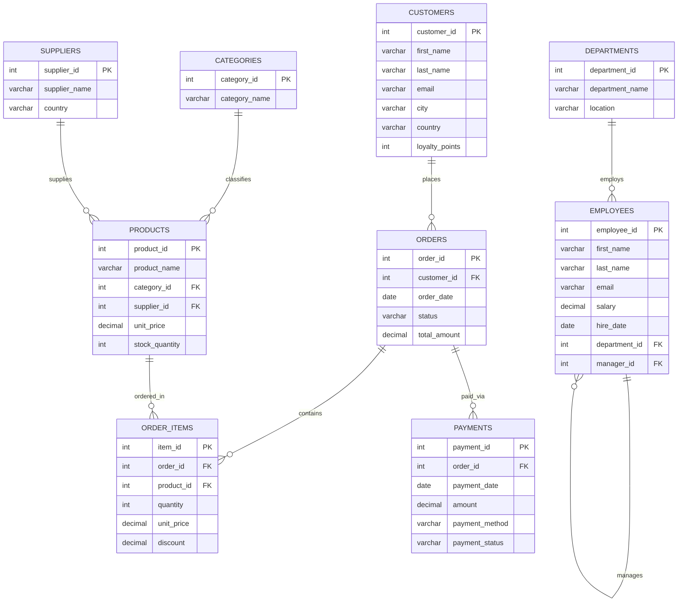

# मास्टर SQL और MySQL लर्निंग गाइड: विषय सूची (Master Table of Contents)

**Master SQL & MySQL Learning Guide** में आपका स्वागत है! यह सम्पूर्ण पाठ्यक्रम (Comprehensive Curriculum) फंडामेंटल डेटाबेस थ्योरी, प्रैक्टिकल SQL प्रोग्रामिंग, एंटरप्राइज डेटाबेस डिज़ाइन, मॉडर्न क्वेरी तकनीकें और परफॉरमेंस ऑप्टिमाइज़ेशन को आसान और स्पष्ट हिंग्लिश (Hinglish) में समझाता है।

इस पूरी गाइड में सभी प्रैक्टिस क्वेरीज, उदाहरण और एक्सरसाइज हमारे यूनिफाइड **`sql_mastery`** डेटाबेस स्कीमा पर रन होते हैं, जो ई-कॉमर्स, वर्कफोर्स मैनेजमेंट, सप्लाई चेन और फाइनेंस जैसे रियल-वर्ल्ड बिजनेस ऑपरेशन्स को मॉडल करता है।

---

## पूरा पाठ्यक्रम ढाँचा (Curriculum Structure)

```
c:\antigravity\master_sql_guide\hi\
├── 00_master_table_of_contents.md     # सिलेबस रोडमैप और मास्टर इंडेक्स
├── 01_sql_fundamentals.md             # Level 1: RDBMS आर्किटेक्चर और SQL कोर
├── 02_database_and_table_management.md # Level 2 & 3: DDL (डेटाबेस, टेबल्स, ALTER)
├── 03_data_types.md                   # Level 4: MySQL डेटा टाइप्स और स्टोरेज
├── 04_constraints.md                  # Level 5: रिलेशनल इंटीग्रिटी कंस्ट्रेंट्स
├── 05_crud_operations.md              # Level 6: CRUD (INSERT, UPDATE, DELETE)
├── 06_select_and_filtering.md         # Level 7: डेटा रिट्रीवल, WHERE, NULLs
├── 07_sorting_and_limiting.md         # Level 7: ORDER BY, LIMIT, Keyset पेजिनेशन
├── 08_sql_operators.md                # Level 8: अरिथमेटिक, लॉजिकल और पैटर्न ऑपरेटर्स
├── 09_sql_functions.md                # Level 9-12: स्ट्रिंग, डेट, मैथ, और फ्लो फंक्शन्स
├── 10_group_by_and_having.md          # Level 13-14: ग्रुपिंग, HAVING, और ROLLUP
├── 11_joins.md                        # Level 15: INNER, LEFT, RIGHT, FULL, Self Joins
├── 12_union.md                        # Level 16: सेट ऑपरेशन्स (UNION और UNION ALL)
├── 13_subqueries.md                   # Level 17: Scalar, Correlated Subqueries और CTEs
├── 14_keys_and_relationships.md       # Level 18-19: Primary/Foreign Keys और कार्डिनैलिटी
├── 15_database_design.md              # Level 20: ER मॉडलिंग और स्कीमा डिज़ाइन
├── 16_normalization.md                # Level 21: 1NF से BCNF नॉर्मलाइजेशन
├── 17_views.md                        # Level 22: वर्चुअल टेबल्स और सिक्योरिटी व्यूज
├── 18_indexes.md                      # Level 23: B+ Tree इंडेक्स और परफॉरमेंस
├── 19_transactions.md                 # Level 24-25: ACID, लॉकिंग और आइसोलेशन लेवल्स
├── 20_stored_procedures.md            # Level 26: प्रोसीजर्स, पैरामीटर्स, कण्ट्रोल फ्लो
├── 21_functions.md                    # Level 27: यूजर-डिफाइंड स्केलर फंक्शन्स (UDFs)
├── 22_triggers.md                     # Level 28: इवेंट ट्रिगर्स और ऑडिट लॉगिंग
├── 23_advanced_sql.md                 # Level 29: विंडो फंक्शन्स और JSON मैनिपुलेशन
├── 24_query_optimization.md           # Level 30: EXPLAIN ANALYZE और SARGability
├── 25_security_and_best_practices.md  # Level 31: RBAC रोल्स, ग्रांट्स और SQL इंजेक्शन सुरक्षा
├── 26_real_world_projects.md          # Level 32: 5 रियल-वर्ल्ड एंटरप्राइज प्रोजेक्ट्स
├── 27_exercises.md                    # 300 स्तरीय अभ्यास प्रश्न (Tiered Exercises)
├── 28_answer_key.md                   # पूरे 300 सवालों के उत्तर और व्याख्या
├── 29_interview_questions.md          # Level 33: 150 टॉप इंटरव्यू सवाल और जवाब
├── 30_sql_cheat_sheet.md              # Level 35: कॉम्पैक्ट SQL कमांड चीट शीट
├── 31_learning_roadmaps.md            # 7-दिन, 14-दिन, 30-दिन, 60-दिन स्टडी रोडमैप्स
├── 32_final_revision_guide.md         # Level 34: फाइनल एग्जाम और इंटरव्यू रिविजन
└── 33_az_sql_reference.md             # वर्णमाला (A-Z) अनुसार SQL कीवर्ड लेक्सिकॉन
```

---

## 35 मास्टरी लेवल्स अवलोकन (Mastery Levels Overview)

| Level | विषय क्षेत्र | संबंधित मॉड्यूल | मुख्य कोर कॉन्सेप्ट्स |
| :--- | :--- | :--- | :--- |
| **01** | Database Fundamentals | `01_sql_fundamentals.md` | Data vs Information, DBMS vs RDBMS, SQL vs NoSQL, Client-Server आर्किटेक्चर |
| **02** | SQL Fundamentals | `01_sql_fundamentals.md` | DDL, DML, DQL, DCL, TCL कमांड्स और क्वेरी एग्जीक्यूशन लाइफसाइकिल |
| **03** | Database & Table Management | `02_database_and_table_management.md` | `CREATE DATABASE`, `CREATE TABLE`, `ALTER`, `DROP`, `TRUNCATE` |
| **04** | Data Types | `03_data_types.md` | Numeric, String, Date/Time, JSON, स्टोरेज बाइट्स, और टाइप कास्टिंग |
| **05** | Integrity Constraints | `04_constraints.md` | `PRIMARY KEY`, `NOT NULL`, `UNIQUE`, `CHECK`, `DEFAULT`, `AUTO_INCREMENT` |
| **06** | Data Manipulation (CRUD) | `05_crud_operations.md` | `INSERT`, `UPDATE`, `DELETE`, Bulk loading, `ON DUPLICATE KEY UPDATE` |
| **07** | Filtering & Sorting | `06_select_and_filtering.md`, `07_sorting_and_limiting.md` | `WHERE`, Multi-column `ORDER BY`, `LIMIT`, `OFFSET`, Keyset पेजिनेशन |
| **08** | SQL Operators | `08_sql_operators.md` | Arithmetic, Logical (`AND`, `OR`, `NOT`), `BETWEEN`, `IN`, `LIKE`, `<=>` |
| **09** | String Functions | `09_sql_functions.md` | `CONCAT`, `SUBSTRING`, `LENGTH`, `LOWER`, `UPPER`, `TRIM`, `REPLACE` |
| **10** | Date & Time Functions | `09_sql_functions.md` | `NOW`, `CURDATE`, `DATEDIFF`, `DATE_ADD`, `DATE_FORMAT`, `TIMESTAMPDIFF` |
| **11** | Numeric Functions | `09_sql_functions.md` | `ROUND`, `FLOOR`, `CEIL`, `MOD`, `POWER`, `SQRT`, `ABS`, `TRUNCATE` |
| **12** | Aggregate Functions | `09_sql_functions.md` | `COUNT(*)`, `COUNT(col)`, `SUM`, `AVG`, `MIN`, `MAX`, NULLs हैंडलिंग |
| **13** | GROUP BY | `10_group_by_and_having.md` | Multi-column grouping, `ONLY_FULL_GROUP_BY` मोड, `WITH ROLLUP` |
| **14** | HAVING | `10_group_by_and_having.md` | रो फिल्टरिंग (`WHERE`) बनाम एग्रीगेट फिल्टरिंग (`HAVING`) |
| **15** | Relational JOINs | `11_joins.md` | `INNER`, `LEFT`, `RIGHT`, Full Outer emulation, Cross, Self JOIN |
| **16** | Set Operations | `12_union.md` | `UNION`, `UNION ALL`, स्कीमा कम्पैटिबिलिटी रूल्स, कम्पाउंड सॉर्टिंग |
| **17** | Subqueries & CTEs | `13_subqueries.md` | Scalar, Column, Table subqueries, Correlated subqueries, `EXISTS`, CTEs |
| **18** | Primary & Foreign Keys | `14_keys_and_relationships.md` | Surrogate vs Natural keys, Composite keys, Referential actions (`CASCADE`) |
| **19** | Relational Modeling | `14_keys_and_relationships.md` | One-to-One, One-to-Many, Many-to-Many, Junction/Bridge टेबल्स |
| **20** | Database Design | `15_database_design.md` | Entity Relationship Diagrams (ERDs), कार्डिनैलिटी, कॉन्सेप्चुअल से फिजिकल |
| **21** | Normalization | `16_normalization.md` | Update anomalies, 1NF, 2NF, 3NF, BCNF, OLAP डीनॉर्मलाइजेशन |
| **22** | Views | `17_views.md` | वर्चुअल टेबल्स, एब्सट्रैक्शन, सिक्योरिटी व्यूज, `WITH CHECK OPTION` |
| **23** | Indexes & Performance | `18_indexes.md` | Clustered vs Secondary indexes, B+ Tree इंटरनल्स, Leftmost Prefix रूल |
| **24** | Transactions & ACID | `19_transactions.md` | Atomicity, Consistency, Isolation, Durability, Undo/Redo लॉग्स |
| **25** | Concurrency Control | `19_transactions.md` | `COMMIT`, `ROLLBACK`, `SAVEPOINT`, Isolation levels, Deadlocks |
| **26** | Stored Procedures | `20_stored_procedures.md` | `DELIMITER`, `IN`, `OUT`, `INOUT` पैरामीटर्स, कण्ट्रोल फ्लो (`IF`, `WHILE`) |
| **27** | Stored Functions | `21_functions.md` | `CREATE FUNCTION ... RETURNS`, Deterministic रूल्स बनाम प्रोसीजर्स |
| **28** | Triggers | `22_triggers.md` | `BEFORE`/`AFTER` `INSERT`/`UPDATE`/`DELETE`, `OLD`/`NEW` रो इमेजेस, ऑडिट ट्रेल्स |
| **29** | Advanced SQL | `23_advanced_sql.md` | विंडो फंक्शन्स (`ROW_NUMBER`, `RANK`, `LEAD`, `LAG`), JSON ऑपरेटर्स |
| **30** | Query Optimization | `24_query_optimization.md` | `EXPLAIN`, Execution plans, SARGable क्लॉजेज, कवरिंग इंडेक्स |
| **31** | Security & Administration | `25_security_and_best_practices.md` | `CREATE USER`, `GRANT`, `REVOKE`, RBAC रोल्स, SQL इंजेक्शन सुरक्षा |
| **32** | Real-World Projects | `26_real_world_projects.md` | 5 एंड-टू-एंड प्रोडक्शन स्कीमा, बिजनेस लॉजिक और एनालिटिक्स |
| **33** | Interview Mastery | `29_interview_questions.md` | 150 टेक्निकल इंटरव्यू सवाल (Junior, Mid-level, Senior) |
| **34** | Rapid Revision Guide | `32_final_revision_guide.md` | हाई-यील्ड रिविजन कार्ड्स, सिंटैक्स टेबल्स, और ट्रैप्स |
| **35** | MySQL Cheat Sheet | `30_sql_cheat_sheet.md` | प्रोडक्शन चीट शीट: कमांड्स, फंक्शन्स और सिंटैक्स पैटर्न्स |

---

## यूनिफाइड डेटाबेस स्कीमा: `sql_mastery`

इस गाइड के सभी कोड उदाहरणों को खुद रन करके देखने के लिए, [`sql_mastery_schema.sql`](file:///c:/antigravity/master_sql_guide/sql_mastery_schema.sql) स्क्रिप्ट को अपने MySQL में चलाएँ।

### एंटिटी रिलेशनशिप डायग्राम (ERD)



---

## 12-सेक्शन चैप्टर स्ट्रक्चर (Chapter Blueprint)

हर टेक्निकल चैप्टर ठीक इसी 12-भागों के स्ट्रक्चर को फॉलो करता है:
1. **Concept Overview (अवधारणा का अवलोकन)** — यह कॉन्सेप्ट क्या है?
2. **Why It Matters (यह क्यों जरूरी है)** — इंडस्ट्री में इसकी क्या अहमियत है?
3. **Core Syntax & Signatures (मुख्य सिंटैक्स)** — फॉर्मल सिंटैक्स और कीवर्ड्स।
4. **Intuitive Explanation (आसान समझ)** — रियल-लाइफ उदाहरणों के साथ सहज व्याख्या।
5. **Progressive Walkthroughs (स्टेप-बाय-स्टेप कोड)** — 3+ प्रैक्टिकल कोड ब्लॉक्स।
6. **Real-World Business Use Case (वास्तविक उपयोग)** — `sql_mastery` पर आधारित केस-स्टडी।
7. **Common Pitfalls & Antipatterns (सामान्य गलतियाँ)** — कौन सी गलतियों से बचना है।
8. **Best Practices & Performance Tips (सर्वोत्तम तरीके)** — परफॉरमेंस और क्लीन कोड रूल्स।
9. **Engine Under the Hood (इंजन के अंदर)** — InnoDB और मेमोरी कैसे काम करती है।
10. **Dialect Notes (MySQL vs PostgreSQL vs ANSI)** — डेटाबेस इंजनों में अंतर।
11. **Interactive Challenge & Self-Quiz (अभ्यास चुनौती)** — खुद की परीक्षा लें।
12. **Chapter Summary & Next Steps (सारांश और आगे की राह)** — मुख्य बिंदु और अगला चैप्टर।

लर्निंग शुरू करने के लिए [01 — SQL & RDBMS Fundamentals](/hi/01_sql_fundamentals) पर जाएँ।
