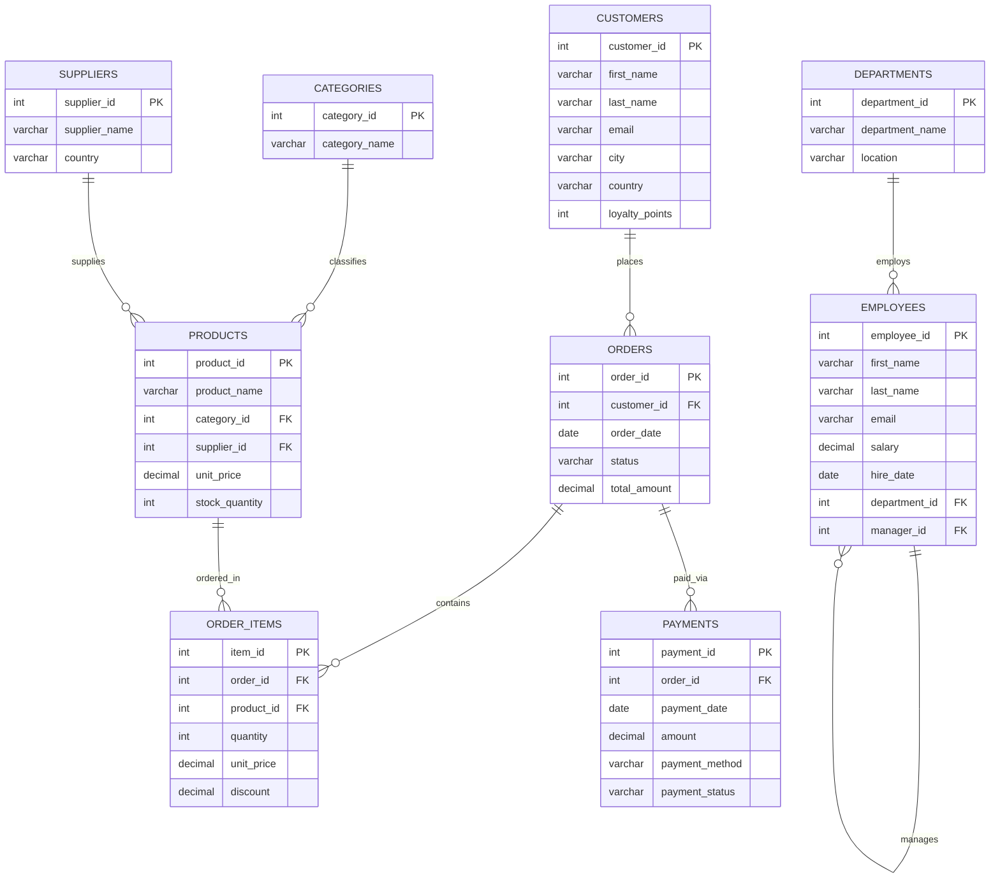

# Master SQL & MySQL Learning Guide: Master Table of Contents (Hinglish)

**Master SQL & MySQL Learning Guide** mein aapka swagat hai! Ye comprehensive curriculum fundamental database theory, practical SQL programming, enterprise database design, modern query techniques, aur performance optimization ko simple, natural Roman Hinglish mein explain karta hai.

Is poori guide mein saare practice queries, demonstrations, aur exercises hamare unified **`sql_mastery`** database schema par run hote hain, jo E-commerce, workforce management, supply chain, aur finance jaise real-world enterprise operations ko model karta hai.

---

## Complete Curriculum Structure

```
c:\antigravity\master_sql_guide\hi\
├── 00_master_table_of_contents.md     # Syllabus roadmap aur master index
├── 01_sql_fundamentals.md             # Level 1: RDBMS architecture aur SQL core
├── 02_database_and_table_management.md # Level 2 & 3: DDL (Databases, Tables, ALTER)
├── 03_data_types.md                   # Level 4: MySQL data types aur storage
├── 04_constraints.md                  # Level 5: Relational integrity constraints
├── 05_crud_operations.md              # Level 6: CRUD (INSERT, UPDATE, DELETE)
├── 06_select_and_filtering.md         # Level 7: Data retrieval, WHERE, NULLs
├── 07_sorting_and_limiting.md         # Level 7: ORDER BY, LIMIT, Keyset pagination
├── 08_sql_operators.md                # Level 8: Arithmetic, logical aur pattern operators
├── 09_sql_functions.md                # Level 9-12: String, Date, Math, aur Flow functions
├── 10_group_by_and_having.md          # Level 13-14: Grouping, HAVING, aur ROLLUP
├── 11_joins.md                        # Level 15: INNER, LEFT, RIGHT, FULL, Self Joins
├── 12_union.md                        # Level 16: Set operations (UNION aur UNION ALL)
├── 13_subqueries.md                   # Level 17: Scalar, Correlated Subqueries aur CTEs
├── 14_keys_and_relationships.md       # Level 18-19: Primary/Foreign Keys aur cardinality
├── 15_database_design.md              # Level 20: ER modeling aur schema architecture
├── 16_normalization.md                # Level 21: 1NF se BCNF normalization
├── 17_views.md                        # Level 22: Virtual tables aur security views
├── 18_indexes.md                      # Level 23: B+ Tree indexes aur query performance
├── 19_transactions.md                 # Level 24-25: ACID, locking, aur isolation levels
├── 20_stored_procedures.md            # Level 26: Procedures, parameters, control flow
├── 21_functions.md                    # Level 27: User-defined scalar functions (UDFs)
├── 22_triggers.md                     # Level 28: Event triggers aur audit logging
├── 23_advanced_sql.md                 # Level 29: Window functions aur JSON manipulation
├── 24_query_optimization.md           # Level 30: EXPLAIN ANALYZE aur SARGability
├── 25_security_and_best_practices.md  # Level 31: RBAC roles, grants, aur SQL injection defense
├── 26_real_world_projects.md          # Level 32: 5 production-grade database systems
├── 27_exercises.md                    # 300 tiered practice exercises
├── 28_answer_key.md                   # Complete answers aur explanations
├── 29_interview_questions.md          # Level 33: 150 top technical interview questions
├── 30_sql_cheat_sheet.md              # Level 35: Compact SQL command cheat sheet
├── 31_learning_roadmaps.md            # 7-day, 14-day, 30-day, 60-day study schedules
├── 32_final_revision_guide.md         # Level 34: Final exam aur interview revision
└── 33_az_sql_reference.md             # A-Z keyword aur function lexicon
```

---

## 35 Mastery Levels Overview

| Level | Topic Area | Focus Module | Core Concepts |
| :--- | :--- | :--- | :--- |
| **01** | Database Fundamentals | `01_sql_fundamentals.md` | Data vs Information, DBMS vs RDBMS, SQL vs NoSQL, Client-Server architecture |
| **02** | SQL Fundamentals | `01_sql_fundamentals.md` | DDL, DML, DQL, DCL, TCL commands taxonomy, execution lifecycle |
| **03** | Database & Table Management | `02_database_and_table_management.md` | `CREATE DATABASE`, `CREATE TABLE`, `ALTER`, `DROP`, `TRUNCATE` |
| **04** | Data Types | `03_data_types.md` | Numeric, String, Date/Time, JSON, storage bytes, type casting |
| **05** | Integrity Constraints | `04_constraints.md` | `PRIMARY KEY`, `NOT NULL`, `UNIQUE`, `CHECK`, `DEFAULT`, `AUTO_INCREMENT` |
| **06** | Data Manipulation (CRUD) | `05_crud_operations.md` | `INSERT`, `UPDATE`, `DELETE`, Bulk loading, `ON DUPLICATE KEY UPDATE` |
| **07** | Filtering & Sorting | `06_select_and_filtering.md`, `07_sorting_and_limiting.md` | `WHERE`, Multi-column `ORDER BY`, `LIMIT`, `OFFSET`, Keyset pagination |
| **08** | SQL Operators | `08_sql_operators.md` | Arithmetic, Logical (`AND`, `OR`, `NOT`), `BETWEEN`, `IN`, `LIKE`, `<=>` |
| **09** | String Functions | `09_sql_functions.md` | `CONCAT`, `SUBSTRING`, `LENGTH`, `LOWER`, `UPPER`, `TRIM`, `REPLACE` |
| **10** | Date & Time Functions | `09_sql_functions.md` | `NOW`, `CURDATE`, `DATEDIFF`, `DATE_ADD`, `DATE_FORMAT`, `TIMESTAMPDIFF` |
| **11** | Numeric Functions | `09_sql_functions.md` | `ROUND`, `FLOOR`, `CEIL`, `MOD`, `POWER`, `SQRT`, `ABS`, `TRUNCATE` |
| **12** | Aggregate Functions | `09_sql_functions.md` | `COUNT(*)`, `COUNT(col)`, `SUM`, `AVG`, `MIN`, `MAX`, NULLs handling |
| **13** | GROUP BY | `10_group_by_and_having.md` | Multi-column grouping, `ONLY_FULL_GROUP_BY` mode, `WITH ROLLUP` |
| **14** | HAVING | `10_group_by_and_having.md` | Row filtering (`WHERE`) vs Aggregate filtering (`HAVING`) |
| **15** | Relational JOINs | `11_joins.md` | `INNER`, `LEFT`, `RIGHT`, Full Outer emulation, Cross, Self JOIN |
| **16** | Set Operations | `12_union.md` | `UNION`, `UNION ALL`, schema compatibility rules, compound sorting |
| **17** | Subqueries & CTEs | `13_subqueries.md` | Scalar, Column, Table subqueries, Correlated subqueries, `EXISTS`, CTEs |
| **18** | Primary & Foreign Keys | `14_keys_and_relationships.md` | Surrogate vs Natural keys, Composite keys, Referential actions (`CASCADE`) |
| **19** | Relational Modeling | `14_keys_and_relationships.md` | One-to-One, One-to-Many, Many-to-Many, Junction/Bridge tables |
| **20** | Database Design | `15_database_design.md` | Entity Relationship Diagrams (ERDs), cardinality, conceptual to physical |
| **21** | Normalization | `16_normalization.md` | Update anomalies, 1NF, 2NF, 3NF, BCNF, OLAP de-normalization |
| **22** | Views | `17_views.md` | Virtual tables, abstraction, security views, `WITH CHECK OPTION` |
| **23** | Indexes & Performance | `18_indexes.md` | Clustered vs Secondary indexes, B+ Tree internals, Leftmost Prefix rule |
| **24** | Transactions & ACID | `19_transactions.md` | Atomicity, Consistency, Isolation, Durability, Undo/Redo logs |
| **25** | Concurrency Control | `19_transactions.md` | `COMMIT`, `ROLLBACK`, `SAVEPOINT`, Isolation levels, Deadlocks |
| **26** | Stored Procedures | `20_stored_procedures.md` | `DELIMITER`, `IN`, `OUT`, `INOUT` parameters, control flow (`IF`, `WHILE`) |
| **27** | Stored Functions | `21_functions.md` | `CREATE FUNCTION ... RETURNS`, Deterministic rules vs Procedures |
| **28** | Triggers | `22_triggers.md` | `BEFORE`/`AFTER` `INSERT`/`UPDATE`/`DELETE`, `OLD`/`NEW` row images, audit trails |
| **29** | Advanced SQL | `23_advanced_sql.md` | Window functions (`ROW_NUMBER`, `RANK`, `LEAD`, `LAG`), JSON operators |
| **30** | Query Optimization | `24_query_optimization.md` | `EXPLAIN`, Execution plans, SARGable clauses, covering index |
| **31** | Security & Administration | `25_security_and_best_practices.md` | `CREATE USER`, `GRANT`, `REVOKE`, RBAC roles, SQL injection defense |
| **32** | Real-World Projects | `26_real_world_projects.md` | 5 End-to-end production schemas, business logic aur analytics |
| **33** | Interview Mastery | `29_interview_questions.md` | 150 Technical interview questions (Junior, Mid-level, Senior) |
| **34** | Rapid Revision Guide | `32_final_revision_guide.md` | High-yield revision cards, syntax tables, aur traps |
| **35** | MySQL Cheat Sheet | `30_sql_cheat_sheet.md` | Production cheat sheet: commands, functions, aur syntax patterns |

---

## Unified Database Schema: `sql_mastery`

Is guide ke sabhi code examples ko practical run karne ke liye [`sql_mastery_schema.sql`](file:///c:/antigravity/master_sql_guide/sql_mastery_schema.sql) script ko apne MySQL environment mein execute karein.

### Entity Relationship Diagram (ERD)



---

## 12-Section Chapter Structure (Chapter Blueprint)

Har technical chapter isi standardized 12-section blueprint ko follow karta hai:
1. **Concept Overview** — Ye concept kya hai?
2. **Why It Matters** — Industry aur enterprise software mein iska kya importance hai?
3. **Core Syntax & Signatures** — Formal syntax aur keywords.
4. **Intuitive Explanation** — Real-life developer analogies ke sath intuitive explanation.
5. **Progressive Walkthroughs** — 3+ practical code blocks.
6. **Real-World Business Use Case** — `sql_mastery` schema par based enterprise scenario.
7. **Common Pitfalls & Antipatterns** — Common mistakes jinse bachna zaroori hai.
8. **Best Practices & Performance Tips** — Production tips aur performance guidelines.
9. **Engine Under the Hood** — InnoDB engine aur memory internals.
10. **Dialect Notes (MySQL vs PostgreSQL vs ANSI)** — Different SQL engines ke beech differences.
11. **Interactive Challenge & Self-Quiz** — Practice challenge aur self-test questions.
12. **Chapter Summary & Next Steps** — Key takeaways aur next chapter ka link.

Learning start karne ke liye [01 — SQL & RDBMS Fundamentals](/hi/01_sql_fundamentals) par jaayein.
