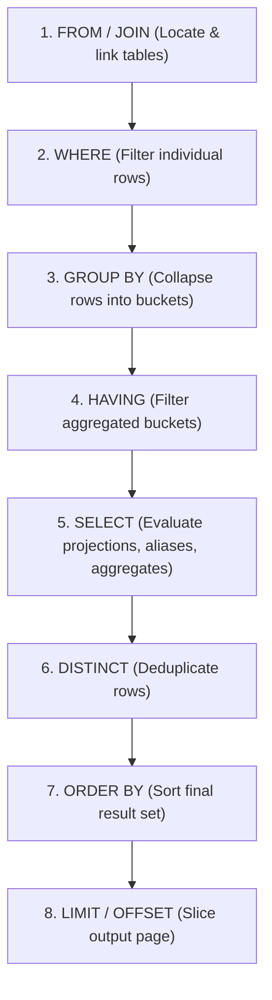

# Chapter 10 — Grouping & Aggregation: GROUP BY & HAVING (ग्रुपिंग और एग्रीगेशन)

---

## 1. What is it? (यह क्या है?)

Relational database queries mein aksar individual rows ke andar chote-chote transaction details hote hain, jabki business decisions lene ke liye humein higher-level summary metrics (jaise total sales per department, average order value, etc.) chahiye hote hain.

* **`GROUP BY`**: Yeh clause un sabhi rows ko jinme specified columns ki values same hoti hain, ek single summary "bucket" (group) mein collapse kar deta hai. Jab hum ise aggregate functions (`COUNT`, `SUM`, `AVG`, `MIN`, `MAX`) ke sath use karte hain, toh yeh har ek group ke liye ek calculated summary metric nikalta hai.
* **`HAVING`**: Yeh ek dedicated filtering clause hai jo groups banne aur aggregation hone ke **baad** un aggregated summary buckets par filter lagata hai.

### The Fundamental Distinction: `WHERE` vs `HAVING` (मुख्य अंतर)
* **`WHERE`** individual raw rows ko groups banne se **pehle** filter karta hai. Isliye `WHERE` ke andar aggregate functions use nahi ho sakte (jaise `WHERE AVG(salary) > 50000` likhna invalid SQL hai).
* **`HAVING`** `GROUP BY` hone ke **baad** banne wale summary groups ko filter karta hai. Isme aap seedhe aggregate expressions par condition laga sakte hain (jaise `HAVING AVG(salary) > 50000`).

---

## 2. Logical Query Execution Order (क्वेरी एग्जीक्यूशन का लॉजिकल क्रम)

Complex SQL queries likhne aur unhe debug karne ke liye aapko database engine ka internal **Logical Query Processing Order** samajhna behad zaroori hai. Bhale hi hum query `SELECT` se likhna shuru karte hain, lekin engine use bilkul alag sequence mein process karta hai:



Dhyan se dekhiye: `WHERE` Step 2 par execute hota hai (Step 3 par groups banne se pehle), isliye `WHERE` aggregates ko filter nahi kar sakta! Aur `HAVING` Step 4 par execute hota hai, isliye yeh Step 5 (SELECT) par final data display hone se pehle aggregated buckets ko filter karta hai.

---

## 3. Syntax (सिंटैक्स)

```sql
SELECT 
    group_column1,
    group_column2,
    AGGREGATE_FUNCTION(metric_column) AS summary_metric
FROM table_name
[WHERE raw_row_filter_condition]
GROUP BY 
    group_column1,
    group_column2
[WITH ROLLUP]
[HAVING aggregate_filter_condition]
[ORDER BY summary_metric DESC]
[LIMIT row_count];
```

### Advanced MySQL Aggregation: `GROUP_CONCAT`
MySQL ek behad powerful aggregate function provide karta hai jiska naam hai `GROUP_CONCAT()`. Yeh group ki sabhi non-null string values ko jodkar ek single formatted comma-separated string bana deta hai:

```sql
GROUP_CONCAT([DISTINCT] column_name [ORDER BY col ASC] [SEPARATOR ', '])
```

---

## 4. Basic Example (बुनियादी उदाहरण)

Basic grouping, aggregate metrics, aur group filtering:

```sql
USE sql_mastery;

-- Total number of customers grouped by country
SELECT 
    country,
    COUNT(*) AS total_customers
FROM customers
GROUP BY country;

-- Filter groups using HAVING: Only show countries with more than 1 customer
SELECT 
    country,
    COUNT(*) AS total_customers
FROM customers
GROUP BY country
HAVING COUNT(*) > 1;

-- Aggregate string concatenation: List all customer first names in each country
SELECT 
    country,
    COUNT(*) AS customer_count,
    GROUP_CONCAT(first_name ORDER BY first_name ASC SEPARATOR ', ') AS customer_roster
FROM customers
GROUP BY country;
```

---

## 5. Real-World Example (वास्तविक दुनिया का उदाहरण)

Company ke Chief Financial Officer (CFO) ko `employees` table se ek Departmental Payroll & Headcount Analysis report chahiye:
1. Employees ko `department_id` ke hisab se group karein.
2. Inactive employees ko `WHERE is_active = TRUE` se shuru mein hi filter out karein.
3. Total headcount, total salary expenditure, average salary, aur min/max salary range calculate karein.
4. `HAVING` ka use karke aise departments ko filter out karein jinme 2 se kam active employees hon ya average salary $80,000 se kam ho.
5. `WITH ROLLUP` ka use karke report mein subtotals aur grand total summary rows add karein.

```sql
USE sql_mastery;

SELECT 
    IF(GROUPING(department_id) = 1, 'ALL DEPARTMENTS (GRAND TOTAL)', COALESCE(CAST(department_id AS CHAR), 'No Department')) AS department_label,
    COUNT(*) AS active_headcount,
    SUM(salary) AS total_payroll,
    ROUND(AVG(salary), 2) AS average_salary,
    MIN(salary) AS min_salary,
    MAX(salary) AS max_salary
FROM employees
WHERE is_active = TRUE
GROUP BY department_id WITH ROLLUP
HAVING COUNT(*) >= 2 OR GROUPING(department_id) = 1;
```

---

## 6. Step-by-Step Explanation (कदम-दर-कदम व्याख्या)

1. **`FROM employees WHERE is_active = TRUE`**:
   * Storage engine `employees` table scan karta hai aur sabse pehle un employees ko discard kar deta hai jinka `is_active` status `FALSE` hai.
2. **`GROUP BY department_id WITH ROLLUP`**:
   * Rows ko `department_id` (Dept 1, Dept 2, Dept 3, Dept 4) ke hisab se sort aur partition karke distinct buckets banata hai.
   * `WITH ROLLUP` modifier MySQL ko instruction deta hai ki woh sabhi departments ko milakar ek extra hierarchical summary row (grand total) bhi generate kare.
3. **`HAVING COUNT(*) >= 2 OR GROUPING(department_id) = 1`**:
   * Engine har ek department bucket ke aggregate metrics ko evaluate karta hai.
   * Jin departments mein 2 se kam active members hain, unhe filter out kar diya jata hai.
   * `OR GROUPING(department_id) = 1` clause yeh ensure karta hai ki individual departments filter hone ke baad bhi grand-total rollup row result mein bani rahe.
4. **`SELECT ... GROUPING(...)`**:
   * `GROUPING(department_id)` function rollup row ke liye `1` return karta hai aur normal department rows ke liye `0`. Iski madad se hum generic `NULL` ki jagah sundar label `'ALL DEPARTMENTS (GRAND TOTAL)'` print kar paate hain.

---

## 7. Expected Result (अपेक्षित परिणाम)

Departmental Payroll Analysis query ka output:

```
+--------------------------------+------------------+---------------+----------------+------------+------------+
| department_label               | active_headcount | total_payroll | average_salary | min_salary | max_salary |
+--------------------------------+------------------+---------------+----------------+------------+------------+
| 1                              |                3 |     368000.00 |      122666.67 |   98000.00 |  145000.00 |
| 2                              |                2 |     227000.00 |      113500.00 |   92000.00 |  135000.00 |
| 3                              |                2 |     208000.00 |      104000.00 |   78000.00 |  130000.00 |
| 4                              |                2 |     182000.00 |       91000.00 |   72000.00 |  110000.00 |
| ALL DEPARTMENTS (GRAND TOTAL)  |               10 |    1070000.00 |      107000.00 |   72000.00 |  145000.00 |
+--------------------------------+------------------+---------------+----------------+------------+------------+
5 rows in set (0.00 sec)
```

---

## 8. Common Mistakes (आम गलतियाँ)

1. **The `ONLY_FULL_GROUP_BY` Error (MySQL 5.7+ / 8.0+) (बिना एग्रीगेट वाले कॉलम से एरर)**:
   * *The Broken Query*:
     ```sql
     SELECT department_id, first_name, AVG(salary)
     FROM employees
     GROUP BY department_id;
     ```
   * *Fatal Error*:
     `ERROR 1055 (42000): 'sql_mastery.employees.first_name' isn't in GROUP BY clause and contains nonaggregated column... which is not functionally dependent on columns in GROUP BY clause; this is incompatible with sql_mode=only_full_group_by`
   * *Why? (ऐसा क्यों हुआ?)*: Soch kar dekhiye, agar Department 1 mein 3 employees hain (Alex, Sarah, Marcus), toh department average ke paas database kiska `first_name` dikhaye? Kisi ek ka random naam uthana galat aur non-deterministic hai.
   * *Strict Rule*: Modern SQL mein **`SELECT` mein likha har ek column ya toh `GROUP BY` clause mein hona chahiye ya kisi aggregate function ke andar wrapped hona chahiye**.
2. **Placing Aggregate Conditions in `WHERE` (`WHERE` में एग्रीगेट फंक्शन का इस्तेमाल)**:
   * *Mistake*: `SELECT department_id FROM employees WHERE AVG(salary) > 80000 GROUP BY department_id;`
   * *Error*: `ERROR 1111 (HY000): Invalid use of group function`.
   * *Correction*: Aggregate filter ko hamesha `HAVING` mein likhein: `HAVING AVG(salary) > 80000`.
3. **Placing Non-Aggregate Filters in `HAVING` (`HAVING` में सामान्य फिल्टर लगाना)**:
   * *Sub-optimal Query*:
     ```sql
     SELECT department_id, AVG(salary)
     FROM employees
     GROUP BY department_id
     HAVING department_id = 1; -- POOR PRACTICE!
     ```
   * *Why it's bad*: Database engine pehle poori company ke har ek employee ko group karega aur uske baad Dept 1 ke alawa baaki sabhi ko fekega!
   * *Correction*: Pehle hi `WHERE department_id = 1` lagayein taaki engine ko shuru se hi bahut kam rows process karni padein.

---

## 9. Best Practices (सर्वोत्तम प्रथाएं / Best Practices)

1. **Filter Early with `WHERE`, Filter Late with `HAVING` (फिल्टर सही जगह लगाएं)**:
   * Jo rows summary ka hissa nahi ban sakti, unhe pehle hi `WHERE` mein eliminate kar dein. `HAVING` ko strictly sirf aggregate function ke results (`SUM`, `COUNT`, `AVG`) par condition lagane ke liye reserve rakhein.
2. **Build Composite Indexes to Accelerate Grouping (ग्रुपिंग के लिए इंडेक्स बनाएं)**:
   * Agar aap frequently `SELECT department_id, status, COUNT(*) FROM orders GROUP BY department_id, status` chalate hain, toh `(department_id, status)` par composite index banayein. Engine pre-sorted B+ Tree index se seedhe aggregates compute kar leta hai aur in-memory temporary table banane ki zaroorat nahi padti.
3. **Use the `GROUPING()` Function with `ROLLUP` (`ROLLUP` के साथ `GROUPING` फंक्शन)**:
   * `WITH ROLLUP` use karte waqt kabhi bhi `IFNULL(col, 'Total')` ka use na karein agar `col` ke andar real `NULL` values ho sakti hain. Hamesha standard ANSI SQL `GROUPING(col)` function ka prayog karein, jo 100% reliably batata hai ki yeh row engine-generated summary row hai ya nahi.

---

## 10. Practice Questions (अभ्यास प्रश्न)

### Easy (सरल)
1. Har ek `category_id` mein total kitne products hain, yeh find karne ke liye query likhein.
2. Har ek category ke liye average `unit_price` calculate karne ki query likhein.
3. Har ek order `status` ke liye total orders ki sankhya count karne ki query likhein.

### Medium (मध्यम)
4. `orders` table se har customer ka total revenue (`SUM(total_amount)`) calculate karein, aur `HAVING` use karke sirf un customers ko show karein jinki total purchases $500.00 se zyada hon.
5. Har `supplier_id` ke sath uske supply kiye jaane wale products ki sankhya nikalen, aur `GROUP_CONCAT` ka use karke product names ko `' | '` se separate karke display karein.
6. Year 2023 ke har calendar month mein kitne orders place hue the, yeh calculate karne ki query likhein.

### Difficult (कठिन)
7. `order_items` table par ek multi-column aggregation query likhein jo `order_id` ke hisab se group kare aur total quantity, gross total, aur average discount calculate kare. `HAVING` clause ka use karke un orders ko filter karein jinme 1 se zyada distinct products hon aur jinka average discount 0% se zyada ho.
8. `products` table par ek query banayein jo `category_id` aur `supplier_id` par `WITH ROLLUP` use kare, aur `GROUPING()` function ki madad se subtotals aur grand totals ke liye clean descriptive labels provide kare.

---

## 11. Interview Questions (साक्षात्कार प्रश्न)

### Q1: What is the fundamental difference between `WHERE` and `HAVING` in SQL?
**Answer**:
* **Execution Phase**: Logical query processing pipeline mein `WHERE` clause `GROUP BY` se *pehle* execute hota hai aur individual raw table rows par filter lagata hai. Jabki `HAVING` clause rows ke aggregate buckets mein collapse hone ke *baad* execute hota hai.
* **Expression Capability**: `WHERE` clause sirf raw column values aur scalar expressions par filter kar sakta hai; yeh aggregate functions ko evaluate nahi kar sakta kyunki us samay tak groups bane hi nahi hote. Iske viprit, `HAVING` seedhe aggregate metrics (`SUM`, `AVG`, `COUNT`) par condition evaluate karta hai.

### Q2: What is the purpose of `ONLY_FULL_GROUP_BY` in MySQL, and why should it never be disabled in production?
**Answer**: `ONLY_FULL_GROUP_BY` MySQL ka ek strict SQL mode hai (jo MySQL 5.7 aur 8.0 se by default on rehta hai) aur standard ANSI SQL rules follow karta hai. Yeh aisi queries ko reject karta hai jahan `SELECT`, `HAVING`, ya `ORDER BY` mein aise non-aggregated columns likhe hote hain jo na toh `GROUP BY` clause ka hissa hain aur na hi unpar functionally dependent hain.
Agar ise disable kar diya jaye, toh MySQL group ki kisi bhi random row se unpredictable value uthakar de deta hai. Isse silent data corruption hoti hai, alag-alag database replicas alag answer return karte hain, aur business reporting completely galat ho sakti hai.

### Q3: How does the `WITH ROLLUP` modifier work in MySQL, and how do you distinguish between real NULL values and rollup summary NULLs?
**Answer**: `WITH ROLLUP` ek extension hai jo `GROUP BY` clause mein dimensions ko right-to-left roll up karke hierarchical subtotals aur grand total summary rows generate karta hai.
Summary rows ke andar rolled-up columns ki value `NULL` ban jaati hai. Database mein already maujood original `NULL` aur engine dwara generate kiye gaye rollup summary `NULL` ke beech farq karne ke liye SQL mein `GROUPING(column_name)` function hota hai. `GROUPING()` tab `1` return karta hai jab `NULL` rollup ka summary marker hota hai, aur `0` return karta hai jab row table ka real data hoti hai.

---

## 12. Quick Revision (त्वरित सारांश)

* **`GROUP BY`** same keys wali rows ko collapse karke aggregate summary buckets banata hai.
* **`WHERE`** rows ko grouping se *pehle* filter karta hai; **`HAVING`** aggregated buckets ko grouping ke *baad* filter karta hai.
* **`ONLY_FULL_GROUP_BY`** rule: `SELECT` ka har column ya toh `GROUP BY` mein hona chahiye ya aggregate function ke andar.
* Ek group ki multiple string values ko single comma-separated row mein jodne ke liye **`GROUP_CONCAT()`** use karein.
* Multi-level subtotals aur grand totals nikalne ke liye **`WITH ROLLUP`** ka prayog karein aur summary rows ko clean label dene ke liye **`GROUPING()`** function use karein.
