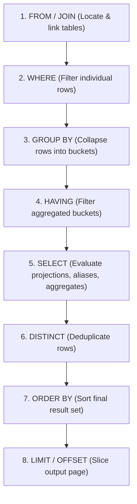

# Chapter 10 — Grouping & Aggregation: GROUP BY & HAVING (Grouping aur Aggregation)

---

## 1. What is it? (Ye Kya Hai?)

Relational querying mein, aksar individual rows mein granular transaction details store hoti hain, jabki business decisions lene ke liye higher-level summaries ki zarurat padti hai.

* **`GROUP BY`**: Ye clause un sabhi rows ko distinct summary buckets mein collapse kar deta hai jo ek ya multiple grouping columns mein identical values share karti hain. Jab ise aggregate functions (`COUNT`, `SUM`, `AVG`, `MIN`, `MAX`) ke sath combine kiya jata hai, toh ye har ek group ke liye ek single calculated metric compute karta hai.
* **`HAVING`**: Ye ek dedicated filtering clause hai jise specifically summary groups ko aggregation ke *baad* filter karne ke liye design kiya gaya hai.

### The Fundamental Distinction: `WHERE` vs `HAVING`
* **`WHERE`** individual raw rows ko groups banne se **pehle** aur aggregate functions calculate hone se pehle filter karta hai. Ye aggregate expressions ko reference nahi kar sakta (jaise `WHERE AVG(salary) > 50000` invalid SQL hai).
* **`HAVING`** aggregated summary buckets ko tab filter karta hai jab `GROUP BY` clause poore dataset ko process kar chuka hota hai. Ye directly aggregated expressions par operate karta hai (jaise `HAVING AVG(salary) > 50000`).

---

## 2. Why do we use it? (Hum Iska Use Kyun Karte Hain?)

1. **Business Intelligence & Reporting**: Raw transactional data ko high-level KPIs mein convert karna—jaise har department ka total payroll calculate karna, har country ke customer counts track karna, ya monthly sales revenue summarize karna.
2. **Post-Aggregation Filtering**: Aise groups ko isolate karna jo specific aggregate thresholds ko meet karte hain (for example, *"Sirf un suppliers ko dikhao jo 5 se zyada products deliver karte hain"*).
3. **Multi-Level Subtotals**: `WITH ROLLUP` ke zariye reporting hierarchy mein subtotals aur grand totals automatically generate karna.

### Logical Query Execution Order (Query Execution Ka Internal Order)
Complex SQL queries likhne aur debug karne ke liye engine ka internal **Logical Query Processing Order** samajhna bohot zaroori hai. SQL queries likhi bhale hi `SELECT` se shuru hoti hain, lekin database engine unhe bilkul alag order mein process karta hai:



Kyunki `WHERE` Step 2 par execute hota hai (Step 3 par groups banne se pehle), isliye ye aggregates par filter nahi kar sakta! Aur kyunki `HAVING` Step 4 par execute hota hai, ye Step 5 ke final projection se pehle aggregated groups ko filter karta hai.

---

## 3. Syntax

```sql
SELECT 
    group_column1,
    group_column2,
    AGGREGATE_FUNCTION(metric_column) AS summary_metric
FROM table_name
[WHERE raw_row_filter_condition]
GROUP BY 
    group_column1,
    group_column2
[WITH ROLLUP]
[HAVING aggregate_filter_condition]
[ORDER BY summary_metric DESC]
[LIMIT row_count];
```

### Advanced MySQL Aggregation: `GROUP_CONCAT`
MySQL provide karta hai powerful `GROUP_CONCAT()` aggregate function, jo har group ki non-null values ko ek single formatted string mein concatenate kar deta hai:

```sql
GROUP_CONCAT([DISTINCT] column_name [ORDER BY col ASC] [SEPARATOR ', '])
```

---

## 4. Basic Example

Basic grouping, aggregate metrics, aur group filtering ke examples:

```sql
USE sql_mastery;

-- Total number of customers grouped by country
SELECT 
    country,
    COUNT(*) AS total_customers
FROM customers
GROUP BY country;

-- Filter groups using HAVING: Only show countries with more than 1 customer
SELECT 
    country,
    COUNT(*) AS total_customers
FROM customers
GROUP BY country
HAVING COUNT(*) > 1;

-- Aggregate string concatenation: List all customer first names in each country
SELECT 
    country,
    COUNT(*) AS customer_count,
    GROUP_CONCAT(first_name ORDER BY first_name ASC SEPARATOR ', ') AS customer_roster
FROM customers
GROUP BY country;
```

---

## 5. Real-World Example

Chief Financial Officer (CFO) ko `employees` table se Departmental Payroll & Headcount Analysis chahiye:
1. Employees ko `department_id` ke hisab se group karo.
2. Inactive employees ko `WHERE is_active = TRUE` use karke filter out karo.
3. Total headcount, total salary expenditure, average salary, aur minimum/maximum salary range compute karo.
4. `HAVING` use karke un departments ko filter out karo jinme 2 se kam active employees hain ya jinki average salary $80,000 se kam hai.
5. `WITH ROLLUP` use karke subtotal aur grand total summary rows append karo.

```sql
USE sql_mastery;

SELECT 
    IF(GROUPING(department_id) = 1, 'ALL DEPARTMENTS (GRAND TOTAL)', COALESCE(CAST(department_id AS CHAR), 'No Department')) AS department_label,
    COUNT(*) AS active_headcount,
    SUM(salary) AS total_payroll,
    ROUND(AVG(salary), 2) AS average_salary,
    MIN(salary) AS min_salary,
    MAX(salary) AS max_salary
FROM employees
WHERE is_active = TRUE
GROUP BY department_id WITH ROLLUP
HAVING COUNT(*) >= 2 OR GROUPING(department_id) = 1;
```

---

## 6. Step-by-Step Explanation

1. **`FROM employees WHERE is_active = TRUE`**:
   * Storage engine `employees` table ko scan karta hai aur aise sabhi employees ko turant discard kar deta hai jinka `is_active` status `FALSE` hai.
2. **`GROUP BY department_id WITH ROLLUP`**:
   * Rows ko `department_id` ke basis par sort aur distinct buckets mein partition kiya jata hai (jaise Dept 1, Dept 2, Dept 3, Dept 4).
   * `WITH ROLLUP` modifier MySQL ko ek extra hierarchical summary row generate karne ka instruction deta hai jo sabhi departments ka grand total represent karti hai.
3. **`HAVING COUNT(*) >= 2 OR GROUPING(department_id) = 1`**:
   * Engine har department bucket ke summary metrics evaluate karta hai.
   * Single-member departments (jaise Dept 5) ko filter out kar diya jata hai.
   * `OR GROUPING(department_id) = 1` clause ensure karta hai ki grand-total rollup row preserve rahe, chahe individual departments filter hue hon.
4. **`SELECT ... GROUPING(...)`**:
   * `GROUPING(department_id)` function rollup row ke liye `1` return karta hai aur standard grouped rows ke liye `0` return karta hai. Iski madad se hum confusing `NULL` ki jagah clean `'ALL DEPARTMENTS (GRAND TOTAL)'` display kar pate hain.

---

## 7. Expected Result

Departmental Payroll Analysis query ka output:

```
+--------------------------------+------------------+---------------+----------------+------------+------------+
| department_label               | active_headcount | total_payroll | average_salary | min_salary | max_salary |
+--------------------------------+------------------+---------------+----------------+------------+------------+
| 1                              |                3 |     368000.00 |      122666.67 |   98000.00 |  145000.00 |
| 2                              |                2 |     227000.00 |      113500.00 |   92000.00 |  135000.00 |
| 3                              |                2 |     208000.00 |      104000.00 |   78000.00 |  130000.00 |
| 4                              |                2 |     182000.00 |       91000.00 |   72000.00 |  110000.00 |
| ALL DEPARTMENTS (GRAND TOTAL)  |               10 |    1070000.00 |      107000.00 |   72000.00 |  145000.00 |
+--------------------------------+------------------+---------------+----------------+------------+------------+
5 rows in set (0.00 sec)
```

---

## 8. Common Mistakes

1. **The `ONLY_FULL_GROUP_BY` Error (MySQL 5.7+ / 8.0+)**:
   * *The Broken Query*:
     ```sql
     SELECT department_id, first_name, AVG(salary)
     FROM employees
     GROUP BY department_id;
     ```
   * *Fatal Error*:
     `ERROR 1055 (42000): 'sql_mastery.employees.first_name' isn't in GROUP BY clause and contains nonaggregated column... which is not functionally dependent on columns in GROUP BY clause; this is incompatible with sql_mode=only_full_group_by`
   * *Why?*: Agar Department 1 mein 3 employees hain (Alex, Sarah, Marcus), toh database department average ke bagal mein display karne ke liye kaun sa ek `first_name` pick karega? Randomly koi ek choose karne se data non-deterministic ho jata hai.
   * *Strict Rule*: Modern SQL mein, **`SELECT` mein likha har column ya toh `GROUP BY` clause mein aana chahiye ya aggregate function ke andar wrapped hona chahiye**.
2. **Placing Aggregate Conditions in `WHERE`**:
   * *Mistake*: `SELECT department_id FROM employees WHERE AVG(salary) > 80000 GROUP BY department_id;`
   * *Error*: `ERROR 1111 (HY000): Invalid use of group function`.
   * *Correction*: Aggregate filter ko `HAVING AVG(salary) > 80000` mein move karo.
3. **Placing Non-Aggregate Filters in `HAVING`**:
   * *Sub-optimal Query*:
     ```sql
     SELECT department_id, AVG(salary)
     FROM employees
     GROUP BY department_id
     HAVING department_id = 1; -- POOR PRACTICE!
     ```
   * *Why it's bad*: Database engine pehle poori company ke har employee ko group karega, aur uske baad baaki departments ko filter karega!
   * *Correction*: Raw rows ko grouping se *pehle* `WHERE department_id = 1` ke zariye filter karo taki engine ko bohot kam records process karne padein.

---

## 9. Best Practices

1. **Filter Early with `WHERE`, Filter Late with `HAVING`**:
   * Unwanted rows ko grouping engine mein enter hone se pehle hamesha `WHERE` mein eliminate karo. `HAVING` ko strictly aggregate function results (`SUM`, `COUNT`, `AVG`) evaluate karne ke liye reserve rakho.
2. **Build Composite Indexes to Accelerate Grouping**:
   * Agar aap frequently `SELECT department_id, status, COUNT(*) FROM orders GROUP BY department_id, status` run karte hain, toh `(department_id, status)` par composite index engine ko pre-sorted index tree traverse karke aggregates compute karne deta hai, jisse temporary tables completely avoid ho jati hain.
3. **Use the `GROUPING()` Function with `ROLLUP`**:
   * Jab aap `WITH ROLLUP` use karte hain, toh kabhi bhi `IFNULL(col, 'Total')` jaise string functions use mat karo agar `col` legitimately NULL values contain kar sakta hai. Engine-generated summary rows ko reliably detect karne ke liye standard ANSI SQL `GROUPING(col)` function use karo.

---

## 10. Practice Questions

### Easy
1. Har ek `category_id` mein total number of products find karne ke liye query likho.
2. Har category ke liye average `unit_price` calculate karne ke liye query likho.
3. Har `status` ke liye total number of orders count karne ke liye query likho.

### Medium
4. `orders` table mein har customer ke liye total revenue (`SUM(total_amount)`) calculate karne ki query likho, jisme sirf un customers ko display kiya jaye jinki total purchases $500.00 se exceed karti hon.
5. Har `supplier_id` ke sath unke supplied products ka count list karne ke liye query likho, aur `GROUP_CONCAT` use karke product names ko `' | '` se separate karke display karo.
6. Year 2023 ke har calendar month mein place hue orders ka count determine karne ke liye query likho.

### Difficult
7. `order_items` table par multi-column aggregation query likho jo `order_id` ke according group kare aur total quantity of items, gross total, aur average discount calculate kare. Sath hi `HAVING` use karke un orders ko isolate kare jinme 1 se zyada distinct product line items hon aur unka average discount 0% se zyada ho.
8. `products` table ke against aisi query construct karo jo `category_id` aur `supplier_id` ke according `WITH ROLLUP` use karke group kare, aur `GROUPING()` use karke subtotals aur grand totals ke liye clean descriptive labels provide kare.

---

## 11. Interview Questions

### Q1: What is the fundamental difference between `WHERE` and `HAVING` in SQL?
**Answer**:
* **Phase of Execution**: Logical query processing pipeline mein, `WHERE` `GROUP BY` phase se *pehle* execute hota hai aur individual raw table rows par operate karta hai. `HAVING` rows ke aggregate buckets mein collapse hone ke *baad* execute hota hai.
* **Expression Capability**: `WHERE` sirf raw column values aur scalar expressions ko reference kar sakta hai; ye aggregate functions contain nahi kar sakta kyunki `WHERE` evaluate hote waqt aggregates exist hi nahi karte. `HAVING` directly aggregate expressions (`SUM`, `AVG`, `COUNT`) par filter kar sakta hai aur poore groups across conditions evaluate karta hai.

### Q2: What is the purpose of `ONLY_FULL_GROUP_BY` in MySQL, and why should it never be disabled in production?
**Answer**: `ONLY_FULL_GROUP_BY` MySQL ka ek SQL mode hai (MySQL 5.7 aur 8.0 mein default enabled) jo ANSI SQL standard ko strictly follow karta hai. Ye aisi queries ko reject karta hai jahan `SELECT` list, `HAVING` condition, ya `ORDER BY` clause un non-aggregated columns ko reference karti hai jo na toh `GROUP BY` clause mein listed hain aur na hi un par functionally dependent hain.
Ise disable karne par MySQL unaggregated columns ke liye grouped rows mein se koi bhi arbitrary, non-deterministic value return kar deta hai. Isse silent data integrity bugs aate hain, alag-alag replicas alag results return karte hain, aur relational consistency violate hoti hai.

### Q3: How does the `WITH ROLLUP` modifier work in MySQL, and how do you distinguish between real NULL values and rollup summary NULLs?
**Answer**: `WITH ROLLUP` `GROUP BY` clause ka ek extension hai jo dimensions ko right se left roll up karke hierarchical subtotals aur grand total row generate karta hai.
Generated summary rows mein rolled-up grouping columns ko `NULL` set kiya jata hai. Ye distinguish karne ke liye ki `NULL` table row ka genuine `NULL` hai ya `ROLLUP` dwara generated summary marker, SQL `GROUPING(column_name)` function provide karta hai. `GROUPING()` `1` return karta hai jab `NULL` rollup aggregate marker ke roop mein generate hua ho, aur `0` return karta hai jab row genuine data value represent karti ho.

---

## 12. Quick Revision

* **`GROUP BY`** matching keys wali rows ko aggregate summary buckets mein collapse karta hai.
* **`WHERE`** grouping se *pehle* rows filter karta hai; **`HAVING`** grouping ke *baad* aggregated buckets filter karta hai.
* **`ONLY_FULL_GROUP_BY`** require karta hai ki har selected column ya toh `GROUP BY` clause mein ho ya aggregate function ke andar wrapped ho.
* Group ke andar string values ko single delimited row mein concatenate karne ke liye **`GROUP_CONCAT()`** use karo.
* **`WITH ROLLUP`** multi-level subtotals aur grand totals compute karta hai; generated summary rows ko cleanly format karne ke liye **`GROUPING()`** use karo.
