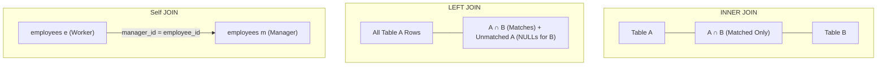

# Chapter 11 — Relational Operations: SQL JOINs (रिलेशनल ऑपरेशन्स: SQL JOINs)

---

## 1. What is it? (यह क्या है?)

Ek normalized relational database mein data redundancy (duplicate data) ko hatane aur data integrity maintain karne ke liye alag-alag business facts ko alag-alag specialized tables mein store kiya jata hai. Lekin real world mein humein ek sath poora data dekhna hota hai—jaise customer ka naam aur uske orders ek sath! Ek **`JOIN`** wahi relational operation hai jo query run hone ke samay in alag-alag tables ko unke common columns (aamtaur par child table ki Foreign Key aur parent table ki Primary Key) ke base par aapas mein combine karta hai.

SQL mein alag-alag types ke JOINs hote hain, jo yeh decide karte hain ki unmatched data ke sath kya karna hai:
1. **`INNER JOIN`**: Dono tables ka intersection return karta hai—yaani sirf wahi rows aati hain jinka match **dono** tables mein maujood hota hai.
2. **`LEFT JOIN` (या `LEFT OUTER JOIN`)**: Left table ki **saari** rows return karta hai, aur right table se sirf match hone wali rows laata hai. Agar right table mein match nahi milta, toh right side ke columns mein `NULL` fill ho jata hai.
3. **`RIGHT JOIN` (या `RIGHT OUTER JOIN`)**: Right table ki **saari** rows return karta hai, aur left table se match hone wali rows laata (`LEFT JOIN` ka mirror opposite).
4. **`FULL OUTER JOIN`**: Dono tables ki saari rows laata hai, aur jahan bhi match nahi milta wahan `NULL` bhar deta hai. (MySQL mein native `FULL OUTER JOIN` keyword nahi hota; ise `LEFT JOIN` aur `RIGHT JOIN` ko `UNION` se jodkar emulate kiya jata hai).
5. **`CROSS JOIN`**: Do tables ka **Cartesian Product** calculate karta hai—yaani Table A ki har ek row ko Table B ki har ek row ke sath pair karta hai ($N \times M$ rows).
6. **`Self JOIN`**: Ek table ko usi ke sath join karta hai alag-alag aliases use karke. Yeh hierarchical ya recursive data (jaise employee aur uska manager) ke liye use hota hai.

---

## 2. Visual Representation & Relational Venn Diagrams (विजुअल डायग्राम और वेन डायग्राम)



---

## 3. Syntax (सिंटैक्स)

```sql
-- 1. INNER JOIN
SELECT t1.col, t2.col
FROM table1 t1
INNER JOIN table2 t2 ON t1.id = t2.t1_id;

-- 2. LEFT JOIN
SELECT t1.col, t2.col
FROM table1 t1
LEFT JOIN table2 t2 ON t1.id = t2.t1_id;

-- 3. RIGHT JOIN
SELECT t1.col, t2.col
FROM table1 t1
RIGHT JOIN table2 t2 ON t1.id = t2.t1_id;

-- 4. FULL OUTER JOIN Emulation in MySQL
SELECT t1.col, t2.col
FROM table1 t1
LEFT JOIN table2 t2 ON t1.id = t2.t1_id
UNION
SELECT t1.col, t2.col
FROM table1 t1
RIGHT JOIN table2 t2 ON t1.id = t2.t1_id;

-- 5. Self JOIN
SELECT e.first_name AS employee, m.first_name AS manager
FROM employees e
LEFT JOIN employees m ON e.manager_id = m.employee_id;

-- 6. ANTI-JOIN (Find rows in A that have NO match in B)
SELECT t1.id, t1.name
FROM table1 t1
LEFT JOIN table2 t2 ON t1.id = t2.t1_id
WHERE t2.t1_id IS NULL;
```

---

## 4. Basic Example (बुनियादी उदाहरण)

Customers aur orders tables par `INNER JOIN`, `LEFT JOIN`, aur Anti-Join ka pradarshan:

```sql
USE sql_mastery;

-- INNER JOIN: Only customers who have placed at least one order
SELECT c.customer_id, c.first_name, c.last_name, o.order_id, o.total_amount
FROM customers c
INNER JOIN orders o ON c.customer_id = o.customer_id;

-- LEFT JOIN: ALL customers, showing order details or NULL if they have never ordered
SELECT c.customer_id, c.first_name, c.last_name, o.order_id, o.total_amount
FROM customers c
LEFT JOIN orders o ON c.customer_id = o.customer_id;

-- ANTI-JOIN: Find customers who have NEVER placed an order
SELECT c.customer_id, c.first_name, c.last_name, c.email
FROM customers c
LEFT JOIN orders o ON c.customer_id = o.customer_id
WHERE o.order_id IS NULL;
```

---

## 5. Real-World Example (वास्तविक दुनिया का उदाहरण)

Enterprise commerce analytics team ko 5 tables ko jodkar ek relational invoice breakdown report tayyar karni hai:
1. Sirf unhi `orders` ko shamil karein jinka status `'Delivered'` ho.
2. Customer ka full name aur unka city display karein.
3. Har line item (`order_items`), product ka title, aur uski category ka naam fetch karein.
4. Line-item ka gross aur net cost calculate karein.
5. Har product ke supplier ka naam display karein.

```sql
USE sql_mastery;

SELECT 
    o.order_id,
    o.order_date,
    CONCAT(c.first_name, ' ', c.last_name) AS customer_name,
    c.city AS customer_city,
    cat.category_name,
    p.product_name,
    oi.quantity,
    oi.unit_price,
    oi.discount,
    ROUND(oi.quantity * oi.unit_price * (1.00 - oi.discount), 2) AS line_total,
    sup.supplier_name
FROM orders o
INNER JOIN customers c ON o.customer_id = c.customer_id
INNER JOIN order_items oi ON o.order_id = oi.order_id
INNER JOIN products p ON oi.product_id = p.product_id
INNER JOIN categories cat ON p.category_id = cat.category_id
INNER JOIN suppliers sup ON p.supplier_id = sup.supplier_id
WHERE o.status = 'Delivered'
ORDER BY o.order_id ASC, line_total DESC;
```

---

## 6. Step-by-Step Explanation (कदम-दर-कदम व्याख्या)

Aaiye dekhte hain ki MySQL is 5-table join pipeline ko internally kaise execute karta hai:

1. **Join Order Determination (Optimizer)**:
   * MySQL query optimizer table cardinality, indexes, aur filter predicates ko inspect karke sabse cost-effective join order tay karta hai.
   * Kyunki `orders` par `status = 'Delivered'` ka filter hai, optimizer aksar `orders` ko driving table (starting point) chunta hai.
2. **First Join (`orders` $\bowtie$ `customers`)**:
   * Har delivered order ke liye MySQL `customers.customer_id` par Primary Key B+ Tree index seek karta hai aur matching customer dhoondhta hai.
3. **Second Join (`orders` $\bowtie$ `order_items`)**:
   * Order ID milne ke baad engine `order_items.order_id` ke foreign key index ka use karke matching line items nikalta hai.
4. **Third & Fourth Joins (`order_items` $\bowtie$ `products` $\bowtie$ `categories`)**:
   * Har line item se `product_id` lekar `products` table mein product lookup karta hai, aur phir wahan se `category_id` lekar `categories` table se category fetch karta hai.
5. **Projection & Calculation**:
   * 5 tables ke matching combinations par `ROUND(oi.quantity * oi.unit_price * (1.00 - oi.discount), 2)` se `line_total` calculate hota hai.
   * Jo rows kisi bhi table mein match nahi karti, unhe discard kar diya jata hai kyunki `INNER JOIN` mein sabhi tables mein match hona zaroori hai.

---

## 7. Expected Result (अपेक्षित परिणाम)

5-table analytical invoice join ka partial output:

```
+----------+------------+---------------+---------------+-----------------+-------------------------------+----------+------------+----------+------------+-----------------------+
| order_id | order_date | customer_name | customer_city | category_name   | product_name                  | quantity | unit_price | discount | line_total | supplier_name         |
+----------+------------+---------------+---------------+-----------------+-------------------------------+----------+------------+----------+------------+-----------------------+
|     1001 | 2023-08-01 | Emily Watson  | San Francisco | Electronics     | Quantum Pro 15 Laptop         |        1 |    1299.99 |     0.00 |    1299.99 | Apex Tech Supply      |
|     1001 | 2023-08-01 | Emily Watson  | San Francisco | Electronics     | TrueSound ANC Headphones      |        1 |     249.50 |     0.00 |     249.50 | Nippon Component Corp |
|     1002 | 2023-08-03 | Sophia Garcia | Miami         | Electronics     | UltraVision 4K 27in Monitor   |        1 |     389.00 |     0.00 |     389.00 | Shenzhen Precision Ltd|
|     1003 | 2023-08-10 | Michael Brown | Austin        | Electronics     | TrueSound ANC Headphones      |        1 |     249.50 |     0.00 |     249.50 | Nippon Component Corp |
|     1004 | 2023-08-15 | Aisha Khan    | Bengaluru     | Electronics     | Quantum Pro 15 Laptop         |        1 |    1299.99 |     0.05 |    1234.99 | Apex Tech Supply      |
|     1004 | 2023-08-15 | Aisha Khan    | Bengaluru     | Books & Media   | Mastering Database Design Book|        3 |      49.99 |     0.10 |     134.97 | Apex Tech Supply      |
+----------+------------+---------------+---------------+-----------------+-------------------------------+----------+------------+----------+------------+-----------------------+
```

---

## 8. Common Mistakes (आम गलतियाँ)

1. **Accidental Cartesian Product (`CROSS JOIN`): Missing Join Condition (`ON` क्लॉज भूल जाना)**:
   * *The Nightmare Query*:
     ```sql
     SELECT * FROM customers, orders; -- OMITTED ON CLAUSE!
     ```
   * *Consequence*: Agar `customers` mein 10,000 rows hain aur `orders` mein 100,000 rows hain, toh yeh query $10,000 \times 100,000 = 1,000,000,000$ (1 Arab) rows generate karne ki koshish karegi! Database server ki memory khatam ho jayegi, CPU 100% par lock ho jayega, aur server crash ho jayega. Hamesha modern explicit `JOIN ... ON ...` syntax ka hi upyog karein.
2. **Accidentally Converting a `LEFT JOIN` into an `INNER JOIN` via `WHERE` (`WHERE` से `LEFT JOIN` का खराब होना)**:
   * *The Bug*:
     ```sql
     SELECT c.customer_id, o.order_id, o.status
     FROM customers c
     LEFT JOIN orders o ON c.customer_id = o.customer_id
     WHERE o.status = 'Delivered'; -- TURNS LEFT JOIN INTO INNER JOIN!
     ```
   * *Why? (ऐसा क्यों हुआ?)*: Jin customers ne kabhi order nahi kiya, unke liye right-side ka column `o.status` `NULL` hota hai. Ab jab `WHERE` condition `NULL = 'Delivered'` check karegi, toh result `UNKNOWN` aayega aur `WHERE` un sabhi customers ko bahar fek dega! Aapka poora `LEFT JOIN` bekaar hokar `INNER JOIN` ban jayega.
   * *Correction*: Filter condition ko `WHERE` ke bajaye `ON` clause ke andar move karein:
     ```sql
     SELECT c.customer_id, o.order_id, o.status
     FROM customers c
     LEFT JOIN orders o ON c.customer_id = o.customer_id AND o.status = 'Delivered';
     ```
3. **Ambiguous Column Name Errors (कॉलम नाम में एंबिग्युइटी)**:
   * Agar dono tables mein ek hi naam ka column ho (jaise `created_at` ya `status`), aur aap bina table prefix ke seedhe `status` select karenge, toh MySQL error dega:
     `ERROR 1052 (23000): Column 'status' in field list is ambiguous`. Hamesha table alias ke sath prefix lagayein (`o.status` ya `c.status`).

---

## 9. Best Practices (सर्वोत्तम प्रथाएं / Best Practices)

1. **Always Use Table Aliases (टेबल एलियास का इस्तेमाल करें)**:
   * Hamesha chote aur meaningful aliases assign karein (`FROM customers c JOIN orders o ON c.customer_id = o.customer_id`). Isse query choti, clean, aur readable rehti hai.
2. **Ensure Foreign Key Columns Are Indexed (जॉइन कॉलम्स पर इंडेक्स रखें)**:
   * MySQL foreign keys par automatically index banata hai, lekin hamesha ensure karein ki `ON` clause mein use hone wale columns indexed hon. Bina index ke do tables ko join karne par database ko nested loop full table scan karna padta hai ($O(N \times M)$ complexity), jo database ko slow kar deta hai.
3. **Prefer `INNER JOIN` Over `LEFT JOIN` When Outer Rows Are Unneeded (ज़रूरत न हो तो `INNER JOIN` चुनें)**:
   * `INNER JOIN` mein query optimizer ko poori aazadi hoti hai ki woh tables ka join order badal sake (jaise sabse choti table pehle process karna). Lekin `LEFT JOIN` mein optimizer majboor hota hai ki woh pehle left table ko hi poora read kare.
4. **Use ANSI Explicit Join Syntax (मानक ANSI सिंटैक्स इस्तेमाल करें)**:
   * Puraane comma-separated joins (`FROM tableA, tableB WHERE tableA.id = tableB.id`) kabhi na likhein. Isme join condition bhoolna bahut aasaan hota hai aur filtering logic join logic mein mix hokar bugs create karti hai.

---

## 10. Practice Questions (अभ्यास प्रश्न)

### Easy (सरल)
1. Ek `INNER JOIN` query likhein jo har employee ka `employee_id`, `first_name`, `last_name`, aur unke department ka `department_name` display kare.
2. Sabhi `departments` ko display karne ke liye query likhein, jisme jin departments mein employees hain unki details dikhein, aur jinme koi employee nahi hai wahan `NULL` dikhe.
3. `products` aur `suppliers` tables ko join karke product name aur uske supplier ka naam show karne wali query likhein.

### Medium (मध्यम)
4. `employees` table par ek `Self JOIN` query likhein jo employee ka full name aur uske manager ka full name ek sath show kare. Agar kisi employee ka koi manager nahi hai, toh `'No Manager'` display karein.
5. Ek Anti-Join query likhein jo aise sabhi departments ko dhoondhe jinme filhal ek bhi employee assigned nahi hai.
6. `customers`, `orders`, aur `payments` tables ko aapas mein join karke customer name, order ID, payment amount, aur payment method display karein sirf completed payments ke liye.

### Difficult (कठिन)
7. `departments` aur `employees` ke beech ek `FULL OUTER JOIN` emulate karne wali query likhein jo sabhi departments (bina employee wale bhi) aur sabhi employees (bina department wale bhi) ko return kare.
8. Ek query likhein jo har ek `category_name` se generate hua total revenue calculate kare. Isme aisi categories bhi shamil hon jinki koi sale nahi hui (unka revenue `$0.00` dikhayein), aur result ko highest revenue se lowest revenue order mein sort karein.

---

## 11. Interview Questions (साक्षात्कार प्रश्न)

### Q1: What is the operational difference between an `INNER JOIN` and a `LEFT JOIN`?
**Answer**: `INNER JOIN` sirf unhi records ko return karta hai jahan join condition **dono** tables mein `TRUE` evaluate hoti hai. Agar kisi row ka match dusri table mein nahi milta, toh use discard kar diya jata hai.
Iske viprit, `LEFT JOIN` (ya `LEFT OUTER JOIN`) left table ki **saari** rows ko preserve karta hai, chahe right table mein match ho ya na ho. Jin rows ke liye right table mein matching data nahi hota, database engine right table ke sabhi columns ke liye `NULL` values populate kar deta hai.

### Q2: Why does adding a `WHERE` condition on a right-table column turn a `LEFT JOIN` into an `INNER JOIN`, and how do you fix it?
**Answer**: `LEFT JOIN` mein jin rows ka right table mein match nahi hota, unke right-side columns `NULL` hote hain. Agar aap `WHERE` clause mein right table ke kisi column par filter laga dete hain (jaise `WHERE right_table.status = 'Active'`), toh unmatched rows ke liye condition `NULL = 'Active'` evaluate hokar `UNKNOWN` ban jaati hai. Chunki `WHERE` clause sirf `TRUE` rows ko aage badhne deta hai, isliye unmatched left rows silently drop ho jaati hain aur aapka `LEFT JOIN` behave karne lagta hai `INNER JOIN` ki tarah.
Ise fix karne ke liye filter condition ko `WHERE` ke bajaye `ON` clause ke andar shift karein (`LEFT JOIN right_table ON ... AND right_table.status = 'Active'`). Isse unmatched left rows preserve rehti hain aur unke right side par `NULL` aata hai.

### Q3: How does a Self JOIN work, and why are table aliases mandatory when executing one?
**Answer**: Self JOIN ek aisi technique hai jisme ek table ko usi ke sath join kiya jata hai. Iska upyog tab hota hai jab ek hi table ke andar hierarchical ya recursive relationship hoti hai (jaise `employees` table mein har row ka `manager_id` foreign key usi table ke kisi dusre employee ki `employee_id` primary key ko point karta hai).
Table aliases isme mandatory hote hain kyunki database engine ko memory ke andar usi single physical table ke do alag-alag logical instances banane padte hain (jaise `employees e` worker ke liye aur `employees m` manager ke liye). Bina distinct aliases ke parser yeh identify nahi kar payega ki aap kiske column ki baat kar rahe hain aur `ambiguous column` error de dega.

---

## 12. Quick Revision (त्वरित सारांश)

* **`INNER JOIN`**: Dono tables ka matching intersection return karta hai.
* **`LEFT JOIN`**: Left table ki saari rows deta hai; right table se missing values ke liye `NULL` populate karta hai.
* **Anti-Join**: `LEFT JOIN ... WHERE right_table.id IS NULL` pattern ka use karke aise records dhundhe jate hain jinka koi matching child ya parent record nahi hota.
* **Self JOIN**: Do distinct aliases ka use karke table ko khud se hi join karta hai (hierarchies ke liye).
* MySQL mein **`FULL OUTER JOIN`** natively nahi hota, ise `LEFT JOIN` aur `RIGHT JOIN` ke sath **`UNION`** use karke emulate kiya jata hai.
* Cartesian product (`CROSS JOIN`) ke disaster se bachne ke liye kabhi bhi `ON` clause likhna na bhoolein.
