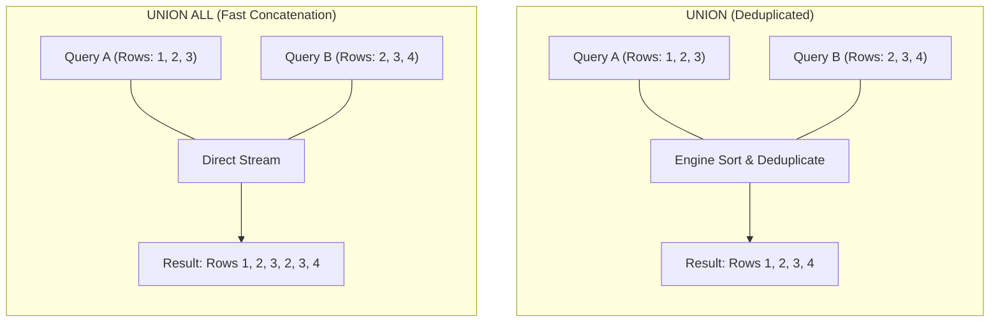

# Chapter 12 — Set Operations: UNION & UNION ALL (सेट ऑपरेशन्स: UNION और UNION ALL)

---

## 1. What is it? (यह क्या है?)

Relational algebra mein set operators do ya do se zyada independent `SELECT` queries ke results ko combine karke ek single unified result set banate hain. Jahan ek taraf `JOIN` tables ko **horizontally** jodta hai (ek table ke columns ke aage dusri table ke columns jodna), wahi dusri taraf **Set Operation** queries ko **vertically** jodta hai (ek query ki rows ke niche dusri query ki rows ko stack karna).

SQL mein do sabse mukhya set combination operators hote hain:
1. **`UNION`**: Do ya zyada queries ke output ko aapas mein combine karta hai aur automatically unme se **duplicates hata deta hai (deduplication)**. Agar dono queries mein identical rows aati hain, toh result mein woh sirf ek hi baar aayegi.
2. **`UNION ALL`**: Do ya zyada queries ke output ko bina deduplication ke seedhe combine karta hai. Sabhi rows preserve rehti hain, chahe duplicate hi kyun na hon.

Kyunki `UNION` ko duplicate rows dhoondhne aur hatane ke liye memory ke andar poore dataset ko sort karna padta hai ya temporary hash table banani padti hai, isme kaafi computational overhead aur time lagta hai. Iske viprit, `UNION ALL` bina kisi checking ke rows ko stream kar deta hai, isliye yeh exponentially faster hota hai!

---

## 2. Strict Schema Compatibility Rules (स्कीमा कम्पैटिबिलिटी के सख्त नियम)

Queries ko `UNION` ya `UNION ALL` se jodne ke liye unhe teen relational compatibility rules follow karne padte hain:
1. **Identical Column Count (कॉलम की संख्या बराबर हो)**: Compound query ke har ek `SELECT` statement mein projected columns ki sankhya bilkul barabar honi chahiye.
2. **Compatible Data Types (डेटा टाइप्स कम्पैटिबल हों)**: Corresponding columns (Query 1 ka pehla column aur Query 2 ka pehla column, doosra aur doosra) ke data types compatible ya implicitly convertible hone chahiye. Jaise `VARCHAR` column ko seedhe `DATE` column ke sath match nahi kiya ja sakta jab tak explicit `CAST` na kiya jaye.
3. **Column Naming Precedence (कॉलम नामों का निर्धारण)**: Final output ke column names, data types aur aliases chain ki **pehli** `SELECT` query se tay hote hain.



---

## 3. Syntax (सिंटैक्स)

```sql
-- Standard UNION (Implicit Deduplication)
SELECT column1, column2, ...
FROM table1
WHERE condition1

UNION

SELECT column1, column2, ...
FROM table2
WHERE condition2;

-- High-Performance UNION ALL (Preserves Duplicates)
SELECT column1, column2, ...
FROM table1

UNION ALL

SELECT column1, column2, ...
FROM table2;

-- Global Ordering and Pagination of a Compound Query
(SELECT id, name, created_at FROM table1)
UNION ALL
(SELECT id, name, created_at FROM table2)
ORDER BY created_at DESC
LIMIT 20;
```

---

## 4. Basic Example (बुनियादी उदाहरण)

Geographic locations par `UNION` aur `UNION ALL` ka farq:

```sql
USE sql_mastery;

-- UNION: Distinct list of cities where we have either customers OR suppliers
SELECT city, country, 'Customer Base' AS entity_source
FROM customers
WHERE country = 'USA'

UNION

SELECT city, country, 'Supplier Base' AS entity_source
FROM suppliers
WHERE country = 'USA';

-- Compare without the entity_source column:
-- UNION removes duplicate cities (e.g. Seattle)
SELECT city, country FROM customers WHERE country = 'USA'
UNION
SELECT city, country FROM suppliers WHERE country = 'USA';

-- UNION ALL preserves both occurrences of duplicate cities
SELECT city, country FROM customers WHERE country = 'USA'
UNION ALL
SELECT city, country FROM suppliers WHERE country = 'USA';
```

---

## 5. Real-World Example (वास्तविक दुनिया का उदाहरण)

Enterprise security aur audit office ko ek aggregated **Corporate Directory & Activity Feed** chahiye jo teen alag-alag sources ko merge kare:
1. Internal employees (`employees` table) jinka contact details, department, aur `'Internal Staff'` role ho.
2. External supplier contacts (`suppliers` table) jinka contact details, company name, aur `'External Vendor'` role ho.
3. Customer contacts (`customers` table) jinka city, country, aur `'Registered Customer'` role ho.
4. Final unified directory ko contact name ke alphabetical order mein sort karna hai.

```sql
USE sql_mastery;

(
    SELECT 
        CONCAT(first_name, ' ', last_name) AS full_name,
        email AS contact_email,
        phone AS contact_phone,
        'Internal Staff' AS entity_type,
        d.department_name AS affiliation
    FROM employees e
    LEFT JOIN departments d ON e.department_id = d.department_id
)
UNION ALL
(
    SELECT 
        contact_name AS full_name,
        contact_email AS contact_email,
        contact_phone AS contact_phone,
        'External Vendor' AS entity_type,
        supplier_name AS affiliation
    FROM suppliers
)
UNION ALL
(
    SELECT 
        CONCAT(first_name, ' ', last_name) AS full_name,
        email AS contact_email,
        phone AS contact_phone,
        'Registered Customer' AS entity_type,
        CONCAT(city, ', ', country) AS affiliation
    FROM customers
)
ORDER BY full_name ASC;
```

---

## 6. Step-by-Step Explanation (कदम-दर-कदम व्याख्या)

1. **First Query (`employees`)**:
   * Employee ka full name, email, phone nikalta hai aur `departments` ko join karke unka department assign karta hai.
   * Final result set ke schema ka blueprint tay karta hai: `full_name`, `contact_email`, `contact_phone`, `entity_type`, `affiliation`.
2. **Second Query (`suppliers`)**:
   * Supplier contacts ke data ko theek usi 5-column structure ke hisab se map karta hai. `supplier_name` ko `affiliation` column ki position par rakha gaya hai.
3. **Third Query (`customers`)**:
   * Customers ke contact details ko bhi usi 5-column layout mein match karwaya gaya hai.
4. **`UNION ALL` Processing**:
   * Database engine bina kisi deduplication sort ke seedhe teeno queries ki rows ko memory buffer mein ek ke niche ek append karta hai.
5. **Global `ORDER BY full_name ASC`**:
   * Teeno alag-alag tables se aayi hui merged rows ko ek sath alphabetically `full_name` ke hisab se sort kar diya jata hai.

---

## 7. Expected Result (अपेक्षित परिणाम)

Unified Corporate Directory ka partial output:

```
+-------------------+----------------------------+---------------+---------------------+------------------------+
| full_name         | contact_email              | contact_phone | entity_type         | affiliation            |
+-------------------+----------------------------+---------------+---------------------+------------------------+
| Aisha Khan        | aisha.khan@domain.in       | 555-0305      | Registered Customer | Bengaluru, India       |
| Alex Morgan       | alex.morgan@company.com    | 555-0100      | Internal Staff      | Engineering            |
| Astrid Lind       | lind@nordictm.se           | 555-0205      | External Vendor     | Nordic Timber & Metal  |
| Carlos Mendoza    | carlos.mendoza@company.com | 555-0108      | Internal Staff      | Supply Chain           |
| Chloe Dubois      | chloe.dubois@orange.fr     | 555-0309      | Registered Customer | Lyon, France           |
| David Kim         | david.kim@company.com      | 555-0104      | Internal Staff      | Data & Analytics       |
| Elena Rostova     | elena.rostova@company.com  | 555-0105      | Internal Staff      | Sales & Marketing      |
| Emily Watson      | emily.watson@gmail.com     | 555-0301      | Registered Customer | San Francisco, USA     |
| Greta Weber       | weber@eurosmart.de         | 555-0203      | External Vendor     | EuroSmart Manufacturing|
+-------------------+----------------------------+---------------+---------------------+------------------------+
```

---

## 8. Common Mistakes (आम गलतियाँ)

1. **Column Count Mismatch (कॉलम की संख्या में अंतर)**:
   * *Mistake*:
     ```sql
     SELECT employee_id, first_name, email FROM employees
     UNION
     SELECT customer_id, first_name FROM customers; -- ONLY 2 COLUMNS!
     ```
   * *Error*:
     `ERROR 1222 (21000): The used SELECT statements have a different number of columns.`
   * *Rule*: Subhi participating queries mein select kiye gaye columns ki sankhya exact same honi chahiye.
2. **Defaulting to `UNION` Instead of `UNION ALL` (बिना ज़रूरत `UNION` का इस्तेमाल)**:
   * *Mistake*: Jab aapko pehle se pata hai ki dono datasets mein duplicate ho hi nahi sakte (jaise `customers` aur `suppliers`), tab bhi aadat ke mutabik `UNION` likhna.
   * *Consequence*: Engine bewajah temporary table banata hai aur in-memory sort karta hai aise duplicates dhoondhne ke liye jo kabhi exist hi nahi karte! Isse query slow ho jati hai.
3. **Placing `ORDER BY` Inside Individual Queries Without Parentheses (`ORDER BY` में ब्रैकेट न लगाना)**:
   * Aise likhna:
     ```sql
     SELECT name FROM tableA ORDER BY name
     UNION
     SELECT name FROM tableB;
     ```
     Syntax error create karta hai. Agar aapko combine karne se pehle individual branch ko sort ya limit karna hai, toh har ek query ko alag parentheses mein wrap karna mandatory hai:
     ```sql
     (SELECT name FROM tableA ORDER BY name LIMIT 5)
     UNION ALL
     (SELECT name FROM tableB ORDER BY name LIMIT 5);
     ```
4. **Expecting Column Names from Later Queries to Matter (दूसरे क्वेरी के एलियास की उम्मीद रखना)**:
   * Agar Query 1 mein column ka naam `account_id` hai aur Query 2 mein wahi column `customer_number` ke naam se aliased hai, toh final output mein column ka naam `account_id` hi hoga. Hamesha pehli `SELECT` query ke column aliases par dhyan dein.

---

## 9. Best Practices (सर्वोत्तम प्रथाएं / Best Practices)

1. **Default to `UNION ALL` Unless Deduplication Is Explicitly Required (डिफ़ॉल्ट रूप से `UNION ALL` इस्तेमाल करें)**:
   * Production queries mein hamesha pehle `UNION ALL` choose karein. `UNION` ka use sirf tabhi karein jab business logic duplicate rows ko hatane ki explicit requirement maange.
2. **Always Align Column Data Types Positively (डेटा टाइप्स को स्पष्ट रूप से मैच करें)**:
   * Implicit conversion par bharosa karne se bachein (jaise integer ko string ke sath match karna). Hamesha explicit `CAST()` ka use karein taaki conversion safe aur clear ho:
     ```sql
     SELECT CAST(employee_id AS CHAR(20)) FROM employees
     UNION ALL
     SELECT reference_code FROM external_partners;
     ```
3. **Use Static Literal Tags to Identify Row Provenance (डेटा का स्रोत पहचानने के लिए टैग लगाएं)**:
   * Jab alag-alag tables ka data merge karein, toh query mein constant string literal (jaise `'Order'`, `'Refund'`, `'Adjustment'`) zaroor add karein taaki application code ko pata chal sake ki kaun si row kahan se aayi hai.

---

## 10. Practice Questions (अभ्यास प्रश्न)

### Easy (सरल)
1. `customers` table ke `city` column aur `departments` table ke `location` column ko `UNION` se jodein aur single list display karein.
2. `employees` aur `customers` dono tables ke sabhi email addresses ko `UNION ALL` ka use karke ek sath list karein.
3. Question 1 aur Question 2 ke answers ke row counts ke farq ko samjhayein.

### Medium (मध्यम)
4. Aise sabhi products jinka `unit_price > 500` hai aur aise products jinka `stock_quantity < 20` hai, unhe `UNION` se combine karein taaki dono conditions meet karne wale products sirf ek hi baar list hon.
5. Ek unified financial movements ledger banane ki query likhein:
   * `orders` jinka status `'Delivered'` ho unka positive order value (tag: `'REVENUE'`).
   * `orders` jinka `shipping_fee > 0` ho unka shipping cost (tag: `'EXPENSE'`).
   * Final result ko date descending order mein sort karein.
6. Active customers aur inactive customers ke names ko combine karein aur har row par unka respective status label project karein.

### Difficult (कठिन)
7. `departments` aur `employees` ke beech `LEFT JOIN`, `RIGHT JOIN`, aur `UNION` ka upyog karke `FULL OUTER JOIN` emulate karein. Verify karein ki bina employee wale departments aur bina department wale employees dono result mein maujood hon.
8. `UNION ALL` ka use karke top 2 highest-paid employees aur top 2 lowest-paid employees ko merge karein, aur final output ko overall salary descending order mein sort karein. (Hint: Branch queries ke liye individual parentheses aur `LIMIT` ka use karein).

---

## 11. Interview Questions (साक्षात्कार प्रश्न)

### Q1: What is the mechanical difference between `UNION` and `UNION ALL` in terms of execution mechanics and performance?
**Answer**:
* `UNION` do queries ke results ko concatenate karta hai aur phir unpar ek **implicit deduplication** step chalata hai. Iske liye database engine ko poori combined rows ko ek temporary table (memory ya disk) mein dalna padta hai, sabhi columns par sort operation chalana padta hai ya hash set construct karna padta hai, aur duplicate rows ko discard karna padta hai. Yeh kaafi CPU, memory aur disk I/O consume karta hai.
* `UNION ALL` ek pure vertical stacking perform karta hai. Engine Query 1 se aane wali rows ko seedhe client ya agle operator ko stream kar deta hai, aur uske turant baad Query 2 ki rows bhej deta hai—bina kisi sorting, hashing ya comparison ke. Isliye `UNION ALL` orders of magnitude faster hota hai aur jab rows already distinct hon ya duplicates allow karne hon, toh hamesha `UNION ALL` hi use karna chahiye.

### Q2: What are the three relational rules that two queries must satisfy to be combined using a Set Operator?
**Answer**:
1. **Identical Column Count (डिग्री)**: Dono `SELECT` statements mein exact barabar sankhya mein columns project hone chahiye.
2. **Type Compatibility (कम्पैटिबल डेटा टाइप्स)**: Dono queries ke corresponding position wale columns ke data types same ya engine dwara easily convertible hone chahiye (jaise INT aur FLOAT aapas mein convert ho sakte hain, lekin DATE aur binary BLOB nahi).
3. **Naming Authority (कॉलम नामों का अधिकार)**: Final output result set ke column names, aliases aur collations hamesha chain ki *pehli* `SELECT` query se decide hote hain.

### Q3: How can you apply an `ORDER BY` to an entire compound query versus applying an `ORDER BY` to an individual branch of a `UNION`?
**Answer**:
* **Poore compound result set par `ORDER BY`**: Query chain ke bilkul aakhiri mein bina parentheses ke single `ORDER BY` lagaya jata hai. Yeh overall combined data par sort execute karta hai.
* **Individual branches par `ORDER BY` (aur `LIMIT`)**: Har ek branch query ko apne alag parentheses ke andar wrap karna zaroori hota hai:
  ```sql
  (SELECT * FROM table1 ORDER BY score DESC LIMIT 5)
  UNION ALL
  (SELECT * FROM table2 ORDER BY score DESC LIMIT 5)
  ORDER BY score DESC;
  ```

---

## 12. Quick Revision (त्वरित सारांश)

* **`UNION`** queries ko vertically jodta hai aur duplicate rows ko discard karta hai (sorting ka overhead rehta hai).
* **`UNION ALL`** queries ko vertically jodta hai bina duplicates check kiye (maximum fast performance).
* Sabhi combine ki gayi queries mein **columns ki sankhya aur data types compatible** hone chahiye.
* Output ke column names aur aliases hamesha **pehli query** se tay hote hain.
* Agar individual branch mein `LIMIT` ya `ORDER BY` lagana ho, toh query ko parentheses `(...)` mein wrap karein.
