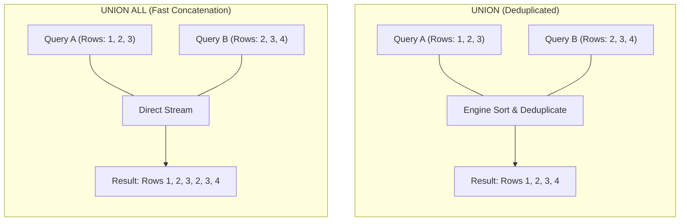

# Chapter 12 — Set Operations: UNION & UNION ALL (Set Operations: UNION aur UNION ALL)

---

## 1. What is it? (Ye Kya Hai?)

Relational algebra mein, set operators do ya do se zyada independent `SELECT` queries ke results ko ek single unified result set mein combine karte hain. Jahan ek taraf `JOIN` tables ko **horizontally** combine karta hai (ek table ke columns ke aage doosri table ke columns jodkar), wahin **Set Operation** queries ko **vertically** combine karta hai (ek query ki rows ke upar doosri query ki rows ko stack karke).

SQL do main set combination operators provide karta hai:
1. **`UNION`**: Do ya do se zyada queries ke output ko combine karta hai, aur automatically ek implicit deduplication phase perform karta hai. Multiple queries mein aane wali identical rows ko condense karke ek single unique row bana deta hai.
2. **`UNION ALL`**: Do ya do se zyada queries ke output ko **bina** kisi deduplication ke combine karta hai. Sabhi queries ki matching rows as it is preserve rehti hain, duplicate rows samet.

Kyunki `UNION` ko duplicate rows identify aur eliminate karne ke liye combined dataset ko memory mein sort karna padta hai ya temporary hash table banani padti hai, isliye isme significant computational overhead lagta hai. Iske opposite, `UNION ALL` simply har query ki rows ko sequentially stream kar deta hai, jisse ye kaafi zyada fast hota hai.

---

## 2. Why do we use it? (Hum Iska Use Kyun Karte Hain?)

1. **Aggregating Disparate Tables**: Alag-alag tables se similar business entities ko ek unified feed ya report mein merge karna—jaise internal employees aur external contractors ko ek single contact directory mein combine karna.
2. **Combining Partitioned Datasets**: Historic/archival tables aur active transactional tables ko single report ke liye bina schema change ke quickly combine karna.
3. **High-Speed Non-Overlapping Merges**: Jab hume pata hota hai ki dono datasets disjoint hain (unme koi duplicate row nahi ho sakti), toh `UNION ALL` use karke bina sorting overhead ke superfast vertical combination achieve karna.

### Strict Schema Compatibility Rules (Schema Compatibility Ke Niyam)

`UNION` ya `UNION ALL` use karne ke liye participating queries ko 3 strict relational rules satisfy karne padte hain:
1. **Identical Column Count**: Compound query ke har `SELECT` statement mein exact same number of columns project hone chahiye.
2. **Compatible Data Types**: Har query ke corresponding position wale columns (Column 1 to Column 1, Column 2 to Column 2) compatible ya implicitly convertible data types ke hone chahiye. For example, `VARCHAR` column ko bina explicit cast ke `DATE` column ke sath match nahi kiya ja sakta.
3. **Column Naming Precedence**: Final output ke column names, data types, aur aliases chain ki **pehli** `SELECT` query se decide hote hain.



---

## 3. Syntax

```sql
-- Standard UNION (Implicit Deduplication)
SELECT column1, column2, ...
FROM table1
WHERE condition1

UNION

SELECT column1, column2, ...
FROM table2
WHERE condition2;

-- High-Performance UNION ALL (Preserves Duplicates)
SELECT column1, column2, ...
FROM table1

UNION ALL

SELECT column1, column2, ...
FROM table2;

-- Global Ordering and Pagination of a Compound Query
(SELECT id, name, created_at FROM table1)
UNION ALL
(SELECT id, name, created_at FROM table2)
ORDER BY created_at DESC
LIMIT 20;
```

---

## 4. Basic Example

Geographic locations ke across `UNION` vs `UNION ALL` ka example:

```sql
USE sql_mastery;

-- UNION: Distinct list of cities where we have either customers OR suppliers
SELECT city, country, 'Customer Base' AS entity_source
FROM customers
WHERE country = 'USA'

UNION

SELECT city, country, 'Supplier Base' AS entity_source
FROM suppliers
WHERE country = 'USA';

-- Compare without the entity_source column:
-- UNION removes duplicate cities (e.g. Seattle)
SELECT city, country FROM customers WHERE country = 'USA'
UNION
SELECT city, country FROM suppliers WHERE country = 'USA';

-- UNION ALL preserves both occurrences of duplicate cities
SELECT city, country FROM customers WHERE country = 'USA'
UNION ALL
SELECT city, country FROM suppliers WHERE country = 'USA';
```

---

## 5. Real-World Example

Enterprise security aur audit office ko ek aggregated **Corporate Directory & Activity Feed** chahiye jo merge kare:
1. Internal employees (`employees` table) unke contact details, department, aur `'Staff'` role ke sath.
2. External supplier contacts (`suppliers` table) contact details, company name, aur `'Vendor'` role ke sath.
3. Customer contacts (`customers` table) city, country, aur `'Customer'` role ke sath.
4. Final unified directory ko contact name ke according alphabetically sort karna hai.

```sql
USE sql_mastery;

(
    SELECT 
        CONCAT(first_name, ' ', last_name) AS full_name,
        email AS contact_email,
        phone AS contact_phone,
        'Internal Staff' AS entity_type,
        d.department_name AS affiliation
    FROM employees e
    LEFT JOIN departments d ON e.department_id = d.department_id
)
UNION ALL
(
    SELECT 
        contact_name AS full_name,
        contact_email AS contact_email,
        contact_phone AS contact_phone,
        'External Vendor' AS entity_type,
        supplier_name AS affiliation
    FROM suppliers
)
UNION ALL
(
    SELECT 
        CONCAT(first_name, ' ', last_name) AS full_name,
        email AS contact_email,
        phone AS contact_phone,
        'Registered Customer' AS entity_type,
        CONCAT(city, ', ', country) AS affiliation
    FROM customers
)
ORDER BY full_name ASC;
```

---

## 6. Step-by-Step Explanation

1. **First Query (`employees`)**:
   * Full name, email, phone extract karta hai, aur `departments` ko join karke internal personnel label karta hai.
   * Final output column schema define karta hai: `full_name`, `contact_email`, `contact_phone`, `entity_type`, `affiliation`.
2. **Second Query (`suppliers`)**:
   * Supplier contact metadata ko exact usi 5-column positional structure par map karta hai. `supplier_name` ko `affiliation` column populate karne ke liye position kiya gaya hai.
3. **Third Query (`customers`)**:
   * Customer personal details ko exact same 5-column layout par map karta hai.
4. **`UNION ALL` Processing**:
   * Database engine in-memory deduplication sorting skip kar deta hai aur sabhi source tables ke tuples ko directly ek intermediate result set mein stream kar deta hai.
5. **Global `ORDER BY full_name ASC`**:
   * Teeno source tables ke combined result set ko `full_name` ke basis par alphabetically sort kiya jata hai.

---

## 7. Expected Result

Unified Corporate Directory query ka partial output:

```
+-------------------+----------------------------+---------------+---------------------+------------------------+
| full_name         | contact_email              | contact_phone | entity_type         | affiliation            |
+-------------------+----------------------------+---------------+---------------------+------------------------+
| Aisha Khan        | aisha.khan@domain.in       | 555-0305      | Registered Customer | Bengaluru, India       |
| Alex Morgan       | alex.morgan@company.com    | 555-0100      | Internal Staff      | Engineering            |
| Astrid Lind       | lind@nordictm.se           | 555-0205      | External Vendor     | Nordic Timber & Metal  |
| Carlos Mendoza    | carlos.mendoza@company.com | 555-0108      | Internal Staff      | Supply Chain           |
| Chloe Dubois      | chloe.dubois@orange.fr     | 555-0309      | Registered Customer | Lyon, France           |
| David Kim         | david.kim@company.com      | 555-0104      | Internal Staff      | Data & Analytics       |
| Elena Rostova     | elena.rostova@company.com  | 555-0105      | Internal Staff      | Sales & Marketing      |
| Emily Watson      | emily.watson@gmail.com     | 555-0301      | Registered Customer | San Francisco, USA     |
| Greta Weber       | weber@eurosmart.de         | 555-0203      | External Vendor     | EuroSmart Manufacturing|
+-------------------+----------------------------+---------------+---------------------+------------------------+
```

---

## 8. Common Mistakes

1. **Column Count Mismatch**:
   * *Mistake*:
     ```sql
     SELECT employee_id, first_name, email FROM employees
     UNION
     SELECT customer_id, first_name FROM customers; -- ONLY 2 COLUMNS!
     ```
   * *Error*:
     `ERROR 1222 (21000): The used SELECT statements have a different number of columns.`
   * *Rule*: Participating sabhi queries mein exact same number of columns project hone chahiye.
2. **Defaulting to `UNION` Instead of `UNION ALL`**:
   * *Mistake*: Aise case mein `UNION` likhna jahan aap pehle se jaante hain ki dono datasets overlap ho hi nahi sakte (jaise `customers` aur `suppliers` ko combine karna).
   * *Consequence*: Engine unnecessary duplicate rows check karne ke liye ek expensive temporary table banata hai aur in-memory sort karta hai, jisse query execution kaafi slow ho jata hai.
3. **Placing `ORDER BY` Inside Individual Queries Without Parentheses**:
   * Is tarah likhna:
     ```sql
     SELECT name FROM tableA ORDER BY name
     UNION
     SELECT name FROM tableB;
     ```
     Syntax error throw karta hai. Agar merge se pehle local ordering ya limits apply karni hain, toh har individual query ko parentheses mein enclose karna zaroori hai:
     ```sql
     (SELECT name FROM tableA ORDER BY name LIMIT 5)
     UNION ALL
     (SELECT name FROM tableB ORDER BY name LIMIT 5);
     ```
4. **Expecting Column Names from Later Queries to Matter**:
   * Agar Query 1 column ka alias `account_id` rakhti hai aur Query 2 usi position ke column ka alias `customer_number` rakhti hai, toh output column ka naam `account_id` hi rahega. Hamesha pehle `SELECT` statement ke column aliases verify karo.

---

## 9. Best Practices

1. **Default to `UNION ALL` Unless Deduplication Is Explicitly Required**:
   * By default hamesha `UNION ALL` use karo. `UNION` tabhi use karo jab duplicate rows aane ki possibility ho aur business requirement unhe remove karna mandate karti ho.
2. **Always Align Column Data Types Positively**:
   * Implicit type coercion par rely mat karo (jaise integer column ko string column ke sath merge karna). Types ko harmonize karne ke liye explicit `CAST()` functions use karo:
     ```sql
     SELECT CAST(employee_id AS CHAR(20)) FROM employees
     UNION ALL
     SELECT reference_code FROM external_partners;
     ```
3. **Use Static Literal Tags to Identify Row Provenance**:
   * Jab alag-alag tables ko combine karein, toh ek constant string literal (jaise `'Order'`, `'Refund'`, `'Adjustment'`) zaroor include karein taaki client code har row ka origin asaani se identify kar sake.

---

## 10. Practice Questions

### Easy
1. `customers` table ke `city` column aur `departments` table ke `location` column ko `UNION` use karke single list mein combine karne ke liye query likho.
2. `employees` aur `customers` dono tables ke sabhi email addresses ko list karne ke liye `UNION ALL` query likho.
3. Question 1 aur Question 2 ke answers mein row count ka jo farak aayega use explain karo.

### Medium
4. Ek aisi query likho jo `unit_price > 500` wale sabhi products aur `stock_quantity < 20` wale sabhi products ko combine kare, jisme `UNION` ka use ho taaki dono criteria satisfy karne wale products sirf ek hi baar list hon.
5. Financial movements ka unified ledger generate karne ke liye query likho:
   * `orders` table se positive order values jahan `status = 'Delivered'` ho (tagged as `'REVENUE'`)
   * `orders` table se shipping costs jahan `shipping_fee > 0` ho (tagged as `'EXPENSE'`)
   * Unified ledger ko date descending ke according order karo.
6. Active customers aur inactive customers ke names ko do alag partitions mein combine karne ki query likho, jahan har row unke respective status ke sath labeled ho.

### Difficult
7. `departments` aur `employees` ke beech `LEFT JOIN`, `RIGHT JOIN`, aur `UNION` use karke `FULL OUTER JOIN` emulate karne wali query likho. Verify karo ki bina employees wale departments aur bina department wale employees dono result mein shamil hon.
8. Aisi query construct karo jo top 2 highest-paid employees aur top 2 lowest-paid employees ko `UNION ALL` ke zariye merge kare, aur overall result salary descending ke hisab se sorted ho. (Hint: Parenthesized subqueries ke sath individual `LIMIT` clauses use karo).

---

## 11. Interview Questions

### Q1: What is the mechanical difference between `UNION` and `UNION ALL` in terms of execution mechanics and performance?
**Answer**:
* `UNION` do queries ke result sets ko concatenate karta hai aur phir ek **implicit deduplication** step perform karta hai. Aisa karne ke liye, database engine ko combined rows ko memory ya on-disk temporary table mein dump karna padta hai, sabhi projected columns par records ko sort karna padta hai (ya hash set build karna padta hai), aur duplicate rows ko eliminate karna padta hai. Isme heavy CPU, memory, aur disk I/O lagti hai.
* `UNION ALL` pure vertical concatenation perform karta hai. Engine Query 1 se aane wali rows ko directly client ya parent pipeline ko stream karta hai, jiske turant baad Query 2 ki rows stream hoti hain. Isme zero sorting, hashing, ya row comparisons hote hain. Is wajah se `UNION ALL` bohot zyada fast hota hai aur jab records distinct hote hain ya duplicates acceptable hote hain toh hamesha isi ko prefer karna chahiye.

### Q2: What are the three relational rules that two queries must satisfy to be combined using a Set Operator?
**Answer**:
1. **Identical Degree (Column Count)**: Dono `SELECT` queries mein exact same number of columns project hone chahiye.
2. **Type Compatibility**: Corresponding positions wale columns ke data types identical ya database engine dwara implicitly convertible hone chahiye (jaise integer aur float chal jayenge, lekin date aur binary blob nahi).
3. **Order of Evaluation**: Final output result set ke column names, aliases, aur character collations union chain ke *pehli* `SELECT` statement se decide hote hain.

### Q3: How can you apply an `ORDER BY` to an entire compound query versus applying an `ORDER BY` to an individual branch of a `UNION`?
**Answer**:
* Poore **compound result set** par `ORDER BY` lagane ke liye, aakhiri query ke bilkul end mein bina parentheses ke single `ORDER BY` clause likha jata hai. Ye poore combined output par evaluate hota hai.
* **Individual branches** par `ORDER BY` (aur usually sath mein `LIMIT`) lagane ke liye, har branch query ko uske apne parentheses mein wrap karna padta hai:
  ```sql
  (SELECT * FROM table1 ORDER BY score DESC LIMIT 5)
  UNION ALL
  (SELECT * FROM table2 ORDER BY score DESC LIMIT 5)
  ORDER BY score DESC;
  ```

---

## 12. Quick Revision

* **`UNION`** query results ko vertically stack karta hai aur duplicate rows eliminate karta hai (sorting overhead lagta hai).
* **`UNION ALL`** query results ko vertically stack karta hai bina duplicates hataye (maximum performance).
* Sabhi combined queries mein **same number of columns** aur compatible data types hone chahiye.
* Final result set ke column names aur aliases **pehli query** decide karti hai.
* Branch-level `LIMIT` ya `ORDER BY` use karte waqt individual queries ko parentheses mein wrap karein.
