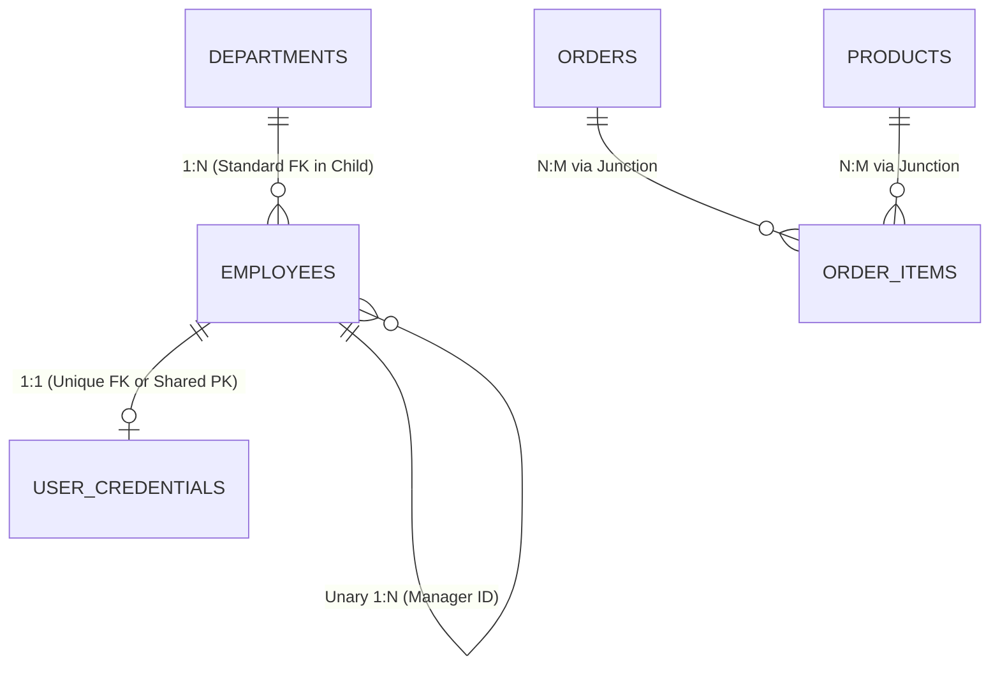

# Chapter 14 — Relational Architecture: Keys & Entity Relationships (Keys Aur Entity Relationships)

---

## 1. What is it? (Ye Kya Hai?)

Relational Database Management Systems (RDBMS) ke andar, **Keys** aur **Relationships** wo fundamental structural mechanisms hain jo alag-alag discrete tables ko aapas me jodkar ek coherent, reliable aur self-enforcing data web banate hain.

Bina relationships ke, aapka database bas isolated spreadsheets ka ek collection ban kar reh jayega, jisme data redundancy aur data inconsistency ka bohot bada risk bana rehta hai. Keys hume guarantee deti hain ki table ka har record uniquely identify ho sake aur multiple tables ke beech ka connection referentially solid rahe.

### 1.1. The Key Taxonomy (Keys Ka Taxonomy)
* **Super Key**: Kisi bhi table ke ek ya ek se zyada columns ka aisa set jinki values milkar table ki har ek row ko uniquely identify karne ki guarantee deti hain. Ek table me multiple super keys ho sakti hain.
* **Candidate Key**: Ek minimal Super Key—yaani aisa super key jisme se agar aap koi bhi ek column hata dein, toh uniqueness ki guarantee khatam ho jayegi (no proper subset can guarantee uniqueness). Ek table ke paas multiple Candidate Keys ho sakti hain.
* **Primary Key (PK)**: Database architect dwara select ki gayi wo single candidate key jo table ki rows ka official unique identifier banti hai. MySQL ke default **InnoDB** storage engine me, Primary Key physically **Clustered Index** define karti hai. Iska matlab ye hai ki table ka actual data disk par physically Primary Key ke order me hi store hota hai!
* **Alternate Key**: Wo saari candidate keys jinhe Primary Key ke roop me select *nahi* kiya gaya (inhe aamtaur par table me `UNIQUE NOT NULL` constraint ke sath implement kiya jata hai, jaise `email` ya `phone_number`).
* **Composite Key**: Jab do ya do se zyada columns ko combine karke ek single key banayi jaati hai (for example, `(order_id, product_id)`).
* **Surrogate Key vs Natural Key**:
  * **Natural Key**: Ek real-world business attribute jisme inherent uniqueness hoti hai (jaise Social Security Number, Aadhar Number, VIN, ISBN, email).
  * **Surrogate Key**: Ek artificial, system-generated identifier jiska koi business meaning nahi hota (jaise `INT AUTO_INCREMENT` ya `UUID`).
* **Foreign Key (FK)**: Ek **child table** ka aisa column (ya columns ka set) jo kisi **parent table** ki Primary Key ki values ko reference karta hai. Ye **referential integrity** enforce karta hai taaki database me koi orphan ya invalid records create na ho sakein.

---

## 2. Cardinality & Relational Patterns (Cardinality Aur Relational Patterns)

Ek table ke entity instances dusri table ke kitne entity instances ke sath relate kar sakte hain, is ratio ya count ko hum **cardinality** kehte hain:



1. **One-to-One (1:1)**:
   * *Rule*: Table A ki exactly ek row, Table B ki maximum ek row se relate karti hai.
   * *Implementation*: Table B ke andar Foreign Key banaiye aur us par ek `UNIQUE` constraint apply kar dijiye (ya dono tables me identical Primary Key share karwaiye).
   * *Example*: `employees` aur `employee_passports` — ek employee ka maximum ek passport record hoga aur ek passport record kisi ek hi employee ko belong karega.
2. **One-to-Many (1:N)**:
   * *Rule*: Table A ki ek row Table B ki multiple rows se relate ho sakti hai, lekin Table B ki har ek row Table A ki exactly ek hi row se judi hoti hai.
   * *Implementation*: Foreign Key ko hamesha "Many" (child) side wali table me place kiya jata hai.
   * *Example*: Ek `department` ke andar multiple `employees` kaam karte hain; ek `customer` multiple `orders` place kar sakta hai.
3. **Many-to-Many (N:M)**:
   * *Rule*: Table A ki multiple rows Table B ki multiple rows se relate kar sakti hain.
   * *Implementation*: Relational engines direct do tables ke beech N:M relationship implement nahi kar sakte. Iske liye hume ek third table introduce karni padti hai jise **Junction Table** (ya Associative / Bridge Table) kehte hain. Is table me dono parent tables ki primary keys foreign keys ban kar aati hain.
   * *Example*: `orders` aur `products` aapas me `order_items` junction table ke through connect hote hain.
4. **Self-Referencing (Unary)**:
   * *Rule*: Ek table khud apne aap ko hi reference karti hai.
   * *Implementation*: Table ke andar ek aisa foreign key column hota hai jo usi table ki primary key ko point karta hai.
   * *Example*: `employees.manager_id` jo usi table ke `employees.employee_id` ko reference karta hai.

---

## 3. Syntax (Syntax)

### Creating Relationships with Referential Actions
```sql
-- 1. One-to-One Table Creation (Unique Foreign Key)
CREATE TABLE employee_profiles (
    profile_id INT AUTO_INCREMENT PRIMARY KEY,
    employee_id INT NOT NULL UNIQUE,       -- UNIQUE enforces 1:1 cardinality
    emergency_contact VARCHAR(100) NOT NULL,
    home_address VARCHAR(255) NOT NULL,
    CONSTRAINT fk_profile_employee FOREIGN KEY (employee_id)
        REFERENCES employees(employee_id)
        ON DELETE CASCADE
        ON UPDATE CASCADE
);

-- 2. One-to-Many Relationship (Standard FK)
CREATE TABLE orders (
    order_id INT AUTO_INCREMENT PRIMARY KEY,
    customer_id INT NOT NULL,              -- 1:N: One customer has many orders
    order_date DATE NOT NULL,
    CONSTRAINT fk_orders_customer FOREIGN KEY (customer_id)
        REFERENCES customers(customer_id)
        ON DELETE RESTRICT
        ON UPDATE CASCADE
);

-- 3. Many-to-Many Junction Table
CREATE TABLE order_items (
    item_id INT AUTO_INCREMENT PRIMARY KEY,
    order_id INT NOT NULL,
    product_id INT NOT NULL,
    quantity INT NOT NULL,
    CONSTRAINT uq_order_product UNIQUE (order_id, product_id),
    CONSTRAINT fk_items_order FOREIGN KEY (order_id)
        REFERENCES orders(order_id)
        ON DELETE CASCADE
        ON UPDATE CASCADE,
    CONSTRAINT fk_items_product FOREIGN KEY (product_id)
        REFERENCES products(product_id)
        ON DELETE RESTRICT
        ON UPDATE CASCADE
);
```

### Managing Keys and Constraints via `ALTER TABLE`
```sql
-- Adding a Foreign Key to an existing table
ALTER TABLE child_table
ADD CONSTRAINT fk_name FOREIGN KEY (parent_id_column)
    REFERENCES parent_table(id_column)
    ON DELETE RESTRICT
    ON UPDATE CASCADE;

-- Dropping a Foreign Key constraint (Requires the specific constraint symbol name)
ALTER TABLE child_table
DROP FOREIGN KEY fk_name;

-- Dropping a Primary Key (Must remove AUTO_INCREMENT attribute first)
ALTER TABLE table_name
MODIFY COLUMN id INT NOT NULL;
ALTER TABLE table_name
DROP PRIMARY KEY;
```

---

## 4. Basic Example (Basic Example)

Parent aur child tables ke beech referential integrity enforcement ko samajhte hain:

```sql
USE sql_mastery;

CREATE TABLE authors (
    author_id INT AUTO_INCREMENT PRIMARY KEY,
    author_name VARCHAR(100) NOT NULL
);

CREATE TABLE books (
    book_id INT AUTO_INCREMENT PRIMARY KEY,
    title VARCHAR(150) NOT NULL,
    author_id INT NOT NULL,
    CONSTRAINT fk_books_author FOREIGN KEY (author_id)
        REFERENCES authors(author_id)
        ON DELETE CASCADE
);

INSERT INTO authors (author_name) VALUES ('Robert C. Martin'), ('Martin Fowler');
INSERT INTO books (title, author_id) VALUES ('Clean Code', 1), ('Refactoring', 2);

-- Deleting Author 1 automatically triggers CASCADE deletion of 'Clean Code' in books
DELETE FROM authors WHERE author_id = 1;

-- Verify books: 'Clean Code' has been deleted automatically
SELECT * FROM books;

-- Clean up
DROP TABLE books;
DROP TABLE authors;
```

---

## 5. Real-World Example (Real-World Example)

Chaliye hamare `sql_mastery` database ke andar `customers`, `orders`, aur `order_items` ko connect karne wale relational architecture ko dekhte hain:
1. `orders` aur `order_items` par foreign keys aur cascade rules ko verify karte hain.
2. Demonstrate karte hain ki kaise `ON DELETE RESTRICT` customer history ko accidental deletion se bachata hai.
3. Demonstrate karte hain ki kaise `ON DELETE CASCADE` ensure karta hai ki agar order cancel ho kar delete ho, toh child line items automatically clean up ho jayein.

```sql
USE sql_mastery;

-- Step 1: Attempt to delete Customer 1 (Emily Watson)
-- This customer has placed orders 1001 and 1006.
-- This command will fail because fk_orders_customer is configured with ON DELETE RESTRICT!
DELETE FROM customers WHERE customer_id = 1;

-- Step 2: Create a temporary test order to test ON DELETE CASCADE on order_items
INSERT INTO orders (order_id, customer_id, order_date, status, total_amount)
VALUES (9999, 1, CURDATE(), 'Cancelled', 100.00);

INSERT INTO order_items (item_id, order_id, product_id, quantity, unit_price, discount)
VALUES (8888, 9999, 9, 2, 49.99, 0.00);

-- Verify line item exists
SELECT * FROM order_items WHERE order_id = 9999;

-- Step 3: Delete the cancelled parent order 9999
-- Because fk_items_order has ON DELETE CASCADE, item 8888 is deleted automatically!
DELETE FROM orders WHERE order_id = 9999;

-- Verify line item was purged automatically
SELECT * FROM order_items WHERE order_id = 9999;
```

---

## 6. Step-by-Step Explanation (Step-by-Step Explanation)

1. `DELETE FROM customers WHERE customer_id = 1;`:
   * InnoDB storage engine ke paas customer `1` ko delete karne ki request aati hai.
   * Customer row ko chhoone se pehle, InnoDB un saare foreign key references ko check karta hai jo `customers(customer_id)` ki taraf point kar rahe hain.
   * Use `orders` table ke andar matching child rows milti hain jahan `customer_id = 1` hai.
   * Kyunki foreign key constraint me `ON DELETE RESTRICT` specify kiya gaya hai, InnoDB turant operation ko halt kar deta hai, rollback karta hai, aur error return karta hai:
     `ERROR 1451 (23000): Cannot delete or update a parent row: a foreign key constraint fails`.
2. `DELETE FROM orders WHERE order_id = 9999;`:
   * InnoDB order `9999` ko dhundhta hai.
   * Wo un foreign keys ko inspect karta hai jo `orders(order_id)` ko reference kar rahi hain.
   * Use `order_items` table me child row `8888` milti hai jahan constraint `ON DELETE CASCADE` configure kiya hua hai.
   * InnoDB ek internal cascade deletion perform karta hai, jisse order `9999` delete hone se pehle `order_items` se item `8888` automatically delete ho jati hai. Dono operations ek single atomic transaction me commit ho jaate hain.

---

## 7. Expected Result (Expected Result)

Deletion test ka terminal output:

```
mysql> DELETE FROM customers WHERE customer_id = 1;
ERROR 1451 (23000): Cannot delete or update a parent row: a foreign key constraint fails (`sql_mastery`.`orders`, CONSTRAINT `fk_orders_customer` FOREIGN KEY (`customer_id`) REFERENCES `customers` (`customer_id`) ON DELETE RESTRICT ON UPDATE CASCADE)

mysql> SELECT * FROM order_items WHERE order_id = 9999;
+---------+----------+------------+----------+------------+----------+---------------------+
| item_id | order_id | product_id | quantity | unit_price | discount | created_at          |
+---------+----------+------------+----------+------------+----------+---------------------+
|    8888 |     9999 |          9 |        2 |      49.99 |     0.00 | 2026-09-09 10:11:00 |
+---------+----------+------------+----------+------------+----------+---------------------+

mysql> DELETE FROM orders WHERE order_id = 9999;
Query OK, 1 row affected (0.01 sec)

mysql> SELECT * FROM order_items WHERE order_id = 9999;
Empty set (0.00 sec)
```

---

## 8. Common Mistakes (Common Mistakes)

1. **Using Natural Keys as Clustered Primary Keys**:
   * *Mistake*: InnoDB table me `email VARCHAR(100)` ya `uuid CHAR(36)` ko Primary Key bana dena.
   * *Performance Problem*: InnoDB me primary key physically clustered index tay karti hai. Random string keys (jaise UUID v4) inserts ke dauran **page splits**, random disk I/O aur heavy index fragmentation cause karti hain. Iske alawa, har secondary index apne leaf nodes me primary key ki copy store karta hai, yaani ek lamba primary key table ke *baaki sabhi indexes* ke size ko bohot bada bana deta hai.
   * *Rule*: Primary keys ke liye hamesha compact, monotonically increasing surrogate keys (`INT` ya `BIGINT AUTO_INCREMENT`) choose karein, aur natural uniqueness ko secondary `UNIQUE` constraints ke through enforce karein.
2. **Missing Indexes on Foreign Key Columns**:
   * Child tables ke andar foreign key columns par index hona bohot zaroori hai. Agar `child_table(parent_id)` par index nahi hoga, toh parent row ko delete ya update karte samay database engine ko match check karne ke liye poori child table ka full table scan karna padega, jisse severe locking bottlenecks aur performance drop hoga.
3. **Circular Foreign Key Deadlocks**:
   * Table A create karna jisme Table B ka foreign key ho, aur Table B me Table A ka foreign key ho. Is scenario me pehli row insert karna impossible ho jata hai kyunki dono me se koi bhi parent record pehle se exist nahi karta. (Agar circular references unavoidable hon, toh pehle `NULL` ke sath insert karein, ya temporarily checks disable karein: `SET FOREIGN_KEY_CHECKS = 0;`).

---

## 9. Best Practices (Best Practices)

1. **Always Choose Surrogate Keys for Relational Joins**:
   * Relational joins ke liye hamesha surrogate integer keys (`customer_id INT`) use karein. Real-world business attributes (jaise email ya username) user update ke waqt badal sakte hain; jabki surrogate keys kabhi change nahi hote, jisse millions of foreign keys me cascading updates ka risk khatam ho jata hai.
2. **Never Permit Orphaned Records**:
   * Relationships ko hamesha explicit database-level Foreign Keys se enforce karein, na ki sirf application code ke integrity checks par depend karein.
3. **Always Configure `ON UPDATE CASCADE`**:
   * Agar rare case me primary key value ko migrate ya re-sequence karna pade, toh `ON UPDATE CASCADE` ensure karta hai ki sabhi child tables me updated key automatically reflect ho jaye.
4. **Model Many-to-Many Relationships with Explicit Junction Tables**:
   * Junction tables me relationship history track karne ke liye auditing metadata columns (`created_at`, `assigned_by`) zaroor shamil karein.

---

## 10. Practice Questions (Practice Questions)

### Easy
1. Natural Key aur Surrogate Key ke beech ka difference explain kijiye.
2. `departments` aur `employees` ke relationship me Parent Table kaun si hai aur Child Table kaun si hai?
3. Agar aap ek aise employee ko insert karne ki koshish karein jiska `department_id = 999` ho, aur department 999 exist na karta ho, toh kya error aayega?

### Medium
4. Ek table `customer_passports` create karne ke liye DDL statement likhiye jo `customers` ke sath strict 1:1 relationship model kare, ensure karte hue ki har customer ka maximum ek hi passport ho sake.
5. `employees` table se `fk_emp_department` foreign key constraint ko drop karne ke liye SQL command likhiye.
6. Junction table `class_roster` ka use karte hue `students` aur `classes` ke beech many-to-many relationship schema design kijiye. Isme composite uniqueness include kijiye.

### Difficult
7. Explain kijiye ki InnoDB ka clustered index secondary index leaf records ko internally kaise store karta hai, aur 36-character UUID string primary key ke roop me 8-byte `BIGINT` se zyada RAM kyun waste karti hai?
8. Ek aisa `ALTER TABLE` sequence construct kijiye jo existing nullable foreign key relationship ko strict `NOT NULL` foreign key with `ON DELETE CASCADE` me convert kare, aur pehle ensure kare ki existing orphaned rows clean up ho chuki hon.

---

## 11. Interview Questions (Interview Questions)

### Q1: MySQL InnoDB me Clustered Index kya hota hai, aur ye Primary Key se kaise determine hota hai?
**Answer**: InnoDB storage engine me table ka data disk par physically ek B+ Tree index ke order me organize hota hai, jise **Clustered Index** kaha jata hai. Clustered index ke leaf pages me actual poori row ka data store hota hai. 

InnoDB table ki `PRIMARY KEY` ko automatically clustered index banata hai. Agar koi primary key declare nahi ki gayi hai, toh InnoDB pehle non-null `UNIQUE` index ko pick karta hai. Agar dono hi nahi hain, toh InnoDB background me ek hidden 6-byte row identifier (`DB_ROW_ID`) generate karke clustered index create karta hai. 

Saare secondary (non-clustered) indexes me rows ke physical disk pointers store nahi hote; balki unke leaf nodes me corresponding row ki `PRIMARY KEY` value store hoti hai. Secondary index search ke dauran pehle secondary index traverse hota hai aur phir full row fetch karne ke liye clustered index me "bookmark lookup" kiya jata hai.

### Q2: `ON DELETE CASCADE`, `ON DELETE SET NULL`, aur `ON DELETE RESTRICT` me kya farq hota hai?
**Answer**:
* `ON DELETE RESTRICT` (ya `NO ACTION`): Agar kisi parent row ko reference karne wali koi bhi child row exist karti hai, toh ye parent row ke deletion ko rok deta hai, turant error raise karta hai aur transaction ko rollback kar deta hai.
* `ON DELETE CASCADE`: Parent row delete hote hi usi transaction ke andar use reference karne wali saari child rows automatically aur recursively delete ho jaati hain.
* `ON DELETE SET NULL`: Parent row delete hone par referencing child rows ke foreign key column ko `NULL` set kar diya jata hai (iske liye child foreign key column ka nullable hona zaroori hai).

### Q3: Relational database me Many-to-Many (N:M) relationship ko kaise implement kiya jata hai?
**Answer**: Relational database tables direct foreign keys ka use karke sirf One-to-Many (1:N) links bana sakti hain. Many-to-Many relationship ko implement karne ke liye hume ise do One-to-Many relationships me todna padta hai, jiske liye ek third table banayi jaati hai jise **Junction Table** (ya Associative / Bridge Table) kehte hain. 

Junction table ke paas do foreign keys hoti hain, jo dono participating parent tables ki primary keys ko point karti hain. Duplicate links ko prevent karne ke liye dono foreign keys ke combination par composite `PRIMARY KEY` ya composite `UNIQUE` constraint lagaya jata hai. Junction table relationship se related specific attributes bhi store kar sakti hai (jaise `orders` aur `products` ke beech `order_items` junction table me `quantity`, `unit_price`, aur `discount` store hota hai).

---

## 12. Quick Revision (Quick Revision)

* **Primary Key** table ki rows ko uniquely identify karti hai aur InnoDB me physical **clustered index** define karti hai.
* **Foreign Keys** child tables ko parent tables se link karti hain aur referential integrity maintain karti hain.
* Primary keys ke liye wide natural keys (UUID ya email) ke bajaye hamesha compact **Surrogate Keys** (`INT AUTO_INCREMENT`) prefer karein.
* **1:1** relationship implement karne ke liye Foreign Key par `UNIQUE` constraint lagaya jata hai.
* **1:N** relationship implement karne ke liye standard Foreign Key ko child table me rakha jata hai.
* **N:M** relationship ke liye do Foreign Keys ke sath ek intermediate **Junction Table** banani padti hai.
* Referential actions hamesha clearly define karein: `ON DELETE RESTRICT` (data protect karne ke liye), `ON DELETE CASCADE` (dependent child rows automatically clean karne ke liye), ya `ON DELETE SET NULL`.
