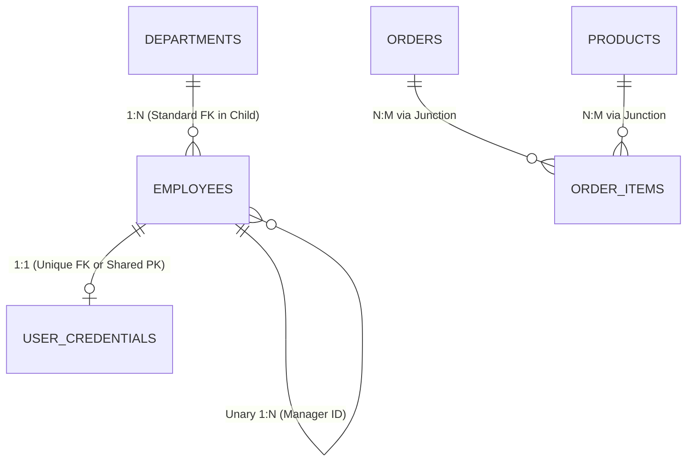

# Chapter 14 — Relational Architecture: Keys & Entity Relationships (कीज और एंटिटी रिलेशनशिप्स)

---

## 1. What is it? (यह क्या है?)

Relational Database Management Systems (RDBMS) में, **Keys** और **Relationships** वे बुनियादी structural pillars हैं जो अलग-अलग tables को आपस में जोड़कर एक coherent, reliable और self-enforcing data web तैयार करते हैं। 

Bina relationships ke, aapka database sirf alag-alag spreadsheet sheets ka collection ban kar reh jayega jisme data redundancy aur inconsistency ka khatra hamesha bana rehta hai. Keys hume ensure karti hain ki har record uniquely identifiable ho aur do tables ke beech ka connection perfectly valid rahe.

### 1.1. The Key Taxonomy (कीज का वर्गीकरण)
* **Super Key**: Table ke kisi bhi ek ya multiple columns ka aisa set jinki values milkar table ki har ek row ko uniquely identify karne ki guarantee deti hain. Ek table me multiple super keys ho sakti hain.
* **Candidate Key**: Ek minimal Super Key—yaani aisa super key jisme se agar aap ek bhi column hata dein, toh uniqueness guarantee khatam ho jayegi (no proper subset can guarantee uniqueness). Ek table ke paas multiple Candidate Keys ho sakti hain.
* **Primary Key (PK)**: Database architect dwara chuni gayi woh single candidate key jo table ki rows ka official unique identifier banti hai. MySQL ke default **InnoDB** storage engine mein, Primary Key physically **Clustered Index** define karti hai. Iska matlab hai ki table ka data disk par physically Primary Key ke order mein hi store hota hai!
* **Alternate Key**: Aisi candidate keys jinhe Primary Key ke roop mein select *nahi* kiya gaya (inhe aamtaur par table me `UNIQUE NOT NULL` constraint ke sath implement kiya jata hai, jaise `email` ya `phone_number`).
* **Composite Key**: Jab do ya do se zyada columns ko combine karke ek key banayi jaati hai (jaise `(order_id, product_id)`).
* **Surrogate Key vs Natural Key**:
  * **Natural Key**: Ek real-world business attribute jisme inherent uniqueness hoti hai (jaise Social Security Number, Aadhar Number, VIN, ISBN, email).
  * **Surrogate Key**: Ek artificial, system-generated identifier jiska real-world business logic se koi matlab nahi hota (jaise `INT AUTO_INCREMENT` ya `UUID`).
* **Foreign Key (FK)**: Ek **child table** ka aisa column (ya columns ka set) jo kisi **parent table** ki Primary Key ki values ko reference karta hai. Ye **referential integrity** enforce karta hai taaki database me koi invalid ya orphan record create na ho sake.

---

## 2. Cardinality & Relational Patterns (कार्डिनैलिटी और रिलेशनल पैटर्न्स)

Ek table ke entity instances dusri table ke kitne entity instances ke sath relate kar sakte hain, is ratio ya count ko hum **cardinality** kehte hain:



1. **One-to-One (1:1)**:
   * *Rule*: Table A ki bilkul ek row, Table B ki maximum ek row se correspond karti hai.
   * *Implementation*: Table B ke andar Foreign Key banaiye aur us par ek `UNIQUE` constraint laga dijiye (ya fir dono tables mein identical Primary Key share karwaiye).
   * *Example*: `employees` aur `employee_passports` — ek employee ka sirf ek passport ho sakta hai aur ek passport sirf ek employee ka hota hai.
2. **One-to-Many (1:N)**:
   * *Rule*: Table A ki ek row, Table B ki multiple rows se relate ho sakti hai, lekin Table B ki har row Table A ki sirf ek hi row se judi hoti hai.
   * *Implementation*: Foreign Key ko hamesha "Many" (child) side wali table mein rakha jata hai.
   * *Example*: Ek `department` mein multiple `employees` kaam kar sakte hain; ek `customer` multiple `orders` place kar sakta hai.
3. **Many-to-Many (N:M)**:
   * *Rule*: Table A ki multiple rows, Table B ki multiple rows se relate kar sakti hain.
   * *Implementation*: Relational engines do tables ke beech direct N:M link store nahi kar sakte. Iske liye hume ek teesri intermediate table banani padti hai jise **Junction Table** (ya Associative / Bridge Table) kehte hain. Is junction table mein dono parent tables ki primary keys foreign keys ke roop mein store hoti hain.
   * *Example*: `orders` aur `products` jo aapas mein `order_items` table ke zariye jude hote hain (ek order mein kayi products ho sakte hain aur ek product kayi orders ka hissa ho sakta hai).
4. **Self-Referencing (Unary)**:
   * *Rule*: Jab ek table khud ko hi reference karti hai.
   * *Implementation*: Table ke andar ek foreign key column create kiya jata hai jo usi table ki primary key ko point karta hai.
   * *Example*: `employees.manager_id` jo usi table ke `employees.employee_id` ko point karta hai (kyunki manager bhi aakhirkar ek employee hi hota hai).

---

## 3. Syntax (सिंटैक्स)

### Creating Relationships with Referential Actions
```sql
-- 1. One-to-One Table Creation (Unique Foreign Key)
CREATE TABLE employee_profiles (
    profile_id INT AUTO_INCREMENT PRIMARY KEY,
    employee_id INT NOT NULL UNIQUE,       -- UNIQUE enforces 1:1 cardinality
    emergency_contact VARCHAR(100) NOT NULL,
    home_address VARCHAR(255) NOT NULL,
    CONSTRAINT fk_profile_employee FOREIGN KEY (employee_id)
        REFERENCES employees(employee_id)
        ON DELETE CASCADE
        ON UPDATE CASCADE
);

-- 2. One-to-Many Relationship (Standard FK)
CREATE TABLE orders (
    order_id INT AUTO_INCREMENT PRIMARY KEY,
    customer_id INT NOT NULL,              -- 1:N: One customer has many orders
    order_date DATE NOT NULL,
    CONSTRAINT fk_orders_customer FOREIGN KEY (customer_id)
        REFERENCES customers(customer_id)
        ON DELETE RESTRICT
        ON UPDATE CASCADE
);

-- 3. Many-to-Many Junction Table
CREATE TABLE order_items (
    item_id INT AUTO_INCREMENT PRIMARY KEY,
    order_id INT NOT NULL,
    product_id INT NOT NULL,
    quantity INT NOT NULL,
    CONSTRAINT uq_order_product UNIQUE (order_id, product_id),
    CONSTRAINT fk_items_order FOREIGN KEY (order_id)
        REFERENCES orders(order_id)
        ON DELETE CASCADE
        ON UPDATE CASCADE,
    CONSTRAINT fk_items_product FOREIGN KEY (product_id)
        REFERENCES products(product_id)
        ON DELETE RESTRICT
        ON UPDATE CASCADE
);
```

### Managing Keys and Constraints via `ALTER TABLE`
```sql
-- Adding a Foreign Key to an existing table
ALTER TABLE child_table
ADD CONSTRAINT fk_name FOREIGN KEY (parent_id_column)
    REFERENCES parent_table(id_column)
    ON DELETE RESTRICT
    ON UPDATE CASCADE;

-- Dropping a Foreign Key constraint (Requires the specific constraint symbol name)
ALTER TABLE child_table
DROP FOREIGN KEY fk_name;

-- Dropping a Primary Key (Must remove AUTO_INCREMENT attribute first)
ALTER TABLE table_name
MODIFY COLUMN id INT NOT NULL;
ALTER TABLE table_name
DROP PRIMARY KEY;
```

---

## 4. Basic Example (बेसिक उदाहरण)

Chaliye dekhte hain ki parent aur child tables ke beech referential integrity kaise kaam karti hai aur `ON DELETE CASCADE` ka kya asar hota hai:

```sql
USE sql_mastery;

CREATE TABLE authors (
    author_id INT AUTO_INCREMENT PRIMARY KEY,
    author_name VARCHAR(100) NOT NULL
);

CREATE TABLE books (
    book_id INT AUTO_INCREMENT PRIMARY KEY,
    title VARCHAR(150) NOT NULL,
    author_id INT NOT NULL,
    CONSTRAINT fk_books_author FOREIGN KEY (author_id)
        REFERENCES authors(author_id)
        ON DELETE CASCADE
);

INSERT INTO authors (author_name) VALUES ('Robert C. Martin'), ('Martin Fowler');
INSERT INTO books (title, author_id) VALUES ('Clean Code', 1), ('Refactoring', 2);

-- Deleting Author 1 automatically triggers CASCADE deletion of 'Clean Code' in books
DELETE FROM authors WHERE author_id = 1;

-- Verify books: 'Clean Code' has been deleted automatically
SELECT * FROM books;

-- Clean up
DROP TABLE books;
DROP TABLE authors;
```

---

## 5. Real-World Example (रियल-वर्ल्ड उदाहरण)

Ab hamare `sql_mastery` database ke real production architecture ko samajhte hain, jisme `customers`, `orders`, aur `order_items` tables aapas mein connected hain:
1. `orders` aur `order_items` par defined foreign keys aur unke cascade rules ko test karenge.
2. Dekhenge ki kaise `ON DELETE RESTRICT` rule customer history ko galti se delete hone se bachata hai.
3. Dekhenge ki jab ek order cancel hoke remove hota hai, toh `ON DELETE CASCADE` kaise uske sabhi child line items ko automatically safely clean up kar deta hai.

```sql
USE sql_mastery;

-- Step 1: Attempt to delete Customer 1 (Emily Watson)
-- This customer has placed orders 1001 and 1006.
-- This command will fail because fk_orders_customer is configured with ON DELETE RESTRICT!
DELETE FROM customers WHERE customer_id = 1;

-- Step 2: Create a temporary test order to test ON DELETE CASCADE on order_items
INSERT INTO orders (order_id, customer_id, order_date, status, total_amount)
VALUES (9999, 1, CURDATE(), 'Cancelled', 100.00);

INSERT INTO order_items (item_id, order_id, product_id, quantity, unit_price, discount)
VALUES (8888, 9999, 9, 2, 49.99, 0.00);

-- Verify line item exists
SELECT * FROM order_items WHERE order_id = 9999;

-- Step 3: Delete the cancelled parent order 9999
-- Because fk_items_order has ON DELETE CASCADE, item 8888 is deleted automatically!
DELETE FROM orders WHERE order_id = 9999;

-- Verify line item was purged automatically
SELECT * FROM order_items WHERE order_id = 9999;
```

---

## 6. Step-by-Step Explanation (स्टेप-बाय-स्टेप व्याख्या)

1. `DELETE FROM customers WHERE customer_id = 1;`:
   * InnoDB storage engine ko customer `1` ko delete karne ki query milti hai.
   * Customer row ko chhoone se pehle, InnoDB un sabhi foreign key references ko inspect karta hai jo `customers(customer_id)` ko point kar rahe hain.
   * Use `orders` table mein aisi child rows milti hain jahan `customer_id = 1` maujood hai.
   * Kyunki constraint par `ON DELETE RESTRICT` configure hai, InnoDB turant operation ko halt kar deta hai, transaction ko roll back karta hai, aur ek fatal error return karta hai:
     `ERROR 1451 (23000): Cannot delete or update a parent row: a foreign key constraint fails`.
2. `DELETE FROM orders WHERE order_id = 9999;`:
   * InnoDB order `9999` ko dhundhta hai.
   * Ye check karta hai ki kya koi foreign key `orders(order_id)` ko reference kar rahi hai.
   * Use `order_items` mein child line item `8888` milta hai jahan rule `ON DELETE CASCADE` set hai.
   * InnoDB automatically ek internal cascade deletion perform karta hai aur `order_items` se row `8888` ko pehle delete karta hai, fir parent order `9999` ko `orders` se delete karta hai. Ye dono operations ek single atomic transaction ke andar commit hote hain.

---

## 7. Expected Result (अपेक्षित परिणाम)

Deletion test ka terminal output:

```
mysql> DELETE FROM customers WHERE customer_id = 1;
ERROR 1451 (23000): Cannot delete or update a parent row: a foreign key constraint fails (`sql_mastery`.`orders`, CONSTRAINT `fk_orders_customer` FOREIGN KEY (`customer_id`) REFERENCES `customers` (`customer_id`) ON DELETE RESTRICT ON UPDATE CASCADE)

mysql> SELECT * FROM order_items WHERE order_id = 9999;
+---------+----------+------------+----------+------------+----------+---------------------+
| item_id | order_id | product_id | quantity | unit_price | discount | created_at          |
+---------+----------+------------+----------+------------+----------+---------------------+
|    8888 |     9999 |          9 |        2 |      49.99 |     0.00 | 2026-09-09 10:11:00 |
+---------+----------+------------+----------+------------+----------+---------------------+

mysql> DELETE FROM orders WHERE order_id = 9999;
Query OK, 1 row affected (0.01 sec)

mysql> SELECT * FROM order_items WHERE order_id = 9999;
Empty set (0.00 sec)
```

---

## 8. Common Mistakes (सामान्य गलतियाँ और Pitfalls)

1. **Natural Keys ko Clustered Primary Key banana**:
   * *Mistake*: `email VARCHAR(100)` ya `uuid CHAR(36)` ko InnoDB table ki Primary Key bana dena.
   * *Performance Problem*: InnoDB mein Primary Key physical clustered index ko decide karti hai. Random string keys (jaise UUID v4) insert ke time par lagatar **page splits**, random disk I/O, aur heavy index fragmentation cause karti hain. Iske alawa, table ka har secondary index apne leaf nodes mein primary key ki copy store karta hai, jiska matlab hai ki ek lambi primary key table ke *har doosre index* ka size bohot badha deti hai!
   * *Rule*: Hamesha compact, monotonically increasing surrogate keys (`INT` ya `BIGINT AUTO_INCREMENT`) ko primary key banayein, aur real-world uniqueness enforce karne ke liye secondary `UNIQUE` constraint ka use karein.
2. **Foreign Key Columns par Index miss kar dena**:
   * Child table ke foreign key columns par hamesha index hona chahiye. Agar `child_table(parent_id)` par index nahi hoga, toh jab bhi parent table se koi row update ya delete hogi, database engine ko matching records dhundhne ke liye child table ka full table scan karna padega, jisse massive table locking aur bottlenecks paida ho jayenge. (Note: MySQL aamtaur par foreign key banate waqt index automatically create kar deta hai, lekin explicit dhyan rakhna zaroori hai).
3. **Circular Foreign Key Deadlocks**:
   * Table A ko Table B ke foreign key ke sath create karna, aur Table B ko Table A ke foreign key ke sath create karna. Aise case mein pehli row insert karna impossible ho jata hai kyunki dono mein se koi bhi parent row pehle se maujood nahi hoti. (Agar circular dependency zaroori hi ho, toh pehle `NULL` insert karein ya temporary tor par `SET FOREIGN_KEY_CHECKS = 0;` ka use karein).

---

## 9. Best Practices (बेस्ट प्रैक्टिसेज)

1. **Relational Joins ke liye hamesha Surrogate Keys chunein**:
   * Relational joins ke liye integer surrogate keys (`customer_id INT`) use karein. Business attributes (jaise email ya phone number) samay ke sath badal sakte hain jab user apna profile update karta hai; surrogate keys kabhi nahi badalti, jisse lakho child foreign keys ko update karne ki naubat nahi aati.
2. **Orphan Records kabhi allow na karein**:
   * Relationships ko hamesha database engine level par explicit Foreign Keys se enforce karein. Sirf application-layer code ke checks par bharosa na karein, kyunki direct script execution ya concurrent bugs se orphan rows ban sakti hain.
3. **Hamesha `ON UPDATE CASCADE` configure karein**:
   * Kabhi agar rare case mein parent table ki primary key re-sequence ya migrate hoti hai, toh `ON UPDATE CASCADE` ensure karta hai ki sabhi child tables automatically naye key value ke sath sync ho jayein.
4. **Many-to-Many Relationships ke liye explicit Junction Tables banayein**:
   * Junction table mein auditing metadata (`created_at`, `assigned_by`, `status`) zaroor add karein taaki relationships ki history track ki ja sake.

---

## 10. Practice Questions (अभ्यास प्रश्न)

### Easy (सरल)
1. Natural Key aur Surrogate Key ke beech mukhya antar kya hai? Real-world udaharan ke sath samjhaiye.
2. `departments` aur `employees` ke relationship mein kaun si table Parent Table hai aur kaun si Child Table?
3. Agar aap `employees` table mein ek aisa record insert karne ki koshish karein jisme `department_id = 999` ho aur department 999 exist na karta ho, toh MySQL kya error return karega?

### Medium (मध्यम)
4. Ek aisi DDL statement likhiye jo `customer_passports` table create kare jo `customers` ke sath strict 1:1 relationship maintain kare, taaki har customer ka maximum ek hi passport ho sake.
5. `employees` table se foreign key constraint `fk_emp_department` ko drop karne ke liye sahi SQL command likhiye.
6. `students` aur `classes` ke beech ek Many-to-Many relationship design kijiye jisme junction table ka naam `class_roster` ho. Isme composite uniqueness constraint include kijiye.

### Difficult (कठिन)
7. InnoDB ke clustered index aur secondary index ke internal storage mechanics ko detail mein samjhaiye. Ek 36-character UUID string primary key ke roop mein 8-byte `BIGINT` ke mukable RAM mein kitna zyada overhead create karti hai?
8. Ek aisa `ALTER TABLE` execution sequence banaiye jo ek existing nullable foreign key relationship ko strict `NOT NULL` foreign key with `ON DELETE CASCADE` mein badalta ho, aur ensure karein ki pehle se maujood koi bhi orphaned rows pehle clean ho jayein.

---

## 11. Interview Questions (इंटरव्यू सवाल और जवाब)

### Q1: MySQL InnoDB mein Clustered Index kya hota hai, aur ye Primary Key dwara kaise decide hota hai?
**Answer**: InnoDB storage engine mein, table ka data disk par physically ek B+ Tree index ke order mein arrange hota hai jise **Clustered Index** kaha jata hai. Clustered index ke leaf pages mein poori actual row ka complete data store hota hai.

InnoDB table ki `PRIMARY KEY` ko automatically Clustered Index designate karta hai. Agar koi primary key define nahi ki gayi hai, toh InnoDB table ke pehle non-null `UNIQUE` index ko clustered index banata hai. Agar dono hi maujood nahi hain, toh InnoDB internally ek hidden 6-byte row identifier (`DB_ROW_ID`) generate karta hai aur uspar clustered index banata hai.

Sabhi secondary (non-clustered) indexes row ke physical disk pointer ko store nahi karte; balki unke leaf nodes mein matching row ki `PRIMARY KEY` value store hoti hai. Isliye jab aap secondary index se query karte hain, toh engine pehle secondary index traversal karta hai aur fir complete row fetch karne ke liye clustered index par "bookmark lookup" (double lookup) karta hai.

### Q2: `ON DELETE CASCADE`, `ON DELETE SET NULL`, aur `ON DELETE RESTRICT` mein kya antar hai?
**Answer**:
* `ON DELETE RESTRICT` (ya `NO ACTION`): Agar kisi parent row ko koi child row reference kar rahi hai, toh parent row ko delete hone se rok deta hai. Ye foran ek error raise karta hai aur statement ko roll back kar deta hai.
* `ON DELETE CASCADE`: Parent row ke delete hote hi, us parent row ko reference karne wali sabhi child rows ko usi transaction ke andar automatically aur recursively delete kar deta hai.
* `ON DELETE SET NULL`: Parent row ke delete hone par, child table ke foreign key column ki value ko `NULL` set kar deta hai (iske liye child column ka nullable hona zaroori hai).

### Q3: Relational database mein Many-to-Many (N:M) relationship kaise implement ki jaati hai?
**Answer**: Relational database tables direct foreign keys ka use karke sirf One-to-Many (1:N) links establish kar sakti hain. Many-to-Many relationship implement karne ke liye hume use do One-to-Many relationships mein todna padta hai jiske liye ek teesri table create ki jaati hai jise **Junction Table** (ya Associative/Bridge Table) kehte hain.

Junction table mein do foreign keys hoti hain, jo dono participating parent tables ki primary keys ko reference karti hain. In dono foreign keys ke combination par aamtaur par ek composite `PRIMARY KEY` ya composite `UNIQUE` constraint lagaya jata hai taaki duplicate mappings na banein. Junction table relationship ke specific attributes ko bhi store kar sakti hai (jaise `order_items` table mein `quantity`, `unit_price`, aur `discount`).

---

## 12. Quick Revision (क्विक रिविजन)

* **Primary Key** table ki rows ko uniquely identify karti hai aur InnoDB mein physical **Clustered Index** define karti hai.
* **Foreign Keys** child tables ko parent tables se link karti hain aur **referential integrity** maintain karti hain.
* Primary key ke liye lambi natural keys (jaise UUID ya email) ki jagah compact **Surrogate Keys** (`INT AUTO_INCREMENT` ya `BIGINT`) ko tarjeeh dein.
* **1:1 relationship** implement karne ke liye Foreign Key par `UNIQUE` constraint lagaya jata hai.
* **1:N relationship** standard Foreign Key dwara child table mein implement hoti hai.
* **N:M relationship** ke liye ek intermediate **Junction Table** ki zaroorat hoti hai jisme do Foreign Keys hoti hain.
* Hamesha explicit referential actions configure karein: Data protection ke liye `ON DELETE RESTRICT`, owned child records ki automatic safai ke liye `ON DELETE CASCADE`, ya optional links ke liye `ON DELETE SET NULL`.
