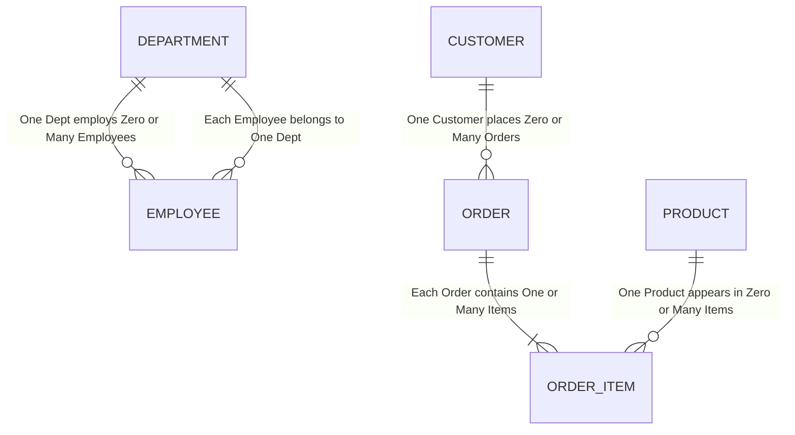
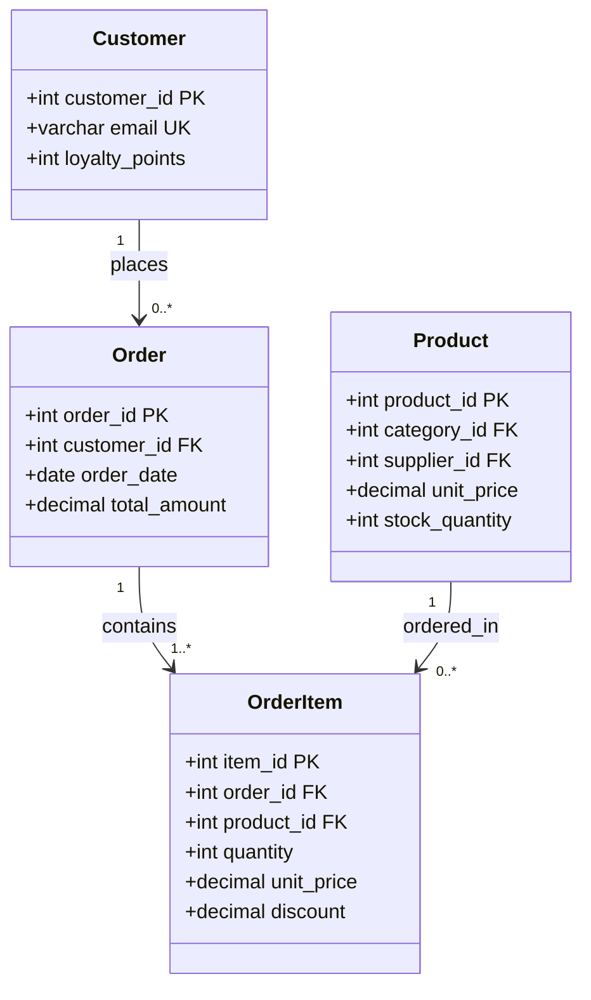
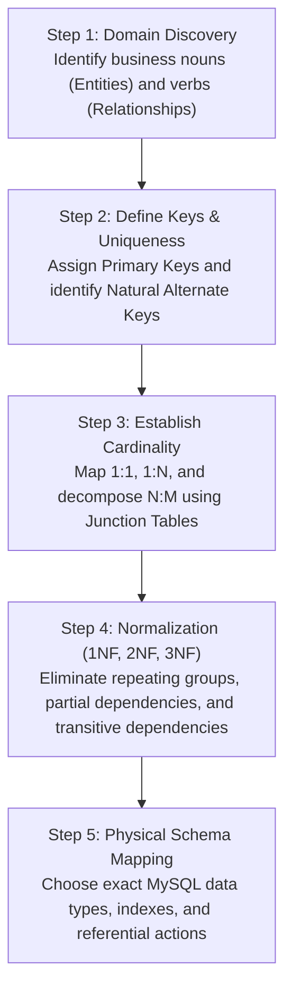

# Chapter 15 — Database Design & Entity Relationship Modeling (डेटाबेस डिज़ाइन और एंटिटी रिलेशनशिप मॉडलिंग)

---

## 1. What is it? (यह क्या है?)

**Database Design** ek structured aur disciplined engineering process hai jisme enterprise business requirements ko samajhkar ek aisa data model banaya jata hai jo high data integrity, top-notch query performance, aur long-term scalability guarantee karta hai.

Bina proper planning aur architecture ke database banana waise hi hai jaise bina blueprint ke multi-storey building khadi karna—shuru me sab theek lagega, lekin jaise hi data badhega, pura system crash aur slow ho jayega!

Database design ko teen progressive architectural phases mein divide kiya jata hai:
1. **Conceptual Design**: Business domain ko high level par samajhna. Isme core business entities (jaise *Customer*, *Order*, *Product*) aur unke aapsi business relationships ko bina kisi technology ya software ke identify kiya jata hai.
2. **Logical Design**: Conceptual model ko actual relational tables mein translate karna. Har entity ke attributes (columns) define karna, primary keys aur foreign keys decide karna, exact cardinality (1:1, 1:N, N:M) establish karna, aur data anomalies ko eliminate karne ke liye schema ko normalize karna (1NF to 3NF/BCNF).
3. **Physical Design**: Logical structure ko kisi specific RDBMS engine (jaise MySQL InnoDB) ke physical storage architecture par map karna. Isme exact data types (`INT UNSIGNED`, `VARCHAR(100)`, `DECIMAL(10,2)`), character collations (`utf8mb4_0900_ai_ci`), B+ Tree primary/secondary indexes, foreign key actions, aur table partitioning strategies plan ki jaati hain.

Data modeling ka sabse mukhya visual tool **Entity-Relationship Diagram (ERD)** hota hai, jo industry-standard **Crow's Foot Notation** ka use karke entities, attributes aur relationships ko visualize karta hai.

---

## 2. Why do we use it? (हम इसका उपयोग क्यों करते हैं? — क्रोज़ फुट नोटेशन और मॉडलिंग)

Ek poorly designed database me update anomalies, data loss, aur massive performance bottlenecks aate hain. Crow's Foot notation ke zariye hum entities ke beech minimum aur maximum cardinality ko visual clarity ke sath represent karte hain taaki developers aur architects bina kisi confusion ke schema implement kar sakein:

| Symbol / End | Meaning | Cardinality Description |
| :--- | :--- | :--- |
| `||` | One and only one | Mandatory Single (Minimum 1, Maximum 1) |
| `|o` | Zero or one | Optional Single (Minimum 0, Maximum 1) |
| `}|` | One or many | Mandatory Multiple (Minimum 1, Maximum Many) |
| `}o` | Zero or many | Optional Multiple (Minimum 0, Maximum Many) |



---

## 3. Syntax & Design Rules (सिंटैक्स और डिज़ाइन नियम)

Database architecture design karte waqt in fundamental golden rules ka hamesha paalan karein:

1. **Rule of Atomicity (परमाणुता का नियम)**: Table ke har column mein sirf ek single, indivisible scalar value honi chahiye. Ek column mein comma-separated values store karna (jaise `phone_numbers = '9876543210, 9123456780'`) First Normal Form (1NF) ka ghor ulanghan hai, indexing ko block karta hai aur queries ko slow bana deta hai.
2. **Rule of Single Responsibility (एकल जिम्मेदारी)**: Ek table ko sirf ek real-world business entity represent karni chahiye. Kabhi bhi customer profile data aur order shipping details ko ek hi table mein khichdi mat banaiye.
3. **Rule of Key Immutability (कीज की अपरिवर्तनीयता)**: Primary key ki value aisi honi chahiye jo kabhi na badle. Aise natural attributes (jaise mobile number ya email) ko primary key na banayein jo future me update ho sakte hain; hamesha synthetic surrogate keys (`INT AUTO_INCREMENT` ya `BIGINT`) use karein.
4. **Naming Conventions (नामकरण परंपराएँ)**:
   * Tables: Lowercase plural (`customers`, `orders`, `products`, `departments`).
   * Columns: Lowercase singular with snake_case (`customer_id`, `unit_price`, `hire_date`).
   * Junction Tables: Hyphenated ya combined entity names (`order_items`, `student_courses`).
   * Foreign Keys: Parent table ke primary key name ke sath match karein (`customer_id` referencing `customers(customer_id)`).

---

## 4. Basic Example (बेसिक उदाहरण)

Chaliye ek complete blogging platform ka robust relational schema design karte hain jisme Authors, Posts, Tags aur Many-to-Many tagging relationship shamil hain:

```sql
USE sql_mastery;

-- 1. Authors Entity
CREATE TABLE blog_authors (
    author_id INT AUTO_INCREMENT PRIMARY KEY,
    full_name VARCHAR(100) NOT NULL,
    email VARCHAR(100) NOT NULL UNIQUE,
    created_at TIMESTAMP DEFAULT CURRENT_TIMESTAMP
);

-- 2. Posts Entity (1:N with Authors)
CREATE TABLE blog_posts (
    post_id INT AUTO_INCREMENT PRIMARY KEY,
    author_id INT NOT NULL,
    slug VARCHAR(120) NOT NULL UNIQUE,
    title VARCHAR(200) NOT NULL,
    body_content TEXT NOT NULL,
    published_at DATETIME DEFAULT NULL,
    CONSTRAINT fk_posts_author FOREIGN KEY (author_id)
        REFERENCES blog_authors(author_id)
        ON DELETE RESTRICT
        ON UPDATE CASCADE
);

-- 3. Tags Entity
CREATE TABLE blog_tags (
    tag_id INT AUTO_INCREMENT PRIMARY KEY,
    tag_name VARCHAR(50) NOT NULL UNIQUE
);

-- 4. Junction Table for Many-to-Many relationship between Posts and Tags
CREATE TABLE post_tags (
    post_id INT NOT NULL,
    tag_id INT NOT NULL,
    assigned_at TIMESTAMP DEFAULT CURRENT_TIMESTAMP,
    PRIMARY KEY (post_id, tag_id),  -- Composite PK enforces uniqueness
    CONSTRAINT fk_pt_post FOREIGN KEY (post_id)
        REFERENCES blog_posts(post_id)
        ON DELETE CASCADE,
    CONSTRAINT fk_pt_tag FOREIGN KEY (tag_id)
        REFERENCES blog_tags(tag_id)
        ON DELETE RESTRICT
);

-- Clean up
DROP TABLE post_tags;
DROP TABLE blog_tags;
DROP TABLE blog_posts;
DROP TABLE blog_authors;
```

---

## 5. Real-World Example (रियल-वर्ल्ड उदाहरण — केस स्टडी: `sql_mastery`)

Hamare enterprise database schema `sql_mastery` ke relational architecture aur critical design decisions ka deep-dive:



### Mukhya Design Decisions ki Vyakhya:
1. **Historical Price Capture in `order_items`**:
   * Dhyan se dekhiye: `products` table mein pehle se hi `unit_price` column maujood hai, fir bhi humne `order_items` mein alag se `unit_price` column kyu banaya?
   * *Why?*: Product catalog ke prices waqt ke sath badalte rehte hain. Agar ek laptop aaj ₹50,000 ka hai aur agle mahine inflation ya new stock ki wajah se ₹55,000 ka ho jata hai, toh purane orders ka financial total nahi badalna chahiye! Agar hum `order_items` me price store na karein aur query me direct `products.unit_price` se join karein, toh agle mahine pichle saal ke sabhi orders ke bills galat dikhayenge! Is snapshot ko store karna **point-in-time financial truth** kehlata hai.
2. **Decoupled Order and Payment Entities**:
   * Order table me payment information ko mix karne ke bajaye alag `payments` table banayi gayi hai.
   * *Why?*: Real life me ek order ke multiple payment attempts ho sakte hain (jaise pehla card fail ho gaya, doosra pass hua), split payments ho sakti hain (adhe paise wallet se, adhe UPI se), ya fir partial refunds ho sakte hain. Alag `payments` table cleanly 1:N payment attempts ko support karti hai.

---

## 6. Step-by-Step Explanation (स्टेप-बाय-स्टेप व्याख्या और वर्कफ्लो)

Jab bhi aapko scratch se kisi naye project ke liye enterprise relational database design karna ho, toh is 5-step workflow ko follow karein:



* **Step 1 (Domain Discovery)**: Stakeholders aur business requirements documents se Nouns (jo Entities banenge jaise User, Invoice, Item) aur Verbs (jo Relationships banenge jaise Places, Contains, Issues) identify kijiye.
* **Step 2 (Define Keys)**: Har entity ke liye immutable synthetic primary key chunein (`AUTO_INCREMENT`) aur alternate keys (jaise email, GSTIN) par `UNIQUE` constraints mark karein.
* **Step 3 (Establish Cardinality)**: Business rules ke hisab se 1:1, 1:N decide karein aur jahan bhi N:M relationship ho, wahan intermediate Junction Table design karein.
* **Step 4 (Normalization)**: Redundant data aur anomalies ko rokne ke liye tables ko 3NF tak decompose karein.
* **Step 5 (Physical Mapping)**: MySQL engine specific data types, character sets (`utf8mb4`), indexes, aur constraints define karke actual SQL scripts taiyar karein.

---

## 7. Expected Result (अपेक्षित परिणाम और स्कीमा वेरिफिकेशन)

Jab aap upar diye gaye DDL statements run karte hain, toh MySQL table schema aur indexes ko verify karta hai:

```
mysql> DESCRIBE blog_posts;
+--------------+--------------+------+-----+---------+----------------+
| Field        | Type         | Null | Key | Default | Extra          |
+--------------+--------------+------+-----+---------+----------------+
| post_id      | int          | NO   | PRI | NULL    | auto_increment |
| author_id    | int          | NO   | MUL | NULL    |                |
| slug         | varchar(120) | NO   | UNI | NULL    |                |
| title        | varchar(200) | NO   |     | NULL    |                |
| body_content | text         | NO   |     | NULL    |                |
| published_at | datetime     | YES  |     | NULL    |                |
+--------------+--------------+------+-----+---------+----------------+
6 rows in set (0.01 sec)

mysql> DESCRIBE post_tags;
+-------------+-----------+------+-----+-------------------+-------------------+
| Field       | Type      | Null | Key | Default           | Extra             |
+-------------+-----------+------+-----+-------------------+-------------------+
| post_id     | int       | NO   | PRI | NULL              |                   |
| tag_id      | int       | NO   | PRI | NULL              |                   |
| assigned_at | timestamp | YES  |     | CURRENT_TIMESTAMP | DEFAULT_GENERATED |
+-------------+-----------+------+-----+-------------------+-------------------+
3 rows in set (0.00 sec)
```

Notice karein ki `post_tags` me `(post_id, tag_id)` par composite `PRI` key successfully create ho gayi hai, jo duplicate tag mapping ko database level par hi block kar deti hai!

---

## 8. Common Mistakes (सामान्य गलतियाँ और डिज़ाइन एंटी-पैटर्न्स)

1. **The Comma-Separated List Anti-Pattern (Jaywalking)**:
   * *Anti-pattern*: Ek text column mein multiple IDs ghusa dena: `products.category_ids = '1, 4, 7'`.
   * *Problems*: Kisi category ko search karne ke liye `LIKE '%4%'` jaisa slow full-table scan karna padta hai, categories ke sath standard relational JOIN lagana impossible ho jata hai, foreign key integrity enforce nahi ho sakti, aur category update karne ke liye string manipulation karni padti hai.
   * *Fix*: Hamesha proper junction table banayein: `product_categories(product_id, category_id)`.
2. **Entity-Attribute-Value (EAV) Overuse**:
   * *Anti-pattern*: Dynamic attributes store karne ke liye teen generic columns wali single table bana dena: `(entity_id, attribute_name, attribute_value)`.
   * *Problems*: Ek simple product details query fetch karne ke liye 10 self-joins lagane padte hain, basic data types (integers, dates, booleans) sab string ban jate hain, data validation khatam ho jati hai, aur query performance bohot kharab ho jati hai.
   * *Fix*: MySQL 8.0+ mein common fixed attributes ke liye strongly typed columns use karein aur highly dynamic attributes ke liye structured `JSON` column use karein.
3. **Multipurpose Column Anti-Pattern**:
   * Order ship ho gaya toh tracking number daal diya, cancel hua toh cancellation reason daal diya—sab ek hi `status_note` column mein! Isse data domain pollute hota hai aur report nikaalne ke liye complex `CASE` statements likhne padte hain. Har business concept ke liye dedicated column banayein.

---

## 9. Best Practices (बेस्ट प्रैक्टिसेज)

1. **Primary Key ke liye Synthetic Auto-Increment Keys chunein**:
   * `INT UNSIGNED AUTO_INCREMENT` ya `BIGINT UNSIGNED AUTO_INCREMENT` use karein. Ye compact hote hain (4 ya 8 bytes), monotonically badhte hain, aur InnoDB ke B+ Tree clustered index mein random page splits ko rok kar blazing-fast insert performance dete hain.
2. **Historical Immutability Enforce karein**:
   * Transactional records mein snapshot data (jaise us samay ka unit price, shipping address, tax rate) transaction table mein hi copy karein. Customer profile table par depend na rahein kyunki customer kal apna address badal sakta hai!
3. **Soft Deletes ka use karein (`is_active` ya `deleted_at`)**:
   * Production systems mein financial ya critical records (customers, orders, bank accounts) ko physically `DELETE` na karein. Table mein `is_active BOOLEAN DEFAULT TRUE` ya `deleted_at TIMESTAMP NULL` add karein taaki audit trail aur historical data hamesha surakshit rahe.

---

## 10. Practice Questions (अभ्यास प्रश्न)

### Easy (सरल)
1. Database design ke teen pramukh phases kaun se hain aur unme kya antar hai?
2. Crow's Foot notation mein circle (`o`) ke sath crow's foot (`}`) ka nishan kya darshata hai?
3. Ek relational table ke andar kisi column mein comma-separated values kyun nahi store karni chahiye?

### Medium (मध्यम)
4. Ek Hospital Clinic ke liye ER schema design kijiye jisme `doctors`, `patients`, aur `appointments` entities shamil hon. Har table ki primary keys, foreign keys aur cardinalities specify kijiye.
5. Hamare `sql_mastery` schema mein `unit_price` column `products` aur `order_items` dono tables mein kyu rakha gaya hai? Agar ye sirf `products` mein hota toh production billing mein kya bug aata?
6. Kab ek database architect ko 1:1 relationship ko ek hi table me rakhne ke bajaye do alag tables me divide karna chahiye?

### Difficult (कठिन)
7. Airline Reservation System ke liye ek complete database schema design kijiye:
   * Isme `flights`, `airports`, `airplanes`, `passengers`, aur `seat_reservations` tables hon.
   * Ensure kijiye ki ek passenger ek hi flight par same seat do baar book na kar sake (composite uniqueness).
   * Flight table mein `origin_airport` aur `destination_airport` dono columns ek hi `airports` table ko reference karein (Multiple foreign keys to same parent).
8. MySQL InnoDB mein auto-increment integers ke mukable UUIDs ko primary key banane ke pros aur cons kya hain? MySQL 8.0 ka `UUID_TO_BIN(uuid, 1)` function clustered index page fragmentation ko kaise kam karta hai?

---

## 11. Interview Questions (इंटरव्यू सवाल और जवाब)

### Q1: Conceptual, Logical, aur Physical database design ke beech kya antar hai?
**Answer**:
* **Conceptual Design**: Business-focused modeling jisme core entities, business rules aur unke aapsi relationships ko define kiya jata hai, bina kisi database technology ki chinta kiye.
* **Logical Design**: Technology-independent relational modeling jisme tables, primary keys, foreign keys, constraints aur 3NF normalization apply kiya jata hai.
* **Physical Design**: Engine-specific implementation jisme target database (jaise MySQL InnoDB) ke mutabik specific data types, B+ Tree indexes, storage parameters, collations aur partitioning strategy decide ki jaati hai.

### Q2: Database design mein "Jaywalking" anti-pattern kya hota hai aur isse kya nuksan hain?
**Answer**: Jaywalking anti-pattern tab hota hai jab ek developer Many-to-Many junction table banane ke aalas mein ek hi column mein multiple IDs ko comma-separated string (jaise `'10,24,35'`) ke roop mein store kar deta hai.
Iske mukhya nuksan:
1. Referential integrity enforce nahi ho sakti (foreign key comma-separated string ke andar ke individual IDs ko validate nahi kar sakti).
2. Data search karne ke liye `LIKE '%24%'` ya `FIND_IN_SET()` use karna padta hai jo index use nahi kar sakte aur slow full table scans karte hain.
3. Simple aggregations (`COUNT`, `AVG`) nikalne ke liye complex string manipulation karni padti hai.
4. Concurrency bugs: ID add ya remove karne ke liye poori string ko read karke replace karna padta hai jisse race conditions create hoti hain.

### Q3: E-commerce database design mein point-in-time historical data preservation kyu critical hota hai?
**Answer**: Enterprise systems mein master catalog ka data samay ke sath badalta rehta hai—products ke prices update hote hain, discounts change hote hain, aur customers apne addresses modify karte hain. Agar ek order line item `products.unit_price` ko dynamically join karega aur checkout ke waqt ka actual price `order_items.unit_price` mein copy nahi karega, toh bhavishya mein hone wala koi bhi price change pichle sabhi saalon ke orders ke financial totals ko badal dega. Isse company ki accounting, tax audit reports, aur customer purchase history poori tarah corrupt ho jayegi.

---

## 12. Quick Revision (क्विक रिविजन)

* Accha database design **Conceptual**, **Logical**, aur **Physical** phases se hokar guzarta hai.
* Minimum aur maximum relationships ko accurately model karne ke liye **Crow's Foot notation** ka prayog karein.
* **Rule of Atomicity** ka kadi se paalan karein: har column me single scalar value honi chahiye; comma-separated lists kabhi na use karein.
* Transaction tables mein **point-in-time historical values** (jaise unit price, checkout addresses) ko snapshot ke roop mein store karein.
* Primary key ke liye hamesha compact **synthetic surrogate keys** (`INT AUTO_INCREMENT`) use karein taaki InnoDB clustered index par best performance mile.
