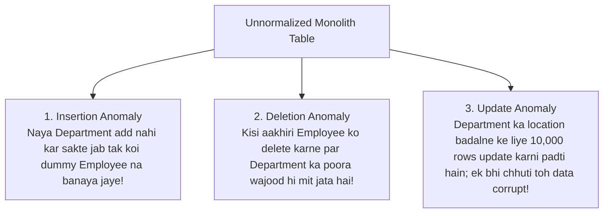
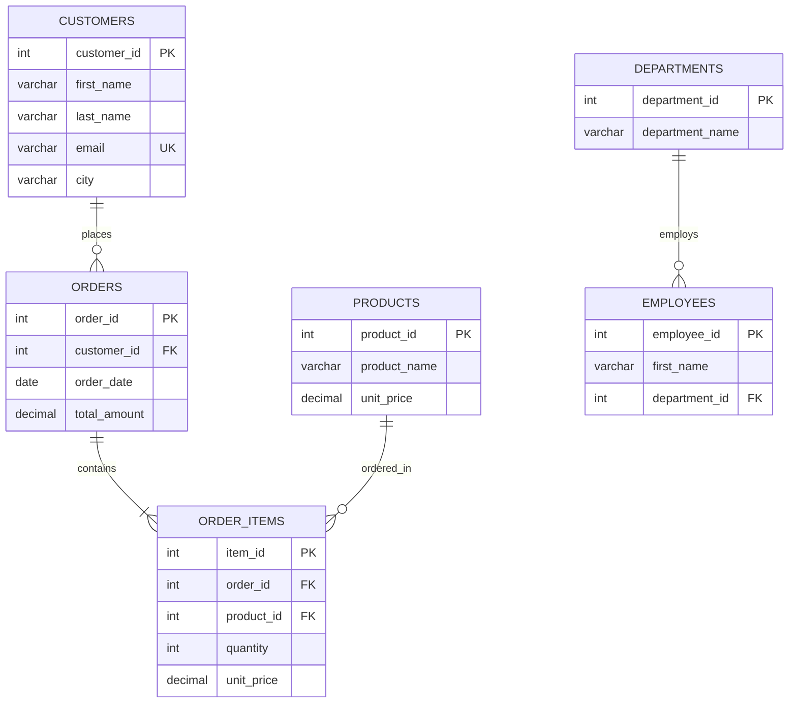

# Chapter 16 — Relational Integrity: Database Normalization & Anomalies (डेटाबेस नॉर्मलाइजेशन और अनोमलीज)

---

## 1. What is it? (यह क्या है?)

**Database Normalization** relational database design ka ek formal aur mathematical process hai, jise relational model ke father **Edgar F. Codd** ne introduce kiya tha. Iska mukhya uddeshya table ke andar data redundancy (faltu duplication) ko khatam karna aur khatarnak **modification anomalies** ko rokna hai.

Normalization ke zariye hum bade, unorganized aur monolithic tables ko systematically chhote, well-structured aur tightly focused tables mein divide (decompose) karte hain, jo aapas mein foreign keys ke zariye jude hote hain. 

Database architecture ki duniya me Normalization ka ek bohot famous golden mantra hai:

> *"Every non-key attribute must provide a fact about the key, the whole key, and nothing but the key, so help me Codd."*
> *(Har non-key column ko key, poori key, aur sirf key ke baare mein hi jaankari deni chahiye!)*

### 1.1. The Three Modification Anomalies (तीन मॉडिफिकेशन अनोमलीज)
Agar table ko bina normalize kiye ek hi jagah saara data store karne ki koshish ki jaye, toh teen bhyankar data integrity failures aate hain:



1. **Insertion Anomaly**: Ek valid business entity ko add na kar pana kyunki doosri unrelated entity ki dummy ya `NULL` information fill karna majboori ban jata hai. (Udaharan: Jab tak aap company mein naye `'Research'` department ke liye pehla employee hire nahi kar lete, tab tak aap database mein `'Research'` department exist karta hai ye record hi nahi kar sakte!).
2. **Deletion Anomaly**: Kisi ek record ko delete karne ke side-effect ke taur par kisi doosre zaroori business fact ka anjane mein permanently delete ho jana. (Udaharan: Agar `'Legal'` department mein sirf ek hi employee kaam karta hai aur wo resign kar deta hai, toh us employee ki row delete karte hi database se ye fact bhi mit jayega ki company mein kabhi `'Legal'` department tha aur uska office kahan tha!).
3. **Update (Modification) Anomaly**: Redundant data hone ki wajah se paida hone wali data inconsistency. (Udaharan: Agar `'Engineering'` department ka location 500 employees ki rows mein repeat ho raha hai, aur office naye floor par shift hota hai, toh sabhi 500 rows ko update karna padega. Agar network break hone se 250 rows update hui aur baki reh gayi, toh aadhe employees alag location dikhayenge aur aadhe alag—data corrupt ho gaya!).

---

## 2. Why do we use it? (हम इसका उपयोग क्यों करते हैं? — अनोमलीज और फंक्शनल डिपेंडेंसी)

Database me data redundancy se storage waste hota hai, memory buffer pool par load badhta hai, aur sabse badi baat—data par bharosa khatam ho jata hai. Normalization ka scientific foundation **Functional Dependency** par tika hota hai:

A **Functional Dependency** (ise $X \rightarrow Y$ likha jata hai) columns ke beech ka mathematical relationship batata hai:
* Attribute $Y$, attribute $X$ par functionally dependent tab kehlata hai jab $X$ ki har distinct value ke liye $Y$ ki exactly ek hi value associate hoti hai.
* *Example*: `employees` table mein, `employee_id` $\rightarrow$ `email` (agar aapko employee ID pata hai, toh uska exactly ek unique email hoga).

---

## 3. Syntax & Normalization Rules (सिंटैक्स और नॉर्मलाइजेशन नियम — 1NF, 2NF, 3NF, BCNF)

Chaliye step-by-step dekhte hain ki kaise har Normal Form ke rules aur unke SQL DDL transformations kaam karte hain:

### 3.1. First Normal Form (1NF): Atomic Values & No Repeating Groups
Ek table **1NF** mein tab hoti hai jab:
1. Har column mein sirf **atomic (indivisible)** scalar values hon (comma-separated lists ya arrays strictly prohibited hain).
2. Table mein columns ke **repeating groups** na hon (jaise `phone1`, `phone2`, `phone3`).
3. Har record ko uniquely identify karne ke liye ek **Primary Key** maujood ho.

```sql
-- VIOLATES 1NF: Multi-valued list in a single column
CREATE TABLE bad_orders_unf (
    order_id INT,
    customer_name VARCHAR(100),
    product_ids VARCHAR(100) -- e.g. '1, 3, 4' VIOLATES 1NF!
);

-- CONVERTED TO 1NF: Atomic rows
CREATE TABLE orders_1nf (
    order_id INT,
    product_id INT,
    customer_name VARCHAR(100),
    PRIMARY KEY (order_id, product_id)
);
```

### 3.2. Second Normal Form (2NF): No Partial Dependencies
Ek table **2NF** mein tab hoti hai jab:
1. Wo pehle se hi **1NF** satisfy karti ho.
2. Usme koi bhi **partial functional dependency** na ho: har non-key attribute ko poori composite primary key par depend hona chahiye, key ke kisi aadhe hisse par nahi!
*(Note: Agar kisi table ki primary key single-column hai, aur table 1NF mein hai, toh wo automatically 2NF mein hoti hai!)*

```sql
-- VIOLATES 2NF: Composite PK is (order_id, product_id).
-- But 'product_name' and 'unit_price' depend ONLY on product_id, NOT on order_id!
CREATE TABLE bad_order_items_2nf (
    order_id INT,
    product_id INT,
    quantity INT,            -- Depends on BOTH (order_id, product_id) -> Full dependency
    product_name VARCHAR(50),-- Depends ONLY on product_id -> PARTIAL DEPENDENCY!
    PRIMARY KEY (order_id, product_id)
);

-- CONVERTED TO 2NF: Decompose into two tables
CREATE TABLE products_2nf (
    product_id INT PRIMARY KEY,
    product_name VARCHAR(50)
);

CREATE TABLE order_items_2nf (
    order_id INT,
    product_id INT,
    quantity INT,
    PRIMARY KEY (order_id, product_id),
    FOREIGN KEY (product_id) REFERENCES products_2nf(product_id)
);
```

### 3.3. Third Normal Form (3NF): No Transitive Dependencies
Ek table **3NF** mein tab hoti hai jab:
1. Wo pehle se hi **2NF** satisfy karti ho.
2. Usme koi **transitive functional dependency** na ho: non-key attributes kisi doosre non-key attribute par depend nahi hone chahiye ($X \rightarrow Y$ aur $Y \rightarrow Z$, jiska matlab $X \rightarrow Z$). Non-key attributes sirf aur sirf primary key par depend hone chahiye.

```sql
-- VIOLATES 3NF: PK is employee_id.
-- employee_id -> department_id, and department_id -> department_name.
-- Therefore, department_name depends transitively on employee_id via department_id!
CREATE TABLE bad_employees_3nf (
    employee_id INT PRIMARY KEY,
    first_name VARCHAR(50),
    department_id INT,
    department_name VARCHAR(50), -- TRANSITIVE DEPENDENCY!
    department_location VARCHAR(50)
);

-- CONVERTED TO 3NF: Decompose into departments and employees
CREATE TABLE departments_3nf (
    department_id INT PRIMARY KEY,
    department_name VARCHAR(50),
    department_location VARCHAR(50)
);

CREATE TABLE employees_3nf (
    employee_id INT PRIMARY KEY,
    first_name VARCHAR(50),
    department_id INT,
    FOREIGN KEY (department_id) REFERENCES departments_3nf(department_id)
);
```

### 3.4. Boyce-Codd Normal Form (BCNF): Strict 3NF
Ek table **BCNF** mein tab hoti hai jab har non-trivial functional dependency $X \rightarrow Y$ ke liye, determinant $X$ hamesha ek **Super Key** ho. BCNF un rare edge cases aur anomalies ko fix karta hai jahan 3NF table mein multiple overlapping composite candidate keys hoti hain.

---

## 4. Basic Example (बेसिक उदाहरण)

Chaliye ek unnormalized student enrollment data ko step-by-step normalize karke dekhte hain:

```sql
USE sql_mastery;

-- Step 1: Violating 2NF and 3NF (Course info and instructor info repeat for each enrollment)
-- Let's build normalized 3NF structures:

CREATE TABLE courses_3nf (
    course_id INT AUTO_INCREMENT PRIMARY KEY,
    course_name VARCHAR(100) NOT NULL,
    instructor_name VARCHAR(100) NOT NULL
);

CREATE TABLE students_3nf (
    student_id INT AUTO_INCREMENT PRIMARY KEY,
    student_name VARCHAR(100) NOT NULL,
    email VARCHAR(100) NOT NULL UNIQUE
);

CREATE TABLE enrollments_3nf (
    student_id INT NOT NULL,
    course_id INT NOT NULL,
    enrollment_date DATE NOT NULL,
    grade CHAR(2),
    PRIMARY KEY (student_id, course_id),
    CONSTRAINT fk_enr_student FOREIGN KEY (student_id) REFERENCES students_3nf(student_id),
    CONSTRAINT fk_enr_course FOREIGN KEY (course_id) REFERENCES courses_3nf(course_id)
);

-- Clean up test tables
DROP TABLE enrollments_3nf;
DROP TABLE students_3nf;
DROP TABLE courses_3nf;
```

---

## 5. Real-World Example (रियल-वर्ल्ड उदाहरण — स्प्रेडशीट से 3NF स्कीमा)

Dekhte hain ki kaise ek unstructured, unnormalized Excel sheet row ko hamare clean, production-grade 3NF `sql_mastery` schema mein transform kiya jata hai:

### The Raw Unnormalized Invoice Row (Spreadsheet)
```
Order_ID: 1001
Order_Date: 2023-08-01
Customer_Name: Emily Watson
Customer_Email: emily.watson@gmail.com
Customer_City: San Francisco
Products_Ordered: "Quantum Pro 15 Laptop (Qty: 1, $1299.99), TrueSound Headphones (Qty: 1, $249.50)"
Department: Sales
Department_Head: Elena Rostova
```

### The 3NF Relational Decomposition:


---

## 6. Step-by-Step Explanation (स्टेप-बाय-स्टेप व्याख्या)

Upar diye gaye real-world transform ko dhyan se samjhiye:
* **1NF achieved**: `Products_Ordered` ke andar jo comma-separated products aur quantities ki multi-valued string thi, use tod kar `order_items` table mein individual atomic rows banaya gaya.
* **2NF achieved**: `product_name` aur catalog `unit_price` ko separate `products` table mein shift kiya gaya, taaki wo order line item ki composite primary key par partially depend na karein.
* **3NF achieved**: Customer ka contact info `customers` table mein chala gaya, aur Department Head ki details `departments` aur `employees` mein alag kar di gayi, jisse saari transitive dependencies poori tarah eradicate ho gayi!

---

## 7. Expected Result & Controlled Denormalization (अपेक्षित परिणाम और कंट्रोल्ड डीनॉर्मलाइजेशन)

3NF relational model **OLTP (Online Transaction Processing)** ke liye gold standard hai (kyunki ye writes ko fast banata hai aur anomalies ko zero kar deta hai). Lekin heavy analytical reporting systems (**OLAP**) ke liye enterprise architectures mein **Controlled Denormalization** ka use kiya jata hai:

| Dimension | Normalized Schema (3NF) | Denormalized Schema (Star / Snowflake) |
| :--- | :--- | :--- |
| **Primary Goal** | Data redundancy minimize karna; safe, atomic `INSERT`/`UPDATE`/`DELETE`. | Massive analytical read queries ki speed maximize karna. |
| **Workload Type** | High-concurrency OLTP (e.g., e-commerce checkouts, bank transactions). | Business Intelligence & Data Warehousing (e.g., Snowflake, BigQuery). |
| **Query Complexity** | Entities reconstruct karne ke liye multiple `JOIN`s lagte hain. | Pre-joined wide tables; minimal joins. |
| **Storage Overhead** | Compact storage footprints. | Repeated values ki wajah se zyada disk space consume hoti hai. |

### Practical Denormalization Example: Pre-Aggregated Totals
Hamari `orders` table mein, `total_amount` technically ek denormalized calculated column hai (kyunki ise `order_items` se `SUM(quantity * unit_price * (1 - discount)) + shipping_fee` karke dynamically nikala ja sakta hai).
* *Store karne ka reason kya hai?*: Har baar jab customer apna dashboard khole, tab lakho line items ko aggregate karke total calculate karna CPU par bohot zyada load daalta hai. Final bill amount ko `orders.total_amount` mein cache karke rakhna ek socha-samjha, controlled denormalization trade-off hai.

---

## 8. Common Mistakes (सामान्य गलतियाँ और Pitfalls)

1. **Over-Normalizing to the Point of Paralysis**:
   * Har chhote attribute ke liye alag lookup table bana dena (jaise `cities` ki alag table, `postal_codes` ki alag table, `street_names` ki alag table). Aise schema mein ek simple profile fetch karne ke liye 15 joins lagane padte hain, jisse database freeze ho jata hai. Transactional systems ke liye 3NF sabse practical aur balanced form hai.
2. **Decomposed Tables par Foreign Keys lagana bhool jana**:
   * Ek unnormalized table ko teen alag tables me tod toh diya, lekin unke beech Foreign Key constraints nahi lagaye. Iska natija ye hota hai ki orphan records jamne lagte hain aur normalization ka saara fayda barbad ho jata hai.
3. **Premature Denormalization**:
   * Bina kisi real performance issue ke, sirf "lagta hai slow hoga" soch kar shuru se hi tables mein columns duplicate karne lagna. Rule ye hai: hamesha clean 3NF se shuru karein; denormalization sirf tab karein jab actual production query profiling aur EXPLAIN plan se prove ho jaye ki join bottleneck ban raha hai.

---

## 9. Best Practices (बेस्ट प्रैक्टिसेज)

1. **Normalize for Writes, Denormalize for Reads**:
   * Apne primary operational database ko hamesha strict **3NF** mein design karein taaki write transactions completely safe rahein.
   * Heavy reporting aur BI dashboards ke liye data ko asynchronously read-replica ya data warehouse mein replicate karein, jahan schema ko denormalized **Star Schema** (Fact aur Dimension tables) ke roop mein maintain kiya jaye.
2. **Point-of-Sale Snapshots Maintain karein**:
   * Transactional data (jaise order place karte waqt ka price aur shipping address) ko duplicate karna galat redundancy nahi hai; wo audit history ka immutable snapshot hota hai.
3. **Denormalized Caches ko sync rakhne ke liye Triggers ya Application Services use karein**:
   * Agar aapne koi calculated metric (jaise `orders.total_amount`) cache ki hai, toh triggers ya background services ensure karein ki jab bhi line item add ya delete ho, toh cached total automatic sync ho jaye.

---

## 10. Practice Questions (अभ्यास प्रश्न)

### Easy (सरल)
1. Teeno modification anomalies (Insertion, Deletion, aur Update) ki paribhasha simple shabdon mein dijiye.
2. First Normal Form (1NF) achieve karne ke liye kisi table ko kaun sa mukhya rule satisfy karna zaroori hai?
3. Agar kisi table ki primary key single-column hai aur table 1NF satisfy karti hai, toh kya wo automatically 2NF mein hoti hai? Explain kijiye kyu.

### Medium (मध्यम)
4. Is table mein Transitive Dependency identify kijiye: `(Student_ID, Student_Name, Dorm_Name, Dorm_Building_Manager)`. Is table ko 3NF mein normalize karne ke liye ise kaise decompose karenge?
5. `orders` aur `order_items` ko do alag tables mein todne se 2NF ki partial dependency kaise solve hoti hai?
6. Ek table ke columns hain: `(Author_ID, Book_ISBN, Book_Title, Author_Bio, Publication_Year)`. Agar composite primary key `(Author_ID, Book_ISBN)` ho, toh kaun sa normal form violate ho raha hai?

### Difficult (कठिन)
7. Di gayi functional dependencies ke sath:
   * $A \rightarrow B$
   * $B \rightarrow C$
   * $C \rightarrow D$
   Relation $R(A, B, C, D)$ ko bina kisi dependency ya data loss ke 3NF relations mein decompose kijiye.
8. Boyce-Codd Normal Form (BCNF) ko ek real-world scenario ke zariye samjhaiye jahan table 3NF mein toh hai lekin overlapping composite candidate keys hone ki wajah se BCNF violate karti hai.

---

## 11. Interview Questions (इंटरव्यू सवाल और जवाब)

### Q1: Is statement ka kya matlab hai: "Every non-key attribute must depend on the key, the whole key, and nothing but the key"?
**Answer**: Ye statement pehle teen Normal Forms ka classical summary hai:
1. **"On the key" (1NF)**: Table ka har non-key attribute table ke primary key identifier par functionally dependent hona chahiye.
2. **"The whole key" (2NF)**: Agar primary key composite (multiple columns) hai, toh non-key attributes poori composite key par depend hone chahiye, na ki key ke kisi aadhe hisse par (Partial dependencies ko khatam karna).
3. **"And nothing but the key" (3NF)**: Non-key attributes sirf aur sirf primary key par depend hone chahiye, kisi doosre non-key column par nahi (Transitive dependencies ko khatam karna).

### Q2: Update Anomaly kya hoti hai aur ye live business application ke liye kitni khatarnak hai?
**Answer**: Update Anomaly tab hoti hai jab unnormalized table mein redundant data multiple rows mein duplicate store hota hai. Jab us data ko modify karna hota hai, toh har ek duplicate row ko update karna zaroori hota hai. Agar server crash, query timeout, ya network disconnect ki wajah se kuch rows update hoti hain aur baki reh jaati hain, toh database inconsistent state mein chala jata hai. Real-world business mein isse bhyankar nuksan ho sakte hain—jaise customer ko purane address par samaan ship ho jana ya kisi customer ko expired discount rate charge ho jana.

### Q3: Data Warehouses aksar 3NF ke bajaye Denormalized schemas (jaise Star Schema) kyu use karte hain?
**Answer**:
* **OLTP systems (Transactional)**: Yahan fast, safe, aur concurrent single-row inserts aur updates primary goal hote hain. 3NF yahan best hai kyunki har fact ek hi jagah store hota hai, jisse locking overhead aur update anomalies zero ho jaati hain.
* **OLAP / Data Warehouses**: Yahan complex analytical read queries lakho ya karodo records ko aggregate karti hain. Agar 3NF mein query likhein toh 10 se zyada tables join karni padengi, jisse memory buffer pool aur CPU exhaust ho jayenge. Denormalized Star Schema mein wide Dimension tables ko central Fact table ke chaaron taraf rakha jata hai, jisse joins bohot kam ho jaate hain aur columnar databases (jaise Snowflake, BigQuery) super-fast aggregations perform kar sakte hain.

---

## 12. Quick Revision (क्विक रिविजन)

* **Normalization** data redundancy ko minimize karta hai aur Insertion, Deletion, aur Update anomalies se bachata hai.
* **1NF**: Atomic scalar values; no repeating groups; unique primary key identified.
* **2NF**: 1NF satisfied + composite primary key par koi **partial dependency** na ho.
* **3NF**: 2NF satisfied + non-key columns ke beech koi **transitive dependency** na ho.
* **BCNF**: Strict 3NF jisme har determinant ek Super Key hona chahiye.
* Transactional systems (OLTP) ke liye **3NF** best practice hai; analytical systems aur data warehouses (OLAP) ke liye **controlled denormalization (Star Schema)** use kiya jata hai.
