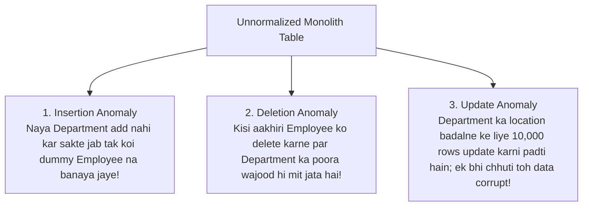
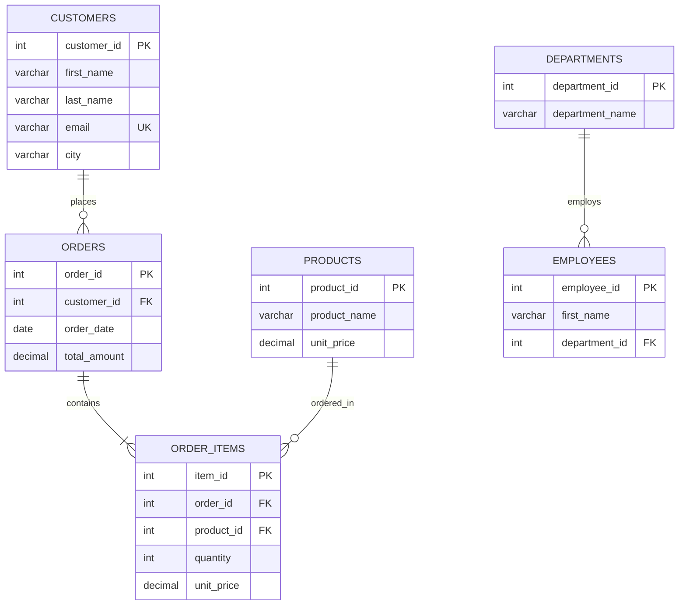

# Chapter 16 — Relational Integrity: Database Normalization & Anomalies (Normalization Aur Anomalies)

---

## 1. What is it? (Ye Kya Hai?)

**Database Normalization** relational database design ka ek formal aur mathematical process hai, jise relational model ke founder **Edgar F. Codd** ne introduce kiya tha. Iska main purpose table ke andar data redundancy (unnecessary duplicate data) ko minimize karna aur dangerous **modification anomalies** ko prevent karna hai.

Normalization ke zariye hum bade, unorganized aur monolithic tables ko systematically chhote, well-structured aur tightly focused tables me divide (decompose) karte hain, jo aapas me foreign keys ke zariye jude hote hain.

Database architecture ki duniya me Normalization ka ek bohot famous golden rule hai:

> *"Every non-key attribute must provide a fact about the key, the whole key, and nothing but the key, so help me Codd."*
> *(Har non-key column ko key, poori key, aur sirf key ke baare me hi jaankari deni chahiye!)*

### 1.1. The Three Modification Anomalies (Teen Modification Anomalies)
Agar table ko bina normalize kiye ek hi jagah saara data store karne ki koshish ki jaye, toh teen critical data integrity failures aate hain:



1. **Insertion Anomaly**: Ek valid business fact ko database me enter na kar pana kyunki doosri unrelated entity ki dummy ya `NULL` information fill karna majboori ban jata hai. (For example: Jab tak aap company me naye `'Research'` department ke liye pehla employee hire nahi kar lete, tab tak aap database me `'Research'` department exist karta hai ye record hi nahi kar sakte!).
2. **Deletion Anomaly**: Kisi ek record ko delete karne ke side-effect ke taur par kisi doosre zaroori business fact ka anjane me permanently delete ho jana. (For example: Agar `'Legal'` department me sirf ek hi employee kaam karta hai aur wo resign kar deta hai, toh us employee ki row delete karte hi database se ye fact bhi erase ho jayega ki company me kabhi `'Legal'` department tha aur uska office kahan tha!).
3. **Update (Modification) Anomaly**: Redundant data hone ki wajah se paida hone wali data inconsistency. (For example: Agar `'Engineering'` department ka location 500 employees ki rows me repeat ho raha hai, aur office naye floor par shift hota hai, toh sabhi 500 rows ko update karna padega. Agar network break hone se 250 rows update hui aur baki reh gayi, toh aadhe employees alag location dikhayenge aur aadhe alag—data corrupt ho gaya!).

---

## 2. Why do we use it? (Hum Iska Use Kyun Karte Hain?)

Database me data redundancy se storage waste hota hai, memory buffer pool par load badhta hai, aur sabse badi baat—data par bharosa khatam ho jata hai. Normalization ka scientific foundation **Functional Dependency** par tika hota hai:

A **Functional Dependency** (ise $X \rightarrow Y$ likha jata hai) columns ke beech ka mathematical relationship batata hai:
* Attribute $Y$, attribute $X$ par functionally dependent tab kehlata hai jab $X$ ki har distinct value ke liye $Y$ ki exactly ek hi value associate hoti hai.
* *Example*: `employees` table me, `employee_id` $\rightarrow$ `email` (agar aapko employee ID pata hai, toh uska exactly ek unique email hoga).

---

## 3. Syntax (Syntax Aur Progressive Normal Forms)

Chaliye step-by-step dekhte hain ki kaise har Normal Form ke rules aur unke SQL DDL transformations kaam karte hain:

### 3.1. First Normal Form (1NF): Atomic Values & No Repeating Groups
Ek table **1NF** me tab hoti hai jab:
1. Har column me sirf **atomic (indivisible)** scalar values hon (comma-separated lists ya arrays strictly prohibited hain).
2. Table me columns ke **repeating groups** na hon (jaise `phone1`, `phone2`, `phone3`).
3. Har record ko uniquely identify karne ke liye ek **Primary Key** maujood ho.

```sql
-- VIOLATES 1NF: Multi-valued list in a single column
CREATE TABLE bad_orders_unf (
    order_id INT,
    customer_name VARCHAR(100),
    product_ids VARCHAR(100) -- e.g. '1, 3, 4' VIOLATES 1NF!
);

-- CONVERTED TO 1NF: Atomic rows
CREATE TABLE orders_1nf (
    order_id INT,
    product_id INT,
    customer_name VARCHAR(100),
    PRIMARY KEY (order_id, product_id)
);
```

### 3.2. Second Normal Form (2NF): No Partial Dependencies
Ek table **2NF** me tab hoti hai jab:
1. Ye pehle se **1NF** me ho.
2. Isme **koi partial functional dependencies na hon**: har non-key attribute composite primary key ke **poore set** par depend kare, na ki key ke kisi chhote hisse par.
*(Note: Agar table ki primary key single-column hai, toh 1NF satisfy hote hi table automatically 2NF me hoti hai!)*

```sql
-- VIOLATES 2NF: Composite PK is (order_id, product_id).
-- But 'product_name' and 'unit_price' depend ONLY on product_id, NOT on order_id!
CREATE TABLE bad_order_items_2nf (
    order_id INT,
    product_id INT,
    quantity INT,            -- Depends on BOTH (order_id, product_id) -> Full dependency
    product_name VARCHAR(50),-- Depends ONLY on product_id -> PARTIAL DEPENDENCY!
    PRIMARY KEY (order_id, product_id)
);

-- CONVERTED TO 2NF: Decompose into two tables
CREATE TABLE products_2nf (
    product_id INT PRIMARY KEY,
    product_name VARCHAR(50)
);

CREATE TABLE order_items_2nf (
    order_id INT,
    product_id INT,
    quantity INT,
    PRIMARY KEY (order_id, product_id),
    FOREIGN KEY (product_id) REFERENCES products_2nf(product_id)
);
```

### 3.3. Third Normal Form (3NF): No Transitive Dependencies
Ek table **3NF** me tab hoti hai jab:
1. Ye pehle se **2NF** me ho.
2. Isme **koi transitive functional dependencies na hon**: non-key attributes kisi doosre non-key attribute par depend nahi hone chahiye ($X \rightarrow Y$ aur $Y \rightarrow Z$, meaning $X \rightarrow Z$). Non-key attributes ko sirf aur sirf primary key par depend hona chahiye.

```sql
-- VIOLATES 3NF: PK is employee_id.
-- employee_id -> department_id, and department_id -> department_name.
-- Therefore, department_name depends transitively on employee_id via department_id!
CREATE TABLE bad_employees_3nf (
    employee_id INT PRIMARY KEY,
    first_name VARCHAR(50),
    department_id INT,
    department_name VARCHAR(50), -- TRANSITIVE DEPENDENCY!
    department_location VARCHAR(50)
);

-- CONVERTED TO 3NF: Decompose into departments and employees
CREATE TABLE departments_3nf (
    department_id INT PRIMARY KEY,
    department_name VARCHAR(50),
    department_location VARCHAR(50)
);

CREATE TABLE employees_3nf (
    employee_id INT PRIMARY KEY,
    first_name VARCHAR(50),
    department_id INT,
    FOREIGN KEY (department_id) REFERENCES departments_3nf(department_id)
);
```

### 3.4. Boyce-Codd Normal Form (BCNF): Strict 3NF
Ek table **BCNF** me tab hoti hai jab har non-trivial functional dependency $X \rightarrow Y$ ke liye, determinant $X$ hamesha ek **Super Key** ho. BCNF un rare edge cases aur anomalies ko fix karta hai jahan 3NF table me multiple overlapping composite candidate keys hoti hain.

---

## 4. Basic Example (Controlled Denormalization: When & Why?)

Jabki 3NF transactional environments (**OLTP**) ke liye gold standard hai (write locking minimize karne aur update anomalies eliminate karne ke liye), enterprise architectures me reporting aur analytics (**OLAP**) ke liye **Controlled Denormalization** ka use kiya jata hai:

| Dimension | Normalized Schema (3NF) | Denormalized Schema (Star / Snowflake) |
| :--- | :--- | :--- |
| **Primary Goal** | Minimize redundancy; safe, atomic `INSERT`/`UPDATE`/`DELETE`. | Maximize query speed for massive analytical reads. |
| **Workload Type** | High-concurrency OLTP (e.g., e-commerce checkouts). | Business Intelligence & Data Warehousing (e.g., Snowflake, BigQuery). |
| **Query Complexity** | Requires multiple `JOIN`s to reconstruct entities. | Pre-joined wide tables; minimal joins. |
| **Storage Overhead** | Compact storage footprints. | Higher disk consumption due to repeated dimension values. |

### Practical Denormalization Example: Pre-Aggregated Totals
Hamari `orders` table me, `total_amount` technically ek denormalized calculated column hai (kyunki ise `order_items` se `SUM(quantity * unit_price * (1 - discount)) + shipping_fee` karke dynamically derive kiya ja sakta hai).
* *Why store it?*: Millions of historic line items par har baar customer dashboard load hone par total calculate karna enormous CPU cycles waste karta hai. Finalized sum ko `orders.total_amount` me cache karna ek intentional, controlled denormalization trade-off hai.

---

## 5. Real-World Example (Real-World Normalization Transformation)

Dekhte hain ki kaise ek unorganized spreadsheet invoice row hamare clean, 3NF `sql_mastery` schema me transform hoti hai:

### The Raw Unnormalized Invoice Row (Spreadsheet)
```
Order_ID: 1001
Order_Date: 2023-08-01
Customer_Name: Emily Watson
Customer_Email: emily.watson@gmail.com
Customer_City: San Francisco
Products_Ordered: "Quantum Pro 15 Laptop (Qty: 1, $1299.99), TrueSound Headphones (Qty: 1, $249.50)"
Department: Sales
Department_Head: Elena Rostova
```

### The 3NF Relational Decomposition:


---

## 6. Step-by-Step Explanation (Step-by-Step Explanation)

Upar diye gaye real-world transformation ko step-by-step samjhiye:
* **1NF achieved**: `Products_Ordered` multi-valued string ko break karke `order_items` table me individual atomic rows banaya gaya.
* **2NF achieved**: `product_name` ko separate `products` table me decouple kiya gaya taaki wo line item composite key par partially depend na kare.
* **3NF achieved**: Customer contact information ko `customers` table me move kiya gaya, aur Department Head metadata ko `departments` aur `employees` me separate kiya gaya, jisse transitive dependencies poori tarah eliminate ho gayi.

---

## 7. Expected Result (Expected Result)

Jab normalization successfully execute ho jaati hai, toh schema ka har attribute single responsibility principle ko follow karta hai:
1. Department name ya location badalne ke liye sirf `departments` table me ek single row update karni hoti hai—zero update anomalies!
2. Naya department create karne ke liye dummy employee invent nahi karna padta—zero insertion anomalies!
3. Kisi employee ke resign karne par company ka department record erase nahi hota—zero deletion anomalies!

---

## 8. Common Mistakes (Common Mistakes)

1. **Over-Normalizing to the Point of Paralysis**:
   * Har attribute ke liye alag lookup table bana dena (jaise `cities`, `postal_codes`, `street_names`). Har basic query 15 joins require karti hai, jisse query performance degrade ho jaati hai. 3NF transactional systems ke liye optimal balance provide karta hai.
2. **Failing to Enforce Foreign Keys on Decomposed Tables**:
   * Unnormalized table ko split toh kar diya, lekin foreign key constraints define nahi kiye. Isse orphaned records badhte hain aur normalization ka benefit khatam ho jata hai.
3. **Premature Denormalization**:
   * Query profiling se bottleneck prove hone se pehle hi tables me columns duplicate karna shuru kar dena. Hamesha clean 3NF schema se shuru karein; denormalize sirf tab karein jab measurable bottleneck ho.

---

## 9. Best Practices (Best Practices)

1. **Normalize for Writes, Denormalize for Reads**:
   * Apne core operational transactional database ko strict **3NF** me design karein data integrity guarantee karne ke liye.
   * Heavy reporting queries ke liye data ko asynchronously analytics data warehouse me replicate karein jo denormalized **Star Schema** (Fact aur Dimension tables) me organized ho.
2. **Maintain Point-of-Sale Snapshots**:
   * Checkout date ke samay charge kiya gaya price transaction record me store karna redundancy nahi hai; ye historical audit truth represent karta hai.
3. **Use Triggers or Application Services to Guard Denormalized Caches**:
   * Agar aap koi calculated metric (jaise `orders.total_amount`) cache karte hain, toh triggers ya application services ke through ensure karein ki cached sum hamesha line items ke sath synchronized rahe.

---

## 10. Practice Questions (Practice Questions)

### Easy
1. Define the three modification anomalies: Insertion, Deletion, and Update anomalies.
2. What core rule must a table satisfy to achieve First Normal Form (1NF)?
3. If a table has a single-column primary key and satisfies 1NF, is it automatically in 2NF? Explain why.

### Medium
4. Identify the transitive dependency in this table: `Student_ID, Student_Name, Dorm_Name, Dorm_Building_Manager`. How should this table be normalized to 3NF?
5. Explain how splitting `orders` and `order_items` into two tables solves the partial dependency violation of 2NF.
6. A table has columns `(Author_ID, Book_ISBN, Book_Title, Author_Bio, Publication_Year)`. With a primary key of `(Author_ID, Book_ISBN)`, which normal form is violated?

### Difficult
7. Given the functional dependencies:
   * $A \rightarrow B$
   * $B \rightarrow C$
   * $C \rightarrow D$
   Decompose a relation $R(A, B, C, D)$ into a collection of 3NF relations without losing any dependency or data.
8. Explain Boyce-Codd Normal Form (BCNF) using a concrete real-world scenario where a table is in 3NF but fails BCNF due to overlapping composite candidate keys.

---

## 11. Interview Questions (Interview Questions)

### Q1: Explain the statement: "Every non-key attribute must depend on the key, the whole key, and nothing but the key."
**Answer**: This phrase summarizes the first three Normal Forms:
1. **"On the key" (1NF)**: Every non-key attribute must be functionally dependent on the table's primary key identifier.
2. **"The whole key" (2NF)**: In tables with a composite primary key, every non-key attribute must depend on the complete key as a whole, rather than on a partial subset of the primary key columns (eliminating partial dependencies).
3. **"And nothing but the key" (3NF)**: Non-key attributes must depend exclusively on the primary key, and cannot depend on any other non-key attributes (eliminating transitive dependencies).

### Q2: What is an Update Anomaly, and what real-world danger does it pose to a business?
**Answer**: An Update Anomaly occurs when redundant, duplicate data exists across multiple rows in an unnormalized table. Modifying that data requires locating and updating every single duplicate occurrence. If a network interruption, server crash, or poorly formatted query updates only a subset of those rows, the database enters an inconsistent state where conflicting values represent the same entity. In business applications, this causes critical errors—such as shipping merchandise to an outdated address or billing an obsolete subscription rate.

### Q3: Why do Data Warehouses frequently utilize denormalized schemas (like Star Schemas) instead of 3NF?
**Answer**: 
* **OLTP systems** prioritize fast, safe, highly concurrent single-row inserts and updates. 3NF is ideal because each fact is stored in exactly one place, eliminating locking overhead and update anomalies.
* **OLAP / Data Warehouses** prioritize complex analytical read queries scanning millions of historical records across multiple dimensions. In 3NF, calculating annual revenue across regions requires joining 10+ tables, requiring massive memory for join buffers. Denormalized Star Schemas combine attributes into wide Dimension tables surrounding a central Fact table, minimizing joins, enabling columnar storage compression, and speeding up aggregation queries.

---

## 12. Quick Revision (Quick Revision)

* **Normalization** eliminates redundancy and prevents Insertion, Deletion, and Update anomalies.
* **1NF**: Atomic scalar values; no repeating groups; primary key identified.
* **2NF**: Satisfies 1NF + no **partial dependencies** on composite primary keys.
* **3NF**: Satisfies 2NF + no **transitive dependencies** between non-key attributes.
* **BCNF**: Strict 3NF where every determinant must be a Super Key.
* Use **3NF for transactional OLTP databases**; use **controlled denormalization (Star Schema) for analytics and data warehousing**.
