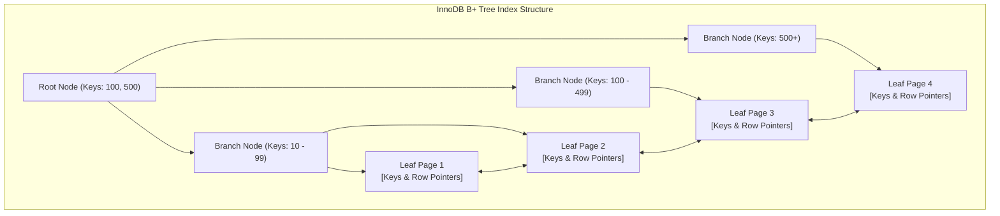
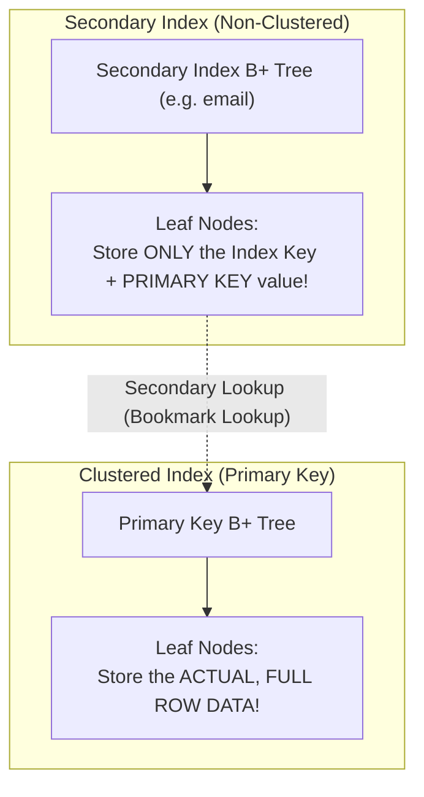

# Chapter 18 — Query Acceleration: MySQL B-Tree Indexes & Optimization (B-Tree Indexes Aur Optimization)

---

## 1. What is it? (Ye Kya Hai?)

Relational database systems me **Index** disk par bani ek aisi specialized, highly-ordered data structure hoti hai (MySQL ke InnoDB engine me mukhya roop se **B+ Tree**) jo database engine ko $O(\log N)$ logarithmic time complexity ke andar specific rows dhundhne ki facility deti hai. Isse engine ko disk par maujood har ek data page ko scan nahi karna padta.

### The Book Index Analogy (Kitab Ke Index Ka Example)
Maan lijiye aap 800 pages ki ek moti Database Engineering textbook me *"Foreign Keys"* topic dhundh rahe hain:
* **Full Table Scan (Bina Index Ke)**: Aapko page 1 se lekar page 800 tak har ek page palat-palat kar ek-ek paragraph padhna padega. Isme ghanto lag jayenge!
* **Index Seek (Index Ke Saath)**: Aap kitab ke aakhiri panno par bane Alphabetical Index par jaate hain, *"Foreign Keys"* dekhte hain, wahan likha milta hai *"Pages 145, 148"*, aur aap 2 seconds ke andar seedhe page 145 open kar lete hain. Database Index bhi bilkul yahi kaam karta hai!

### 1.1. The Physical B+ Tree Architecture (Physical B+ Tree Architecture)
MySQL ke default **InnoDB** engine me indexes balanced search trees (**B+ Trees**) ke roop me store hote hain:
* **Root & Branch Nodes**: Ye tree ke top aur middle levels hote hain jo sirf key values aur child page pointers store karte hain taaki search navigation tezi se ho sake.
* **Leaf Nodes**: Ye tree ka sabse nichla level (bottom tier) hota hai. B+ Tree me sabhi leaf nodes aapas me ek doubly-linked list ke zariye jude hote hain, jisse range scans (jaise `BETWEEN 10 AND 50`) bohot fast ho jaate hain.
* **Depth**: Karodo rows wale database me bhi B+ Tree ki depth aamtaur par sirf 3 se 4 levels hoti hai. Iska matlab hai ki lakho-karodo rows me se kisi bhi row ko sirf 3 ya 4 disk page reads ke andar search kiya ja sakta hai!



---

## 2. Why do we use it? (Hum Iska Use Kyun Karte Hain?)

Jab table me lakho ya karodo records hote hain, toh bina index ke query run karna poor server ko freeze kar sakta hai. Lekin index use karte waqt **Clustered Index** aur **Secondary Index** ke beech ka physical difference samajhna sabse zyada zaroori hai:



1. **Clustered Index**:
   * InnoDB engine me, table khud hi Clustered Index hoti hai (table *is* the clustered index).
   * Ye table ki `PRIMARY KEY` dwara define hota hai.
   * Clustered index ke leaf nodes ke andar actual physical row ka poora data store hota hai!
   * Ek table ke paas **sirf aur sirf ek** clustered index ho sakta hai.
2. **Secondary (Non-Clustered) Index**:
   * Primary key ke alawa kisi bhi doosre column par banaya gaya index (jaise `CREATE INDEX idx_email ON customers(email)`).
   * Leaf nodes row ka data ya physical disk offsets store nahi karte; balki indexed column value aur us row ki **Primary Key value** store karte hain.
   * Jab aap secondary index se query karte hain, MySQL pehle secondary B+ Tree traverse karta hai, Primary Key nikalta hai, aur phir baki columns fetch karne ke liye Clustered Index me doosra lookup karta hai (jise **Bookmark Lookup** kaha jata hai).

---

## 3. Syntax (Syntax)

```sql
-- 1. Create a Single-Column Index
CREATE INDEX idx_customers_city ON customers(city);

-- 2. Create a Composite (Multi-Column) Index
CREATE INDEX idx_orders_customer_status ON orders(customer_id, status);

-- 3. Create a Unique Index (Enforces uniqueness while indexing)
CREATE UNIQUE INDEX uq_suppliers_email ON suppliers(contact_email);

-- 4. Inspect Indexes on a Table
SHOW INDEX FROM table_name;

-- 5. Drop an Index
DROP INDEX idx_customers_city ON customers;

-- 6. Verify Index Usage with EXPLAIN
EXPLAIN SELECT * FROM customers WHERE city = 'San Francisco';
```

---

## 4. Basic Example (Basic Example)

### The Leftmost Prefix Rule for Composite Indexes
Jab aap multiple columns `(colA, colB, colC)` par composite index banate hain, toh MySQL us index ko sirf un queries ke liye use kar sakta hai jo filter karti hain:
* `colA` alone
* `colA` AND `colB`
* `colA` AND `colB` AND `colC`

Lekin MySQL is index ko use **nahi** kar sakta agar query filter kare:
* `colB` alone
* `colC` alone
* `colB` AND `colC`

> [!TIP]
> Composite index ko ek aisi telephone directory ki tarah samjhiye jo `(Last_Name, First_Name)` ke order me sorted hai. Isme kisi `"Smith"` (`colA`) ya `"Smith, John"` (`colA, colB`) ko dhundhna bohot aasan hai. Lekin agar aapko kisi aise insaan ko dhundhna ho jiska sirf first name `"John"` (`colB` alone) pata ho, toh aapko poori phone book shuru se aakhir tak scan karni padegi!

### Index Creation and Analysis on `customers` Table:
```sql
USE sql_mastery;

-- Inspect initial default indexes created by primary keys and foreign keys
SHOW INDEX FROM customers;

-- Create an index on the city column
CREATE INDEX idx_customers_city ON customers(city);

-- Analyze query execution plan with EXPLAIN
EXPLAIN SELECT customer_id, first_name, last_name, city
FROM customers
WHERE city = 'San Francisco';

-- Clean up
DROP INDEX idx_customers_city ON customers;
```

---

## 5. Real-World Example (Real-World Example)

Ek **Covering Index** wo index hota hai jisme query dwara maange gaye saare columns (`SELECT`, `WHERE`, `GROUP BY`, aur `ORDER BY` clauses) index ke andar hi maujood hote hain. Jab query covered hoti hai, toh InnoDB result poori tarah secondary index tree se hi return kar deta hai, jisse clustered index ka secondary lookup (bookmark lookup) completely eliminate ho jata hai!

```sql
USE sql_mastery;

-- Scenario: The mobile API frequently queries customer loyalty rankings by country:
-- SELECT customer_id, loyalty_points, country FROM customers WHERE country = 'USA';

-- Step 1: Without a covering index, check execution plan
EXPLAIN SELECT customer_id, loyalty_points, country 
FROM customers 
WHERE country = 'USA';

-- Step 2: Create a composite covering index
-- Notice that customer_id is automatically included in every secondary index leaf node in InnoDB!
CREATE INDEX idx_cov_country_loyalty ON customers(country, loyalty_points);

-- Step 3: Check execution plan with the covering index in place
-- Notice 'Using index' in the Extra column: Zero clustered index lookups!
EXPLAIN SELECT customer_id, loyalty_points, country 
FROM customers 
WHERE country = 'USA';

-- Clean up
DROP INDEX idx_cov_country_loyalty ON customers;
```

---

## 6. Step-by-Step Explanation (Step-by-Step Explanation)

Index health verify karne ke liye `EXPLAIN` command run karte waqt in key columns ko inspect karein:

| EXPLAIN Field | Ideal Target Value | Danger Value | Technical Explanation |
| :--- | :--- | :--- | :--- |
| **`type`** | `const`, `eq_ref`, `ref`, `range` | `ALL` | Access mechanism. `ALL` indicates a full table scan; `ref` ya `range` indicates index usage. |
| **`possible_keys`** | Name of your index | `NULL` | Optimizer ne jin indexes ko consider kiya. |
| **`key`** | Name of index actually chosen | `NULL` | Cost-Based Optimizer dwara select kiya gaya actual index. |
| **`rows`** | Lowest possible number | Total table rows | Engine ko inspect karne ke liye estimated disk rows ka count. |
| **`Extra`** | `Using index` (Covering!) | `Using filesort`, `Using temporary` | Performance notes. `Using index` means query memory me covered hai; `Using filesort` indicates sorting without index. |

---

## 7. Expected Result (Expected Result)

Covering Index banane se pehle aur baad ke `EXPLAIN` output ka comparison:

Before index creation:
```
+----+-------------+-----------+------------+------+---------------+------+---------+------+------+----------+-------------+
| id | select_type | table     | partitions | type | possible_keys | key  | key_len | ref  | rows | filtered | Extra       |
+----+-------------+-----------+------------+------+---------------+------+---------+------+------+----------+-------------+
|  1 | SIMPLE      | customers | NULL       | ALL  | NULL          | NULL | NULL    | NULL |   10 |    10.00 | Using where |
+----+-------------+-----------+------------+------+---------------+------+---------+------+------+----------+-------------+
```
*(Notice karein `type: ALL` aur `key: NULL` $\rightarrow$ Full Table Scan).*

After creating `idx_cov_country_loyalty`:
```
+----+-------------+-----------+------------+------+------------------------+------------------------+---------+-------+------+----------+-------------+
| id | select_type | table     | partitions | type | possible_keys          | key                    | key_len | ref   | rows | filtered | Extra       |
+----+-------------+-----------+------------+------+------------------------+------------------------+---------+-------+------+----------+-------------+
|  1 | SIMPLE      | customers | NULL       | ref  | idx_cov_country_loyalty| idx_cov_country_loyalty| 202     | const |    4 |   100.00 | Using index |
+----+-------------+-----------+------------+------+------------------------+------------------------+---------+-------+------+----------+-------------+
```
*(Notice karein `type: ref`, `key: idx_cov_country_loyalty`, aur `Extra: Using index` $\rightarrow$ Clustered table lookup zero ho gaya, blazing-fast response!).*

---

## 8. Common Mistakes (Common Mistakes)

Indexes free nahi hote. Har index ke sath significant trade-offs aate hain:
1. **The Write Penalty (DML Overhead)**: Har baar jab `INSERT`, `UPDATE`, ya `DELETE` run hota hai, database engine ko na sirf clustered table update karni padti hai, balki table ke **har ek secondary index** ke B+ Tree ko rebalance aur update karna padta hai! Ek table jisme 10 indexes hain, wo har single insert par 11 distinct index trees me write karegi, jisse heavy write slowdown hoga.
2. **Buffer Pool RAM Consumption**: Index trees disk space consume karte hain aur MySQL Buffer Pool (RAM) ke liye compete karte hain, jisse active data pages memory se bahar push ho jaate hain.
3. **Indexing Low-Cardinality Columns**: Aise column par index lagana jisme bohot kam distinct values hoti hain (jaise `is_active BOOLEAN` ya `gender`) aamtaur par useless hota hai. Agar table ki 50% rows `is_active = TRUE` hain, toh optimizer index ko ignore karke full table scan karega, kyunki sequentially scan karna random index lookup se zyada fast hota hai.
4. **Neglecting the Leftmost Prefix**: Composite index `(A, B)` banakar query me sirf `WHERE B = 'val'` filter karna; is case me index completely unutilized rehta hai.

---

## 9. Best Practices (Best Practices)

1. **Index Columns Frequently Used in `WHERE`, `JOIN ... ON`, and `ORDER BY` Clauses**:
   * Unhi columns ko index karein jo high cardinality (zyada unique values) rakhte hon ya foreign key joins ka hissa hon.
2. **Follow the Leftmost Prefix Rule in Composite Indexes**:
   * Composite index banate waqt columns ko highest selectivity se lowest selectivity ke order me arrange karein: `(high_cardinality_col, low_cardinality_col)`.
3. **Design Covering Indexes for High-Frequency Queries**:
   * Critical high-throughput API endpoints ke liye covering index banayein taaki clustered index bookmark lookups eliminate ho sakein (`Extra: Using index`).
4. **Audit and Remove Unused or Duplicate Indexes**:
   * MySQL ke `sys.schema_unused_indexes` view ko regularly inspect karein. Jo indexes kisi bhi query dwara use nahi ho rahe, unhe drop karein taaki write speed boost ho sake.

---

## 10. Practice Questions (Practice Questions)

### Easy
1. MySQL InnoDB engine me indexes store karne ke liye mukhya roop se kaun sa data structure use hota hai?
2. InnoDB me Clustered Index aur Secondary Index ke beech sabse bada basic difference kya hai?
3. Ek table par maximum kitne Clustered Indexes ho sakte hain?

### Medium
4. Agar `orders(customer_id, order_date, status)` par composite index bana ho, toh inme se kaun si query `WHERE` clauses is index ka use kar sakti hain?
   * A: `WHERE customer_id = 5`
   * B: `WHERE order_date = '2023-08-01'`
   * C: `WHERE customer_id = 5 AND order_date = '2023-08-01'`
   * D: `WHERE status = 'Delivered'`
5. `employees` table ke `hire_date` column par `idx_emp_hire_date` naam ka index create karne ke liye SQL statement likhiye.
6. `EXPLAIN` query plan ke `Extra` column me `Using filesort` aane ka kya matlab hota hai?

### Difficult
7. "Covering Index" kya hota hai aur ye InnoDB me "Bookmark Lookup" step ko kaise completely prevent karta hai? `products` table ke liye ek concrete query aur covering index definition likhiye.
8. Agar kisi indexed query predicate par run karne par 40% matching rows aane wali hon, toh MySQL Cost-Based Optimizer jaan-boojhkar index ko ignore karke Full Table Scan (`type: ALL`) kyun choose karta hai?

---

## 11. Interview Questions (Interview Questions)

### Q1: Samjhaiye ki InnoDB ka B+ Tree index `WHERE id BETWEEN 100 AND 200` jaisi range query ko internally kaise execute karta hai?
**Answer**: InnoDB B+ Tree index me engine sabse pehle **Root Node** se shuru karta hai aur target key `100` ko branch nodes ke pointers ke sath compare karte hue $O(\log N)$ time me us specific **Leaf Node Page** par pahunchta hai jahan key `100` maujood hai. 

Kyunki B+ Tree ke sabhi leaf nodes aapas me doubly-linked list ke zariye jude hote hain, engine ko agle keys (`101`, `102`...) dhundhne ke liye wapas upar tree traversal nahi karna padta! Wo linked leaf pages par aage sequential scan karta rehta hai aur rows read karta jata hai jab tak ki use `200` se badi key nahi milti. Jaise hi `> 200` milta hai, scan turant ruk jata hai.

### Q2: MySQL multi-column indexing me "Leftmost Prefix Rule" kya hota hai?
**Answer**: Leftmost Prefix Rule ka niyam ye hai ki multiple columns `(A, B, C)` par bana composite index sirf tabhi use ho sakta hai jab query ke filtering predicates sabse leftmost column `A` se shuru hote hon. Index in queries ko accelerate karega:
* `(A)`
* `(A, B)`
* `(A, B, C)`
Lekin agar query sirf `(B)` par, sirf `(C)` par, ya `(B, C)` par filter karegi (bina `A` ke), toh optimizer is index ko use nahi kar payega. Aisa isliye hai kyunki composite B+ Tree physically pehle `A` ke order me sort hota hai, fir `A` ke andar `B` sort hota hai, aur `B` ke andar `C` sort hota hai.

### Q3: Database table par bohot zyada indexes banane ke kya nuksan hote hain?
**Answer**:
1. **DML Write Penalty**: Har `INSERT`, `UPDATE`, aur `DELETE` operation ko clustered table ke sath-sath sabhi secondary index trees ko update aur rebalance karna padta hai, jisse write operations bohot slow ho jaate hain.
2. **Buffer Pool Contention**: Sabhi indexes InnoDB Buffer Pool (RAM) me jagah gherte hain, jisse active data pages memory se bahar dhakel diye jaate hain aur disk I/O badh jata hai.
3. **Storage Overhead**: Lakho rows wali tables me secondary indexes ka cumulative disk space table ke actual data se bhi bada ho sakta hai.
4. **Optimizer Latency**: Bohot saare overlapping indexes hone par MySQL Cost-Based Optimizer ko query plan generate karne me zyada samay lagta hai kyunki use multiple candidate indexes ko evaluate karna padta hai.

---

## 12. Quick Revision (Quick Revision)

* **Index** ek B+ Tree search structure hai jo queries ko $O(N)$ full table scans se badal kar $O(\log N)$ fast logarithmic seeks me convert karta hai.
* **Clustered Index**: Table ki `PRIMARY KEY` dwara define hota hai; leaf nodes me poori row ka physical data hota hai.
* **Secondary Index**: Indexed column aur Primary Key ki value store karta hai (bookmark lookup required).
* **Covering Index**: Saare required columns index me hi maujood hote hain, jisse bookmark lookup eliminate ho jata hai (`Using index`).
* Multi-column composite indexes strictly **Leftmost Prefix Rule** ko obey karte hain.
* Indexes reads ko superfast banate hain, lekin `INSERT`, `UPDATE`, aur `DELETE` par **Write Penalty** impose karte hain.
