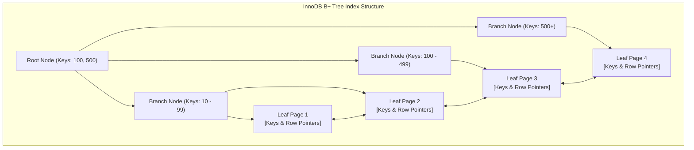
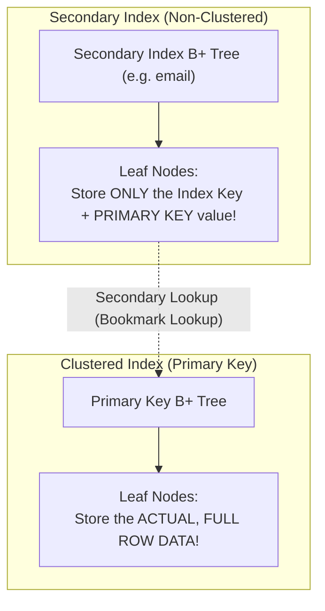

# Chapter 18 — Query Acceleration: MySQL B-Tree Indexes & Optimization (क्वेरी एक्सेलेरेशन: MySQL B-Tree इंडेक्स और ऑप्टिमाइज़ेशन)

---

## 1. What is it? (यह क्या है?)

Relational database systems mein **Index** disk par bani ek aisi specialized, highly-ordered data structure hoti hai (MySQL ke InnoDB engine mein mukhya roop se **B+ Tree**) jo database engine ko $O(\log N)$ logarithmic time complexity ke andar specific rows dhundhne ki suvidha deti hai. Isse engine ko disk par maujood har ek data page ko scan nahi karna padta.

### The Book Index Analogy (किताब के इंडेक्स का उदाहरण)
Maan lijiye aap 800 panno ki ek moti Database Engineering ki kitaab mein *"Foreign Keys"* topic dhundh rahe hain:
* **Full Table Scan (बिना इंडेक्स के)**: Aapko page 1 se lekar page 800 tak har ek panna palat-palat kar ek-ek paragraph padhna padega. Isme ghanto lag jayenge!
* **Index Seek (इंडेक्स के साथ)**: Aap kitaab ke aakhiri panno par bane Alphabetical Index par jate hain, *"Foreign Keys"* dekhte hain, wahan likha milta hai *"Pages 145, 148"*, aur aap 2 second ke andar seedhe page 145 khol lete hain. Database Index bhi bilkul yahi jaadu karta hai!

### 1.1. The Physical B+ Tree Architecture (B+ Tree का भौतिक ढाँचा)
MySQL ke default **InnoDB** engine mein indexes balanced search trees (**B+ Trees**) ke roop mein store hote hain:
* **Root & Branch Nodes**: Ye tree ke upar aur beech ke levels hote hain jo sirf key values aur child page pointers store karte hain taaki search navigation tezi se ho sake.
* **Leaf Nodes**: Ye tree ka sabse nichla level (bottom tier) hota hai. B+ Tree mein sabhi leaf nodes aapas mein ek doubly-linked list ke zariye jude hote hain, jisse range scans (jaise `BETWEEN 10 AND 50`) bohot fast ho jate hain.
* **Depth (Tree ki Lambai)**: Karodo rows wale database mein bhi B+ Tree ki depth aamtaur par sirf 3 se 4 levels hoti hai. Iska matlab hai ki lakho-karodo rows mein se kisi bhi row ko sirf 3 ya 4 disk page reads ke andar search kiya ja sakta hai!



---

## 2. Why do we use it? (हम इसका उपयोग क्यों करते हैं? — Clustered vs Secondary Indexes)

Jab table mein lakho ya karodo records hote hain, toh bina index ke query run karna poor server crash karwa sakta hai. Lekin index use karte waqt **Clustered Index** aur **Secondary Index** ke beech ka physical difference samajhna sabse zyada zaroori hai:



1. **Clustered Index**:
   * InnoDB engine mein, table khud hi Clustered Index hoti hai (table *is* the clustered index).
   * Ye table ki `PRIMARY KEY` dwara define hota hai.
   * Clustered index ke leaf nodes ke andar actual physical row ka poora data store hota hai!
   * Ek table ke paas **sirf aur sirf ek** clustered index ho sakta hai.
2. **Secondary (Non-Clustered) Index**:
   * Primary key ke alawa kisi bhi doosre column par banaya gaya index (jaise `CREATE INDEX idx_email ON customers(email)`).
   * Secondary index ke leaf nodes mein poori row ka data ya physical disk pointer store **nahi** hota; balki indexed column ki value ke sath us row ki **Primary Key value** store hoti hai.
   * Jab aap secondary index se query karte hain, toh MySQL pehle secondary B+ Tree ko traverse karke Primary Key nikalta hai, aur fir us Primary Key ke zariye Clustered Index mein jakar poori row ka data fetch karta hai. Is double-hop process ko **Bookmark Lookup** kaha jata hai.

---

## 3. Syntax (सिंटैक्स)

```sql
-- 1. Create a Single-Column Index
CREATE INDEX idx_customers_city ON customers(city);

-- 2. Create a Composite (Multi-Column) Index
CREATE INDEX idx_orders_customer_status ON orders(customer_id, status);

-- 3. Create a Unique Index (Enforces uniqueness while indexing)
CREATE UNIQUE INDEX uq_suppliers_email ON suppliers(contact_email);

-- 4. Inspect Indexes on a Table
SHOW INDEX FROM table_name;

-- 5. Drop an Index
DROP INDEX idx_customers_city ON customers;

-- 6. Verify Index Usage with EXPLAIN
EXPLAIN SELECT * FROM customers WHERE city = 'San Francisco';
```

---

## 4. The Leftmost Prefix Rule (बेसिक नियम — Leftmost Prefix Rule)

Jab aap multiple columns ko milakar ek Composite Index banate hain, jaise `(colA, colB, colC)`, toh MySQL is index ko sirf unhi queries ke liye use kar sakta hai jo filter karti hain:
* Sirf `colA` par
* `colA` AND `colB` par
* `colA` AND `colB` AND `colC` par

Lekin MySQL is composite index ko use **nahi** kar payega agar aapki query filter karti hai:
* Sirf `colB` par
* Sirf `colC` par
* `colB` AND `colC` par (bina `colA` ke!)

> [!TIP]
> Composite index ko ek Telephone Directory ki tarah samjhiye jo `(Last_Name, First_Name)` ke order mein printed hai. Agar aapko surname `"Sharma"` (`colA`) dhundhna hai, ya `"Sharma, Rohit"` (`colA, colB`) dhundhna hai, toh directory bohot fast kaam karegi. Lekin agar koi aapse kahe ki "Aise sabhi logon ko dhundho jinka first name `"Rohit"` (`colB`) hai chahe surname kuch bhi ho", toh aapko telephone directory ka pehla panna se lekar aakhiri panna tak poora scan karna padega!

---

## 5. Basic Example (बेसिक उदाहरण)

`customers` table par index banate hain aur `EXPLAIN` ke zariye query execution plan ko analyze karte hain:

```sql
USE sql_mastery;

-- Inspect initial default indexes created by primary keys and foreign keys
SHOW INDEX FROM customers;

-- Create an index on the city column
CREATE INDEX idx_customers_city ON customers(city);

-- Analyze query execution plan with EXPLAIN
EXPLAIN SELECT customer_id, first_name, last_name, city
FROM customers
WHERE city = 'San Francisco';

-- Clean up
DROP INDEX idx_customers_city ON customers;
```

---

## 6. Real-World Example: The Covering Index Optimization (रियल-वर्ल्ड उदाहरण — कवरिंग इंडेक्स ऑप्टिमाइज़ेशन)

**Covering Index** ek aisa index hota hai jisme query dwara maange gaye saare columns (`SELECT`, `WHERE`, `GROUP BY`, aur `ORDER BY` clauses) us index tree ke andar hi maujood hote hain!
Jab koi query covering index dwara cover hoti hai, toh InnoDB ko clustered index mein jakar double-hop bookmark lookup karne ki bilkul zaroorat nahi padti—poora data secondary index ke RAM pages se hi return ho jata hai!

```sql
USE sql_mastery;

-- Scenario: The mobile API frequently queries customer loyalty rankings by country:
-- SELECT customer_id, loyalty_points, country FROM customers WHERE country = 'USA';

-- Step 1: Without a covering index, check execution plan
EXPLAIN SELECT customer_id, loyalty_points, country 
FROM customers 
WHERE country = 'USA';

-- Step 2: Create a composite covering index
-- Notice that customer_id is automatically included in every secondary index leaf node in InnoDB!
CREATE INDEX idx_cov_country_loyalty ON customers(country, loyalty_points);

-- Step 3: Check execution plan with the covering index in place
-- Notice 'Using index' in the Extra column: Zero clustered index lookups!
EXPLAIN SELECT customer_id, loyalty_points, country 
FROM customers 
WHERE country = 'USA';

-- Clean up
DROP INDEX idx_cov_country_loyalty ON customers;
```

---

## 7. Step-by-Step Explanation & EXPLAIN Output (स्टेप-बाय-स्टेप व्याख्या और EXPLAIN आउटपुट)

Jab aap query health aur index efficiency check karne ke liye `EXPLAIN` run karte hain, toh in mukhya columns par dhyan dein:

| EXPLAIN Field | Ideal Target Value | Danger Value | Technical Explanation |
| :--- | :--- | :--- | :--- |
| **`type`** | `const`, `eq_ref`, `ref`, `range` | `ALL` | Access mechanism. `ALL` ka matlab full table scan; `ref` ya `range` ka matlab index seek. |
| **`possible_keys`** | Index ka naam | `NULL` | Optimizer ne kin indexes par vichar kiya. |
| **`key`** | Actually chuna gaya index | `NULL` | Cost-Based Optimizer ne kis index ko select kiya. |
| **`rows`** | Kam se kam number | Table ki total rows | Query execute karne ke liye engine ko kitni rows inspect karni padengi. |
| **`Extra`** | `Using index` (Covering!) | `Using filesort`, `Using temporary` | `Using index` ka matlab memory se direct return; `Using filesort` ka matlab disk/memory par unindexed sorting. |

---

## 8. Expected Result & The Write Penalty (अपेक्षित परिणाम और राइट पेनल्टी)

### Covering Index se pehle aur baad ka `EXPLAIN` comparison:

Index create karne se pehle:
```
+----+-------------+-----------+------------+------+---------------+------+---------+------+------+----------+-------------+
| id | select_type | table     | partitions | type | possible_keys | key  | key_len | ref  | rows | filtered | Extra       |
+----+-------------+-----------+------------+------+---------------+------+---------+------+------+----------+-------------+
|  1 | SIMPLE      | customers | NULL       | ALL  | NULL          | NULL | NULL    | NULL |   10 |    10.00 | Using where |
+----+-------------+-----------+------------+------+---------------+------+---------+------+------+----------+-------------+
```
*(Notice karein `type: ALL` aur `key: NULL` $\rightarrow$ Poori table ka Full Scan ho raha hai).*

`idx_cov_country_loyalty` create karne ke baad:
```
+----+-------------+-----------+------------+------+------------------------+------------------------+---------+-------+------+----------+-------------+
| id | select_type | table     | partitions | type | possible_keys          | key                    | key_len | ref   | rows | filtered | Extra       |
+----+-------------+-----------+------------+------+------------------------+------------------------+---------+-------+------+----------+-------------+
|  1 | SIMPLE      | customers | NULL       | ref  | idx_cov_country_loyalty| idx_cov_country_loyalty| 202     | const |    4 |   100.00 | Using index |
+----+-------------+-----------+------------+------+------------------------+------------------------+---------+-------+------+----------+-------------+
```
*(Notice karein `type: ref`, `key: idx_cov_country_loyalty`, aur `Extra: Using index` $\rightarrow$ Clustered table lookup zero ho gaya, blazing-fast response!).*

### The Write Penalty: Indexes Free Nahi Hote!
Database mein har naye index ki ek keemat hoti hai jise **Write Penalty (DML Overhead)** kehte hain:
1. **DML Overhead**: Jab bhi table par `INSERT`, `UPDATE`, ya `DELETE` hota hai, engine ko na sirf clustered table update karni padti hai, balki table par bane **har ek secondary index** ke B+ Tree ko rebalance aur update karna padta hai! Agar table par 10 indexes hain, toh har ek insert par 11 alag-alag index trees mein write I/O hoga.
2. **Buffer Pool RAM Consumption**: Sabhi index trees disk space lete hain aur MySQL ke Buffer Pool (RAM) ke liye compete karte hain, jisse active data pages memory se bahar dhakle jaate hain.
3. **Low-Cardinality Trap**: Aise columns par index lagana jinki bahut kam unique values hoti hain (jaise `is_active BOOLEAN` ya `gender`) bekaar hota hai. Agar table ki 50% rows `is_active = TRUE` hain, toh optimizer index ko chhod kar direct full table scan karega kyunki index traversal zyada mehenga padega.

---

## 9. Best Practices (बेस्ट प्रैक्टिसेज)

1. **`WHERE`, `JOIN ... ON`, aur `ORDER BY` wale columns par Index lagayein**:
   * Unhi columns ko index karein jo high cardinality (zyada unique values) rakhte hon ya foreign key joins ka hissa hon.
2. **Composite Indexes mein Leftmost Prefix Rule ka dhyan rakhein**:
   * Composite index banate waqt columns ko most-selective se least-selective ke order mein arrange karein: `(high_cardinality_col, low_cardinality_col)`.
3. **High-Frequency Queries ke liye Covering Index banayein**:
   * Critical API endpoints jo second mein hazaro baar run hote hain, unke liye covering index banayein taaki clustered index bookmark lookups eliminate ho sakein (`Extra: Using index`).
4. **Unused Indexes ko dhundhkar Drop karein**:
   * MySQL ke `sys.schema_unused_indexes` view ko regularly check karein. Jo indexes kabhi query mein use nahi ho rahe hain, unhe drop karein taaki write speed boost ho sake.

---

## 10. Practice Questions (अभ्यास प्रश्न)

### Easy (सरल)
1. MySQL InnoDB engine mein indexes store karne ke liye mukhya roop se kaun sa data structure use hota hai?
2. InnoDB mein Clustered Index aur Secondary Index ke beech sabse bada buniyadi antar kya hai?
3. Ek table par maximum kitne Clustered Indexes banaye ja sakte hain?

### Medium (मध्यम)
4. Agar `orders(customer_id, order_date, status)` par composite index bana ho, toh inme se kaun si queries is index ka upyog kar sakti hain?
   * A: `WHERE customer_id = 5`
   * B: `WHERE order_date = '2023-08-01'`
   * C: `WHERE customer_id = 5 AND order_date = '2023-08-01'`
   * D: `WHERE status = 'Delivered'`
5. `employees` table ke `hire_date` column par `idx_emp_hire_date` naam ka index banane ke liye SQL statement likhiye.
6. `EXPLAIN` query plan ke `Extra` column mein `Using filesort` aane ka kya matlab hota hai?

### Difficult (कठिन)
7. "Covering Index" kya hota hai aur ye InnoDB mein "Bookmark Lookup" step ko kaise completely eliminate karta hai? `products` table ke liye ek concrete query aur covering index ka DDL likhkar samjhaiye.
8. Agar kisi indexed column par query run karne par 40% matching rows aane wali hon, toh MySQL Cost-Based Optimizer jaan-boojh kar index ko ignore karke Full Table Scan (`type: ALL`) kyu choose karta hai?

---

## 11. Interview Questions (इंटरव्यू सवाल और जवाब)

### Q1: Samjhaiye ki InnoDB ka B+ Tree index `WHERE id BETWEEN 100 AND 200` jaisi range query ko internally kaise execute karta hai?
**Answer**: InnoDB B+ Tree index mein engine sabse pehle **Root Node** se shuru karta hai aur key `100` ko branch nodes ke pointers ke sath compare karte hue $O(\log N)$ steps mein us specific **Leaf Node Page** par pahunchta hai jahan key `100` maujood hai.

Kyunki B+ Tree ke sabhi leaf nodes aapas mein doubly-linked list ke zariye jude hote hain, engine ko agle keys (`101`, `102`...) dhundhne ke liye wapas upar tree traversal nahi karna padta! Wo linked leaf pages par aage sequential scan karta rehta hai aur rows read karta jata hai jab tak ki use `200` se badi key nahi milti. Jaise hi `> 200` milta hai, scan foran ruk jata hai.

### Q2: MySQL multi-column indexing mein "Leftmost Prefix Rule" kya hota hai?
**Answer**: Leftmost Prefix Rule ka niyam ye hai ki multiple columns `(A, B, C)` par bana composite index sirf tabhi use ho sakta hai jab query ke filters sabse leftmost column `A` se shuru hote hon. Index in filtering combinations par tezi se kaam karega:
* `(A)`
* `(A, B)`
* `(A, B, C)`
Lekin agar query sirf `(B)` par, sirf `(C)` par, ya `(B, C)` par filter karegi (bina `A` ke), toh optimizer is index ko use nahi kar payega. Aisa isliye hai kyunki physical B+ Tree pehle `A` ke order mein sort hota hai, fir `A` ke andar `B` sort hota hai, aur `B` ke andar `C` sort hota hai.

### Q3: Kisi table par bohot zyada indexes banane ke kya nuksan hote hain?
**Answer**:
1. **DML Write Penalty**: Har `INSERT`, `UPDATE`, aur `DELETE` operation ko clustered table ke sath-sath sabhi secondary index trees ko update aur rebalance karna padta hai, jisse writes bohot slow ho jate hain.
2. **Buffer Pool Contention**: Sabhi indexes InnoDB Buffer Pool (RAM) mein jagah gherte hain, jisse active data pages memory se bahar nikal jaate hain aur disk I/O badh jata hai.
3. **Storage Overhead**: Lakho rows wali tables mein secondary indexes ka kul size table ke actual data se bhi bada ho sakta hai.
4. **Optimizer Latency**: Bohot saare overlapping indexes hone par MySQL Cost-Based Optimizer ko query plan generate karne mein zyada samay lagta hai.

---

## 12. Quick Revision (क्विक रिविजन)

* **Index** ek B+ Tree structure hai jo queries ko $O(N)$ full table scan se badal kar $O(\log N)$ fast seeks mein convert karta hai.
* **Clustered Index**: Table ki `PRIMARY KEY` par banta hai; iske leaf nodes mein poori row ka physical data hota hai.
* **Secondary Index**: Indexed column aur Primary Key ki value store karta hai (bookmark lookup required).
* **Covering Index**: Saare required columns index mein hi maujood hote hain, jisse bookmark lookup eliminate ho jata hai (`Using index`).
* Composite indexes hamesha **Leftmost Prefix Rule** ko follow karte hain.
* Indexes reads ko superfast banate hain, lekin writes (`INSERT`/`UPDATE`/`DELETE`) par **Write Penalty** lagate hain.
