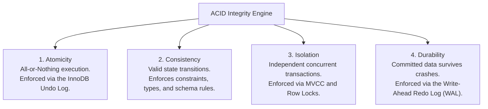
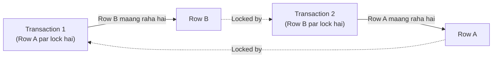

# Chapter 19 — Concurrency Control: Transactions & ACID Integrity (ट्रांजेक्शन्स और ACID इंटीग्रिटी)

---

## 1. What is it? (यह क्या है?)

Relational Database Management Systems में **Transaction** computational work ki ek aisi logical unit hoti hai jisme ek ya ek se zyada SQL statements shamil hote hain, jo sabhi milkar ek **indivisible, atomic operation** ke roop mein execute hote hain.

Enterprise production applications mein business operations shayad hi kabhi sirf ek single table tak seemit hote hain. Maan lijiye ek Banking Transfer ka classic example:
Account A se Account B mein ₹5,000 transfer karne ke liye database mein do alag-alag SQL statements run karni padengi:
1. `UPDATE accounts SET balance = balance - 5000 WHERE id = 1;`
2. `UPDATE accounts SET balance = balance + 5000 WHERE id = 2;`

Sochiye agar Step 1 run hone ke theek baad aur Step 2 run hone se pehle database server ki power chali jaye ya server crash ho jaye, toh kya hoga? Account A se ₹5,000 kat gaye lekin Account B mein pahuche hi nahi—paise hawa mein gayab ho gaye! 
Ek **Transaction** ye guarantee deta hai ki ya toh dono statements **100% succeed** hokar ek sath commit hongi, ya fir agar koi bhi error ya crash aaye, toh database automatically sabhi changes ko **Rollback** kar dega. Database wapas usi clean state mein laut aayega jaise ki transaction kabhi shuru hi na hua ho!

---

## 2. Why do we use it? (हम इसका उपयोग क्यों करते हैं? — ACID गारंटीज और आइसोलेशन लेवल्स)

Financial accuracy aur multi-user concurrency ensure karne ke liye transactional storage engines (jaise MySQL ka **InnoDB**) chaar fundamental **ACID** guarantees provide karte hain:



1. **Atomicity (परमाणुता — All or Nothing)**: Transaction ke andar ke saare statements ya toh poori tarah execute honge ya fir unka 1% hissa bhi save nahi hoga. Agar koi ek statement bhi fail hoti hai, toh pichle sabhi statements ko **Undo Log** ka use karke turant reverse kar diya jata hai.
2. **Consistency (स्थिरता — Valid States)**: Transaction database ko hamesha ek valid state se doosri valid state mein le jata hai. Primary Keys, Foreign Keys, `CHECK`, aur `NOT NULL` jaise saare schema rules transaction commit hone par satisfy hone hi chahiye.
3. **Isolation (अलगाव — Concurrency Shield)**: Ek chalte hue transaction ka intermediate (adha-adhura) kaam doosre concurrent transactions ko dikhayi nahi deta. MySQL ka Multi-Version Concurrency Control (**MVCC**) ensure karta hai ki data read karne wale transactions data write karne wale transactions ko block na karein.
4. **Durability (स्थायित्व — Crash Proof)**: Ek baar transaction commit ho gaya, toh uska data database mein permanently save ho jata hai. Bhale hi agle hi second poora server hardware blast ho jaye ya power off ho jaye, recovery ke waqt **Redo Log** (Write-Ahead Logging) se data wapas restore ho jayega!

### Concurrency Anomalies aur Chaar ANSI Isolation Levels
Jab hazaron users ek sath database ko access karte hain, toh teen concurrency problems aa sakti hain:
* **Dirty Read**: Transaction A kisi doosre Transaction B ka uncommitted data read kar leta hai jo baad mein rollback ho jata hai.
* **Non-Repeatable Read**: Transaction A ek row read karta hai, tabhi Transaction B us row ko update karke commit kar deta hai, aur Transaction A dobara read karne par badla hua data pata hai.
* **Phantom Read**: Transaction A ek range query run karta hai (`WHERE salary > 50000`), tabhi Transaction B ek nayi row insert karke commit karta hai, aur Transaction A wahi query chalane par nayi "phantom" row pata hai.

| Isolation Level | Dirty Reads Allowed? | Non-Repeatable Reads Allowed? | Phantom Reads Allowed? | Performance Impact |
| :--- | :--- | :--- | :--- | :--- |
| **`READ UNCOMMITTED`** | **Yes** (Dangerous) | Yes | Yes | Fastest; zero safety. |
| **`READ COMMITTED`** | No | Yes | Yes | PostgreSQL/Oracle standard; fast. |
| **`REPEATABLE READ`** | No | No | **No in MySQL!** (MVCC Next-Key Locks) | **MySQL Default**; high consistency. |
| **`SERIALIZABLE`** | No | No | No | Slowest; locks all read ranges. |

---

## 3. Syntax (सिंटैक्स — ट्रांजैक्शन कंट्रोल और रो लॉकिंग)

```sql
-- 1. Explicitly Start a Transaction
START TRANSACTION;
-- Alternative shorthand:
-- BEGIN;

-- 2. Execute DML Mutations
UPDATE accounts SET balance = balance - 500 WHERE account_id = 1;
UPDATE accounts SET balance = balance + 500 WHERE account_id = 2;

-- 3. Permanently Commit Changes
COMMIT;

-- 4. Revert All Uncommitted Changes on Failure
ROLLBACK;

-- 5. Intermediate Savepoints
SAVEPOINT savepoint_alpha;
-- Partially rollback to savepoint without aborting the entire transaction:
ROLLBACK TO SAVEPOINT savepoint_alpha;
-- Remove a savepoint:
RELEASE SAVEPOINT savepoint_alpha;

-- 6. Toggling AutoCommit Mode
SET autocommit = 0; -- Disables auto-commit for the session
SET autocommit = 1; -- Enables auto-commit (default in MySQL)

-- 7. Explicit Row-Level Locks (Pessimistic Locking)
-- Exclusive Lock for Update (Blocks both readers and writers on these rows)
SELECT balance FROM accounts WHERE account_id = 1 FOR UPDATE;

-- Shared Lock (Allows concurrent reads, but blocks concurrent writes)
SELECT balance FROM accounts WHERE account_id = 1 FOR SHARE;
```

---

## 4. Basic Example (बेसिक उदाहरण — COMMIT और ROLLBACK)

Ek simple test table par `COMMIT` aur `ROLLBACK` ka prabhav dekhte hain:

```sql
USE sql_mastery;

CREATE TABLE transaction_test (
    id INT PRIMARY KEY,
    val VARCHAR(50)
);

-- TEST 1: The Rollback
START TRANSACTION;
INSERT INTO transaction_test VALUES (1, 'Initial Data');
-- Change mind / simulate error:
ROLLBACK;

-- Verify: Empty set! Row 1 was not persisted
SELECT * FROM transaction_test;

-- TEST 2: The Commit
START TRANSACTION;
INSERT INTO transaction_test VALUES (2, 'Committed Data');
COMMIT;

-- Verify: Row 2 is permanently saved
SELECT * FROM transaction_test;

-- Clean up
DROP TABLE transaction_test;
```

---

## 5. Real-World Example (रियल-वर्ल्ड उदाहरण — मल्टी-टेबल ई-कॉमर्स चेकआउट)

Hamare `sql_mastery` database mein ek complete real-world e-commerce checkout transaction simulate karte hain:
1. Customer 1 Product 1 (`Quantum Pro 15 Laptop`, price $1,299.99) purchase kar raha hai.
2. Race condition rokne ke liye product row par `SELECT ... FOR UPDATE` se pessimistic lock lagayein aur inventory verify karein.
3. `products` table mein product ka `stock_quantity` 1 se decrement karein.
4. `orders` table mein parent order create karein.
5. `order_items` table mein line item insert karein.
6. `payments` table mein financial transaction record karein.
7. Chaaron operations ko ek single atomic transaction ke andar permanently `COMMIT` karein!

```sql
USE sql_mastery;

-- Begin the checkout transaction
START TRANSACTION;

-- Step 1: Pessimistic Lock on Product 1 to check stock
SELECT product_id, product_name, unit_price, stock_quantity
FROM products
WHERE product_id = 1
FOR UPDATE;

-- Step 2: Decrement inventory by 1 unit
UPDATE products
SET stock_quantity = stock_quantity - 1
WHERE product_id = 1 AND stock_quantity >= 1;

-- Step 3: Insert the parent Order record
INSERT INTO orders (order_id, customer_id, order_date, status, shipping_fee, total_amount)
VALUES (2001, 1, CURDATE(), 'Processing', 0.00, 1299.99);

-- Step 4: Insert the Order Line Item
INSERT INTO order_items (item_id, order_id, product_id, quantity, unit_price, discount)
VALUES (3001, 2001, 1, 1, 1299.99, 0.00);

-- Step 5: Record the Payment
INSERT INTO payments (payment_id, order_id, payment_date, amount, payment_method, payment_status, transaction_ref)
VALUES (4001, 2001, CURDATE(), 1299.99, 'Credit Card', 'Completed', 'TXN-CHECKOUT-9901');

-- Step 6: Commit all 4 operations atomically!
COMMIT;

-- Verification: Inspect the synchronized records across tables
SELECT o.order_id, o.status, p.payment_status, p.amount, pr.stock_quantity
FROM orders o
JOIN payments p ON o.order_id = p.order_id
JOIN order_items oi ON o.order_id = oi.order_id
JOIN products pr ON oi.product_id = pr.product_id
WHERE o.order_id = 2001;

-- Clean up the demo checkout records
DELETE FROM payments WHERE payment_id = 4001;
DELETE FROM order_items WHERE item_id = 3001;
DELETE FROM orders WHERE order_id = 2001;
UPDATE products SET stock_quantity = stock_quantity + 1 WHERE product_id = 1;
```

---

## 6. Step-by-Step Explanation (स्टेप-बाय-स्टेप व्याख्या)

1. `START TRANSACTION;`:
   * Is connection ke liye MySQL ke default `autocommit` behavior ko temporarily suspend kar deta hai. Saare aage aane wale DML statements ek private transaction context mein execute hote hain.
2. `SELECT ... FOR UPDATE`:
   * `product_id = 1` ki row par ek **Exclusive Row Lock (X-Lock)** acquire karta hai. Agar koi doosra user usi instant par usi laptop ko khareedne ki koshish karega, toh uska connection queue mein wait karega jab tak ye pehla transaction `COMMIT` ya `ROLLBACK` nahi ho jata!
3. `UPDATE products SET stock_quantity = stock_quantity - 1 ...`:
   * Buffer pool mein memory update karta hai, purani stock value ko **Undo Log** mein likhta hai aur nayi stock value ko **Redo Log** mein enter karta hai.
4. Steps 3, 4, 5 (`INSERT INTO orders`, `order_items`, `payments`):
   * Parent order, order line item aur payment records unki respective tables mein atomically insert hote hain.
5. `COMMIT;`:
   * InnoDB Redo Log buffer ko disk par flush karta hai (`fsync`).
   * `products`, `orders`, aur `payments` par lage saare row-level locks release ho jaate hain.
   * Naya order, payment, aur ghata hua stock ab poore database mein sabhi connections ko ek sath visible ho jata hai!

---

## 7. Expected Result & Deadlock Management (अपेक्षित परिणाम और डेडलॉक समाधान)

### Expected Terminal Output:
```
+----------+------------+----------------+---------+----------------+
| order_id | status     | payment_status | amount  | stock_quantity |
+----------+------------+----------------+---------+----------------+
|     2001 | Processing | Completed      | 1299.99 |             49 |
+----------+------------+----------------+---------+----------------+
1 row in set (0.00 sec)
```

### Deadlocks: Pehchan aur Resolution
**Deadlock** tab hota hai jab do concurrent transactions aisi rows par locks hold karke baith jaate hain jo doosre transaction ko chahiye hoti hain, jisse ek circular lock dependency ban jaati hai:
* Transaction 1 ne Row A par lock lagaya hai, aur wo Row B par lock maang raha hai.
* Transaction 2 ne Row B par lock lagaya hai, aur wo Row A par lock maang raha hai.
* Dono transactions ek doosre ka intezaar karte hue hamesha ke liye freeze ho jayenge!



### MySQL Deadlocks ko kaise solve karta hai?
InnoDB ke paas ek internal **Deadlock Detector** background thread hota hai jo continuous graph analysis karta hai:
1. Jaise hi circular dependency detect hoti hai, engine us transaction ko pehchanta hai jisme sabse kam data modify hua hai (lowest rollback cost).
2. InnoDB us transaction ko force abort kar deta hai, use poora rollback karta hai aur error return karta hai:
   `ERROR 1213 (40001): Deadlock found when trying to get lock; try restarting transaction`.
3. Doosre transaction ko lock mil jata hai aur wo successfully execute ho jata hai.
4. **Production Application Best Practice**: Apne backend code (Python, Java, Node.js) mein hamesha deadlock retry block banayein jo Error `1213` ko catch kare aur randomized exponential backoff ke baad transaction ko retry kare!

---

## 8. Common Mistakes (सामान्य गलतियाँ और Pitfalls)

1. **Transaction ke andar DDL Statements execute karna (Implicit Commit Trap)**:
   * *Mistake*:
     ```sql
     START TRANSACTION;
     INSERT INTO accounts VALUES (1, 500);
     CREATE TABLE temp_log (id INT); -- DDL STATEMENT!
     ROLLBACK;
     ```
   * *The Shocking Result*: Row `(1, 500)` rollback **NAHI** hoti!
   * *Why?*: MySQL mein koi bhi DDL command (`CREATE TABLE`, `ALTER TABLE`, `DROP TABLE`, `TRUNCATE`) chalne par engine internally **Implicit Commit** trigger kar deta hai. Jaise hi MySQL ne `CREATE TABLE` dekha, usne pichle `INSERT` ko disk par permanently commit kar diya. Baad mein chalaya gaya `ROLLBACK` bilkul beasar rehta hai!
2. **External HTTP / Payment Gateway APIs ko Transaction ke andar call karna**:
   * *Anti-Pattern*:
     ```python
     db.execute("START TRANSACTION")
     db.execute("SELECT ... FOR UPDATE")
     # DANGEROUS: Third-party payment gateway API call inside transaction!
     response = http.post("https://api.stripe.com/v1/charges")
     db.execute("COMMIT")
     ```
   * *Nuksan*: Agar Stripe ya Razorpay ke network call mein 3 ya 4 second lag gaye, toh database ke row-level locks poore 4 seconds tak hold rahenge! Isse lakho doosre users ke checkouts freeze ho jayenge aur `Lock wait timeout exceeded` errors flood hone lagenge. Hamesha network calls ko database transaction ke *pehle* ya *baad* mein karein.
3. **Inconsistent Lock Ordering**:
   * Agar Service A pehle Account 1 fir Account 2 lock karti hai, aur Service B pehle Account 2 fir Account 1 lock karti hai, toh 100% deadlocks aayenge. Hamesha locks ko ek consistent, deterministic order mein acquire karein (jaise primary key IDs ko ascending sort karke: `ORDER BY account_id ASC`).

---

## 9. Best Practices (बेस्ट प्रैक्टिसेज)

1. **Transactions ko jitna ho sake chhota aur fast rakhein**:
   * Heavy business calculations aur data validation logic application memory mein pehle complete karein. Database transaction shuru karein, DML statements run karein aur foran `COMMIT` karein taaki locks jaldi release hon.
2. **Application Layer mein Deadlock Retry Mechanism implement karein**:
   * High-concurrency enterprise apps mein deadlocks aana normal hai. Application code ko train karein ki wo error `1213` aane par ghabraye nahi, balki automatically 3 se 5 baar backoff ke sath retry kare.
3. **Session `autocommit` settings ko verify karein**:
   * Dhyan rakhein ki aapki programming language ka driver kaise behave karta hai (jaise Python `psycopg2` ya `mysql-connector` implicit transactions open karte hain jabki Java JDBC aamtaur par autocommit mode mein rehta hai).

---

## 10. Practice Questions (अभ्यास प्रश्न)

### Easy (सरल)
1. ACID acronym mein har ek letter ka poora naam aur arth kya hai?
2. MySQL InnoDB engine ka default transaction isolation level kaun sa hota hai?
3. Kaun si SQL command kisi open transaction ke andar kiye gaye saare changes ko turant revert karti hai?

### Medium (मध्यम)
4. Ek aisa transaction likhiye jo pehle ek naya department `'Security'` insert kare aur fir us naye department mein ek employee assign kare. Agar dono mein se koi bhi query fail ho jaye, toh transaction ko completely rollback kijiye.
5. `SELECT ... FOR UPDATE` aur `SELECT ... FOR SHARE` ke beech kya antar hai?
6. "Dirty Read" kya hota hai aur ANSI ke chaar isolation levels mein se kaun sa level ise allow karta hai?

### Difficult (कठिन)
7. MySQL mein do concurrent terminal sessions ke beech `accounts` table ka upyog karke ek Deadlock scenario recreate kijiye. Session 1 aur Session 2 ke exact SQL statements likhiye jo Error `1213` trigger karein.
8. MySQL ke Undo Log aur Redo Log ke beech kya antar hota hai? `ROLLBACK` ke dauran Atomicity guarantee karne ke liye kaun sa log use hota hai, aur crash recovery ke dauran Durability guarantee karne ke liye kaun sa log use hota hai?

---

## 11. Interview Questions (इंटरव्यू सवाल और जवाब)

### Q1: ACID properties ko explain kijiye aur samjhaiye ki MySQL InnoDB engine physically inko kaise enforce karta hai?
**Answer**:
* **Atomicity**: InnoDB isko **Undo Log** ke zariye physically enforce karta hai. Jab bhi koi statement chalta hai, InnoDB modification se pehle ka data undo tablespace mein store karta hai. Agar statement fail ho ya `ROLLBACK` call kiya jaye, toh engine undo log ko reverse direction mein read karke saare changes undo kar deta hai.
* **Consistency**: Engine level par integrity constraints (`PRIMARY KEY`, `FOREIGN KEY`, `CHECK`, `NOT NULL`) dwara enforce hota hai, aur Doublewrite Buffer crash ke waqt partial page corruption ko rokta hai.
* **Isolation**: **Multi-Version Concurrency Control (MVCC)** aur granular row-level locking (Record Locks, Gap Locks, Next-Key Locks) ke dwara enforce hota hai, jisse readers aur writers ek doosre ko block nahi karte.
* **Durability**: **Write-Ahead Logging (WAL)** architecture aur physical **Redo Log** ke dwara enforce hota hai. Memory ke data pages disk par likhe jane se pehle sequential redo log file mein append kiye jaate hain. Power cut hone par restart ke waqt engine redo log replay karke committed data ko restore kar leta hai.

### Q2: MySQL ka default `REPEATABLE READ` isolation level poori table ko lock kiye bina Phantom Reads ko kaise rokta hai?
**Answer**: ANSI SQL standard ke anusar, `REPEATABLE READ` Dirty Reads aur Non-Repeatable Reads ko rokta hai lekin Phantom Reads allow karta hai. Lekin MySQL InnoDB do advanced mechanisms ka upyog karke `REPEATABLE READ` mein Phantom Reads ko poori tarah eliminate kar deta hai:
1. **Consistent Non-Locking Reads (MVCC Snapshot)**: Normal `SELECT` queries transaction shuru hone ke waqt banaye gaye Read View (consistent snapshot) se data read karti hain. Transaction start hone ke baad doosre transactions dwara insert kiye gaye naye records snapshot filtering (`trx_id`) dwara hide kar diye jaate hain.
2. **Next-Key Locking (Locking Reads)**: Jab locking read (`SELECT ... FOR UPDATE` ya `UPDATE`) execute hota hai, InnoDB **Next-Key Locks** use karta hai jo actual index record lock ke sath-sath us record ke pehle ke empty space par **Gap Lock** laga deta hai. Gap lock lagne ki wajah se koi bhi doosra concurrent transaction us range ke beech nayi row insert hi nahi kar pata jab tak pehla transaction commit na ho jaye!

### Q3: MySQL mein kisi active transaction ke dauran `ALTER TABLE` jaisa DDL command chalane par kya hota hai?
**Answer**: MySQL mein saare DDL statements (`CREATE`, `ALTER`, `DROP`, `TRUNCATE`) **Implicit Commit** trigger karte hain. Agar ek transaction ne kayi `INSERT` ya `UPDATE` statements chalaye hain aur achanak wahan `ALTER TABLE` statement run hota hai, toh MySQL DDL execute karne se theek pehle internally ek `COMMIT` call karta hai aur DDL execute hone ke theek baad dusra `COMMIT` call karta hai. Iska natija ye hota hai ki us point tak kiye gaye saare DML modifications disk par permanently save ho jaate hain aur baad mein chalaya gaya `ROLLBACK` unhe cancel nahi kar pata.

---

## 12. Quick Revision (क्विक रिविजन)

* **Transaction** multiple SQL statements ka ek atomic, indivisible bundle hai jo **ACID** properties dwara chalta hai.
* **Atomicity** (Undo log) all-or-nothing guarantee karta hai; **Durability** (Redo log / WAL) crash ke baad bhi data surakshit rakhta hai.
* Transaction boundaries manage karne ke liye **`START TRANSACTION`**, **`COMMIT`**, aur **`ROLLBACK`** ka use hota hai.
* MySQL ka default isolation level **`REPEATABLE READ`** hai jo Dirty, Non-Repeatable, aur Phantom reads ko rokta hai.
* Concurrency control aur race condition se bachne ke liye **`SELECT ... FOR UPDATE`** (Pessimistic locking) ka prayog karein.
* **DDL statements implicit commit trigger karte hain** aur unke changes rollback nahi kiye ja sakte.
