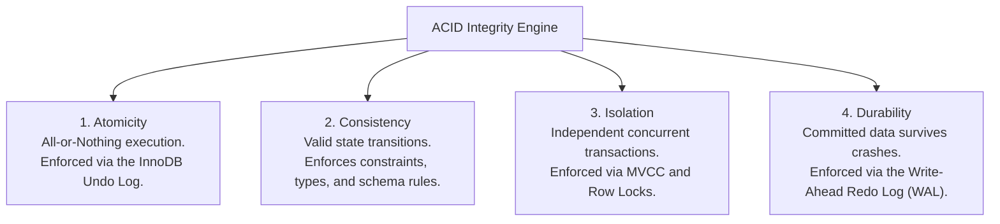

# Chapter 19 — Concurrency Control: Transactions & ACID Integrity (Transactions Aur ACID Integrity)

---

## 1. What is it? (Ye Kya Hai?)

Relational Database Management Systems me **Transaction** computational work ki ek aisi logical unit hoti hai jisme ek ya ek se zyada SQL statements shamil hote hain, jo sabhi milkar ek **indivisible, atomic operation** ke roop me execute hote hain.

Enterprise database applications me business operations shayad hi kabhi kisi single table tak limited hote hain. Maan lijiye ek banking transfer: Account A se Account B me $500 transfer karne ke liye do distinct SQL statements lagte hain:
1. `UPDATE accounts SET balance = balance - 500 WHERE id = 1;`
2. `UPDATE accounts SET balance = balance + 500 WHERE id = 2;`

Agar database server Step 1 ke baad lekin Step 2 se pehle crash ho jaye ya power failure ho jaye, toh $500 hawa me gayab ho jayenge! Ek transaction ensure karta hai ki ya toh **dono** statements ek sath succeed aur commit hon, ya fir agar koi error aaye, toh database automatically sabhi changes ko **rollback** kar de, aur database wapas usi clean state me restore ho jaye jaise operation kabhi start hi na hua ho.

---

## 2. Why do we use it? (Hum Iska Use Kyun Karte Hain?)

Transactional database engine (jaise MySQL ka **InnoDB**) ki reliability chaar **ACID** guarantees dwara govern hoti hai:



1. **Atomicity**: Poora sequence of statements ek all-or-nothing unit ke roop me execute hota hai. Agar koi bhi statement fail hoti hai, toh pichle sabhi statements **Undo Log** ke zariye reverse ho jaate hain.
2. **Consistency**: Transaction database ko sirf ek valid state se doosri valid state me le ja sakta hai. Schema ke saare constraints (Primary Keys, Foreign Keys, `CHECK`, `NOT NULL`) commit ke time satisfy hone chahiye.
3. **Isolation**: Chal rahe transaction ka intermediate state doosre concurrent transactions se hidden rehta hai. Multi-Version Concurrency Control (**MVCC**) ensure karta hai ki readers writers ko block na karein aur writers readers ko block na karein.
4. **Durability**: Ek baar transaction commit ho gaya, toh changes permanently record ho jaate hain aur system crash ya power failure ke baad bhi **Redo Log** (Write-Ahead Logging) se survive karte hain.

---

## 3. Syntax (Syntax)

```sql
-- 1. Explicitly Start a Transaction
START TRANSACTION;
-- Alternative shorthand:
-- BEGIN;

-- 2. Execute DML Mutations
UPDATE accounts SET balance = balance - 500 WHERE account_id = 1;
UPDATE accounts SET balance = balance + 500 WHERE account_id = 2;

-- 3. Permanently Commit Changes
COMMIT;

-- 4. Revert All Uncommitted Changes on Failure
ROLLBACK;

-- 5. Intermediate Savepoints
SAVEPOINT savepoint_alpha;
-- Partially rollback to savepoint without aborting the entire transaction:
ROLLBACK TO SAVEPOINT savepoint_alpha;
-- Remove a savepoint:
RELEASE SAVEPOINT savepoint_alpha;

-- 6. Toggling AutoCommit Mode
SET autocommit = 0; -- Disables auto-commit for the session
SET autocommit = 1; -- Enables auto-commit (default in MySQL)
```

### Transaction Isolation Levels & Concurrency Anomalies
Jab hazaron users simultaneously same tables ko query aur modify karte hain, toh teen major concurrency anomalies ho sakti hain:
1. **Dirty Read**: Transaction A uncommitted data read karta hai jo Transaction B baad me rollback kar deta hai.
2. **Non-Repeatable Read (Fuzzy Read)**: Transaction A ek row read karta hai, Transaction B use modify karke commit karta hai, aur Transaction A dobara read karne par badla hua value pata hai.
3. **Phantom Read**: Transaction A range query karta hai (`WHERE salary > 100000`), Transaction B nayi matching row insert karke commit karta hai, aur Transaction A re-run karne par nayi phantom row pata hai.

| Isolation Level | Dirty Reads Allowed? | Non-Repeatable Reads Allowed? | Phantom Reads Allowed? | Performance Impact |
| :--- | :--- | :--- | :--- | :--- |
| **`READ UNCOMMITTED`** | **Yes** (Dangerous) | Yes | Yes | Maximum throughput; zero safety. |
| **`READ COMMITTED`** | No | Yes | Yes | Standard in PostgreSQL/Oracle; fast. |
| **`REPEATABLE READ`** | No | No | **No in MySQL!** (MVCC Next-Key Locks) | **MySQL Default**; high consistency. |
| **`SERIALIZABLE`** | No | No | No | Slowest; locks all read ranges shared. |

```sql
-- Checking and Setting Isolation Level in MySQL
SELECT @@transaction_isolation;
SET SESSION TRANSACTION ISOLATION LEVEL REPEATABLE READ;
```

### Locking Primitives: Explicit Row-Level Locks
High-concurrency environments me update se pehle records ko exclusively lock karna zaroori hota hai:

```sql
-- 1. Exclusive Lock for Update (Pessimistic Locking)
-- Other transactions attempting to SELECT ... FOR UPDATE or modify these rows are blocked!
SELECT balance FROM accounts WHERE account_id = 1 FOR UPDATE;

-- 2. Shared Lock (Lock in Share Mode / FOR SHARE in MySQL 8.0)
-- Allows other transactions to READ the rows, but blocks them from modifying them.
SELECT balance FROM accounts WHERE account_id = 1 FOR SHARE;
```

---

## 4. Basic Example (Basic Example)

`COMMIT` aur `ROLLBACK` ko demonstrate karte hain:

```sql
USE sql_mastery;

CREATE TABLE transaction_test (
    id INT PRIMARY KEY,
    val VARCHAR(50)
);

-- TEST 1: The Rollback
START TRANSACTION;
INSERT INTO transaction_test VALUES (1, 'Initial Data');
-- Change mind / simulate error:
ROLLBACK;

-- Verify: Empty set! Row 1 was not persisted
SELECT * FROM transaction_test;

-- TEST 2: The Commit
START TRANSACTION;
INSERT INTO transaction_test VALUES (2, 'Committed Data');
COMMIT;

-- Verify: Row 2 is permanently saved
SELECT * FROM transaction_test;

-- Clean up
DROP TABLE transaction_test;
```

---

## 5. Real-World Example (Real-World Example)

Hamare `sql_mastery` database me ek real-world e-commerce checkout transaction simulate karte hain:
1. Customer 1 Product 1 (`Quantum Pro 15 Laptop`, price $1,299.99) purchase karta hai.
2. Product row ko `SELECT ... FOR UPDATE` se lock karein stock confirm karne ke liye.
3. `products` me `stock_quantity` decrement karein.
4. `orders` me order record create karein.
5. `order_items` me line item insert karein.
6. `payments` me processed transaction record karein.
7. Saare mutations ko ek single atomic unit me commit karein.

```sql
USE sql_mastery;

-- Begin the checkout transaction
START TRANSACTION;

-- Step 1: Pessimistic Lock on Product 1 to check stock
SELECT product_id, product_name, unit_price, stock_quantity
FROM products
WHERE product_id = 1
FOR UPDATE;

-- Step 2: Decrement inventory by 1 unit
UPDATE products
SET stock_quantity = stock_quantity - 1
WHERE product_id = 1 AND stock_quantity >= 1;

-- Step 3: Insert the parent Order record
INSERT INTO orders (order_id, customer_id, order_date, status, shipping_fee, total_amount)
VALUES (2001, 1, CURDATE(), 'Processing', 0.00, 1299.99);

-- Step 4: Insert the Order Line Item
INSERT INTO order_items (item_id, order_id, product_id, quantity, unit_price, discount)
VALUES (3001, 2001, 1, 1, 1299.99, 0.00);

-- Step 5: Record the Payment
INSERT INTO payments (payment_id, order_id, payment_date, amount, payment_method, payment_status, transaction_ref)
VALUES (4001, 2001, CURDATE(), 1299.99, 'Credit Card', 'Completed', 'TXN-CHECKOUT-9901');

-- Step 6: Commit all 4 operations atomically!
COMMIT;

-- Verification: Inspect the synchronized records across tables
SELECT o.order_id, o.status, p.payment_status, p.amount, pr.stock_quantity
FROM orders o
JOIN payments p ON o.order_id = p.order_id
JOIN order_items oi ON o.order_id = oi.order_id
JOIN products pr ON oi.product_id = pr.product_id
WHERE o.order_id = 2001;

-- Clean up the demo checkout records
DELETE FROM payments WHERE payment_id = 4001;
DELETE FROM order_items WHERE item_id = 3001;
DELETE FROM orders WHERE order_id = 2001;
UPDATE products SET stock_quantity = stock_quantity + 1 WHERE product_id = 1;
```

---

## 6. Step-by-Step Explanation (Step-by-Step Explanation)

1. `START TRANSACTION;`:
   * MySQL ke default `autocommit` behavior ko suspend karta hai. Sabhi subsequent DML statements private transaction context me record hote hain.
2. `SELECT ... FOR UPDATE`:
   * `product_id = 1` par Exclusive Row Lock (X-Lock) acquire karta hai. Doosri concurrent checkout transaction tab tak queue me wait karti hai jab tak ye `COMMIT` ya `ROLLBACK` na ho jaye.
3. `UPDATE products SET stock_quantity = stock_quantity - 1 ...`:
   * Stock decrement karta hai, pre-modification image **Undo Log** me aur post-modification image **Redo Log** me write karta hai.
4. Steps 3, 4, 5 (`INSERT INTO orders`, `order_items`, `payments`):
   * Corresponding order, item, aur payment records respective tables me atomically insert hote hain.
5. `COMMIT;`:
   * InnoDB commit record ko physical Redo Log buffer me write karke disk par flush karta hai (`fsync`). Sabhi locks release ho jaate hain aur data sabhi connections ke liye visible ho jata hai.

---

## 7. Expected Result (Expected Result & Deadlocks)

### Expected Terminal Output:
```
+----------+------------+----------------+---------+----------------+
| order_id | status     | payment_status | amount  | stock_quantity |
+----------+------------+----------------+---------+----------------+
|     2001 | Processing | Completed      | 1299.99 |             49 |
+----------+------------+----------------+---------+----------------+
1 row in set (0.00 sec)
```

### Deadlocks: Detection and Resolution
**Deadlock** tab hota hai jab do concurrent transactions aise locks hold karte hain jo ek doosre ko chahiye hote hain, creating a circular dependency:
* Transaction 1 Row A lock karta hai aur Row B par lock request karta hai.
* Transaction 2 Row B lock karta hai aur Row A par lock request karta hai.
* Dono transactions aage nahi badh sakte!


### How MySQL Resolves Deadlocks
InnoDB ka internal **Deadlock Detector** circular dependency detect karte hi:
1. Lowest rollback cost wale transaction ko pick karta hai.
2. Use abort karke rollback karta hai aur error issue karta hai:
   `ERROR 1213 (40001): Deadlock found when trying to get lock; try restarting transaction`.
3. Doosra transaction lock acquire karke complete ho jata hai.

---

## 8. Common Mistakes (Common Mistakes)

1. **Executing DDL Inside a Transaction (Implicit Commit Trap)**:
   * *Mistake*:
     ```sql
     START TRANSACTION;
     INSERT INTO accounts VALUES (1, 500);
     CREATE TABLE temp_log (id INT); -- DDL STATEMENT!
     ROLLBACK;
     ```
   * *The Surprise*: Row `(1, 500)` rollback **NAHI** hoti!
   * *Why?*: MySQL me saare DDL commands (`CREATE TABLE`, `ALTER TABLE`, `DROP TABLE`, `TRUNCATE`) **implicit commit** trigger karte hain. Jaise hi `CREATE TABLE` execute hota hai, preceding `INSERT` commit ho jata hai aur subsequent `ROLLBACK` ka koi effect nahi hota.
2. **Holding Transactions Open During External HTTP / API Calls**:
   * *The Anti-Pattern*: External payment gateway API calls (jaise Stripe) transaction ke andar run karna. Network latency ke dauran row locks held rehte hain, jisse lock wait timeouts (`Lock wait timeout exceeded`) hote hain. External network calls hamesha database transactions ke *pehle* ya *baad* me karein.
3. **Inconsistent Lock Ordering**:
   * Agar Service A Account 1 then Account 2 update karti hai, aur Service B Account 2 then Account 1 update karti hai, deadlocks inevitable hain. Locks hamesha consistent, deterministic order me acquire karein (`ORDER BY account_id ASC`).

---

## 9. Best Practices (Best Practices)

1. **Keep Transactions as Short as Possible**:
   * Business calculations aur input validations pehle application memory me karein. Transaction open karein, DML statements execute karein, aur turant `COMMIT` karein.
2. **Always Implement Deadlock Retry Logic**:
   * Multi-threaded systems me deadlocks normal hain. Applications me Error `1213` ko catch karke randomized exponential backoff ke sath 3–5 baar retry karne ka logic lagayein.
3. **Verify `autocommit` Settings**:
   * Apne client library ke default autocommit behavior ko confirm karein.

---

## 10. Practice Questions (Practice Questions)

### Easy
1. What does each letter in the acronym ACID stand for?
2. What is the default transaction isolation level in MySQL InnoDB?
3. Which SQL command reverts all changes made inside an open transaction?

### Medium
4. Write a transaction that inserts a new department named `'Security'` and adds an employee assigned to that new department. If either insert fails, roll back the transaction.
5. Explain the difference between `SELECT ... FOR UPDATE` and `SELECT ... FOR SHARE`.
6. Explain what a "Dirty Read" is, and which ANSI isolation level allows it.

### Difficult
7. Construct a reproducible scenario demonstrating a Deadlock between two concurrent terminal sessions in MySQL using the `accounts` table. Show the exact SQL statements executed in Session 1 and Session 2 that trigger error `1213`.
8. Explain the difference between MySQL's Undo Log and Redo Log. Which log is used to guarantee Atomicity during a `ROLLBACK`, and which is used to guarantee Durability during crash recovery?

---

## 11. Interview Questions (Interview Questions)

### Q1: Describe the ACID properties and how MySQL InnoDB physically enforces each of them.
**Answer**:
* **Atomicity**: Enforced via the **Undo Log**. Statements jab rows modify karte hain, InnoDB undo tablespace me pre-image record karta hai. Error ya `ROLLBACK` par InnoDB undo log ko reverse direction me read karke modifications undo karta hai.
* **Consistency**: Storage engine level par integrity constraints (`PRIMARY KEY`, `FOREIGN KEY`, `CHECK`, `NOT NULL`) dwara validate hoti hai, aur doublewrite buffer partial page writes prevent karta hai.
* **Isolation**: **Multi-Version Concurrency Control (MVCC)** aur **Locking** (Record Locks, Gap Locks, Next-Key Locks) dwara enforce hoti hai. Readers writers ko block nahi karte, aur writers readers ko block nahi karte.
* **Durability**: **Write-Ahead Logging (WAL)** using **Redo Log** dwara enforce hoti hai. Memory data pages disk par likhne se pehle sequential redo log me append hote hain. Sudden power loss par InnoDB startup par redo log replay karke committed transactions reapply karta hai.

### Q2: How does MySQL's default `REPEATABLE READ` isolation level prevent Phantom Reads without locking the entire table?
**Answer**: In standard ANSI SQL, `REPEATABLE READ` Dirty Reads aur Non-Repeatable Reads prevent karta hai, lekin Phantom Reads allow karta hai. MySQL InnoDB ise do mechanisms se prevent karta hai:
1. **Consistent Non-Locking Reads (MVCC)**: Standard `SELECT` queries transaction shuru hote waqt banaye gaye consistent snapshot (Read View) se read karti hain. Transaction ke baad insert kiye gaye rows `trx_id` filter dwara exclude ho jaate hain.
2. **Next-Key Locking (Locking Reads)**: Locking reads (`SELECT ... FOR UPDATE` ya `UPDATE`) ke waqt InnoDB **Next-Key Locks** use karta hai, jo index record lock ke sath record ke pehle ke gap par **Gap Lock** lagata hai, blocking concurrent inserts into that range.

### Q3: What happens when a DDL statement like `ALTER TABLE` is executed inside an active transaction in MySQL?
**Answer**: MySQL me DDL statements **implicit commit** trigger karte hain. Jab koi transaction `INSERT` ya `UPDATE` ke baad `ALTER TABLE` encounter karta hai, MySQL DDL se pehle internal `COMMIT` aur DDL ke baad dusra `COMMIT` call karta hai. Preceding DML statements disk par permanently commit ho jaate hain aur unhe `ROLLBACK` nahi kiya ja sakta.

---

## 12. Quick Revision (Quick Revision)

* A **Transaction** is an indivisible unit of work governed by **ACID** properties.
* **Atomicity** (Undo log) guarantees all-or-nothing; **Durability** (Redo log) ensures committed work survives crashes.
* **`START TRANSACTION`**, **`COMMIT`**, and **`ROLLBACK`** manage transactional boundaries.
* MySQL's default isolation level is **`REPEATABLE READ`**, which prevents Dirty, Non-Repeatable, and Phantom reads.
* Use **`SELECT ... FOR UPDATE`** for pessimistic row locking.
* **DDL statements trigger implicit commits** and cannot be rolled back.
