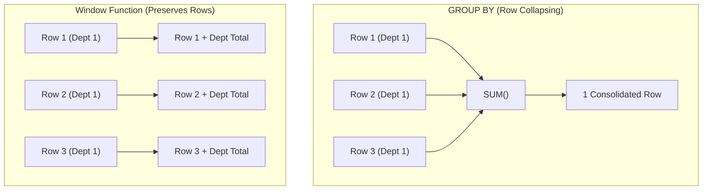

# Chapter 23 — Modern Analytics: Window Functions & JSON Manipulation

---

## 1. What is it?

Modern SQL (jo ANSI SQL:2003 mein standardize hua aur **MySQL 8.0** mein poori tarah implement kiya gaya) relational database capabilities ko do revolutionary features ke sath next level par le gaya:
1. **Window Functions (Analytic Functions)**: Ye current row se related table rows ke ek set par mathematical aur ranking calculations perform karte hain, bina rows ko single summary output mein collapse kiye (unlike `GROUP BY`). Har single row apni individual identity retain karti hai aur sath hi aggregate aur contextual metrics ka access bhi paati hai.
2. **Native JSON Document Processing**: Ye relational integrity aur NoSQL document storage ke beech ka gap bridge karta hai, jisse structured tables ke andar semi-structured JSON payloads ko natively store, query, index, aur transform kiya ja sakta hai.

---

## 2. Window Functions Architecture: The `OVER()` Clause

Ek `GROUP BY` query ke opposite (jo 10 rows ko collapse karke 1 summary row bana deti hai), ek Window Function **har single row** ke liye ek calculated value generate karta hai. Iske liye wo ek analytical "window" ya frame define karta hai jiske upar function compute hota hai:



Window function ka behavior **`OVER()`** clause ke through define hota hai:
```sql
FUNCTION(...) OVER (
    [PARTITION BY partition_column]
    [ORDER BY sort_column [ASC | DESC]]
    [ROWS | RANGE window_frame_specification]
)
```

1. **`PARTITION BY`**: Rows ko distinct processing groups mein divide karta hai (bilkul `GROUP BY` ki tarah, lekin bina unhe collapse kiye).
2. **`ORDER BY`**: Har partition ke andar sorting sequence dictate karta hai.
3. **Window Frame (`ROWS BETWEEN ...`)**: Neighboring rows ki sliding window define karta hai jise evaluate kiya jata hai (for example, rolling 7-day moving averages ya cumulative running totals ke liye).

---

## 3. Comprehensive Window Function Taxonomy

### 3.1. Ranking Functions

| Function | Tie Handling Behavior | Numbering Sequence Example | Typical Use Case |
| :--- | :--- | :--- | :--- |
| **`ROW_NUMBER()`** | Kabhi tie nahi hota. Strict sequential integers assign karta hai. | $1, 2, 3, 4, 5$ | Pagination, deduplication, har group se Top-1 record fetch karna. |
| **`RANK()`** | Ties ko same rank milti hai; subsequent ranks skip ho jaate hain. | $1, 2, 2, 4, 5$ | Olympic leaderboards, competitive standings. |
| **`DENSE_RANK()`** | Ties ko same rank milti hai; ranks skip **nahi** hote. | $1, 2, 2, 3, 4$ | Department salary rankings, top compensation tiers. |
| **`NTILE(N)`** | Partition ko $N$ equal-sized buckets mein divide karta hai. | Bucket $1, 1, 2, 2, 3, 3$ | Quartile/Decile customer segmentation. |

### 3.2. Value Navigation Functions

| Function | Syntax | Description |
| :--- | :--- | :--- |
| **`LAG()`** | `LAG(col, offset, default)` | Bina kisi self-join ke preceding (pichli) row ka data access karta hai (Month-over-Month growth ke liye ideal). |
| **`LEAD()`** | `LEAD(col, offset, default)` | Subsequent (aage aane wali) row ka data access karta hai (churn ya next event tak ka time calculate karne ke liye ideal). |
| **`FIRST_VALUE()`** | `FIRST_VALUE(col)` | Window frame ki pehli row ki value return karta hai. |
| **`LAST_VALUE()`** | `LAST_VALUE(col)` | Window frame ki aakhiri row ki value return karta hai. |

---

## 4. Syntax: Window Functions & Native JSON

### Window Function Calculations
```sql
-- 1. Cumulative Running Total
SELECT 
    order_id,
    order_date,
    total_amount,
    SUM(total_amount) OVER (ORDER BY order_date ASC ROWS BETWEEN UNBOUNDED PRECEDING AND CURRENT ROW) AS running_total
FROM orders;

-- 2. Ranking Employees within their Department
SELECT 
    employee_id,
    department_id,
    salary,
    DENSE_RANK() OVER (PARTITION BY department_id ORDER BY salary DESC) AS dept_salary_rank
FROM employees;

-- 3. Period-over-Period Growth using LAG
SELECT 
    order_date,
    total_amount,
    LAG(total_amount, 1) OVER (ORDER BY order_date) AS prev_order_amount,
    ROUND((total_amount - LAG(total_amount, 1) OVER (ORDER BY order_date)) / LAG(total_amount, 1) OVER (ORDER BY order_date) * 100, 2) AS pct_change
FROM orders;
```

### Native JSON Functions & Operators
```sql
-- JSON Extraction Operators
SELECT 
    data_column->'$.user.name' AS raw_json_string,      -- Returns quoted: "Alex"
    data_column->>'$.user.name' AS unquoted_string,    -- Returns unquoted: Alex
    JSON_EXTRACT(data_column, '$.items[0].price') AS item_price;

-- Constructing JSON Objects & Arrays
SELECT JSON_OBJECT('id', employee_id, 'name', first_name, 'salary', salary) FROM employees;

-- Modifying JSON Documents
UPDATE table_name 
SET json_col = JSON_SET(json_col, '$.is_verified', true) 
WHERE id = 1;
```

---

## 5. Basic Example

Aaiye `ROW_NUMBER()` aur `LAG()` ka use dekhte hain:

```sql
USE sql_mastery;

-- Rank all products by price within their category
SELECT 
    product_id,
    product_name,
    category_id,
    unit_price,
    ROW_NUMBER() OVER (PARTITION BY category_id ORDER BY unit_price DESC) AS price_rank
FROM products;

-- Compare each order's value to the immediately preceding order
SELECT 
    order_id,
    order_date,
    total_amount,
    LAG(total_amount, 1) OVER (ORDER BY order_date) AS prior_amount
FROM orders;
```

---

## 6. Real-World Example: Enterprise Sales Analytics & JSON Ingestion

Hamare `sql_mastery` database mein Business Intelligence group ko teen cheezon ki zaroorat hai:
1. **Running Sales Total & Moving Average**: 2023 orders ke liye running cumulative revenue total calculate karna, sath hi ek 3-order moving average nikalna.
2. **Top-N per Category**: Har department mein top 2 highest-earning employees ko `DENSE_RANK()` ka use karke identify karna.
3. **Semi-Structured Customer Metadata**: JSON format mein stored customer telemetry ko query karna, nested keys extract karna, aur ek indexed virtual generated column build karna.

```sql
USE sql_mastery;

-- PART 1: Cumulative Revenue & 3-Period Moving Average
SELECT 
    order_id,
    order_date,
    total_amount,
    SUM(total_amount) OVER (
        ORDER BY order_date ASC 
        ROWS BETWEEN UNBOUNDED PRECEDING AND CURRENT ROW
    ) AS cumulative_revenue,
    ROUND(AVG(total_amount) OVER (
        ORDER BY order_date ASC 
        ROWS BETWEEN 2 PRECEDING AND CURRENT ROW
    ), 2) AS moving_avg_3orders
FROM orders
WHERE status != 'Cancelled'
ORDER BY order_date ASC;

-- PART 2: Top-2 Highest Paid Employees per Department (CTE + DENSE_RANK)
WITH DepartmentRankedSalaries AS (
    SELECT 
        e.employee_id,
        CONCAT(e.first_name, ' ', e.last_name) AS employee_name,
        d.department_name,
        e.salary,
        DENSE_RANK() OVER (
            PARTITION BY e.department_id 
            ORDER BY e.salary DESC
        ) AS salary_rank
    FROM employees e
    JOIN departments d ON e.department_id = d.department_id
    WHERE e.is_active = TRUE
)
SELECT department_name, salary_rank, employee_name, salary
FROM DepartmentRankedSalaries
WHERE salary_rank <= 2
ORDER BY department_name ASC, salary_rank ASC;

-- PART 3: JSON Telemetry & Indexed Generated Column Demo
CREATE TABLE customer_sessions (
    session_id INT AUTO_INCREMENT PRIMARY KEY,
    customer_id INT NOT NULL,
    session_payload JSON NOT NULL,
    -- Extract JSON key into an indexed virtual generated column!
    device_os VARCHAR(30) AS (session_payload->>'$.device.os') STORED,
    INDEX idx_device_os (device_os)
);

INSERT INTO customer_sessions (customer_id, session_payload) VALUES
(1, '{"device": {"os": "iOS", "version": "16.5"}, "actions": ["login", "view_cart", "checkout"]}'),
(2, '{"device": {"os": "Android", "version": "13.0"}, "actions": ["login", "search"]}'),
(3, '{"device": {"os": "iOS", "version": "17.1"}, "actions": ["login", "view_product"]}');

-- High-performance query utilizing the generated column index
SELECT session_id, customer_id, device_os, session_payload->'$.actions' AS actions_array
FROM customer_sessions
WHERE device_os = 'iOS';

-- Clean up
DROP TABLE customer_sessions;
```

---

## 7. Step-by-Step Explanation

1. `SUM(total_amount) OVER (ORDER BY order_date ...)`:
   * Query non-cancelled orders ko `order_date` ke according sort karti hai.
   * Har row ke liye, window frame `ROWS BETWEEN UNBOUNDED PRECEDING AND CURRENT ROW` engine ko instruct karti hai ki wo shuru se lekar current row tak ki saari pichli rows ka sum kare, jisse exact running total calculate hota hai.
2. `AVG(...) OVER (... ROWS BETWEEN 2 PRECEDING AND CURRENT ROW)`:
   * Dynamically ek 3-row sliding window frame define karti hai (2 pichli rows plus current row), jisse sales spikes ko smooth out karne wala moving average nikal aata hai.
3. `DENSE_RANK() OVER (PARTITION BY department_id ORDER BY salary DESC)`:
   * Har department ko independently evaluate karti hai. Same salary wale employees ko identical rank numbers milte hain bina kisi subsequent integer ko skip kiye.
   * Ise ek CTE (`DepartmentRankedSalaries`) ke andar wrap karne se outer `WHERE salary_rank <= 2` clause ranked results ko cleanly filter kar sakti hai (dhyan rahe: window functions ko direct `WHERE` clause mein nahi likha ja sakta!).
4. `device_os VARCHAR(30) AS (session_payload->>'$.device.os') STORED`:
   * MySQL ek virtual column create karta hai jo JSON document se `device.os` path dynamically extract karke populate hota hai.
   * `STORED` keyword InnoDB ko ye string physically disk par store karne aur standard B+ Tree index (`idx_device_os`) build karne ke liye bolta hai, jisse JSON attributes par ultra-fast $O(\log N)$ seeks enable ho jaate hain.

---

## 8. Expected Result

Part 1 ka output (Running Totals and Moving Averages):

```
+----------+------------+--------------+--------------------+---------------------+
| order_id | order_date | total_amount | cumulative_revenue | moving_avg_3orders  |
+----------+------------+--------------+--------------------+---------------------+
|     1001 | 2023-08-01 |      1564.49 |            1564.49 |             1564.49 |
|     1002 | 2023-08-03 |       389.00 |            1953.49 |              976.75 |
|     1003 | 2023-08-10 |       261.50 |            2214.99 |              738.33 |
|     1004 | 2023-08-15 |      1424.98 |            3639.97 |              691.83 |
|     1005 | 2023-08-20 |       519.00 |            4158.97 |              735.16 |
|     1006 | 2023-09-02 |       549.00 |            4707.97 |              830.99 |
|     1008 | 2023-09-12 |      1248.50 |            5956.47 |              772.17 |
|     1009 | 2023-09-18 |       429.99 |            6386.46 |              742.50 |
|     1010 | 2023-09-22 |       344.00 |            6730.46 |              674.16 |
+----------+------------+--------------+--------------------+---------------------+
9 rows in set (0.00 sec)
```

Part 2 ka output (Top 2 Earners per Department):

```
+--------------------+-------------+---------------+-----------+
| department_name    | salary_rank | employee_name | salary    |
+--------------------+-------------+---------------+-----------+
| Data & Analytics   |           1 | Priya Patel   | 135000.00 |
| Data & Analytics   |           2 | David Kim     |  92000.00 |
| Engineering        |           1 | Alex Morgan   | 145000.00 |
| Engineering        |           2 | Sarah Chen    | 125000.00 |
| Human Resources    |           1 | Fatima Al-M.  |  85000.00 |
| Sales & Marketing  |           1 | Elena Rostova | 130000.00 |
| Sales & Marketing  |           2 | Liam OConnor  |  78000.00 |
| Supply Chain       |           1 | Jessica Taylor| 110000.00 |
| Supply Chain       |           2 | Carlos Mendoza|  72000.00 |
+--------------------+-------------+---------------+-----------+
```

---

## 9. Common Mistakes

1. **Attempting to Filter Window Functions in `WHERE`**:
   * *The Mistake*:
     ```sql
     SELECT employee_id, ROW_NUMBER() OVER (ORDER BY salary DESC) AS rnk
     FROM employees
     WHERE rnk <= 3; -- SYNTAX ERROR!
     ```
   * *Error*: `ERROR 3593 (HY000): You cannot use the window function 'row_number' in this context`
   * *Why?*: Chapter 10 ke Logical Execution Order ko recall karein—`WHERE` Step 2 par execute hota hai, jabki Window Functions Step 5 par `SELECT` phase ke dauran evaluate hote hain. Jab `WHERE` evaluate hota hai, tab tak rank exist hi nahi karti!
   * *Fix*: Hamesha window functions ko ek **CTE** ya derived table subquery ke andar wrap karein, aur calculated alias par outer query mein filter lagayein.
2. **Confusing `RANK()` and `DENSE_RANK()`**:
   * Agar do employees 1st place ke liye tie karte hain:
     * `RANK()` dega: $1, 1, 3$ (rank 2 skip ho jati hai).
     * `DENSE_RANK()` dega: $1, 1, 2$ (koi bhi number skip nahi hota).
3. **Omitting the Window Frame in Running Totals**:
   * Agar aap `SUM(total) OVER (ORDER BY order_date)` likhte hain aur multiple rows ka **exact same `order_date`** hota hai, toh MySQL window frame ko default karke `RANGE BETWEEN UNBOUNDED PRECEDING AND CURRENT ROW` bana deta hai. Ye same date wali saari tied rows ko row-by-row add karne ke bajaye ek sath add kar deta hai! True row-by-row cumulative sum ke liye hamesha explicitly `ROWS BETWEEN UNBOUNDED PRECEDING AND CURRENT ROW` specify karein.

---

## 10. Best Practices

1. **Use Named Windows When Multiple Functions Share the Same Frame**:
   * Queries ko concise aur readable rakhne ke liye `WINDOW` clause ke sath named window define karein:
     ```sql
     SELECT 
         order_id,
         SUM(total_amount) OVER w AS running_sum,
         AVG(total_amount) OVER w AS running_avg
     FROM orders
     WINDOW w AS (PARTITION BY customer_id ORDER BY order_date);
     ```
2. **Index Partition and Order Columns**:
   * Window functions ki execution speed maximize karne ke liye `(partition_col, order_col)` matching composite indexes banayein. Isse engine expensive in-memory Filesort ke bina pre-sorted records ko directly stream kar sakta hai.
3. **Use Virtual Generated Columns to Index Nested JSON**:
   * Baar-baar `->>` se deep JSON paths parse mat karein. Frequently filtered JSON properties ko generated columns mein extract karein aur un par indexes banayein.

---

## 11. Practice Questions

### Easy
1. `GROUP BY` aur Window Function ke beech fundamental difference kya hota hai?
2. Kaun sa window function bina kisi gap ya tie ke strict sequential numbers ($1, 2, 3, \dots$) assign karta hai?
3. MySQL mein `->` aur `->>` JSON extraction operators ke beech kya difference hai?

### Medium
4. `orders` table par `LAG()` ka use karke ek query likhiye jo har customer ke current order aur unke pichle order ke beech ka number of elapsed days calculate kare.
5. Ek aisi query likhiye jo `NTILE(4)` ka use karke employees ko 4 salary quartiles mein divide kare.
6. `products` table par `DENSE_RANK()` ka use karte hue overall top 3 most expensive products find karne ke liye query likhiye, jisme ties cleanly handle hon.

### Difficult
7. Product pricing ke liye ek 3-period centered moving average compute karne wali query likhiye (jo immediately preceding row, current row, aur immediately following row ka average nikale). Exact window frame syntax specify karein.
8. Ek aisi table jisme un-indexed `JSON` column hai jisme tag objects ka array `[{"tag": "sql"}, {"tag": "mysql"}]` store hai, usme `JSON_CONTAINS()` ya `JSON_SEARCH()` ka use karke `"mysql"` match karne wale records query karke dikhayein.

---

## 12. Interview Questions

### Q1: What is the difference between `ROW_NUMBER()`, `RANK()`, and `DENSE_RANK()`?
**Answer**:
* **`ROW_NUMBER()`**: Ek partition ke andar har row ko unique, incremental integer ($1, 2, 3, 4, \dots$) assign karta hai. Isme kabhi tie nahi hota; agar do rows ki sorting value identical bhi ho, tab bhi ek row arbitrarily doosri se pehle rank ho jati hai.
* **`RANK()`**: Same sorting values wali rows ko identical rank assign karta hai (ties). Lekin ye tied rows ke count ke barabar sequence mein gaps chhod deta hai (for example, $1, 2, 2, 4, 5$).
* **`DENSE_RANK()`**: Ye bhi tied rows ko same rank deta hai, lekin sequence mein kisi bhi number ko skip **nahi** karta (for example, $1, 2, 2, 3, 4$).

### Q2: Why can you not use a window function in a `WHERE` or `HAVING` clause?
**Answer**: SQL ke logical query processing lifecycle mein clauses is sequence mein evaluate hote hain:
`FROM` $\rightarrow$ `WHERE` $\rightarrow$ `GROUP BY` $\rightarrow$ `HAVING` $\rightarrow$ **`SELECT` (Window Functions)** $\rightarrow$ `DISTINCT` $\rightarrow$ `ORDER BY` $\rightarrow$ `LIMIT`.
Window functions `SELECT` phase ke dauran evaluate hote hain, jab rows already `WHERE` dwara filter aur `GROUP BY` / `HAVING` dwara group ki ja chuki hoti hain. Kyunki `WHERE` ya `HAVING` phase ke waqt window calculations exist hi nahi karti, isliye engine un par filter nahi laga sakta. Window metric par filter lagane ke liye aapko window function ko ek Common Table Expression (CTE) ya subquery ke andar encapsulate karna padta hai, aur filter outer query mein lagana hota hai.

### Q3: What is the difference between `ROWS` and `RANGE` in a window frame specification?
**Answer**:
* **`ROWS`**: Window frame ko physical row counts ke terms mein define karta hai (for example, `ROWS BETWEEN 2 PRECEDING AND CURRENT ROW` strictly 2 physical preceding row records ko count karta hai, chahe unki values kuch bhi hon).
* **`RANGE`**: Window frame ko logically value offsets ke terms mein define karta hai. Agar multiple rows identical sorting values share karti hain, toh `RANGE` un sabhi tied rows ko ek single collective set ki tarah treat karta hai. `ORDER BY` ke sath jab frame omit kar diya jata hai, toh ye default hokar `RANGE BETWEEN UNBOUNDED PRECEDING AND CURRENT ROW` ban jata hai, jo saari tied rows ko incrementally row-by-row add karne ke bajaye ek sath aggregate kar deta hai.

---

## 13. Quick Revision

* **Window Functions** saari rows ke across calculations perform karte hain jabki **har individual row ko preserve** rakhte hain.
* **`PARTITION BY`** groups define karta hai; **`ORDER BY`** window sorting sequence define karta hai.
* **`ROW_NUMBER()`** mein ties nahi hote; **`RANK()`** gaps ke sath tie karta hai; **`DENSE_RANK()`** bina gaps ke tie karta hai.
* Bina self-joins ke adjacent rows access karne ke liye **`LAG()`** aur **`LEAD()`** use karein.
* Agar window function ke results par `WHERE` clause lagana ho, toh use hamesha **CTE** mein wrap karein.
* Unquoted JSON values extract karne ke liye **`->>`** use karein, aur unhe **Stored Generated Columns** ke zariye index karein.
