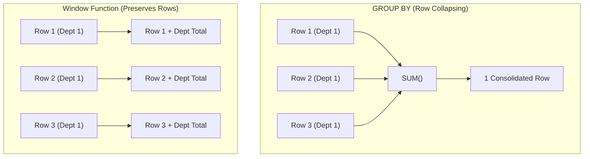

# Chapter 23 — Modern Analytics: Window Functions & JSON Manipulation | आधुनिक एनालिटिक्स: विंडो फ़ंक्शन्स और JSON मैनिपुलेशन

---

## 1. What is it? (विंडो फ़ंक्शन्स और JSON क्या हैं?)

मॉडर्न SQL (जिसे ANSI SQL:2003 में स्टैंडर्डाइज़ किया गया और **MySQL 8.0** में पूरी तरह लागू किया गया) ने रिलेशनल डेटाबेस की क्षमताओं को दो बड़े और क्रांतिकारी फीचर्स के साथ कई गुना बढ़ा दिया:
1. **Window Functions (एनालिटिक फ़ंक्शन्स)**: ये वर्तमान पंक्ति से संबंधित पंक्तियों के एक सेट पर गणितीय और रैंकिंग कैलकुलेशन करते हैं, लेकिन `GROUP BY` की तरह पंक्तियों को सिकोड़कर (collapse) एक सिंगल समरी पंक्ति में नहीं बदलते। हर एक व्यक्तिगत पंक्ति अपनी पहचान बनाए रखती है, और साथ ही उसे एग्रीगेट और कॉन्टेक्स्टुअल मैट्रिक्स का एक्सेस भी मिल जाता है।
2. **Native JSON Document Processing**: यह रिलेशनल इंटीग्रिटी और NoSQL डॉक्यूमेंट स्टोरेज के बीच की दूरी को पाटता है। अब आप संरचित (structured) टेबल्स के अंदर ही सेमी-स्ट्रक्चर्ड JSON पेलोड्स को नेटिव रूप से स्टोर, क्वेरी, इंडेक्स और ट्रांसफ़ॉर्म कर सकते हैं।

---

## 2. Window Functions Architecture: The OVER() Clause (विंडो फ़ंक्शन्स आर्किटेक्चर: OVER() क्लॉज़)

एक सामान्य `GROUP BY` क्वेरी (जो 10 पंक्तियों को सिकोड़कर केवल 1 समरी पंक्ति बना देती है) के विपरीत, एक Window Function **प्रत्येक व्यक्तिगत पंक्ति** के लिए एक कैलकुलेटेड वैल्यू उत्पन्न करता है। इसके लिए वह एक एनालिटिकल "विंडो" या फ़्रेम तय करता है जिस पर गणना की जाती है:



एक विंडो फ़ंक्शन का व्यवहार **`OVER()`** क्लॉज़ द्वारा निर्धारित किया जाता है:
```sql
FUNCTION(...) OVER (
    [PARTITION BY partition_column]
    [ORDER BY sort_column [ASC | DESC]]
    [ROWS | RANGE window_frame_specification]
)
```

1. **`PARTITION BY`**: पंक्तियों को अलग-अलग प्रोसेसिंग ग्रुप्स में विभाजित करता है (बिल्कुल `GROUP BY` की तरह, लेकिन बिना पंक्तियों को कोलैप्स किए)।
2. **`ORDER BY`**: प्रत्येक पार्टीशन के अंदर पंक्तियों के सॉर्टिंग क्रम (sequence) को तय करता है।
3. **Window Frame (`ROWS BETWEEN ...`)**: यह मूल्यांकित की जाने वाली पड़ोसी पंक्तियों की स्लाइडिंग विंडो को परिभाषित करता है (उदाहरण के लिए, रोलिंग 7-डे मूविंग एवरेज या क्युमुलेटिव रनिंग टोटल की गणना के लिए)।

---

## 3. Comprehensive Window Function Taxonomy (विंडो फ़ंक्शन्स का वर्गीकरण)

### 3.1. Ranking Functions (रैंकिंग फ़ंक्शन्स)

| फ़ंक्शन (Function) | टाई हैंडलिंग व्यवहार (Tie Handling) | नंबरिंग सीक्वेंस का उदाहरण | सामान्य उपयोग (Use Case) |
| :--- | :--- | :--- | :--- |
| **`ROW_NUMBER()`** | कभी टाई नहीं करता। सख्त क्रमिक पूर्णांक (sequential integers) असाइन करता है। | $1, 2, 3, 4, 5$ | पेजिनेशन, डुप्लिकेट हटाना, ग्रुप में से Top-1 निकालना। |
| **`RANK()`** | टाई होने पर समान रैंक देता है; बाद की रैंक्स को छोड़ (skip) देता है। | $1, 2, 2, 4, 5$ | ओलंपिक लीडरबोर्ड, प्रतियोगी रैंकिंग। |
| **`DENSE_RANK()`** | टाई होने पर समान रैंक देता है; रैंक्स को **स्किप नहीं** करता। | $1, 2, 2, 3, 4$ | डिपार्टमेंट सैलरी रैंकिंग, टॉप कॉम्पेन्सेशन टियर्स। |
| **`NTILE(N)`** | पार्टीशन को $N$ बराबर आकार की बाल्टियों (buckets) में बाँटता है। | Bucket $1, 1, 2, 2, 3, 3$ | क्वार्टाइल / डेसाइल कस्टमर सेगमेंटेशन। |

### 3.2. Value Navigation Functions (वैल्यू नेविगेशन फ़ंक्शन्स)

| फ़ंक्शन (Function) | सिंटैक्स (Syntax) | विवरण (Description) |
| :--- | :--- | :--- |
| **`LAG()`** | `LAG(col, offset, default)` | बिना किसी सेल्फ-जॉइन के पिछली पंक्ति का डेटा एक्सेस करता है (महीने-दर-महीने ग्रोथ के लिए बेस्ट)। |
| **`LEAD()`** | `LEAD(col, offset, default)` | अगली पंक्ति का डेटा एक्सेस करता है (चर्न कैलकुलेशन या अगले इवेंट तक की अवधि के लिए बेस्ट)। |
| **`FIRST_VALUE()`** | `FIRST_VALUE(col)` | विंडो फ़्रेम की सबसे पहली पंक्ति की वैल्यू लौटाता है। |
| **`LAST_VALUE()`** | `LAST_VALUE(col)` | विंडो फ़्रेम की सबसे अंतिम पंक्ति की वैल्यू लौटाता है। |

---

## 4. Syntax: Window Functions & Native JSON (सिंटैक्स: विंडो फ़ंक्शन्स और नेटिव JSON)

### Window Function Calculations
```sql
-- 1. Cumulative Running Total
SELECT 
    order_id,
    order_date,
    total_amount,
    SUM(total_amount) OVER (ORDER BY order_date ASC ROWS BETWEEN UNBOUNDED PRECEDING AND CURRENT ROW) AS running_total
FROM orders;

-- 2. Ranking Employees within their Department
SELECT 
    employee_id,
    department_id,
    salary,
    DENSE_RANK() OVER (PARTITION BY department_id ORDER BY salary DESC) AS dept_salary_rank
FROM employees;

-- 3. Period-over-Period Growth using LAG
SELECT 
    order_date,
    total_amount,
    LAG(total_amount, 1) OVER (ORDER BY order_date) AS prev_order_amount,
    ROUND((total_amount - LAG(total_amount, 1) OVER (ORDER BY order_date)) / LAG(total_amount, 1) OVER (ORDER BY order_date) * 100, 2) AS pct_change
FROM orders;
```

### Native JSON Functions & Operators
```sql
-- JSON Extraction Operators
SELECT 
    data_column->'$.user.name' AS raw_json_string,      -- Returns quoted: "Alex"
    data_column->>'$.user.name' AS unquoted_string,    -- Returns unquoted: Alex
    JSON_EXTRACT(data_column, '$.items[0].price') AS item_price;

-- Constructing JSON Objects & Arrays
SELECT JSON_OBJECT('id', employee_id, 'name', first_name, 'salary', salary) FROM employees;

-- Modifying JSON Documents
UPDATE table_name 
SET json_col = JSON_SET(json_col, '$.is_verified', true) 
WHERE id = 1;
```

---

## 5. Basic Example (बेसिक प्रैक्टिकल उदाहरण)

यहाँ `ROW_NUMBER()` और `LAG()` का बेसिक उपयोग प्रदर्शित किया गया है:

```sql
USE sql_mastery;

-- Rank all products by price within their category
SELECT 
    product_id,
    product_name,
    category_id,
    unit_price,
    ROW_NUMBER() OVER (PARTITION BY category_id ORDER BY unit_price DESC) AS price_rank
FROM products;

-- Compare each order's value to the immediately preceding order
SELECT 
    order_id,
    order_date,
    total_amount,
    LAG(total_amount, 1) OVER (ORDER BY order_date) AS prior_amount
FROM orders;
```

---

## 6. Real-World Example: Enterprise Sales Analytics & JSON Ingestion (वास्तविक बिज़नेस उदाहरण: सेल्स एनालिटिक्स और JSON इंजेक्शन)

हमारे `sql_mastery` डेटाबेस में, बिज़नेस इंटेलिजेंस (BI) टीम को तीन प्रमुख रिपोर्ट्स चाहिए:
1. **रनिंग सेल्स टोटल और मूविंग एवरेज**: 2023 के ऑर्डर्स के लिए एक क्युमुलेटिव रेवेन्यू टोटल और 3-ऑर्डर मूविंग एवरेज कैलकुलेट करना।
2. **Top-N प्रति कैटेगरी**: `DENSE_RANK()` का उपयोग करके प्रत्येक डिपार्टमेंट में सबसे अधिक वेतन पाने वाले शीर्ष 2 कर्मचारियों की पहचान करना।
3. **सेमी-स्ट्रक्चर्ड कस्टमर टेलीमेट्री**: JSON फ़ॉर्मेट में स्टोर कस्टमर टेलीमेट्री डेटा को क्वेरी करना, नेस्टेड कीज़ निकालना, और एक इंडेक्स्ड वर्चुअल जनरेटेड कॉलम बनाना।

```sql
USE sql_mastery;

-- PART 1: Cumulative Revenue & 3-Period Moving Average
SELECT 
    order_id,
    order_date,
    total_amount,
    SUM(total_amount) OVER (
        ORDER BY order_date ASC 
        ROWS BETWEEN UNBOUNDED PRECEDING AND CURRENT ROW
    ) AS cumulative_revenue,
    ROUND(AVG(total_amount) OVER (
        ORDER BY order_date ASC 
        ROWS BETWEEN 2 PRECEDING AND CURRENT ROW
    ), 2) AS moving_avg_3orders
FROM orders
WHERE status != 'Cancelled'
ORDER BY order_date ASC;

-- PART 2: Top-2 Highest Paid Employees per Department (CTE + DENSE_RANK)
WITH DepartmentRankedSalaries AS (
    SELECT 
        e.employee_id,
        CONCAT(e.first_name, ' ', e.last_name) AS employee_name,
        d.department_name,
        e.salary,
        DENSE_RANK() OVER (
            PARTITION BY e.department_id 
            ORDER BY e.salary DESC
        ) AS salary_rank
    FROM employees e
    JOIN departments d ON e.department_id = d.department_id
    WHERE e.is_active = TRUE
)
SELECT department_name, salary_rank, employee_name, salary
FROM DepartmentRankedSalaries
WHERE salary_rank <= 2
ORDER BY department_name ASC, salary_rank ASC;

-- PART 3: JSON Telemetry & Indexed Generated Column Demo
CREATE TABLE customer_sessions (
    session_id INT AUTO_INCREMENT PRIMARY KEY,
    customer_id INT NOT NULL,
    session_payload JSON NOT NULL,
    -- Extract JSON key into an indexed virtual generated column!
    device_os VARCHAR(30) AS (session_payload->>'$.device.os') STORED,
    INDEX idx_device_os (device_os)
);

INSERT INTO customer_sessions (customer_id, session_payload) VALUES
(1, '{"device": {"os": "iOS", "version": "16.5"}, "actions": ["login", "view_cart", "checkout"]}'),
(2, '{"device": {"os": "Android", "version": "13.0"}, "actions": ["login", "search"]}'),
(3, '{"device": {"os": "iOS", "version": "17.1"}, "actions": ["login", "view_product"]}');

-- High-performance query utilizing the generated column index
SELECT session_id, customer_id, device_os, session_payload->'$.actions' AS actions_array
FROM customer_sessions
WHERE device_os = 'iOS';

-- Clean up
DROP TABLE customer_sessions;
```

---

## 7. Step-by-Step Explanation (स्टेप-बाय-स्टेप व्याख्या)

1. `SUM(total_amount) OVER (ORDER BY order_date ...)`:
   * क्वेरी नॉन-कैंसिल्ड ऑर्डर्स को `order_date` के अनुसार सॉर्ट करती है।
   * प्रत्येक पंक्ति के लिए, विंडो फ़्रेम `ROWS BETWEEN UNBOUNDED PRECEDING AND CURRENT ROW` इंजन को निर्देश देता है कि वह पहली पंक्ति से लेकर वर्तमान पंक्ति तक के सभी मानों का योग निकाले, जिससे एक सटीक रनिंग टोटल बनता है।
2. `AVG(...) OVER (... ROWS BETWEEN 2 PRECEDING AND CURRENT ROW)`:
   * यह डायनामिक रूप से 3-पंक्तियों की एक स्लाइडिंग विंडो (पिछली 2 पंक्तियाँ + वर्तमान पंक्ति) बनाता है, जो एक स्मूथ मूविंग एवरेज कैलकुलेट करती है।
3. `DENSE_RANK() OVER (PARTITION BY department_id ORDER BY salary DESC)`:
   * प्रत्येक विभाग का स्वतंत्र रूप से मूल्यांकन करता है। समान वेतन वाले कर्मचारियों को बिना किसी संख्या को छोड़े समान रैंक मिलती है।
   * इसे एक CTE (`DepartmentRankedSalaries`) में लपेटने से बाहरी `WHERE salary_rank <= 2` क्लॉज़ को स्वच्छ तरीके से फ़िल्टर करने की सुविधा मिलती है (याद रखें: विंडो फ़ंक्शन्स को सीधे `WHERE` में नहीं लिखा जा सकता!)।
4. `device_os VARCHAR(30) AS (session_payload->>'$.device.os') STORED`:
   * MySQL एक वर्चुअल कॉलम बनाता है जो JSON डॉक्यूमेंट से `device.os` पाथ निकालता है।
   * `STORED` कीवर्ड InnoDB को इसे फिजिकली डिस्क पर स्टोर करने और उस पर स्टैंडर्ड B+ Tree इंडेक्स (`idx_device_os`) बनाने का निर्देश देता है, जिससे JSON एट्रिब्यूट्स पर $O(\log N)$ स्पीड में बिजली जैसी तेज़ खोज संभव होती है।

---

## 8. Expected Result (अपेक्षित आउटपुट)

Part 1 (Running Totals and Moving Averages) का आउटपुट:

```
+----------+------------+--------------+--------------------+---------------------+
| order_id | order_date | total_amount | cumulative_revenue | moving_avg_3orders  |
+----------+------------+--------------+--------------------+---------------------+
|     1001 | 2023-08-01 |      1564.49 |            1564.49 |             1564.49 |
|     1002 | 2023-08-03 |       389.00 |            1953.49 |              976.75 |
|     1003 | 2023-08-10 |       261.50 |            2214.99 |              738.33 |
|     1004 | 2023-08-15 |      1424.98 |            3639.97 |              691.83 |
|     1005 | 2023-08-20 |       519.00 |            4158.97 |              735.16 |
|     1006 | 2023-09-02 |       549.00 |            4707.97 |              830.99 |
|     1008 | 2023-09-12 |      1248.50 |            5956.47 |              772.17 |
|     1009 | 2023-09-18 |       429.99 |            6386.46 |              742.50 |
|     1010 | 2023-09-22 |       344.00 |            6730.46 |              674.16 |
+----------+------------+--------------+--------------------+---------------------+
9 rows in set (0.00 sec)
```

Part 2 (Top 2 Earners per Department) का आउटपुट:

```
+--------------------+-------------+---------------+-----------+
| department_name    | salary_rank | employee_name | salary    |
+--------------------+-------------+---------------+-----------+
| Data & Analytics   |           1 | Priya Patel   | 135000.00 |
| Data & Analytics   |           2 | David Kim     |  92000.00 |
| Engineering        |           1 | Alex Morgan   | 145000.00 |
| Engineering        |           2 | Sarah Chen    | 125000.00 |
| Human Resources    |           1 | Fatima Al-M.  |  85000.00 |
| Sales & Marketing  |           1 | Elena Rostova | 130000.00 |
| Sales & Marketing  |           2 | Liam OConnor  |  78000.00 |
| Supply Chain       |           1 | Jessica Taylor| 110000.00 |
| Supply Chain       |           2 | Carlos Mendoza|  72000.00 |
+--------------------+-------------+---------------+-----------+
```

---

## 9. Common Mistakes (सामान्य गलतियाँ और Pitfalls)

1. **`WHERE` क्लॉज़ में विंडो फ़ंक्शन्स को फ़िल्टर करने की कोशिश करना**:
   * *The Mistake*:
     ```sql
     SELECT employee_id, ROW_NUMBER() OVER (ORDER BY salary DESC) AS rnk
     FROM employees
     WHERE rnk <= 3; -- SYNTAX ERROR!
     ```
   * *Error*: `ERROR 3593 (HY000): You cannot use the window function 'row_number' in this context`
   * *Why?*: [Chapter 10 — GROUP BY & HAVING](/hi/10_group_by_and_having) में बताए गए लॉजिकल एग्जीक्यूशन ऑर्डर के अनुसार, `WHERE` स्टेप 2 पर चलता है, जबकि विंडो फ़ंक्शन्स `SELECT` फ़ेज़ (स्टेप 5) में एग्जीक्यूट होते हैं। जब `WHERE` चलता है, तब रैंक अस्तित्व में ही नहीं होती!
   * *Fix*: हमेशा विंडो फ़ंक्शन्स को एक **CTE** या डिराइव्ड टेबल सबक्वेरी में लपेटें, और बाहरी क्वेरी में एलियास पर फ़िल्टर लगाएँ।
2. **`RANK()` और `DENSE_RANK()` में भ्रम**:
   * यदि दो कर्मचारी 1st रैंक पर टाई करते हैं:
     * `RANK()` का परिणाम होगा: $1, 1, 3$ (रैंक 2 छूट जाती है)।
     * `DENSE_RANK()` का परिणाम होगा: $1, 1, 2$ (कोई भी रैंक नहीं छूटती)।
3. **रनिंग टोटल्स में विंडो फ़्रेम छोड़ देना**:
   * यदि आप केवल `SUM(total) OVER (ORDER BY order_date)` लिखते हैं और कई पंक्तियों की **`order_date` बिल्कुल समान** है, तो MySQL डिफ़ॉल्ट रूप से `RANGE BETWEEN UNBOUNDED PRECEDING AND CURRENT ROW` का उपयोग करता है, जो समान तारीख वाली सभी पंक्तियों को एक साथ जोड़ देता है! पंक्ति-दर-पंक्ति सटीक क्युमुलेटिव सम के लिए हमेशा स्पष्ट रूप से `ROWS BETWEEN UNBOUNDED PRECEDING AND CURRENT ROW` निर्दिष्ट करें।

---

## 10. Best Practices (सर्वोत्तम तरीके और टिप्स)

1. **समान फ़्रेम शेयर करने वाले फ़ंक्शन्स के लिए Named Windows का उपयोग करें**:
   * क्वेरी को साफ़ और मेंटेन रखने के लिए `WINDOW` क्लॉज़ का उपयोग करें:
     ```sql
     SELECT 
         order_id,
         SUM(total_amount) OVER w AS running_sum,
         AVG(total_amount) OVER w AS running_avg
     FROM orders
     WINDOW w AS (PARTITION BY customer_id ORDER BY order_date);
     ```
2. **Partition और Order कॉलम्स को इंडेक्स करें**:
   * विंडो फ़ंक्शन्स की एग्जीक्यूशन स्पीड को अधिकतम करने के लिए `(partition_col, order_col)` पर कंपोजिट इंडेक्स बनाएँ। इससे इंजन को बिना महंगे इन-मेमोरी Filesort के प्री-सॉर्टेड रिकॉर्ड्स मिल जाते हैं।
3. **नेस्टेड JSON को इंडेक्स करने के लिए Stored Generated Columns का उपयोग करें**:
   * गहरे JSON पाथ्स को बार-बार `->>` से पार्स करने के बजाय, बार-बार फ़िल्टर की जाने वाली प्रॉपर्टीज़ को जनरेटेड कॉलम्स में निकालें और उन पर इंडेक्स बनाएँ।

---

## 11. Practice Questions (अभ्यास के लिए प्रश्न)

### Easy
1. `GROUP BY` और Window Function में मूलभूत अंतर क्या है?
2. कौन सा विंडो फ़ंक्शन बिना किसी गैप या टाई के सख्त क्रमिक नंबर ($1, 2, 3, \dots$) असाइन करता है?
3. MySQL में `->` और `->>` JSON एक्सट्रैक्शन ऑपरेटर्स में क्या अंतर होता है?

### Medium
4. `orders` टेबल पर `LAG()` का उपयोग करके एक क्वेरी लिखें जो प्रत्येक कस्टमर के वर्तमान ऑर्डर और पिछले ऑर्डर के बीच बीते हुए दिनों की संख्या निकाले।
5. `NTILE(4)` का उपयोग करके कर्मचारियों को 4 सैलरी क्वार्टाइल्स (quartiles) में बाँटने वाली क्वेरी लिखें।
6. `products` टेबल पर `DENSE_RANK()` का उपयोग करके कुल मिलाकर शीर्ष 3 सबसे महंगे प्रोडक्ट्स ढूँढने वाली क्वेरी लिखें, जिसमें टाई भी ठीक से हैंडल हो।

### Difficult
7. प्रोडक्ट प्राइसिंग के लिए 3-पीरियड सेंटर्ड मूविंग एवरेज (पिछली पंक्ति, वर्तमान पंक्ति, और अगली पंक्ति का औसत) निकालने वाली क्वेरी लिखें। सटीक विंडो फ़्रेम सिंटैक्स स्पष्ट करें।
8. मान लीजिए कि एक टेबल में बिना इंडेक्स वाला `JSON` कॉलम है जिसमें टैग ऑब्जेक्ट्स की एक एरे है: `[{"tag": "sql"}, {"tag": "mysql"}]`। `JSON_CONTAINS()` या `JSON_SEARCH()` का उपयोग करके उन रिकॉर्ड्स को ढूँढने वाली क्वेरी लिखें जो `"mysql"` से मैच करते हों।

---

## 12. Interview Questions (इंटरव्यू सवाल और जवाब)

### Q1: `ROW_NUMBER()`, `RANK()`, और `DENSE_RANK()` में क्या अंतर होता है?
**उत्तर**:
* **`ROW_NUMBER()`**: पार्टीशन के अंदर प्रत्येक पंक्ति को एक अनूठा, वृद्धिशील पूर्णांक ($1, 2, 3, 4, \dots$) देता है। इसमें कभी टाई नहीं होता; यदि दो पंक्तियों की वैल्यू समान हो, तब भी एक को मनमाने ढंग से पहले रैंक किया जाता है।
* **`RANK()`**: समान वैल्यू वाली पंक्तियों को समान रैंक देता है (टाई)। लेकिन यह टाई हुई पंक्तियों की संख्या के बराबर बाद के नंबर छोड़ (skip) देता है (जैसे $1, 2, 2, 4, 5$)।
* **`DENSE_RANK()`**: यह भी टाई होने पर समान रैंक देता है, लेकिन सीक्वेंस में कोई भी नंबर **नहीं छोड़ता** (जैसे $1, 2, 2, 3, 4$)।

### Q2: विंडो फ़ंक्शन का उपयोग `WHERE` या `HAVING` क्लॉज़ में क्यों नहीं किया जा सकता?
**उत्तर**: SQL लॉजिकल क्वेरी प्रोसेसिंग लाइफसाइकिल में क्लॉज़ेस का एग्जीक्यूशन क्रम इस प्रकार होता है:
`FROM` $\rightarrow$ `WHERE` $\rightarrow$ `GROUP BY` $\rightarrow$ `HAVING` $\rightarrow$ **`SELECT` (Window Functions)** $\rightarrow$ `DISTINCT` $\rightarrow$ `ORDER BY` $\rightarrow$ `LIMIT`।
चूँकि विंडो फ़ंक्शन्स का मूल्यांकन `SELECT` फ़ेज़ के दौरान होता है (जब पंक्तियाँ पहले ही `WHERE` द्वारा फ़िल्टर और `GROUP BY` द्वारा समूहीकृत हो चुकी होती हैं), इसलिए `WHERE` फ़ेज़ के दौरान उनका कोई अस्तित्व नहीं होता। विंडो मेट्रिक्स पर फ़िल्टर करने के लिए, फ़ंक्शन को CTE या सबक्वेरी में लपेटना और बाहरी क्वेरी में फ़िल्टर लगाना अनिवार्य है।

### Q3: विंडो फ़्रेम विनिर्देश में `ROWS` और `RANGE` में क्या अंतर होता है?
**उत्तर**:
* **`ROWS`**: विंडो फ़्रेम को फिजिकल रो काउंट (पंक्तियों की वास्तविक संख्या) के आधार पर परिभाषित करता है (जैसे `ROWS BETWEEN 2 PRECEDING AND CURRENT ROW` उनके मानों की परवाह किए बिना ठीक 2 पिछली पंक्तियाँ गिनता है)।
* **`RANGE`**: विंडो फ़्रेम को लॉजिकल मानों (value offsets) के आधार पर परिभाषित करता है। यदि कई पंक्तियों की सॉर्टिंग वैल्यू समान है, तो `RANGE` उन सभी को एक समूह मानता है। `ORDER BY` के साथ फ़्रेम न लिखने पर डिफ़ॉल्ट रूप से `RANGE BETWEEN UNBOUNDED PRECEDING AND CURRENT ROW` लागू होता है, जो समान वैल्यू वाली सभी पंक्तियों को एक साथ एग्रीगेट कर देता है।

---

## 13. Quick Revision (त्वरित सारांश / क्विक रिविजन)

* **Window Functions** प्रत्येक पंक्ति की **व्यक्तिगत पहचान बनाए रखते हुए** गणना करते हैं।
* **`PARTITION BY`** ग्रुप्स बनाता है; **`ORDER BY`** विंडो के अंदर सॉर्टिंग क्रम तय करता है।
* **`ROW_NUMBER()`** में टाई नहीं होता; **`RANK()`** में टाई होने पर गैप आता है; **`DENSE_RANK()`** में टाई होने पर गैप नहीं आता।
* बिना सेल्फ-जॉइन के पड़ोसी पंक्तियों को देखने के लिए **`LAG()`** और **`LEAD()`** का उपयोग करें।
* विंडो फ़ंक्शन्स को `WHERE` में फ़िल्टर करने के लिए हमेशा उन्हें **CTE** में लपेटें।
* बिना कोट्स वाली JSON वैल्यूज निकालने के लिए **`->>`** का उपयोग करें और परफ़ॉर्मेंस के लिए **Stored Generated Columns** पर इंडेक्स बनाएँ।
* आगे के अध्ययन के लिए अगले मॉड्यूल [Chapter 24 — Performance Tuning: MySQL Query Optimization & Execution Plans](/hi/24_query_optimization) पर बढ़ें।
