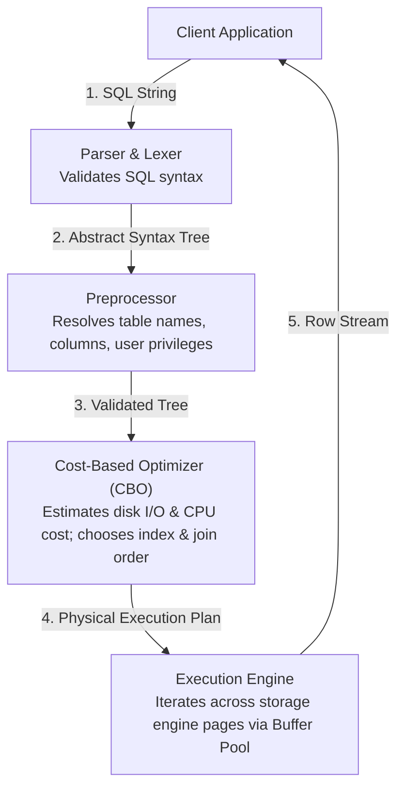

# Chapter 24 — Performance Tuning: MySQL Query Optimization & Execution Plans | परफॉरमेंस ट्यूनिंग: MySQL क्वेरी ऑप्टिमाइज़ेशन और एग्जीक्यूशन प्लान्स

---

## 1. What is it? (क्वेरी ऑप्टिमाइज़ेशन क्या है?)

**Query Optimization** डेटाबेस इंजीनियरिंग का वह महत्वपूर्ण विषय है जिसमें SQL क्वेरीज़, इंडेक्स और डेटाबेस कॉन्फ़िगरेशन का विश्लेषण (profiling) और पुनर्गठन (restructuring) किया जाता है, ताकि क्वेरी एग्जीक्यूशन टाइम, डिस्क I/O, CPU की खपत, और टेबल लॉकिंग कंटेन्शन को कम से कम किया जा सके।

जब कोई SQL स्टेटमेंट MySQL सर्वर डीमन (`mysqld`) पर पहुँचता है, तो वह कई चरणों वाली एग्जीक्यूशन पाइपलाइन से होकर गुजरता है:



इस आर्किटेक्चर का दिल है **Cost-Based Optimizer (CBO)**। ऑप्टिमाइज़र कई संभावित एग्जीक्यूशन पाथ्स का मूल्यांकन करता है (जैसे, इंडेक्स A का उपयोग करें, इंडेक्स B का उपयोग करें, या पूरी टेबल स्कैन करें; किस टेबल को पहले जॉइन करें), डेटा डिक्शनरी के टेबल स्टैटिस्टिक्स के आधार पर अनुमानित लागत (cost) की गणना करता है, और सबसे कम लागत वाले एग्जीक्यूशन प्लान का चयन करता है।

---

## 2. Diagnostic Tools: EXPLAIN and EXPLAIN ANALYZE (डायग्नोस्टिक टूल्स: EXPLAIN और EXPLAIN ANALYZE)

MySQL क्वेरीज़ की प्रोफाइलिंग के लिए दो मुख्य डायग्नोस्टिक टूल्स प्रदान करता है:
1. **`EXPLAIN`**: क्वेरी को वास्तव में *रन किए बिना* ऑप्टिमाइज़र द्वारा चुने गए स्टैटिक एग्जीक्यूशन प्लान को दिखाता है।
2. **`EXPLAIN ANALYZE`** (MySQL 8.0.18+): क्वेरी को वास्तव में एग्जीक्यूट करता है, वास्तविक रनटाइम परफ़ॉर्मेंस को मापता है, और ऑप्टिमाइज़र के अनुमानों की तुलना में वास्तविक समय, लूप्स, और रो काउंट्स का विस्तृत ट्री आउटपुट देता है।

### `EXPLAIN` Access Types को डिकोड करना (सर्वश्रेष्ठ से सबसे खराब तक)

| Access `type` | परफ़ॉर्मेंस ग्रेड | विवरण |
| :--- | :--- | :--- |
| **`system` / `const`** | **सर्वोत्तम (Optimal)** | ठीक 1 पंक्ति मैच होती है (`PRIMARY KEY` या `UNIQUE` इंडेक्स लुकअप)। तुरंत $O(1)$ मेमोरी सीक। |
| **`eq_ref`** | **उत्कृष्ट (Excellent)** | पिछली टेबल की प्रत्येक पंक्ति के लिए इस टेबल से ठीक 1 पंक्ति पढ़ी जाती है (इंडेक्स्ड प्राइमरी/यूनिक की जॉइन)। |
| **`ref`** | **बहुत अच्छा (Very Good)** | नॉन-यूनिक इंडेक्स लुकअप (इंडेक्स्ड वैल्यू से मैच होने वाली कई पंक्तियाँ लौटाता है)। |
| **`range`** | **अच्छा (Good)** | इंडेक्स रेंज स्कैन (`BETWEEN`, `<`, `>`, `IN(...)`, या `LIKE 'prefix%'` के लिए उपयोग किया जाता है)। |
| **`index`** | **औसत (Mediocre)** | फुल इंडेक्स स्कैन (शुरुआत से अंत तक पूरे इंडेक्स ट्री को स्कैन करता है; टेबल स्कैन से तेज़, लेकिन फिर भी सभी कीज़ पढ़ता है)। |
| **`ALL`** | **गंभीर चेतावनी (CRITICAL WARNING)** | **फुल टेबल स्कैन (Full Table Scan)**। स्टोरेज इंजन डिस्क से हर एक पेज पढ़ता है। बड़ी टेबल्स पर बहुत बड़ा बॉटलनेक! |

### `Extra` कॉलम में खतरनाक चेतावनियाँ (Dangerous Warnings)
* **`Using filesort`**: MySQL `ORDER BY` क्लॉज़ को पूरा करने के लिए इंडेक्स का उपयोग नहीं कर सका। उसे पंक्तियों को मेमोरी (`sort_buffer_size`) में लोड करना पड़ा और एक स्पष्ट सॉर्टिंग पास चलाना पड़ा।
* **`Using temporary`**: जटिल `GROUP BY` या `DISTINCT` को प्रोसेस करने के लिए MySQL को डिस्क या मेमोरी में एक आंतरिक अस्थायी टेबल बनानी पड़ी।
* **`Using index`** (पॉज़िटिव!): क्वेरी एक **Covering Index** क्वेरी है; माँगे गए सभी कॉलम्स क्लस्टर्ड इंडेक्स को छुए बिना केवल सेकेंडरी इंडेक्स से ही मिल गए।

---

## 3. Join Algorithms in MySQL (MySQL में जॉइन एल्गोरिदम्स)

टेबल्स के बीच जॉइन करते समय MySQL तीन मुख्य आंतरिक जॉइन एल्गोरिदम्स का उपयोग करता है:
1. **Index Nested-Loop Join (NLJ)**:
   * तब उपयोग किया जाता है जब इनर टेबल के जॉइन कॉलम पर इंडेक्स मौजूद हो।
   * आउटर टेबल की प्रत्येक पंक्ति के लिए इंजन इनर टेबल पर एक तेज़ $O(\log N)$ इंडेक्स सीक करता है।
2. **Block Nested-Loop Join (BNL)** (पुराने MySQL 5.7 में):
   * तब उपयोग किया जाता था जब जॉइन कॉलम पर कोई इंडेक्स न हो। आउटर पंक्तियों को बफर में लोड करके इनर टेबल को बार-बार स्कैन करता था। हाई CPU खपत।
3. **Hash Join** (MySQL 8.0.18+):
   * बिना इंडेक्स वाले जॉइन्स के लिए इसने BNL की जगह ले ली है।
   * इंजन छोटी टेबल की मेमोरी में एक हैश टेबल बनाता है और बड़ी टेबल की पंक्तियों को $O(N)$ लीनियर टाइम में स्ट्रीम करता है।

---

## 4. SARGability: The Golden Rule of Index Optimization (SARGability: इंडेक्स ऑप्टिमाइज़ेशन का सुनहरा नियम)

**SARGable** का फुल फॉर्म है **S**earch **Arg**ument **Able**। कोई क्वेरी प्रेडिकेट तब SARGable होता है जब ऑप्टिमाइज़र B+ Tree इंडेक्स सीक का पूरा लाभ उठा सके।

### Non-SARGable Anti-Patterns बनाम SARGable Rewrites

| एंटी-पैटर्न | Non-SARGable (फुल टेबल स्कैन कराता है) | SARGable Rewrite (इंडेक्स सीक का उपयोग करता है) |
| :--- | :--- | :--- |
| **कॉलम पर फ़ंक्शन लगाना** | `WHERE YEAR(order_date) = 2023` | `WHERE order_date >= '2023-01-01' AND order_date < '2024-01-01'` |
| **स्ट्रिंग फ़ंक्शन लगाना** | `WHERE SUBSTRING(phone, 1, 3) = '555'` | `WHERE phone LIKE '555%'` |
| **शुरुआत में वाइल्डकार्ड (%)** | `WHERE email LIKE '%@gmail.com'` | रिवर्स इंडेक्स, फ़ुलटेक्स्ट सर्च, या ngram इंडेक्स। |
| **कॉलम पर गणितीय गणना**| `WHERE salary * 1.10 > 100000` | `WHERE salary > 100000 / 1.10` |
| **इम्प्लिसिट टाइप कन्वर्ज़न**| `WHERE phone = 5550100` (`phone` is `VARCHAR`) | `WHERE phone = '5550100'` (स्ट्रिंग लिटरल!) |

> [!WARNING]
> **Implicit Type Conversion Trap**: यदि कॉलम `phone` को `VARCHAR(20)` के रूप में परिभाषित किया गया है, तो `WHERE phone = 5550100` (बिना कोट्स वाला इंटीजर) लिखने पर MySQL को रनटाइम पर **हर एक पंक्ति** के `phone` कॉलम को फ्लोटिंग-पॉइंट नंबर में बदलना पड़ता है। यह चुपचाप इंडेक्स को निष्क्रिय कर देता है और फुल टेबल स्कैन ट्रिगर करता है!

---

## 5. Basic Example (बेसिक प्रैक्टिकल उदाहरण)

`EXPLAIN` का विश्लेषण और एक Non-SARGable क्वेरी को SARGable में बदलना:

```sql
USE sql_mastery;

-- 1. Non-SARGable Query: Using a function on the indexed hire_date column
EXPLAIN SELECT employee_id, first_name, last_name, hire_date
FROM employees
WHERE YEAR(hire_date) = 2020;

-- 2. SARGable Rewrite: Bounding the date range with constants
EXPLAIN SELECT employee_id, first_name, last_name, hire_date
FROM employees
WHERE hire_date >= '2020-01-01' AND hire_date < '2021-01-01';
```

---

## 6. Real-World Business Example: Optimizing a Slow Production Query (वास्तविक बिज़नेस उदाहरण: स्लो प्रोडक्शन क्वेरी को ऑप्टिमाइज़ करना)

परिदृश्य: कस्टमर पोर्टल की एक हाई-ट्रैफ़िक क्वेरी CPU स्पाइक्स का कारण बन रही है। यह अगस्त 2023 में दिए गए सभी 'Delivered' ऑर्डर्स को खोजती है, कस्टमर्स को जोड़ती है, और कुल राशि के अनुसार सॉर्ट करती है।

```sql
USE sql_mastery;

-- Step 1: Diagnose the un-optimized query using EXPLAIN ANALYZE
EXPLAIN ANALYZE
SELECT 
    o.order_id,
    c.first_name,
    c.last_name,
    o.total_amount
FROM orders o
JOIN customers c ON o.customer_id = c.customer_id
WHERE o.order_date BETWEEN '2023-08-01' AND '2023-08-31'
  AND o.status = 'Delivered'
ORDER BY o.total_amount DESC;

-- Step 2: Optimization Analysis
-- Notice orders has no composite index covering (status, order_date, total_amount).
-- MySQL scans all orders, filters them, and performs a Filesort.

-- Step 3: Create a targeted Composite Index tailored for this workload
CREATE INDEX idx_opt_orders ON orders(status, order_date, total_amount);

-- Step 4: Re-evaluate with EXPLAIN ANALYZE
EXPLAIN ANALYZE
SELECT 
    o.order_id,
    c.first_name,
    c.last_name,
    o.total_amount
FROM orders o
JOIN customers c ON o.customer_id = c.customer_id
WHERE o.status = 'Delivered'
  AND o.order_date BETWEEN '2023-08-01' AND '2023-08-31'
ORDER BY o.total_amount DESC;

-- Clean up
DROP INDEX idx_opt_orders ON orders;
```

---

## 7. Step-by-Step Explanation of EXPLAIN ANALYZE Output (EXPLAIN ANALYZE आउटपुट की स्टेप-बाय-स्टेप व्याख्या)

`EXPLAIN ANALYZE` के ट्री आउटपुट को समझना:

```
-> Nested loop inner join  (cost=1.85 rows=3) (actual time=0.042..0.065 rows=3 loops=1)
    -> Index range scan on o using idx_opt_orders (status = 'Delivered' AND order_date BETWEEN ...), with index condition: ... (cost=0.80 rows=3) (actual time=0.021..0.028 rows=3 loops=1)
    -> Single-row index lookup on c using PRIMARY (customer_id=o.customer_id) (cost=0.35 rows=1) (actual time=0.008..0.009 rows=1 loops=3)
```

1. **`actual time=0.021..0.028`**: पहली संख्या (`0.021 ms`) पहली पंक्ति प्राप्त करने का समय है; दूसरी संख्या (`0.028 ms`) सभी पंक्तियों को स्ट्रीम करने का कुल समय है।
2. **`rows=3`**: उस इटरेटर चरण द्वारा वास्तव में प्राप्त की गई पंक्तियों की संख्या।
3. **`loops=1`**: इस इटरेटर को कितनी बार कॉल किया गया। `c` पर इनर जॉइन लुकअप के लिए, `loops=3` यह दर्शाता है कि सिंगल-रो प्राइमरी की लुकअप 3 बार (प्रत्येक ऑर्डर के लिए एक बार) किया गया था।
4. **`Index range scan`**: यह साबित करता है कि इंडेक्स सीक ने सीधे मैचिंग रिकॉर्ड्स को अलग कर लिया, जिससे फुल टेबल स्कैन और `Using filesort` दोनों पूरी तरह समाप्त हो गए।

---

## 8. Common Mistakes (सामान्य गलतियाँ और Pitfalls)

1. **हर कॉलम पर आँख बंद करके इंडेक्स बनाना**:
   * एक टेबल पर 15 सिंगल-कॉलम इंडेक्स बनाना एक भारी एंटी-पैटर्न है। MySQL आम तौर पर एक क्वेरी में **प्रति टेबल केवल एक ही इंडेक्स** का उपयोग कर सकता है। आपकी क्वेरी के `WHERE` और `ORDER BY` पैटर्न से मेल खाता हुआ एक सही कंपोजिट इंडेक्स कई अलग-अलग इंडेक्सों की तुलना में कहीं बेहतर होता है।
2. **Slow Query Log को अनदेखा करना**:
   * कौन सी क्वेरीज़ धीमी हैं इसका अंदाज़ा लगाने के बजाय, MySQL के इनबिल्ट **Slow Query Log** को इनेबल करें ताकि एक निश्चित सीमा (जैसे `long_query_time = 1.0` सेकंड) से अधिक समय लेने वाली क्वेरीज़ अपने आप कैप्चर हो जाएँ।
3. **विशाल InnoDB टेबल्स पर `SELECT COUNT(*)` चलाना**:
   * MyISAM इंजन में `COUNT(*)` तुरंत रिज़ल्ट देता था क्योंकि MyISAM टेबल हेडर में रो काउंटर रखता था। लेकिन InnoDB में, क्योंकि MVCC अलग-अलग ट्रांजैक्शन्स को अलग-अलग स्नैपशॉट दिखाता है, इसलिए **InnoDB को एक्टिव पंक्तियों को गिनने के लिए इंडेक्स को स्कैन करना ही पड़ता है**। विशाल टेबल्स के लिए `information_schema.tables` से अनुमानित गिनती लें या एक काउंटर टेबल मेंटेन करें।

---

## 9. Best Practices (सर्वोत्तम तरीके और टिप्स)

1. **इंडेक्स सेलेक्टिविटी (Index Selectivity) के नियम का पालन करें**:
   * कंपोजिट इंडेक्स में उस कॉलम को सबसे पहले रखें जिसकी **सेलेक्टिविटी** सबसे अधिक हो (यानी कुल पंक्तियों की तुलना में जिसमें यूनिक वैल्यूज की संख्या सबसे ज़्यादा हो)।
2. **InnoDB Buffer Pool को ट्यून करें**:
   * एक डेडिकेटेड MySQL डेटाबेस सर्वर पर, `innodb_buffer_pool_size` को **कुल फिजिकल रैम के 70%–80%** पर कॉन्फ़िगर करें। यह सुनिश्चित करता है कि बार-बार एक्सेस किया जाने वाला डेटा और इंडेक्स पेजेस मेमोरी में कैश्ड रहें और डिस्क I/O न हो।
3. **प्रोडक्शन में Slow Query Log को चालू करें**:
   ```sql
   SET GLOBAL slow_query_log = 'ON';
   SET GLOBAL long_query_time = 0.5; -- Log queries taking longer than 500ms
   SET GLOBAL log_queries_not_using_indexes = 'ON';
   ```
4. **बड़े DML मॉडिफिकेशन्स को बैच (Batch) में चलाएँ**:
   * लाखों रिकॉर्ड्स को अपडेट या डिलीट करते समय, मेमोरी बफ़र्स और रो-लॉक्स को ओवरलोड होने से बचाने के लिए `LIMIT` क्लॉज़ के साथ 5,000 पंक्तियों के बैचों में काम करें।

---

## 10. Practice Questions (अभ्यास के लिए प्रश्न)

### Easy
1. `EXPLAIN` रिपोर्ट में कौन सा एक्सेस `type` सबसे खराब परफ़ॉर्मेंस को दर्शाता है?
2. `EXPLAIN` एग्जीक्यूशन प्लान में `type: const` का क्या अर्थ है?
3. `WHERE salary * 12 > 120000` को SARGable फ़ॉर्मेट में दोबारा लिखें।

### Medium
4. समझाइए कि `SELECT * FROM customers WHERE email LIKE '%@yahoo.com'` क्वेरी `email` पर बने स्टैंडर्ड B+ Tree इंडेक्स का उपयोग क्यों नहीं कर सकती?
5. MySQL 8.0 में `EXPLAIN` और `EXPLAIN ANALYZE` में क्या अंतर है?
6. इस क्वेरी में परफ़ॉर्मेंस दोष की पहचान करें:
   ```sql
   SELECT * FROM orders WHERE DATE(order_date) = '2023-08-01';
   ```
   इसे इस तरह दोबारा लिखें कि `order_date` पर बना इंडेक्स इस्तेमाल हो सके।

### Difficult
7. MySQL 8.0.18+ में, क्वेरी ऑप्टिमाइज़र **Nested Loop Join** के बजाय **Hash Join** का चयन कब करता है? मेमोरी आवंटन (`join_buffer_size`) हैश जॉइन के डिस्क पर स्पिल होने को कैसे प्रभावित करता है?
8. निम्नलिखित क्वेरी के लिए एक ऑप्टिमाइज़्ड कवरिंग इंडेक्स परिभाषा लिखें:
   ```sql
   SELECT customer_id, order_date, total_amount 
   FROM orders 
   WHERE customer_id = 10 AND status = 'Delivered' 
   ORDER BY order_date DESC;
   ```
   अपने कंपोजिट इंडेक्स में कॉलम्स के सटीक क्रम को समझाएँ और बताएँ कि वह क्रम CPU ऑपरेशन्स को कैसे कम करता है।

---

## 11. Interview Questions (इंटरव्यू सवाल और जवाब)

### Q1: SQL में SARGable का क्या अर्थ है, और SARGability को नष्ट करने वाले तीन सामान्य एंटी-पैटर्न्स कौन से हैं?
**उत्तर**: SARGable का अर्थ है *Search Argument Able*। कोई क्वेरी प्रेडिकेट तब SARGable होता है जब डेटाबेस इंजन का क्वेरी ऑप्टिमाइज़र B+ Tree इंडेक्स में सीधे इंडेक्स सीक करके कंडीशन का मूल्यांकन कर सकता है।
तीन सामान्य Non-SARGable एंटी-पैटर्न्स:
1. **इंडेक्स्ड कॉलम्स को स्केलर फ़ंक्शन्स में लपेटना**: `WHERE YEAR(order_date) = 2023` फुल टेबल स्कैन कराता है क्योंकि इंजन को हर पंक्ति के लिए फ़ंक्शन चलाना पड़ता है। (रीराइट: `WHERE order_date >= '2023-01-01' AND order_date < '2024-01-01'`)।
2. **शुरुआत में वाइल्डकार्ड मैचिंग**: `WHERE name LIKE '%Smith'` B+ Tree को प्रीफ़िक्स के आधार पर नेविगेट करने से रोकता है।
3. **इम्प्लिसिट टाइप कन्वर्ज़न**: `VARCHAR` कॉलम की तुलना अनकोटेड इंटीजर लिटरल से करना (`WHERE phone = 5550100`) MySQL को हर पंक्ति को नंबर में बदलने पर मजबूर करता है, जिससे इंडेक्स बंद हो जाता है।

### Q2: MySQL `EXPLAIN` प्लान में `rows` और `filtered` कॉलम्स की व्याख्या कैसे की जाती है?
**उत्तर**:
* **`rows`**: यह ऑप्टिमाइज़र का सांख्यिकीय अनुमान है कि एग्जीक्यूशन प्लान के उस चरण को पूरा करने के लिए स्टोरेज इंजन को डिस्क या कैश से कितनी फिजिकल पंक्तियाँ पढ़नी होंगी।
* **`filtered`**: यह उन जाँची गई पंक्तियों का अनुमानित प्रतिशत दर्शाता है जो बाकी बची फ़िल्टरिंग शर्तों को पूरा करेंगी और अगले चरण में भेजी जाएँगी।
यदि `rows` की संख्या बहुत बड़ी हो और `filtered` बहुत कम (जैसे `10.00%`) हो, तो इसका मतलब है कि इंजन भारी मात्रा में डेटा पढ़ रहा है और उसका 90% हिस्सा फेंक रहा है—जो एक गायब या अक्षम इंडेक्स का स्पष्ट संकेत है।

### Q3: `EXPLAIN` प्लान के `Extra` कॉलम में `Using filesort` और `Using index` में क्या अंतर होता है?
**उत्तर**:
* **`Using filesort`**: यह दर्शाता है कि MySQL `ORDER BY` क्लॉज़ के लिए आवश्यक क्रम में पंक्तियों को सीधे इंडेक्स से नहीं पढ़ सका। उसे फ़िल्टर की गई पंक्तियों को मेमोरी बफ़र (`sort_buffer_size`) में लोड करना पड़ा और एक स्पष्ट सॉर्टिंग एल्गोरिदम (quicksort या mergesort) चलाना पड़ा, जो डिस्क पर भी स्पिल हो सकता है।
* **`Using index`**: यह एक **Covering Index** का संकेत देता है। क्वेरी को सेकेंडरी इंडेक्स के लीफ़ पेजों से ही पूरी तरह संतुष्ट कर लिया गया, और क्लस्टर्ड इंडेक्स या बेस टेबल डेटा पेजों को छूने की ज़रूरत नहीं पड़ी।

---

## 12. Quick Revision (त्वरित सारांश / क्विक रिविजन)

* स्टैटिक प्लान देखने के लिए **`EXPLAIN`** और वास्तविक समय मापने के लिए **`EXPLAIN ANALYZE`** का उपयोग करें।
* एक्सेस टाइप **`const`**, **`eq_ref`**, **`ref`**, या **`range`** का लक्ष्य रखें; बड़ी टेबल्स पर **`ALL`** (फुल टेबल स्कैन) को पूरी तरह समाप्त करें।
* क्वेरीज़ को **SARGable** रखें: इंडेक्स्ड कॉलम्स पर कभी फ़ंक्शन न लगाएँ और टाइप कन्वर्ज़न से बचें।
* **Covering Index** माँगे गए सभी कॉलम्स को सीधे इंडेक्स से पूरा करता है (`Extra: Using index`)।
* कंपोजिट इंडेक्स में `ORDER BY` कॉलम्स शामिल करके **`Using filesort`** को हटाएँ।
* डेडिकेटेड डेटाबेस सर्वर्स पर **`innodb_buffer_pool_size`** को सिस्टम रैम के 70–80% पर सेट करें।
* आगे के अध्ययन के लिए अगले मॉड्यूल [Chapter 25 — Enterprise Security: Access Control, Roles & SQL Injection Defense](/hi/25_security_and_best_practices) पर बढ़ें।
