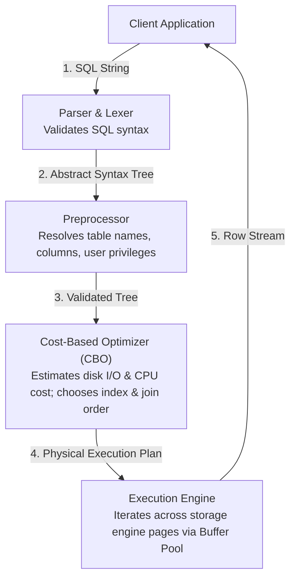

# Chapter 24 — Performance Tuning: MySQL Query Optimization & Execution Plans

---

## 1. What is it?

**Query Optimization** ek aisi engineering discipline hai jisme hum SQL queries, indexes, aur database configurations ko diagnose, profile, aur restructure karte hain taaki query execution time, disk I/O, CPU consumption, aur lock contention ko minimize kiya ja sake.

Jab koi SQL statement MySQL server daemon (`mysqld`) ke paas aati hai, toh wo ek multi-stage execution pipeline se guzarti hai:



Is poore architecture ka heart **Cost-Based Optimizer (CBO)** hota hai. Optimizer multiple alternative execution paths evaluate karta hai (jaise Index A use karein, Index B use karein, ya poori table scan karein; kis table ko pehle join karein), data dictionary mein stored table statistics ke basis par estimated cost calculate karta hai, aur sabse lowest-cost execution plan select karta hai.

---

## 2. Diagnostic Tools: `EXPLAIN` and `EXPLAIN ANALYZE`

MySQL queries ko profile karne ke liye do primary diagnostic tools provide karta hai:
1. **`EXPLAIN`**: Query ko actual mein execute kiye *bina*, optimizer dwara choose kiya gaya static execution plan display karta hai.
2. **`EXPLAIN ANALYZE`** (MySQL 8.0.18+): Query ko execute karta hai, actual runtime performance measure karta hai, aur ek detailed tree structure output deta hai jo optimizer ke estimates ke mukable actual time spent, loops executed, aur row counts show karta hai.

### Decoding the `EXPLAIN` Access Types (From Best to Worst)

| Access `type` | Performance Grade | Description |
| :--- | :--- | :--- |
| **`system` / `const`** | **Optimal** | Exactly 1 row match hoti hai (for example, `PRIMARY KEY` ya `UNIQUE` index lookup). Instant $O(1)$ memory seek. |
| **`eq_ref`** | **Excellent** | Pichli table se har row combination ke liye is table se exactly 1 row read hoti hai (indexed primary/unique key join). |
| **`ref`** | **Very Good** | Non-unique index lookup (indexed value se match karne wali multiple rows return karta hai). |
| **`range`** | **Good** | Index range scan (`BETWEEN`, `<`, `>`, `IN(...)`, ya `LIKE 'prefix%'` ke liye use hota hai). |
| **`index`** | **Mediocre** | Full Index Scan (poore index tree ko start se end tak scan karta hai; table scan se fast hota hai, lekin saari keys read karta hai). |
| **`ALL`** | **CRITICAL WARNING** | **Full Table Scan**. Storage engine disk se har single page read karta hai. Large tables par ye severe bottleneck hai! |

### Dangerous Warnings in the `Extra` Column
* **`Using filesort`**: MySQL `ORDER BY` clause ko satisfy karne ke liye index use nahi kar saka. Use candidate rows ko memory (`sort_buffer_size`) mein load karke explicit sorting pass execute karna pada.
* **`Using temporary`**: MySQL ko complex `GROUP BY` ya `DISTINCT` process karne ke liye disk ya memory mein internal temporary table banani padi.
* **`Using index`** (Positive!): Query ek **Covering Index** query hai; saare requested columns clustered index ko touch kiye bina secondary index se hi satisfy ho gaye.

---

## 3. Join Algorithms in MySQL

Tables ke beech joins execute karte waqt MySQL primarily teen internal join algorithms use karta hai:
1. **Index Nested-Loop Join (NLJ)**:
   * Tab use hota hai jab inner table ke joined column par index maujood hota hai.
   * Outer table ki har row ke liye, engine inner table par ek fast $O(\log N)$ index seek perform karta hai.
2. **Block Nested-Loop Join (BNL)** (Legacy MySQL 5.7):
   * Tab use hota tha jab join column par koi index nahi hota. Outer rows ke chunks ko buffer mein read karke inner table scan karta tha. CPU cost kaafi high hoti thi.
3. **Hash Join** (MySQL 8.0.18+):
   * Index na hone wale joins ke liye isne BNL ko replace kar diya hai.
   * Engine smaller table ka memory mein ek in-memory hash table build karta hai aur larger table ki rows ko is hash table ke against $O(N)$ linear time mein stream karta hai.

---

## 4. SARGability: The Golden Rule of Index Optimization

**SARGable** ka full form **S**earch **Arg**ument **Able** hota hai. Ek query predicate tab SARGable hota hai jab optimizer B+ Tree index seek ko efficiently leverage kar sake.

### Non-SARGable Anti-Patterns vs SARGable Rewrites

| Anti-Pattern | Non-SARGable (Forces Full Table Scan) | SARGable Rewrite (Uses Index Seek) |
| :--- | :--- | :--- |
| **Functions on Columns** | `WHERE YEAR(order_date) = 2023` | `WHERE order_date >= '2023-01-01' AND order_date < '2024-01-01'` |
| **String Functions** | `WHERE SUBSTRING(phone, 1, 3) = '555'` | `WHERE phone LIKE '555%'` |
| **Leading Wildcards** | `WHERE email LIKE '%@gmail.com'` | Reverse index, Fulltext search, ya ngram index. |
| **Arithmetic on Columns**| `WHERE salary * 1.10 > 100000` | `WHERE salary > 100000 / 1.10` |
| **Implicit Type Conversion**| `WHERE phone = 5550100` (`phone` is `VARCHAR`) | `WHERE phone = '5550100'` (String literal!) |

> [!WARNING]
> **Implicit Type Conversion Trap**: Agar koi column `phone` `VARCHAR(20)` defined hai, toh `WHERE phone = 5550100` (unquoted integer) likhne par MySQL runtime par integer se compare karne ke liye **har row** ke `phone` column ko floating-point number mein cast karne par majboor ho jata hai. Ye silently `phone` ke index ko disable kar deta hai aur full table scan trigger karta hai!

---

## 5. Basic Example

`EXPLAIN` inspect karte hain aur ek non-SARGable query ko SARGable query mein convert karte hain:

```sql
USE sql_mastery;

-- 1. Non-SARGable Query: Using a function on the indexed hire_date column
EXPLAIN SELECT employee_id, first_name, last_name, hire_date
FROM employees
WHERE YEAR(hire_date) = 2020;

-- 2. SARGable Rewrite: Bounding the date range with constants
EXPLAIN SELECT employee_id, first_name, last_name, hire_date
FROM employees
WHERE hire_date >= '2020-01-01' AND hire_date < '2021-01-01';
```

---

## 6. Real-World Example: Optimizing a Slow Production Query

Scenario: High-traffic customer portal par ek query CPU spikes cause kar rahi hai. Ye query August 2023 mein place hue sabhi delivered orders ko search karti hai, customers, products aur order items ko join karti hai, aur total amount ke descending order mein sort karti hai.

```sql
USE sql_mastery;

-- Step 1: Diagnose the un-optimized query using EXPLAIN ANALYZE
EXPLAIN ANALYZE
SELECT 
    o.order_id,
    c.first_name,
    c.last_name,
    o.total_amount
FROM orders o
JOIN customers c ON o.customer_id = c.customer_id
WHERE o.order_date BETWEEN '2023-08-01' AND '2023-08-31'
  AND o.status = 'Delivered'
ORDER BY o.total_amount DESC;

-- Step 2: Optimization Analysis
-- Notice orders has no composite index covering (status, order_date, total_amount).
-- MySQL scans all orders, filters them, and performs a Filesort.

-- Step 3: Create a targeted Composite Index tailored for this workload
CREATE INDEX idx_opt_orders ON orders(status, order_date, total_amount);

-- Step 4: Re-evaluate with EXPLAIN ANALYZE
EXPLAIN ANALYZE
SELECT 
    o.order_id,
    c.first_name,
    c.last_name,
    o.total_amount
FROM orders o
JOIN customers c ON o.customer_id = c.customer_id
WHERE o.status = 'Delivered'
  AND o.order_date BETWEEN '2023-08-01' AND '2023-08-31'
ORDER BY o.total_amount DESC;

-- Clean up
DROP INDEX idx_opt_orders ON orders;
```

---

## 7. Step-by-Step Explanation of `EXPLAIN ANALYZE` Output

`EXPLAIN ANALYZE` ke tree output ko samajhna:

```
-> Nested loop inner join  (cost=1.85 rows=3) (actual time=0.042..0.065 rows=3 loops=1)
    -> Index range scan on o using idx_opt_orders (status = 'Delivered' AND order_date BETWEEN ...), with index condition: ... (cost=0.80 rows=3) (actual time=0.021..0.028 rows=3 loops=1)
    -> Single-row index lookup on c using PRIMARY (customer_id=o.customer_id) (cost=0.35 rows=1) (actual time=0.008..0.009 rows=1 loops=3)
```

1. **`actual time=0.021..0.028`**: Pehla number (`0.021 ms`) pehli row fetch karne ka time hai; doosra number (`0.028 ms`) saari rows stream karne ka time hai.
2. **`rows=3`**: Us iterator step dwara materialize hui actual number of rows.
3. **`loops=1`**: Ye iterator kitni baar invoke hua. Inner join lookup `c` ke liye `loops=3` ye batata hai ki single-row primary key lookup 3 baar perform hua (har candidate order ke liye ek baar).
4. **`Index range scan`**: Ye prove karta hai ki index seek ne matching records ko directly isolate kar diya, jisse full table scan aur `Using filesort` poori tarah eliminate ho gaye.

---

## 8. Common Mistakes

1. **Blindly Adding Indexes to Every Column**:
   * Ek hi table par 15 single-column indexes create kar dena. MySQL aamtaur par ek query mein per table **sirf ek hi index** use kar sakta hai. Aapki query ke `WHERE` aur `ORDER BY` pattern se match karta hua ek well-designed composite index multiple individual indexes se laakh guna behtar hota hai.
2. **Ignoring the Slow Query Log**:
   * Kaun si query slow hai ye andaza lagana, bajaye iske ki MySQL ke built-in **Slow Query Log** ko enable kiya jaye jo ek defined threshold (jaise `long_query_time = 1.0`) se zyada samay lene wali queries ko automatically capture karta hai.
3. **Using `SELECT COUNT(*)` on Giant InnoDB Tables**:
   * MyISAM engine mein `COUNT(*)` instantaneous hota tha kyunki MyISAM table header mein ek exact row counter store karta tha. InnoDB mein kyunki MVCC alag-alag transactions ko alag-alag snapshots deta hai, isliye **InnoDB ko active rows count karne ke liye clustered ya secondary index scan karna padta hai**. Massive tables ke liye `information_schema.tables` se approximate counts use karein ya ek dedicated counter table maintain karein.

---

## 9. Best Practices

1. **Follow the Rule of Index Selectivity**:
   * Composite index ke shuru mein hamesha sabse high **selectivity** (total rows ke mukable distinct values ka highest ratio) wala column rakhein.
2. **Tune the InnoDB Buffer Pool**:
   * Dedicated MySQL database server par `innodb_buffer_pool_size` ko **total physical RAM ke 70%–80%** par configure karein. Ye ensure karta hai ki frequently accessed data aur index pages memory mein cached rahein, jisse disk I/O prevent hota hai.
3. **Enable the Slow Query Log in Production**:
   ```sql
   SET GLOBAL slow_query_log = 'ON';
   SET GLOBAL long_query_time = 0.5; -- Log queries taking longer than 500ms
   SET GLOBAL log_queries_not_using_indexes = 'ON';
   ```
4. **Batch Massive DML Modifications**:
   * Jab millions of records update ya delete karne hon, toh `LIMIT` clause ke sath operations ko 5,000 rows ke chunks mein batch karein taaki memory buffers exhaust na hon aur concurrent traffic lock na ho.

---

## 10. Practice Questions

### Easy
1. `EXPLAIN` report mein kaun sa access `type` sabse worst performance indicate karta hai?
2. `EXPLAIN` execution plan mein `type: const` ka kya matlab hota hai?
3. `WHERE salary * 12 > 120000` ko SARGable format mein rewrite karein.

### Medium
4. Explain karein ki query `SELECT * FROM customers WHERE email LIKE '%@yahoo.com'` `email` par bane standard B+ Tree index ko kyu use nahi kar sakti.
5. MySQL 8.0 mein `EXPLAIN` aur `EXPLAIN ANALYZE` ke beech kya difference hota hai?
6. Is query mein performance flaw identify karein:
   ```sql
   SELECT * FROM orders WHERE DATE(order_date) = '2023-08-01';
   ```
   Ise rewrite karein taaki `order_date` par bana index utilize ho sake.

### Difficult
7. MySQL 8.0.18+ mein query optimizer **Nested Loop Join** ke mukable **Hash Join** kab choose karta hai? Memory allocation (`join_buffer_size`) Hash Join ke disk par spill hone ko kaise impact karti hai?
8. Is query ke liye ek optimized covering index definition likhiye:
   ```sql
   SELECT customer_id, order_date, total_amount 
   FROM orders 
   WHERE customer_id = 10 AND status = 'Delivered' 
   ORDER BY order_date DESC;
   ```
   Apne composite index mein columns ka exact order explain karein aur batayein ki ye sequence CPU operations ko kaise minimize karta hai.

---

## 11. Interview Questions

### Q1: What does SARGable mean in SQL, and what are three common anti-patterns that destroy SARGability?
**Answer**: SARGable ka matlab *Search Argument Able* hota hai. Ek query predicate tab SARGable kehlata hai jab database engine ka query optimizer condition ko evaluate karne ke liye direct B+ Tree index structure mein index seek perform kar sake.
Teen common non-SARGable anti-patterns:
1. **Wrapping indexed columns in scalar functions**: `WHERE YEAR(order_date) = 2023` full table scan force karta hai kyunki engine ko har stored row ke liye function execute karna padta hai. (Rewrite: `WHERE order_date >= '2023-01-01' AND order_date < '2024-01-01'`).
2. **Leading wildcard pattern matching**: `WHERE name LIKE '%Smith'` B+ Tree ko prefix ke dwara navigate karne se rok deta hai.
3. **Implicit type conversion**: Ek `VARCHAR` column ko unquoted integer literal se compare karna (`WHERE phone = 5550100`) MySQL ko har row ke liye column ko numeric value mein convert karne par majboor karta hai, jisse index usage disable ho jati hai.

### Q2: How do you interpret the `rows` and `filtered` columns in a MySQL `EXPLAIN` plan?
**Answer**:
* **`rows`**: Optimizer ka statistical estimate hota hai ki execution plan ke us stage ko satisfy karne ke liye storage engine ko disk ya cache se kitni physical rows read karni padengi.
* **`filtered`**: Un examined rows ka estimated percentage hota hai jo remaining filtering conditions ko satisfy karke agle join ya projection step par pass hongi.
Agar `rows` ka count bahut high ho aur sath mein `filtered` percentage bahut low ho (jaise `10.00%`), toh iska matlab hai ki engine massive data read kar raha hai jisme se 90% discard ho raha hai—jo ek missing ya inefficient index ki taraf point karta hai.

### Q3: What is the difference between `Using filesort` and `Using index` in the `Extra` column of an `EXPLAIN` plan?
**Answer**:
* **`Using filesort`**: Ye indicate karta hai ki MySQL `ORDER BY` clause ke required order mein rows ko directly index se read nahi kar saka. Use filtered rows ko memory buffer (`sort_buffer_size`) mein load karna pada aur explicit sorting algorithm (quicksort ya merge sort) execute karni padi, jo kabhi-kabhi temporary disk files par spill ho sakti hai.
* **`Using index`**: Ye ek **Covering Index** ko signify karta hai. Query secondary index ke leaf pages ko read karke poori tarah satisfy ho gayi, bina clustered index mein koi secondary lookup kiye ya base table data pages ko touch kiye.

---

## 12. Quick Revision

* Static execution plan inspect karne ke liye **`EXPLAIN`** aur actual execution time measure karne ke liye **`EXPLAIN ANALYZE`** use karein.
* Access types **`const`**, **`eq_ref`**, **`ref`**, ya **`range`** ka target rakhein; large tables par **`ALL`** (Full Table Scans) ko eliminate karein.
* Queries ko **SARGable** rakhein: indexed columns ko functions mein wrap mat karein aur `WHERE` mein implicit type conversion avoid karein.
* Ek **Covering Index** saari queried columns ko directly index tree se satisfy kar deta hai (`Extra: Using index`).
* Composite indexes mein `ORDER BY` columns ko incorporate karke **`Using filesort`** eliminate karein.
* Dedicated database servers par **`innodb_buffer_pool_size`** ko system RAM ke 70–80% par size karein.
