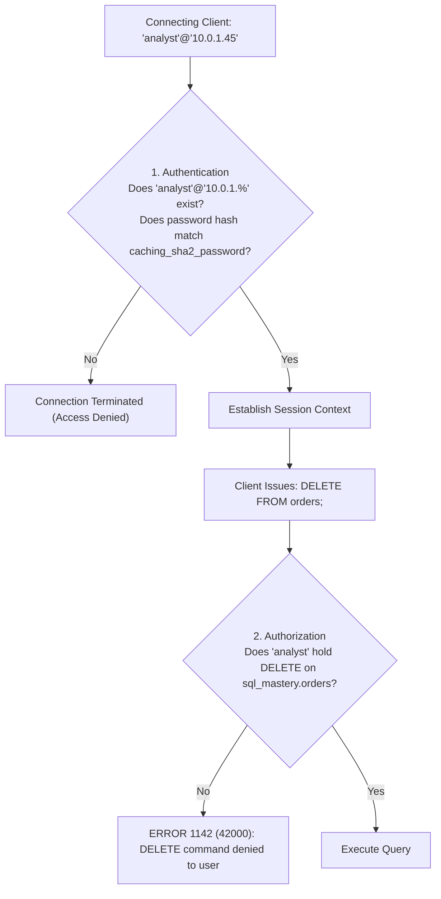
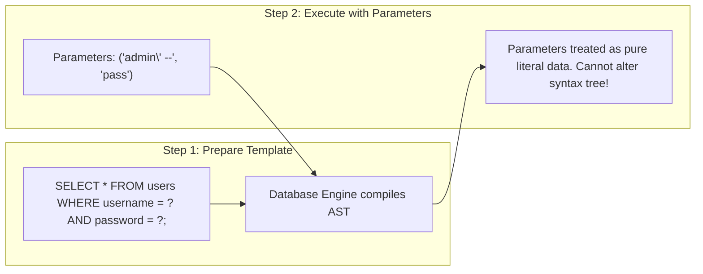

# Chapter 25 — Enterprise Security: Access Control, Roles & SQL Injection Defense | एंटरप्राइज सिक्योरिटी: एक्सेस कंट्रोल, रोल्स और SQL इंजेक्शन सुरक्षा

---

## 1. What is it? (डेटाबेस सिक्योरिटी क्या है?)

**Database Security** नियंत्रणों (controls), प्रशासनिक प्रक्रियाओं और प्रोग्रामिंग तकनीकों का वह संपूर्ण सेट है जिसे अनधिकृत पहुंच, डेटा उल्लंघनों (data breaches), डेटा करप्शन और दुर्भावनापूर्ण हमलों से डेटाबेस संपत्तियों की गोपनीयता (Confidentiality), अखंडता (Integrity), और उपलब्धता (Availability) की रक्षा के लिए डिज़ाइन किया गया है।

एंटरप्राइज MySQL सिक्योरिटी तीन महत्वपूर्ण परतों (layers) पर आधारित होती है:
1. **Authentication & Identity (प्रमाणीकरण और पहचान)**: यह पहचानना कि कौन कनेक्ट हो रहा है। MySQL में, किसी यूज़र की पहचान केवल यूज़रनेम से नहीं, बल्कि यूज़रनेम और होस्ट के संयोजन से बंधी होती है: `'username'@'host_specification'` (जैसे `'app_user'@'10.0.0.%'`)।
2. **Authorization & Access Control (प्राधिकरण और एक्सेस कंट्रोल)**: **Principle of Least Privilege (PoLP)** को लागू करना। यानी उपयोगकर्ताओं और एप्लिकेशन्स को केवल न्यूनतम आवश्यक अनुमतियाँ (`SELECT`, `INSERT`, `EXECUTE`) बहुत ही सटीक दायरे (global, database, table, या column-level) में देना। MySQL 8.0 टीमों के बीच अनुमतियों को आसानी से प्रबंधित करने के लिए **Role-Based Access Control (RBAC)** पेश करता है।
3. **Application Defense against SQL Injection (SQLi)**: ऐसी कमज़ोरियों से बचाव करना जहाँ अविश्वसनीय उपयोगकर्ता इनपुट (untrusted user input) किसी SQL क्वेरी के लॉजिकल सिंटैक्स को बदल देता है।

---

## 2. User & Host Identity Architecture in MySQL (MySQL में यूज़र और होस्ट पहचान आर्किटेक्चर)

MySQL में कोई भी अकाउंट सिर्फ एक यूज़रनेम नहीं होता; यह **Username + Client Host** का एक कंपोजिट रूप होता है:
* `'app_service'@'localhost'`: उसी फिजिकल सर्वर पर केवल एक लोकल UNIX सॉकेट या लूपबैक IP (`127.0.0.1`) के ज़रिए ही कनेक्ट हो सकता है।
* `'analyst'@'192.168.1.%'`: केवल प्राइवेट सबनेट `192.168.1.0/24` की क्लाइंट मशीनों से ही कनेक्ट हो सकता है।
* `'admin'@'%'`: वाइल्डकार्ड `%` किसी भी IP एड्रेस से कनेक्शन की अनुमति देता है (विशेषाधिकार प्राप्त एडमिन अकाउंट्स के लिए यह बेहद खतरनाक है!)।



---

## 3. Syntax (सिंटैक्स और एडमिनिस्ट्रेशन)

### User Account Administration
```sql
-- 1. Create a User with Modern SHA-256 Authentication
CREATE USER 'app_backend'@'10.0.0.%'
IDENTIFIED BY 'P@ssw0rd_Enterprise_2026!';

-- 2. Alter User Password / Expire Password
ALTER USER 'app_backend'@'10.0.0.%'
IDENTIFIED BY 'New_Secure_Password_2026!'
PASSWORD EXPIRE INTERVAL 90 DAY;

-- 3. Lock or Unlock an Account
ALTER USER 'app_backend'@'10.0.0.%' ACCOUNT LOCK;
ALTER USER 'app_backend'@'10.0.0.%' ACCOUNT UNLOCK;

-- 4. Delete a User
DROP USER IF EXISTS 'app_backend'@'10.0.0.%';
```

### Granular Privilege Management
```sql
-- Grant read-only access to a specific database
GRANT SELECT ON sql_mastery.* TO 'reporting_user'@'localhost';

-- Grant DML access on a specific table
GRANT SELECT, INSERT, UPDATE ON sql_mastery.customers TO 'app_backend'@'10.0.0.%';

-- Grant execution rights on stored procedures
GRANT EXECUTE ON PROCEDURE sql_mastery.sp_process_order_checkout TO 'app_backend'@'10.0.0.%';

-- Inspect Active Grants for a User
SHOW GRANTS FOR 'reporting_user'@'localhost';

-- Revoke Privileges
REVOKE UPDATE ON sql_mastery.customers FROM 'app_backend'@'10.0.0.%';
```

### Role-Based Access Control (RBAC in MySQL 8.0)
50 अलग-अलग उपयोगकर्ताओं को अलग-अलग अनुमतियाँ देने के बजाय, **Roles** बनाएँ, रोल को अनुमतियाँ दें, और उपयोगकर्ताओं को वह रोल असाइन करें:

```sql
-- 1. Create Roles
CREATE ROLE 'developer_readwrite', 'analyst_readonly';

-- 2. Assign Privileges to Roles
GRANT SELECT ON sql_mastery.* TO 'analyst_readonly';
GRANT SELECT, INSERT, UPDATE, DELETE ON sql_mastery.* TO 'developer_readwrite';

-- 3. Assign Role to User
GRANT 'analyst_readonly' TO 'sarah_chen'@'localhost';

-- 4. Activate Role as Default
SET DEFAULT ROLE ALL TO 'sarah_chen'@'localhost';
```

---

## 4. SQL Injection (SQLi): Anatomy & Prepared Statement Defense (SQL इंजेक्शन की संरचना और सुरक्षा)

### 4.1. The Vulnerability: Dynamic String Concatenation (कमज़ोरी का कारण)
एक असुरक्षित वेब लॉगिन स्क्रिप्ट पर विचार करें जो उपयोगकर्ता के इनपुट को सीधे SQL स्ट्रिंग में जोड़ती है:

```python
# FATAL INSECURE CODE: DO NOT USE!
username_input = request.form["username"]
password_input = request.form["password"]

query = f"SELECT * FROM users WHERE username = '{username_input}' AND password = '{password_input}';"
cursor.execute(query)
```

यदि कोई हमलावर यूज़रनेम फ़ील्ड में यह स्ट्रिंग दर्ज करता है:
```
admin' --
```
तो MySQL द्वारा निष्पादित होने वाला SQL बन जाता है:
```sql
SELECT * FROM users WHERE username = 'admin' --' AND password = '...';
```
चूँकि `-- ` SQL में कमेंट मार्कर होता है, इसलिए इंजन पासवर्ड की जाँच को पूरी तरह छोड़ देता है! हमलावर पासवर्ड जाने बिना ही एडमिनिस्ट्रेटर के रूप में लॉगिन कर लेता है।

### 4.2. The Solution: Parameterized Queries (Prepared Statements) (समाधान: पैरामीटरयुक्त क्वेरीज़)
Prepared statements क्वेरी कोड को उपयोगकर्ता के डेटा से पूरी तरह अलग कर देते हैं:



```python
# SECURE PRODUCTION CODE: Parameterized Query
query = "SELECT user_id, password_hash FROM users WHERE username = %s AND is_active = TRUE;"
cursor.execute(query, (username_input,))
```

---

## 5. Basic Example (बेसिक प्रैक्टिकल उदाहरण)

एक सुरक्षित और अलग (isolated) रीड-ओनली एनालिस्ट अकाउंट बनाना:

```sql
USE sql_mastery;

-- Create user restricted to local loopback
CREATE USER 'bi_analyst'@'localhost' IDENTIFIED BY 'Analyst_Safe_2026!';

-- Grant SELECT privileges on the practice database
GRANT SELECT ON sql_mastery.* TO 'bi_analyst'@'localhost';

-- Verify privileges
SHOW GRANTS FOR 'bi_analyst'@'localhost';

-- Revoke and drop
REVOKE ALL PRIVILEGES, GRANT OPTION FROM 'bi_analyst'@'localhost';
DROP USER 'bi_analyst'@'localhost';
```

---

## 6. Real-World Business Example: Enterprise Privilege & RBAC Architecture (वास्तविक बिज़नेस उदाहरण: एंटरप्राइज प्रिविलेज और RBAC आर्किटेक्चर)

हमारे `sql_mastery` डेटाबेस में एक प्रोडक्शन-ग्रेड एंटरप्राइज सुरक्षा आर्किटेक्चर स्थापित करते हैं:
1. `sql_mastery` पर DML अनुमतियों के साथ `role_ecommerce_app` बनाएँ।
2. एक सीमित यूज़र `'app_ecommerce_service'@'10.0.2.%'` बनाएँ।
3. केवल आवश्यक टेबल्स पर आवश्यक अनुमतियाँ असाइन करें।

```sql
USE sql_mastery;

-- Step 1: Create Role
CREATE ROLE IF NOT EXISTS 'role_ecommerce_app';

-- Step 2: Grant strict permissions to the role
GRANT SELECT, INSERT, UPDATE ON sql_mastery.orders TO 'role_ecommerce_app';
GRANT SELECT, INSERT, UPDATE ON sql_mastery.order_items TO 'role_ecommerce_app';
GRANT SELECT, UPDATE ON sql_mastery.products TO 'role_ecommerce_app';
GRANT SELECT ON sql_mastery.customers TO 'role_ecommerce_app';

-- Step 3: Create App User and Assign Role
CREATE USER 'app_ecommerce_service'@'10.0.2.%'
IDENTIFIED BY 'App_Service_Vault_Key_9900!';

GRANT 'role_ecommerce_app' TO 'app_ecommerce_service'@'10.0.2.%';
SET DEFAULT ROLE 'role_ecommerce_app' TO 'app_ecommerce_service'@'10.0.2.%';

-- Step 4: Verify Grants
SHOW GRANTS FOR 'app_ecommerce_service'@'10.0.2.%';
SHOW GRANTS FOR 'app_ecommerce_service'@'10.0.2.%' USING 'role_ecommerce_app';

-- Clean up
DROP USER 'app_ecommerce_service'@'10.0.2.%';
DROP ROLE 'role_ecommerce_app';
```

---

## 7. Step-by-Step Explanation (स्टेप-बाय-स्टेप व्याख्या)

1. `CREATE USER ... IDENTIFIED BY ...`:
   * MySQL दिए गए पासवर्ड को डिफ़ॉल्ट `caching_sha2_password` एल्गोरिदम (सॉल्टेड SHA-256 इटरेशन्स) का उपयोग करके हैश करता है और हैश को `mysql.user` में स्टोर करता है।
   * होस्ट को `'10.0.2.%'` तक सीमित करने से यह सुनिश्चित होता है कि क्रेडेंशियल्स लीक होने पर भी एप्लिकेशन सबनेट के बाहर से आने वाले किसी भी कनेक्शन को रिजेक्ट कर दिया जाएगा।
2. `CREATE ROLE` और `GRANT ... TO 'role_ecommerce_app'`:
   * यह अनुमतियों को एक लॉजिकल बंडल में अलग करता है। यदि भविष्य में अनुमतियाँ बदलनी हों, तो केवल रोल में बदलाव करने से उससे जुड़े सभी अकाउंट्स तुरंत अपडेट हो जाते हैं।
3. `SET DEFAULT ROLE ...`:
   * MySQL 8.0 में डिफ़ॉल्ट रूप से, जब कोई यूज़र पहली बार कनेक्ट होता है तो असाइन किए गए रोल्स इनएक्टिव रहते हैं। `SET DEFAULT ROLE ALL` यह सुनिश्चित करता है कि लॉगिन करते ही असाइन किए गए रोल्स तुरंत एक्टिव हो जाएँ, बिना किसी अलग `SET ROLE` कमांड के।

---

## 8. Expected Result (अपेक्षित आउटपुट)

एप्लिकेशन सर्विस के लिए `SHOW GRANTS` आउटपुट की जाँच:

```
+-------------------------------------------------------------------------------------------------+
| Grants for app_ecommerce_service@10.0.2.%                                                       |
+-------------------------------------------------------------------------------------------------+
| GRANT USAGE ON *.* TO `app_ecommerce_service`@`10.0.2.%`                                        |
| GRANT `role_ecommerce_app`@`%` TO `app_ecommerce_service`@`10.0.2.%`                            |
+-------------------------------------------------------------------------------------------------+

Output of SHOW GRANTS ... USING 'role_ecommerce_app':
+-------------------------------------------------------------------------------------------------+
| Grants for app_ecommerce_service@10.0.2.%                                                       |
+-------------------------------------------------------------------------------------------------+
| GRANT USAGE ON *.* TO `app_ecommerce_service`@`10.0.2.%`                                        |
| GRANT SELECT, UPDATE ON `sql_mastery`.`products` TO `app_ecommerce_service`@`10.0.2.%`          |
| GRANT SELECT, INSERT, UPDATE ON `sql_mastery`.`orders` TO `app_ecommerce_service`@`10.0.2.%`    |
| GRANT SELECT, INSERT, UPDATE ON `sql_mastery`.`order_items` TO `app_ecommerce_service`@10.0.2.%|
| GRANT SELECT ON `sql_mastery`.`customers` TO `app_ecommerce_service`@`10.0.2.%`                |
+-------------------------------------------------------------------------------------------------+
```

---

## 9. Common Mistakes (सामान्य गलतियाँ और Pitfalls)

1. **एप्लिकेशन्स को `ALL PRIVILEGES ON *.*` देना**:
   * *Anti-pattern*: किसी वेब एप्लिकेशन यूज़र को `ALL PRIVILEGES` दे देना।
   * *खतरा*: यदि वेब एप्लिकेशन में कोई SQL इंजेक्शन भेद्यता पाई जाती है, तो हमलावर पूरे डेटाबेस को ड्रॉप कर सकता है, एडमिनिस्ट्रेटिव बैकडोर अकाउंट्स बना सकता है, और `mysql.user` से पासवर्ड्स निकाल सकता है।
   * *नियम*: केवल विशिष्ट टेबल्स पर आवश्यक DML अनुमतियाँ ही दें।
2. **एप्लिकेशन कनेक्शन के लिए `root` यूज़र का उपयोग करना**:
   * वेब एप्लिकेशन्स को कभी भी `root` के रूप में कनेक्ट करने के लिए कॉन्फ़िगर न करें। `root` को केवल स्थानीय CLI मेंटेनेंस तक सीमित रखें और उसके होस्ट को सख्ती से `localhost` पर बाइंड करें।
3. **`FLUSH PRIVILEGES` के बारे में गलतफहमी**:
   * *गलत धारणा*: प्रत्येक `GRANT` या `REVOKE` के बाद `FLUSH PRIVILEGES;` चलाना।
   * *सच्चाई*: मानक DDL/DCL कमांड्स (`GRANT`, `REVOKE`, `CREATE USER`) MySQL की इन-मेमोरी ग्रांट टेबल्स को तुरंत अपडेट कर देते हैं। `FLUSH PRIVILEGES` की आवश्यकता केवल तब होती है जब आप सीधे DML (जैसे `UPDATE mysql.user SET ...;`) द्वारा ग्रांट टेबल्स को बदलते हैं, जो कि अनुशंसित नहीं है।
4. **SQL इंजेक्शन से बचाव के लिए केवल क्लाइंट-साइड इनपुट फ़िल्टरिंग पर भरोसा करना**:
   * कोट्स को हटाने या `SELECT`/`DROP` जैसे शब्दों को रेगेक्स से ब्लॉक करने की कोशिश करना बेकार साबित होता है; हमलावर हेक्स लिटरल्स या यूनिकोड ट्रिक्स से इन्हें आसानी से बायपास कर लेते हैं। **केवल Parameterized Queries ही एकमात्र विश्वसनीय सुरक्षा हैं**।

---

## 10. Best Practices (सर्वोत्तम तरीके और टिप्स)

1. **Principle of Least Privilege (PoLP) लागू करें**:
   * खातों को ज़िम्मेदारी के अनुसार अलग करें:
     * केवल पढ़ने वाले रिपोर्टिंग खाते (`GRANT SELECT`)
     * एप्लिकेशन सर्विसेज़ (`GRANT SELECT, INSERT, UPDATE`)
     * माइग्रेशन / डिप्लॉयमेंट स्क्रिप्ट्स (`GRANT CREATE, ALTER, DROP`)
2. **एंटरप्राइज बैकअप प्रथाओं का पालन करें (`mysqldump`)**:
   * सक्रिय InnoDB डेटाबेस का बैकअप लेते समय, बिना टेबल्स को लॉक किए एक ऑनलाइन, कंसिस्टेंट बैकअप लेने के लिए हमेशा `--single-transaction` का उपयोग करें:
     ```bash
     mysqldump -u root -p \
       --single-transaction \
       --quick \
       --routines \
       --triggers \
       sql_mastery > sql_mastery_backup.sql
     ```
3. **नेटवर्क कनेक्शन के लिए TLS/SSL अनिवार्य करें**:
   * सभी रिमोट उपयोगकर्ताओं के लिए एन्क्रिप्टेड TLS कनेक्शन अनिवार्य करने के लिए MySQL को कॉन्फ़िगर करें:
     ```sql
     ALTER USER 'app_backend'@'10.0.0.%' REQUIRE SSL;
     ```
4. **सोर्स कंट्रोल (Git) में कभी भी डेटाबेस क्रेडेंशियल्स कमिट न करें**:
   * पासवर्ड्स को हमेशा एनवायरनमेंट वेरिएबल्स या सीक्रेट मैनेजर्स (जैसे AWS Secrets Manager, HashiCorp Vault) में सुरक्षित रखें।

---

## 11. Practice Questions (अभ्यास के लिए प्रश्न)

### Easy
1. पासवर्ड `'Audit_2026_Secure!'` के साथ `'auditor'@'localhost'` यूज़र बनाने के लिए SQL कमांड लिखें।
2. `'auditor'@'localhost'` को `employees` टेबल पर `SELECT` विशेषाधिकार देने के लिए स्टेटमेंट लिखें।
3. `'auditor'@'localhost'` के सभी विशेषाधिकार रद्द करने और उसे ड्रॉप करने के लिए कमांड लिखें।

### Medium
4. `'app_writer'` नाम से एक रोल बनाने, उस रोल को `sql_mastery` की सभी टेबल्स पर `SELECT`, `INSERT`, और `UPDATE` देने, और उस रोल को यूज़र `'web_api'@'localhost'` को असाइन करने के कमांड लिखें।
5. स्ट्रिंग कॉनकेटनेशन से लिखी गई क्वेरी जैसे `f"SELECT * FROM items WHERE id = {user_input}"` एप्लिकेशन को SQL इंजेक्शन के जोखिम में क्यों डालती है?
6. प्रश्न 5 की क्वेरी को SQL सिंटैक्स (`PREPARE` और `EXECUTE`) में एक सुरक्षित पैरामीटरयुक्त प्रिपेयर्ड स्टेटमेंट के रूप में दोबारा लिखें।

### Difficult
7. एक सुरक्षित MySQL DCL स्क्रिप्ट लिखें जो एक ऐसा यूज़र बनाए जिसे `customers` टेबल को क्वेरी करने की अनुमति हो, लेकिन वह `phone` और `email` कॉलम्स देखने से पूरी तरह प्रतिबंधित हो। (संकेत: कॉलम-लेवल `GRANT` सिंटैक्स या सिक्योरिटी `VIEW` का उपयोग करें)।
8. `mysqldump --single-transaction` से InnoDB बैकअप लेने बनाम Percona XtraBackup जैसे टूल्स से फिजिकल बाइनरी बैकअप लेने के यांत्रिक अंतरों को समझाएँ। परफ़ॉर्मेंस और रिकवरी स्पीड में क्या ट्रेड-ऑफ़ हैं?

---

## 12. Interview Questions (इंटरव्यू सवाल और जवाब)

### Q1: SQL Injection (SQLi) क्या है, और Prepared Statements (Parameterized Queries) इससे बचाव का अचूक समाधान क्यों हैं?
**उत्तर**: SQL Injection एक गंभीर सुरक्षा भेद्यता है जो तब उत्पन्न होती है जब अविश्वसनीय उपयोगकर्ता इनपुट को बिना अलग किए सीधे SQL क्वेरी स्ट्रिंग में जोड़ दिया जाता है। एक हमलावर इनपुट में SQL कीवर्ड्स और कंट्रोल कैरेक्टर्स (जैसे कोट्स, `-- `, या `OR 1=1`) डालकर डेटाबेस पार्सर द्वारा समझे जाने वाले सिंटैक्स ट्री को बदल देता है, जिससे अनधिकृत कमांड्स निष्पादित हो जाते हैं।
Prepared statements अचूक समाधान हैं क्योंकि वे क्वेरी लॉजिक और डेटा को दो अलग-अलग चरणों में विभाजित कर देते हैं:
1. **कंपाइलेशन चरण (Compilation Phase)**: डेटाबेस इंजन प्लेसहोल्डर्स (`?`) वाले क्वेरी टेम्पलेट को पहले ही कंपाइल और पार्स करके एक स्थिर Abstract Syntax Tree (AST) बना लेता है।
2. **एग्जीक्यूशन चरण (Execution Phase)**: डेटाबेस इंजन यूजर डेटा पैरामीटर्स को सीधे कंपाइल किए गए AST नोड्स में बाइंड करता है। चूँकि क्वेरी का सिंटैक्स ट्री पहले ही तय हो चुका है, इसलिए इनपुट डेटा को सख्ती से केवल लिटरल डेटा वैल्यू माना जाता है और वह कभी भी निष्पादन योग्य SQL निर्देश नहीं बन सकता, जिससे इंजेक्शन हमला पूरी तरह बेअसर हो जाता है।

### Q2: डेटाबेस एडमिनिस्ट्रेशन में Principle of Least Privilege (PoLP) क्या है?
**उत्तर**: Principle of Least Privilege का नियम है कि प्रत्येक उपयोगकर्ता, सर्विस, एप्लिकेशन और प्रोसेस को अपने वैध व्यावसायिक कार्य को पूरा करने के लिए केवल न्यूनतम आवश्यक विशेषाधिकार ही दिए जाने चाहिए।
व्यवहार में:
* वेब एप्लिकेशन्स को कभी भी `root` या `admin` के रूप में कनेक्ट नहीं होना चाहिए।
* केवल पढ़ने वाले रिपोर्टिंग डैशबोर्ड्स को केवल `SELECT` विशेषाधिकार मिलने चाहिए।
* ऑनलाइन वेब सेवाओं को विशिष्ट टेबल्स पर `SELECT`, `INSERT`, `UPDATE`, और `DELETE` होना चाहिए, लेकिन उन्हें `DROP`, `ALTER`, या `TRUNCATE` की अनुमति कभी नहीं होनी चाहिए।
* टेबल संरचना में बदलाव केवल अलग माइग्रेशन सर्विस अकाउंट्स द्वारा ही किए जाने चाहिए।

### Q3: MySQL 8.0 में `caching_sha2_password` ऑथेंटिकेशन प्लगइन पुराने `mysql_native_password` की तुलना में सुरक्षा को कैसे बेहतर बनाता है?
**उत्तर**: `mysql_native_password` पुराने SHA-1 हैशिंग पर निर्भर करता है, जो कोलिशन अटैक्स और रेनबो टेबल क्रैकिंग के प्रति संवेदनशील है।
`caching_sha2_password` सॉल्टेड SHA-256 इटरेशन्स का उपयोग करता है, जो ब्रूट-फ़ोर्स हमलों के खिलाफ बहुत मजबूत क्रिप्टोग्राफ़िक सुरक्षा प्रदान करता है। इसके अतिरिक्त, यह MySQL सर्वर पर ऑथेंटिकेशन टोकन्स की इन-मेमोरी कैशिंग लागू करता है, जिससे एक ही क्लाइंट से बार-बार होने वाले कनेक्शन बिना किसी भारी CPU हैशिंग ओवरहेड के आधुनिक एन्क्रिप्शन के साथ तेज़ी से प्रमाणित हो जाते हैं।

---

## 13. Quick Revision (त्वरित सारांश / क्विक रिविजन)

* MySQL यूज़र अकाउंट्स होस्ट-स्पेसिफिक होते हैं: **`'username'@'host'`**।
* हमेशा **Principle of Least Privilege (PoLP)** का सख्ती से पालन करें।
* टीमों में अनुमतियों को व्यवस्थित रूप से प्रबंधित करने के लिए MySQL 8.0 में **Roles (RBAC)** का उपयोग करें।
* **SQL Injection** तब होता है जब अनट्रस्टेड स्ट्रिंग्स को क्वेरीज़ में जोड़ा जाता है; **Prepared Statements (Parameterized Queries)** ही एकमात्र वास्तविक बचाव हैं।
* InnoDB टेबल्स के नॉन-ब्लॉकिंग ऑनलाइन लॉजिकल बैकअप के लिए **`mysqldump --single-transaction`** का उपयोग करें।
* `root` अकाउंट को केवल `localhost` तक ही सीमित रखें।
* आगे के अध्ययन के लिए हमारे अंतिम व्यावहारिक मॉड्यूल [Chapter 26 — Hands-On Engineering: 5 Progressive Real-World SQL Projects](/hi/26_real_world_projects) पर बढ़ें।
