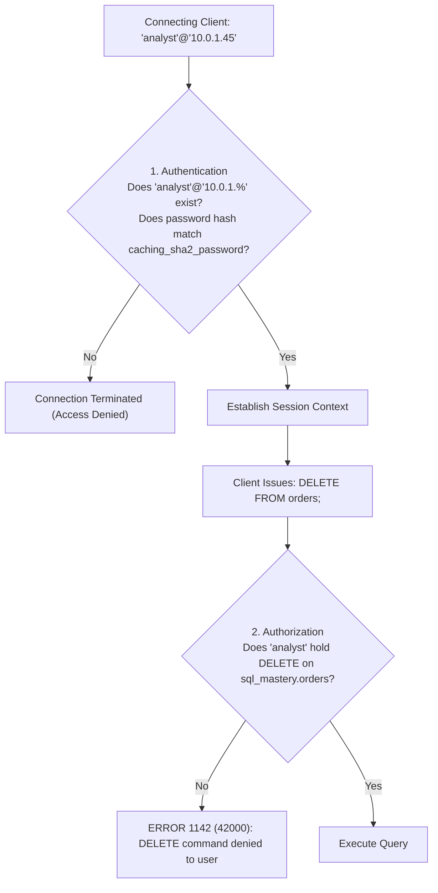
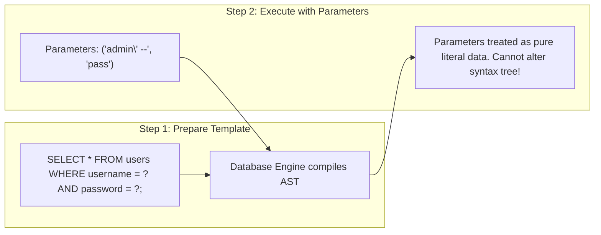

# Chapter 25 — Enterprise Security: Access Control, Roles & SQL Injection Defense

---

## 1. What is it?

**Database Security** controls, administrative procedures, aur programming practices ka ek collective set hota hai jiska purpose database assets ki confidentiality, integrity, aur availability ko unauthorized access, data breaches, corruption, aur malicious exploitation se protect karna hota hai.

Enterprise MySQL security primarily teen critical layers encompass karti hai:
1. **Authentication & Identity**: Identify karna ki kaun connect kar raha hai. MySQL mein user identity strictly username aur host dono se bound hoti hai: `'username'@'host_specification'` (for example, `'app_user'@'10.0.0.%'`).
2. **Authorization & Access Control**: **Principle of Least Privilege (PoLP)** enforce karna. Users aur applications ko granular scopes (global, database, table, ya column-level) par sirf minimum zaroori permissions (`SELECT`, `INSERT`, `EXECUTE`) dena. MySQL 8.0 teams ke across permission management streamline karne ke liye **Role-Based Access Control (RBAC)** introduce karta hai.
3. **Application Defense against SQL Injection (SQLi)**: Aisi vulnerabilities se defend karna jahan untrusted user input SQL query ke logical syntax ko alter kar deta hai.

---

## 2. User & Host Identity Architecture in MySQL

MySQL mein ek account sirf ek username nahi hota; ye **Username + Client Host** ka composite hota hai:
* `'app_service'@'localhost'`: Ye *sirf* usi physical server par local UNIX socket ya loopback IP (`127.0.0.1`) ke zariye connect kar sakta hai.
* `'analyst'@'192.168.1.%'`: Ye sirf private subnet `192.168.1.0/24` ke andar ke client machines se hi connect ho sakta hai.
* `'admin'@'%'`: Wildcard `%` kisi bhi IP address se connection allow karta hai (privileged accounts ke liye ye extremely dangerous hai!).



---

## 3. Syntax

### User Account Administration
```sql
-- 1. Create a User with Modern SHA-256 Authentication
CREATE USER 'app_backend'@'10.0.0.%'
IDENTIFIED BY 'P@ssw0rd_Enterprise_2026!';

-- 2. Alter User Password / Expire Password
ALTER USER 'app_backend'@'10.0.0.%'
IDENTIFIED BY 'New_Secure_Password_2026!'
PASSWORD EXPIRE INTERVAL 90 DAY;

-- 3. Lock or Unlock an Account
ALTER USER 'app_backend'@'10.0.0.%' ACCOUNT LOCK;
ALTER USER 'app_backend'@'10.0.0.%' ACCOUNT UNLOCK;

-- 4. Delete a User
DROP USER IF EXISTS 'app_backend'@'10.0.0.%';
```

### Granular Privilege Management
```sql
-- Grant read-only access to a specific database
GRANT SELECT ON sql_mastery.* TO 'reporting_user'@'localhost';

-- Grant DML access on a specific table
GRANT SELECT, INSERT, UPDATE ON sql_mastery.customers TO 'app_backend'@'10.0.0.%';

-- Grant execution rights on stored procedures
GRANT EXECUTE ON PROCEDURE sql_mastery.sp_process_order_checkout TO 'app_backend'@'10.0.0.%';

-- Inspect Active Grants for a User
SHOW GRANTS FOR 'reporting_user'@'localhost';

-- Revoke Privileges
REVOKE UPDATE ON sql_mastery.customers FROM 'app_backend'@'10.0.0.%';
```

### Role-Based Access Control (RBAC in MySQL 8.0)
50 alag-alag users ko individually privileges grant karne ke bajaye, pehle **Roles** define karein, role ko permissions grant karein, aur fir users ko role assign kar dein:

```sql
-- 1. Create Roles
CREATE ROLE 'developer_readwrite', 'analyst_readonly';

-- 2. Assign Privileges to Roles
GRANT SELECT ON sql_mastery.* TO 'analyst_readonly';
GRANT SELECT, INSERT, UPDATE, DELETE ON sql_mastery.* TO 'developer_readwrite';

-- 3. Assign Role to User
GRANT 'analyst_readonly' TO 'sarah_chen'@'localhost';

-- 4. Activate Role as Default
SET DEFAULT ROLE ALL TO 'sarah_chen'@'localhost';
```

---

## 4. SQL Injection (SQLi): Anatomy & Prepared Statement Defense

### 4.1. The Vulnerability: Dynamic String Concatenation
Maan lo hamare paas ek insecure web login script hai jo user input ko directly SQL string ke sath concatenate karta hai:

```python
# FATAL INSECURE CODE: DO NOT USE!
username_input = request.form["username"]
password_input = request.form["password"]

query = f"SELECT * FROM users WHERE username = '{username_input}' AND password = '{password_input}';"
cursor.execute(query)
```

Agar koi attacker username field mein ye string enter karta hai:
```
admin' --
```
Toh MySQL dwara execute hone wali resulting SQL ban jayegi:
```sql
SELECT * FROM users WHERE username = 'admin' --' AND password = '...';
```
Kyunki `-- ` SQL mein comment marker hota hai, isliye database engine password check ko poori tarah ignore kar deta hai! Attacker bina password jane administrator account se login ho jata hai.

### 4.2. The Solution: Parameterized Queries (Prepared Statements)
Prepared statements query code aur user data ko strictly alag-alag rakhte hain:



```python
# SECURE PRODUCTION CODE: Parameterized Query
query = "SELECT user_id, password_hash FROM users WHERE username = %s AND is_active = TRUE;"
cursor.execute(query, (username_input,))
```

---

## 5. Basic Example

Ek isolated read-only analyst account create karte hain:

```sql
USE sql_mastery;

-- Create user restricted to local loopback
CREATE USER 'bi_analyst'@'localhost' IDENTIFIED BY 'Analyst_Safe_2026!';

-- Grant SELECT privileges on the practice database
GRANT SELECT ON sql_mastery.* TO 'bi_analyst'@'localhost';

-- Verify privileges
SHOW GRANTS FOR 'bi_analyst'@'localhost';

-- Revoke and drop
REVOKE ALL PRIVILEGES, GRANT OPTION FROM 'bi_analyst'@'localhost';
DROP USER 'bi_analyst'@'localhost';
```

---

## 6. Real-World Example: Enterprise Privilege & RBAC Architecture

Hamare `sql_mastery` database ke liye ek production-grade enterprise security architecture establish karte hain:
1. `sql_mastery` par DML permissions ke sath ek `role_ecommerce_app` create karein.
2. Ek restricted user `'app_ecommerce_service'@'10.0.2.%'` banayein aur use ye role assign karein.
3. Verify karein ki grants properly assign hue hain aur role activate ho chuka hai.

```sql
USE sql_mastery;

-- Step 1: Create Role
CREATE ROLE IF NOT EXISTS 'role_ecommerce_app';

-- Step 2: Grant strict permissions to the role
GRANT SELECT, INSERT, UPDATE ON sql_mastery.orders TO 'role_ecommerce_app';
GRANT SELECT, INSERT, UPDATE ON sql_mastery.order_items TO 'role_ecommerce_app';
GRANT SELECT, UPDATE ON sql_mastery.products TO 'role_ecommerce_app';
GRANT SELECT ON sql_mastery.customers TO 'role_ecommerce_app';

-- Step 3: Create App User and Assign Role
CREATE USER 'app_ecommerce_service'@'10.0.2.%'
IDENTIFIED BY 'App_Service_Vault_Key_9900!';

GRANT 'role_ecommerce_app' TO 'app_ecommerce_service'@'10.0.2.%';
SET DEFAULT ROLE 'role_ecommerce_app' TO 'app_ecommerce_service'@'10.0.2.%';

-- Step 4: Verify Grants
SHOW GRANTS FOR 'app_ecommerce_service'@'10.0.2.%';
SHOW GRANTS FOR 'app_ecommerce_service'@'10.0.2.%' USING 'role_ecommerce_app';

-- Clean up
DROP USER 'app_ecommerce_service'@'10.0.2.%';
DROP ROLE 'role_ecommerce_app';
```

---

## 7. Step-by-Step Explanation

1. `CREATE USER ... IDENTIFIED BY ...`:
   * MySQL supplied plaintext password ko default `caching_sha2_password` algorithm (salted SHA-256 iterations) ke zariye hash karta hai aur resulting hash ko `mysql.user` mein store karta hai.
   * Host ko `'10.0.2.%'` par restrict karne se ye ensure hota hai ki agar credentials leak bhi ho jayein, tab bhi application server subnet ke bahar se aane wale connections reject ho jayenge.
2. `CREATE ROLE` aur `GRANT ... TO 'role_ecommerce_app'`:
   * Permissions ko ek logical bundle mein isolate karta hai. Agar future mein permissions update karne ki zaroorat pade, toh sirf role alter karne se sabhi assigned accounts instantly update ho jaate hain.
3. `SET DEFAULT ROLE ...`:
   * MySQL 8.0 mein by default jab user pehli baar connect karta hai, toh assigned roles inactive hote hain. `SET DEFAULT ROLE ALL` ye ensure karta hai ki user ke login hote hi assigned roles immediately activate ho jayein bina kisi explicit `SET ROLE` command ke.

---

## 8. Expected Result

Application service ke liye `SHOW GRANTS` output inspect karte hain:

```
+-------------------------------------------------------------------------------------------------+
| Grants for app_ecommerce_service@10.0.2.%                                                       |
+-------------------------------------------------------------------------------------------------+
| GRANT USAGE ON *.* TO `app_ecommerce_service`@`10.0.2.%`                                        |
| GRANT `role_ecommerce_app`@`%` TO `app_ecommerce_service`@`10.0.2.%`                            |
+-------------------------------------------------------------------------------------------------+

Output of SHOW GRANTS ... USING 'role_ecommerce_app':
+-------------------------------------------------------------------------------------------------+
| Grants for app_ecommerce_service@10.0.2.%                                                       |
+-------------------------------------------------------------------------------------------------+
| GRANT USAGE ON *.* TO `app_ecommerce_service`@`10.0.2.%`                                        |
| GRANT SELECT, UPDATE ON `sql_mastery`.`products` TO `app_ecommerce_service`@`10.0.2.%`          |
| GRANT SELECT, INSERT, UPDATE ON `sql_mastery`.`orders` TO `app_ecommerce_service`@`10.0.2.%`    |
| GRANT SELECT, INSERT, UPDATE ON `sql_mastery`.`order_items` TO `app_ecommerce_service`@10.0.2.%|
| GRANT SELECT ON `sql_mastery`.`customers` TO `app_ecommerce_service`@`10.0.2.%`                |
+-------------------------------------------------------------------------------------------------+
```

---

## 9. Common Mistakes

1. **Granting `ALL PRIVILEGES ON *.*` to Applications**:
   * *Anti-pattern*: Kisi application user ko `*.*` par `ALL PRIVILEGES` de dena.
   * *Danger*: Agar web application SQL injection ke zariye compromise ho jaye, toh attacker poora database drop kar sakta hai, administrative backdoor accounts create kar sakta hai, aur `mysql.user` se passwords read kar sakta hai.
   * *Rule*: Hamesha specific tables par required specific DML permissions hi grant karein.
2. **Using the `root` User for Application Connections**:
   * Web applications ko kabhi bhi `root` ke roop mein connect karne ke liye configure mat karein. `root` ko sirf local CLI maintenance ke liye restrict karein aur iska host strictly `localhost` par bind karein.
3. **Misunderstanding `FLUSH PRIVILEGES`**:
   * *Misconception*: Har `GRANT` ya `REVOKE` statement ke baad `FLUSH PRIVILEGES;` run karna.
   * *Reality*: Standard DDL/DCL commands (`GRANT`, `REVOKE`, `CREATE USER`) MySQL ke internal in-memory grant tables ko immediately update karte hain. `FLUSH PRIVILEGES` ki zaroorat sirf tab padti hai jab aap underlying grant tables ko raw DML ke zariye directly modify karte hain (jaise `UPDATE mysql.user SET ...;`), jo ki discouraged practice hai.
4. **Relying on Client-Side Input Filtering for SQL Injection Defense**:
   * User input se quotes strip karke ya `SELECT` aur `DROP` jaise words ko regex se filter karke sanitize karne ki koshish karna. Attackers alternative encodings, hex literals, ya unicode tricks se in filters ko aasani se bypass kar lete hain. **Parameterized queries hi SQL injection ka ekmatra reliable defense hain**.

---

## 10. Best Practices

1. **Enforce the Principle of Least Privilege (PoLP)**:
   * Responsibility ke according accounts ko separate karein:
     * Read-only reporting accounts (`GRANT SELECT`)
     * Application services (`GRANT SELECT, INSERT, UPDATE`)
     * Migration/deployment scripts (`GRANT CREATE, ALTER, DROP`)
2. **Use Enterprise Backup Practices (`mysqldump`)**:
   * Active InnoDB databases ka `mysqldump` ke sath backup lete waqt hamesha `--single-transaction` use karein, taaki tables ko lock kiye bina ek consistent online backup liya ja sake:
     ```bash
     mysqldump -u root -p \
       --single-transaction \
       --quick \
       --routines \
       --triggers \
       sql_mastery > sql_mastery_backup.sql
     ```
3. **Enforce TLS/SSL for Network Connections**:
   * Saare remote users ke liye encrypted TLS connections require karne ke liye MySQL ko configure karein:
     ```sql
     ALTER USER 'app_backend'@'10.0.0.%' REQUIRE SSL;
     ```
4. **Never Commit Database Credentials to Source Control**:
   * Database passwords ko environment variables ya cloud secret managers (jaise AWS Secrets Manager, HashiCorp Vault) mein securely store karein.

---

## 11. Practice Questions

### Easy
1. Password `'Audit_2026_Secure!'` ke sath ek user `'auditor'@'localhost'` create karne ke liye SQL command likhiye.
2. `'auditor'@'localhost'` ko `employees` table par `SELECT` privileges grant karne ke liye statement likhiye.
3. Saare privileges revoke karne aur `'auditor'@'localhost'` ko drop karne ke liye command likhiye.

### Medium
4. Ek role `'app_writer'` banayein, `sql_mastery` ki saari tables par use `SELECT`, `INSERT`, aur `UPDATE` grant karein, aur ye role user `'web_api'@'localhost'` ko assign karein.
5. String concatenation jaise `f"SELECT * FROM items WHERE id = {user_input}"` ka use karke likhi gayi query application ko SQL injection ke samne kyu expose karti hai?
6. Question 5 ki query ko SQL syntax (`PREPARE` aur `EXECUTE`) mein ek secure parameterized prepared statement ke roop mein rewrite karke dikhayein.

### Difficult
7. Ek secure MySQL DCL script likhiye jo ek aisa user banaye jise `customers` table query karne ki permission ho, lekin use `phone` aur `email` columns dekhne se strictly restrict kiya gaya ho. (Hint: Column-level `GRANT` syntax ya security `VIEW` use karein).
8. `mysqldump --single-transaction` ke sath InnoDB backup lene aur Percona XtraBackup jaise tools ka use karke physical binary backup lene ke internal mechanical differences ko explain karein. Dono ke beech performance aur recovery speed tradeoffs kya hain?

---

## 12. Interview Questions

### Q1: What is SQL Injection (SQLi), and why are Prepared Statements (Parameterized Queries) the definitive defense?
**Answer**: SQL Injection ek aisi vulnerability hai jo tab occur hoti hai jab untrusted user input ko bina proper separation ke directly SQL query string mein concatenate kar diya jata hai. Attacker SQL keywords aur control characters (jaise quotes, `-- `, ya `OR 1=1`) craft karke input deta hai, jisse database parser dwara interpret kiya jaane wala syntax tree alter ho jata hai aur unauthorized commands execute ho jaate hain ya data leak ho jata hai.
Prepared statements SQL injection ke definitive defense hain kyunki ye query logic aur data ko do distinct phases mein separate kar dete hain:
1. **Compilation Phase**: Database engine query template ko placeholders (`?`) ke sath compile aur parse karta hai, jisse ek fixed Abstract Syntax Tree (AST) ban jata hai.
2. **Execution Phase**: Database engine user data parameters ko directly compiled AST nodes mein bind karta hai. Kyunki query ka syntax tree pehle hi compile ho chuka hota hai, isliye incoming parameters strictly literal data values ki tarah treat hote hain aur **kabhi bhi** executable SQL instructions ke roop mein interpret nahi ho sakte, jo injection attacks ko poori tarah neutralize kar deta hai.

### Q2: What is the Principle of Least Privilege (PoLP) in database administration?
**Answer**: Principle of Least Privilege ye demand karta hai ki har user, service, application, aur process ko apni legitimate business function complete karne ke liye sirf wahi minimal set of privileges milna chahiye jo strictly necessary ho.
Practice mein:
* Web applications ko kabhi bhi `root` ya `admin` ke roop mein connect nahi karna chahiye.
* Read-only reporting dashboards ko sirf `SELECT` privileges milne chahiye.
* Online web services ko specific domain tables par `SELECT`, `INSERT`, `UPDATE`, aur `DELETE` hona chahiye, lekin unhe `DROP`, `ALTER`, ya `TRUNCATE` privileges bilkul nahi milne chahiye.
* Table structure modifications exclusively isolated migration service accounts ke through hi execute hone chahiye.

### Q3: How does the `caching_sha2_password` authentication plugin in MySQL 8.0 improve security compared to legacy `mysql_native_password`?
**Answer**: `mysql_native_password` purane SHA-1 hashing par depend karta tha, jo collision attacks aur rainbow-table cracking ke samne vulnerable hai.
`caching_sha2_password` salted SHA-256 iterations use karta hai, jo brute-force attacks ke khilaf significantly stronger cryptographic resistance provide karta hai. Sath hi, ye MySQL server par authentication tokens ki in-memory caching implement karta hai, jisse same client se aane wale repeated connections modern encryption standards maintain karte hue minimal CPU hashing overhead ke sath rapidly authenticate ho jaate hain.

---

## 13. Quick Revision

* MySQL user accounts host-specific hote hain: **`'username'@'host'`**.
* Hamesha **Principle of Least Privilege (PoLP)** enforce karein.
* Teams ke across clean permission management ke liye MySQL 8.0 mein **Roles (RBAC)** use karein.
* **SQL Injection** tab occur hota hai jab queries mein untrusted strings concatenate hoti hain; **Prepared Statements (Parameterized Queries)** iska ekmatra reliable defense hain.
* InnoDB tables ke non-blocking online logical backup ke liye **`mysqldump --single-transaction`** use karein.
* `root` account ko strictly **`localhost`** tak restrict rakhein.
